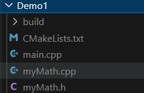
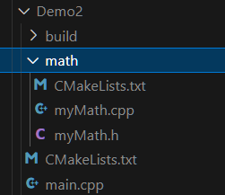

# 一、常用命令

参考：[CMakeLists.txt的超傻瓜手把手教程（附实例源码）](https://blog.csdn.net/qq_38410730/article/details/102477162)

# 1.1 常用命令解释 

这里主要记录一些自己记不太情况的命令含义，一些常见的就不记录了。

```cmake
# CMake 要求的最低版本号
cmake_minimum_required(VERSION 3.0)

# 设置项目名
Project(CMakeStudy)

# 设置变量名，有两种方法
set(变量 路径/文件名...) # 使用${变量}来获取变量的内容
aux_source_directory(路径/文件名... 变量)

# 添加编译选项，有两种方法
add_definitions(编译选项)
add_compile_options(编译参数)

# 打印消息
message(消息)

# 编译子文件夹的CMakeLists.txt
add_subdirectory(子文件夹名称)

# 将.cpp/.c/.cc文件生成库文件
# 注意，库文件名称通常为libxxx.so，在这里只要写xxx即可
# SHARE 表示生成动态库，STATIC 表示生成静态库
add_library(库文件名称 STATIC 文件)

# 将.cpp/.c/.cc文件生成可执行文件
add_executable(可执行文件名称 文件)

# 规定 .h 头文件路径
include_directories(路径)

# 向工程中添加多个特定的文件搜索路径，主要是添加库文件的搜索路径
link_directories(路径)

# 对add_library或add_executable生成的文件进行链接操作
# 注意，库文件名称通常为libxxx.so，在这里只要写xxx即可
target_link_libraries(库文件名称/可执行文件名称（这里需要填生成的文件名） 链接的库文件名称)
```

***

通常一个 CMakeLists.txt 的编写流程：

```cmake
# CMake 要求的最低版本号
cmake_minimum_required(VERSION 3.0)

project(xxx)                                          #必须

add_subdirectory(子文件夹名称)                         #父目录必须，子目录不必

# 生成库文件和生成可执行文件，进行二选一
add_library(库文件名称 STATIC 文件)                    #通常子目录(二选一)
add_executable(可执行文件名称 文件)                     #通常父目录(二选一)

include_directories(路径)                              #必须
link_directories(路径)                                 #必须

target_link_libraries(库文件名称/可执行文件名称（这里需要填生成的文件名） 链接的库文件名称)       #必须
```


# 1.2 常见的 CMake 变量

参考：[[CMake教程] 使用变量](https://blog.csdn.net/maizousidemao/article/details/104096417)、[cmake 常用变量、常用环境变量、常用语法总结](https://blog.csdn.net/bytxl/article/details/50634868)

**一般通过 `SET(变量名 路径/文件名/ ...)` 来定义变量，通过使用 `${}` 获得变量的内容。**但是在 IF 等语句中，是直接使用变量名而不通过 `${}` 来取值。

* 1）`CMAKE_BINARY_DIR`、` PROJECT_BINARY_DIR`、 `<projectname>_BINARY_DIR`：这三个变量指代的内容是一致的。如果是 in source 编译，则表示的是工程顶层目录。如果是 out of source 编译，则表示的工程编译发生的目录。
* 2）`CMAKE_SOURCE_DIR`、`PROJECT_SOURCE_DIR`、` <projectname>_SOURCE_DIR`：这三个变量指代的内容是一致的，不论采用何种编译方式，**都表示工程顶层目录。**
* 3）`PROJECT_NAME`：**表示当前项目的名称**。
* 4）`CMAKE_PROJECT_NAME`：**顶级项目的名称**。该变量保存顶级 CMakeLists.txt 文件中指定的项目名称 `project()` 命令。
* 5）`CMAKE_VERSION`：表示 CMake 版本号。


# 二、实例

参考：[全网最细的CMake教程](https://zhuanlan.zhihu.com/p/534439206)、[CMake 良心教程](https://zhuanlan.zhihu.com/p/500002865)

## 2.1 所有源文件都在同一个目录下



CMakeLists.txt 文件如下：

```cmake
# CMake 最低版本号要求
cmake_minimum_required (VERSION 3.1)

# 设置项目名
project (Demo1)

# 查找当前目录下的所有源文件
# 并将名称保存到 DIR_SRCS 变量
aux_source_directory(. DIR_SRCS)

# 指定生成目标
add_executable(${PROJECT_NAME} ${DIR_SRCS})
```


## 2.2 源文件在子目录，main.cpp 在主目录



主目录下的 CMakeLists.txt 编写如下：

```cmake
# CMake 最低版本号要求
cmake_minimum_required (VERSION 3.1)

# 项目信息
project(Demo2)

# 查找当前目录下的所有源文件
# 并将名称保存到 DIR_SRCS 变量
aux_source_directory(. DIR_SRCS)

# 编译 math 子目录
add_subdirectory(./math)


# 指定生成目标 
add_executable(Demo2 main.cpp)

# 添加链接库
target_link_libraries(Demo2 MathFunctions)
```

子目录下的 CMakeLists.txt 编写如下：

```cmake
# 查找当前目录下的所有源文件
# 并将名称保存到 DIR_LIB_SRCS 变量
aux_source_directory(. DIR_LIB_SRCS)

# 生成链接库
add_library (MathFunctions ${DIR_LIB_SRCS})
```

