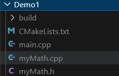
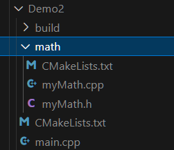

- [一、常用命令](#一常用命令)
  - [1.1 常用命令解释](#11-常用命令解释)
  - [1.2 常见的 CMake 变量](#12-常见的-cmake-变量)
  - [1.3 引入头文件（target\_include\_directories 和 include\_directories的区别）](#13-引入头文件target_include_directories-和-include_directories的区别)
  - [1.4 设置 C++ 标准、开启 O2 优化](#14-设置-c-标准开启-o2-优化)
  - [1.5 依赖管理](#15-依赖管理)
  - [1.6 操作注意事项](#16-操作注意事项)
- [二、实例](#二实例)
  - [2.1 所有源文件都在同一个目录下](#21-所有源文件都在同一个目录下)
  - [2.2 源文件在子目录，main.cpp 在主目录](#22-源文件在子目录maincpp-在主目录)
  - [2.3 复杂项目](#23-复杂项目)

# 一、常用命令

参考：[CMakeLists.txt的超傻瓜手把手教程（附实例源码）](https://blog.csdn.net/qq_38410730/article/details/102477162)

## 1.1 常用命令解释 

这里主要记录一些自己记不太情况的命令含义，一些常见的就不记录了。

```cmake
# CMake 要求的最低版本号
cmake_minimum_required(VERSION 3.0)

# 设置项目名
Project(CMakeStudy)

# 设置变量名，有两种方法
set(变量 路径/文件名...) # 使用${变量}来获取变量的内容
aux_source_directory(路径/文件名... 变量)

# 添加编译选项，有两种方法
add_definitions(编译选项)
add_compile_options(编译参数)

# 打印消息
message(消息)

# 编译子文件夹的CMakeLists.txt
add_subdirectory(子文件夹名称)

# 将.cpp/.c/.cc文件生成库文件
# 注意，库文件名称通常为libxxx.so，在这里只要写xxx即可
# SHARE 表示生成动态库，STATIC 表示生成静态库
add_library(库文件名称 STATIC 文件)

# 将.cpp/.c/.cc文件生成可执行文件
add_executable(可执行文件名称 文件)

# 规定 .h 头文件路径
include_directories(路径)

# 向工程中添加多个特定的文件搜索路径，主要是添加库文件的搜索路径
link_directories(路径)

# 对add_library或add_executable生成的文件进行链接操作
# 注意，库文件名称通常为libxxx.so，在这里只要写xxx即可
target_link_libraries(库文件名称/可执行文件名称（这里需要填生成的文件名） 链接的库文件名称)
```

***

通常一个 CMakeLists.txt 的编写流程：

```cmake
# CMake 要求的最低版本号
cmake_minimum_required(VERSION 3.0)

#必须
project(xxx
	VERSION 1.0
    DESCRIPTION "A complex CMake project example"
    LANGUAGES CXX
)                                          

# 设置 C++17 标准
set(CMAKE_CXX_STANDARD 17) 
set(CMAKE_CXX_STANDARD_REQUIRED True)

# 编译子文件夹的CMakeLists.txt
add_subdirectory(子文件夹名称) #父目录必须，子目录不必

# 生成库文件和生成可执行文件，进行二选一
add_library(库文件名称 STATIC 文件)                    #通常子目录(二选一)
add_executable(可执行文件名称 文件)                     #通常父目录(二选一)

include_directories(路径)                              #必须
link_directories(路径)                                 #必须

target_link_libraries(库文件名称/可执行文件名称（这里需要填生成的文件名） 链接的库文件名称)       #必须
```

复杂点的 CMakeLists.txt 文件的编写：

```cmake
# 设置 CMake 的最低版本要求
cmake_minimum_required(VERSION 3.10)

# 设置项目名称和版本
project(MyProject VERSION 1.0)

# 设置 C++ 标准
set(CMAKE_CXX_STANDARD 11)
set(CMAKE_CXX_STANDARD_REQUIRED True)

# 编译子文件夹的CMakeLists.txt
add_subdirectory(子文件夹名称) #父目录必须，子目录不必

# 添加所有的源文件到变量 SOURCE_FILES
set(SOURCE_FILES
    main.cpp
    src1.cpp
    src2.cpp
    # ... 添加其他 .cpp 文件
)

# 指定头文件目录 include_directories(include)
# 目标文件为可执行文件的，使用PRIVATE来保证B/include不会被传递给其他链接到 MyExecutable 的目标
# 头文件搜索更推荐使用 target_include_directories，可以避免不同目标之间的无意干扰
target_include_directories(MyExecutable PRIVATE B/include

# 生成可执行文件
add_executable(MyProject ${SOURCE_FILES})
# 生成静态库（SHARED 为动态库）
add_library(my_lib STATIC ${SOURCE_FILES})   

# 链接库（如果需要）
# target_link_libraries(MyProject PRIVATE lib1 lib2)

# 安装规则（如果需要）
# install(TARGETS MyProject DESTINATION bin)
# install(FILES header1.h header2.h DESTINATION include)
```


## 1.2 常见的 CMake 变量

参考：[[CMake教程] 使用变量](https://blog.csdn.net/maizousidemao/article/details/104096417)、[cmake 常用变量、常用环境变量、常用语法总结](https://blog.csdn.net/bytxl/article/details/50634868)

**一般通过 `SET(变量名 路径/文件名/ ...)` 来定义变量，通过使用 `${}` 获得变量的内容。**但是在 IF 等语句中，是直接使用变量名而不通过 `${}` 来取值。

* 1）`CMAKE_BINARY_DIR`、` PROJECT_BINARY_DIR`、 `<projectname>_BINARY_DIR`：这三个变量指代的内容是一致的。如果是 in source 编译，则表示的是工程顶层目录。如果是 out of source 编译，则表示的工程编译发生的目录。

* 2）`CMAKE_SOURCE_DIR`、`PROJECT_SOURCE_DIR`、` <projectname>_SOURCE_DIR`：这三个变量指代的内容是一致的，不论采用何种编译方式，**都表示工程顶层目录，也就是工程的根目录。**

* 3）`PROJECT_NAME`：**表示当前项目的名称，也就是通过 `project()` 指定的项目名称**。

* 4）`CMAKE_PROJECT_NAME`：**顶级项目的名称**。该变量保存顶级 CMakeLists.txt 文件中指定的项目名称 `project()` 命令。

* 5）`CMAKE_CURRENT_SOURCE_DIR` ：表示当前 CMakeLists.txt 文件所在的目录。

* 6）`EXECUTABLE_OUTPUT_PATH` ：表示二进制可执行文件输出位置。`LIBRARY_OUTPUT_PATH `：库文件输出位置。

* 7）`CMAKE_C_FLAGS` : 设置 C 编译选项。`CMAKE_CXX_FLAGS `: 设置 C++ 编译选项。

* 8）`CMAKE_CXX_FLAGS_DEBUG` : 设置编译类型 Debug 时的编译选项。`CMAKE_CXX_FLAGS_RELEASE `: 设置编译类型 Release 时的编译选项。

* 9）`CMAKE_GENERATOR `: 编译器名称。`CMAKE_COMMAND `: CMake 可执行文件本身的全路径
  。`CMAKE_BUILD_TYPE` : 工程编译生成的版本， Debug / Release

* 10）`CMAKE_VERSION`：表示 CMake 版本号。

  

## 1.3 引入头文件（target_include_directories 和 include_directories的区别）

**include_directories：** 

* **作用范围**：表示一个全局命令。它会影响到后面所有的目标，直到它被再次修改或作用域结束。因此，**指定的头文件路径将对整个 `CMake` 文件中的所有目标生效**。
* **用法**：它通常用于指定全局的头文件目录，但有时候可能会导致不必要的副作用，特别是在大项目中，因为它会影响到所有目标。

**target_include_directories：**

*  **作用范围**：`target_include_directories` 是**特定于某个目标（target）的**。<font color=alice>它只会影响指定的目标，而不会影响其他目标。这是推荐的做法，尤其在现代 `CMake` 中，因为它使得项目的构建更加模块化和可控。</color>
* **用法**：明确地指定某个目标的头文件目录，这样可以避免不同目标之间的无意干扰。

```cmake
# 目标文件为库文件的，使用PUBLIC来保证任何链接到MyLibrary的库都会在它们的编译命令中包含A/include目录
target_include_directories(MyLibrary PUBLIC A/include)

# 目标文件为可执行文件的，使用PRIVATE来保证B/include不会被传递给其他链接到 MyExecutable 的目标
target_include_directories(MyExecutable PRIVATE B/include)

# 整个项目中的所有目标都能访问到 ${CMAKE_SOURCE_DIR}/include 目录下的头文件
include_directories(${CMAKE_SOURCE_DIR}/include)
```

**主要区别：**

* **作用范围**：`include_directories` 是全局的，而 `target_include_directories` 是针对特定目标的。

* **可维护性**：`target_include_directories` 更加灵活和可维护，因为它避免了无意间影响到其他目标。使用 `include_directories` 可能会导致大型项目中不同目标之间的头文件路径冲突或混乱。

<font color=alice>**推荐用法**：现代 `CMake` 更推荐使用 `target_include_directories`，它更具模块化，能清晰地指定目标所需的头文件路径。</font>


## 1.4 设置 C++ 标准、开启 O2 优化

```cmake
cmake_minimum_required(VERSION 3.10)
project(MyProject)

# 设置C++标准为C++11，并强制要求
set(CMAKE_CXX_STANDARD 11)
set(CMAKE_CXX_STANDARD_REQUIRED ON)

# 针对Release构建类型设置O2优化
if (CMAKE_CXX_COMPILER_ID MATCHES "GNU|Clang")
    # GCC或Clang编译器：替换Release模式的优化选项为-O2
    set(CMAKE_CXX_FLAGS_RELEASE "-O2 -DNDEBUG")
elseif (CMAKE_CXX_COMPILER_ID STREQUAL "MSVC")
    # MSVC编译器：设置Release模式优化为/O2
    set(CMAKE_CXX_FLAGS_RELEASE "/O2 /DNDEBUG")
endif()

# 全局开启O2优化（影响所有构建类型）
# 添加编译选项，有两种方法 add_definitions(编译选项)、add_compile_options(编译参数)
if (CMAKE_CXX_COMPILER_ID MATCHES "GNU|Clang")
    add_compile_options(-O2)
elseif (CMAKE_CXX_COMPILER_ID STREQUAL "MSVC")
    add_compile_options(/O2)
endif()

# 添加可执行文件
add_executable(my_target main.cpp)
```


 ## 1.5 依赖管理

```cmake
# 1. 查找系统库
find_package(OpenCV REQUIRED)          # 查找 OpenCV
target_link_libraries(my_app PRIVATE ${OpenCV_LIBS})

# 2. 集成第三方源码
# 2.1 FetchContent（CMake 3.11+） 
include(FetchContent)
FetchContent_Declare(
  googletest
  GIT_REPOSITORY https://github.com/google/googletest.git
  GIT_TAG release-1.11.0
)
FetchContent_MakeAvailable(googletest)
target_link_libraries(my_test PRIVATE gtest_main)

# 2.2 ExternalProject（复杂依赖管理）
ExternalProject_Add(
  my_external_lib
  URL "https://example.com/lib.tar.gz"
  BUILD_IN_SOURCE TRUE
  INSTALL_COMMAND ""  # 禁用安装步骤
)
```


## 1.6 操作注意事项

1. **目标（Target）为中心的设计**
   - 使用 `target_*` 命令（如 `target_include_directories`）代替全局命令（如 `include_directories`）。
   - 通过 `PUBLIC`、`PRIVATE`、`INTERFACE` 控制依赖传递。
2. **避免全局变量**
   - 使用 `target_link_libraries` 传递依赖，而非全局 `link_directories`.
3. **兼容性处理**
   - 使用 `CMAKE_CXX_STANDARD` 替代 `-std=c++11` 硬编码。

# 二、实例

参考：[全网最细的CMake教程](https://zhuanlan.zhihu.com/p/534439206)、[CMake 良心教程](https://zhuanlan.zhihu.com/p/500002865)

## 2.1 所有源文件都在同一个目录下



CMakeLists.txt 文件如下：

```cmake
# CMake 最低版本号要求
cmake_minimum_required (VERSION 3.1)

# 设置项目名
project (Demo1)

# 查找当前目录下的所有源文件
# 并将名称保存到 DIR_SRCS 变量
aux_source_directory(. DIR_SRCS)

# 指定生成目标
add_executable(${PROJECT_NAME} ${DIR_SRCS})
```


## 2.2 源文件在子目录，main.cpp 在主目录



主目录下的 CMakeLists.txt 编写如下：

```cmake
# CMake 最低版本号要求
cmake_minimum_required (VERSION 3.1)

# 项目信息
project(Demo2)

# 查找当前目录下的所有源文件
# 并将名称保存到 DIR_SRCS 变量
aux_source_directory(. DIR_SRCS)

# 编译 math 子目录
add_subdirectory(./math)


# 指定生成目标 
add_executable(Demo2 main.cpp)

# 添加链接库
target_link_libraries(Demo2 MathFunctions)
```

子目录下的 CMakeLists.txt 编写如下：

```cmake
# 查找当前目录下的所有源文件
# 并将名称保存到 DIR_LIB_SRCS 变量
aux_source_directory(. DIR_LIB_SRCS)

# 生成链接库
add_library(MathFunctions ${DIR_LIB_SRCS})
```


## 2.3 复杂项目

**项目结构：**

```markdown
project_root/
├── CMakeLists.txt              # 根目录配置
├── include/                    # 公共头文件
│   └── mylib/
│       └── utils.h
├── src/                        # 主源码
│   ├── CMakeLists.txt
│   ├── main.cpp
│   └── utils.cpp
├── libs/                       # 内部库
│   └── mylib/
│       ├── CMakeLists.txt
│       ├── include/
│       │   └── mylib/
│       │       └── internal.h
│       └── src/
│           └── internal.cpp
├── thirdparty/                 # 第三方库配置
│   └── CMakeLists.txt
└── tests/                      # 单元测试
    ├── CMakeLists.txt
    └── test_utils.cpp
```

**根目录  `CMakeLists.txt` 文件编写如下：**

```cmake
cmake_minimum_required(VERSION 3.20)
project(ComplexProject
    VERSION 1.0
    DESCRIPTION "A complex CMake project example"
    LANGUAGES CXX
)

# 设置 C++ 标准
set(CMAKE_CXX_STANDARD 17)
set(CMAKE_CXX_STANDARD_REQUIRED ON)

# 全局输出目录
set(CMAKE_ARCHIVE_OUTPUT_DIRECTORY ${CMAKE_BINARY_DIR}/lib)
set(CMAKE_LIBRARY_OUTPUT_DIRECTORY ${CMAKE_BINARY_DIR}/lib)
set(CMAKE_RUNTIME_OUTPUT_DIRECTORY ${CMAKE_BINARY_DIR}/bin)

# 包含第三方库配置
add_subdirectory(thirdparty)

# 包含内部库和主程序
# 编译子文件夹的 CMakeLists.txt
add_subdirectory(libs/mylib)
add_subdirectory(src)
add_subdirectory(tests)  # 测试放在最后以确保依赖可用

# 安装规则
install(DIRECTORY include/ DESTINATION include)
install(TARGETS mylib myapp DESTINATION lib)
```

**主程序 `src/CMakeLists.txt` 文件编写如下：**

```cmake
# 创建可执行文件
add_executable(myapp
    main.cpp
    ../include/mylib/utils.h
    utils.cpp
)

# 链接内部库和头文件
target_include_directories(myapp
    PRIVATE
        ${CMAKE_SOURCE_DIR}/include
)

target_link_libraries(myapp
    PRIVATE
        mylib
)

# 添加版本信息
set_target_properties(myapp PROPERTIES
    VERSION ${PROJECT_VERSION}
    SOVERSION 1
)
```

**内部库 `libs/mylib/CMakeLists.txt`  文件编写如下：**

```cmake
# 创建静态库
add_library(mylib STATIC
    src/internal.cpp
    ${CMAKE_CURRENT_SOURCE_DIR}/include/mylib/internal.h
)

# 头文件暴露给其他组件
target_include_directories(mylib
    PUBLIC
        $<BUILD_INTERFACE:${CMAKE_CURRENT_SOURCE_DIR}/include>
        $<INSTALL_INTERFACE:include>
)

# 链接第三方库 (示例: OpenSSL)
find_package(OpenSSL REQUIRED)
target_link_libraries(mylib
    PRIVATE
        OpenSSL::SSL
        OpenSSL::Crypto
)

# 安装规则
install(TARGETS mylib EXPORT mylib-targets)
install(DIRECTORY include/ DESTINATION include)
```

**第三方库配置 `thirdparty/CMakeLists.txt` 文件编写如下：**

```cmake
# 方式 1: 使用 FetchContent 集成 GoogleTest
include(FetchContent)
FetchContent_Declare(
    googletest
    GIT_REPOSITORY https://github.com/google/googletest.git
    GIT_TAG release-1.12.1
)
FetchContent_MakeAvailable(googletest)

# 方式 2: 查找系统安装的库 (示例: JSON库)
find_package(nlohmann_json 3.10.5 REQUIRED)
```

**测试模块 `tests/CMakeLists.txt` 文件如下：**

```cmake
if(BUILD_TESTING)
    # 创建测试可执行文件
    add_executable(test_utils
        test_utils.cpp
    )

    # 链接依赖项
    target_link_libraries(test_utils
        PRIVATE
            mylib
            GTest::gtest_main
            nlohmann_json::nlohmann_json
    )

    # 添加测试用例
    add_test(
        NAME MyLibTests
        COMMAND test_utils
    )

    # 添加 GoogleTest 发现
    include(GoogleTest)
    gtest_discover_tests(test_utils)
endif()
```

**构建命令：**

```bash
# 生成构建系统
mkdir build && cd build
cmake .. -DCMAKE_BUILD_TYPE=Release -DBUILD_TESTING=ON

# 编译
cmake --build . --parallel 4

# 运行测试
ctest --output-on-failure

# 安装
cmake --install . --prefix /usr/local
```

