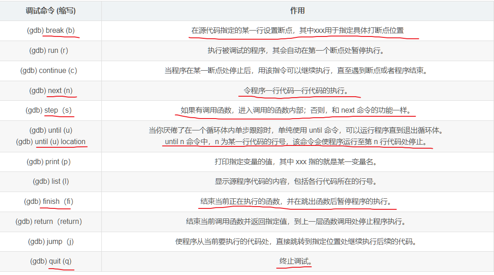
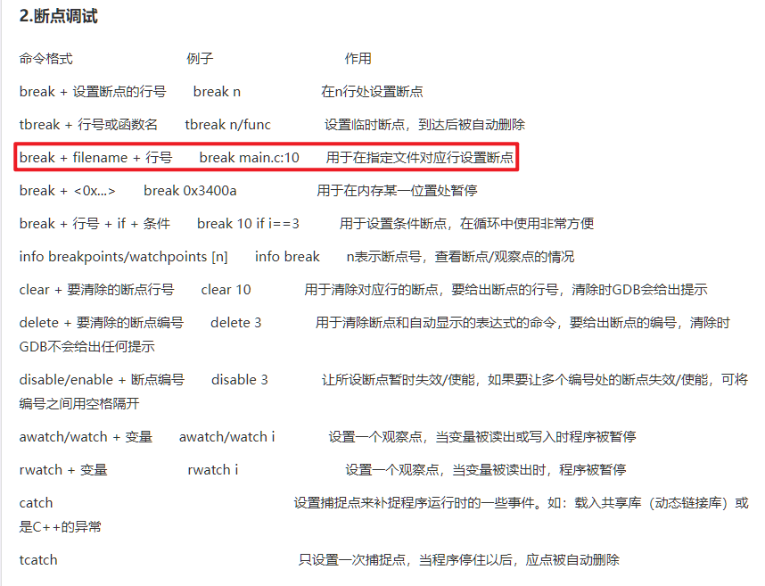
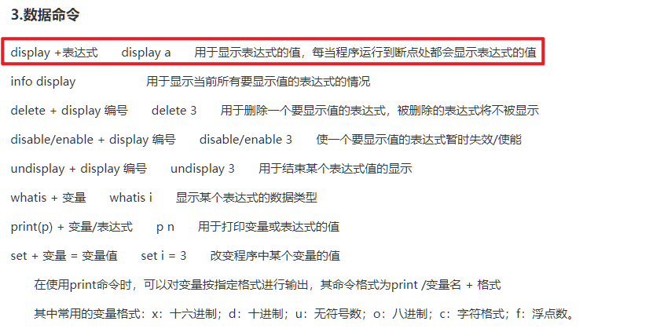
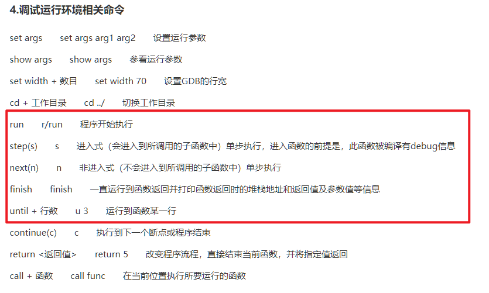
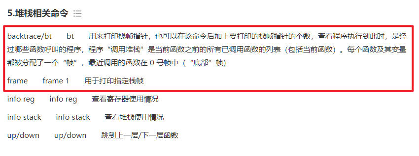
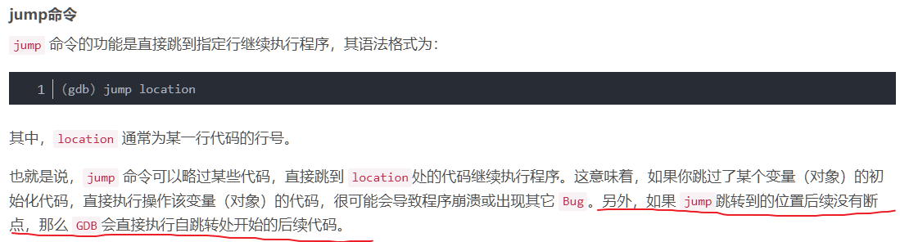

- [一、GDB 概念](#一gdb-概念)
  - [1.1 调试程序](#11-调试程序)
  - [1.2 GDB 的作用](#12-gdb-的作用)
  - [1.3 安装 GDB](#13-安装-gdb)
  - [二、GDB 的用法](#二gdb-的用法)
  - [2.1 调试步骤](#21-调试步骤)
  - [2.2 常用的调试命令](#22-常用的调试命令)
    - [2.2.1 断点调试](#221-断点调试)
    - [2.2.2 数据相关的命令](#222-数据相关的命令)
    - [2.2.3 调试运行环境相关的命令](#223-调试运行环境相关的命令)
    - [2.2.4 堆栈相关的命令](#224-堆栈相关的命令)
    - [2.2.5 跳转执行](#225-跳转执行)


参考：[GDB调试命令详解](https://blog.csdn.net/qq_28351609/article/details/114855630)、[gdb 调试命令](https://www.cnblogs.com/wuyuegb2312/archive/2013/03/29/2987025.html)、[Linux 高级编程 - 15 个 gdb 调试基础命令](https://dlonng.com/posts/gdb)

# 一、GDB 概念

## 1.1 调试程序

程序中出现的语法错误可以借助编译器来进行解决；但是逻辑错误则只能靠自己解决。实际场景中解决逻辑错误最高效的方法就是借助调试工具对程序进行调试了。

通过调试程序，可以监控程序执行的每一个细节，包括变量的值、函数的调用过程、内存中的数据、线程的调度等，从而发现隐藏的错误或者低效的代码。


## 1.2 GDB 的作用

GDB 调试器可以用来实现以下几个功能：

* 程序启动时，可以按照我们自定义的要求运行程序，如设置参数、环境变量；
* 可使被调试程序在指定代码处暂停运行，并查看当前程序的运行状态（如当前变量的值、函数的执行结果等），即支持断点调试；
* 程序在执行过程中，可以改变某个变量的值，还可以改变代码的执行顺序，从而修改程序中出现的逻辑错误；

## 1.3 安装 GDB

```shell
# 安装 gdb
sudo apt-get install gdb

# 查看 gdb 版本
gdb -v
```


## 二、GDB 的用法

使用 `g++ -g` 编译程序，生成带调试信息的可执行文件，就能使用 `gdb` 进行断点调试了。

```
g++ -g hello.cpp -o hello.out
```

## 2.1 调试步骤

**在 Windows 的 IDE 下调试程序，例如使用 VS，一般都有下面这几个操作：**

* 1）Debug 模式编译并启动程序。
* 2）程序运行出错，打**断点**分析出错的地方。
* 3）单步运行程序，包括：`step over` 单步执行；`step into` 跳入函数；`step return` 跳出函数。
* 4）还有全速运行，打印或者监视变量，冻结或解冻线程等调试技术。

在 IDE 中上面的这些步骤一般都**有固定的按钮**提供给我们使用，非常的简单方便，我们只要多练习练习，在图形界面调试程序不会很难，但是在 Linux 下用命令来调试程序就比图形界面要复杂很多了。

***

在 Linux 下既然是使用命令行来调试，顾名思义就是**手敲命令来调试程序**，也就是**使用 GDB 进行调试，大体分为下面几个步骤**：

* 1）编译可以调试的程序；
* 2）运行程序，打断点；
* 3）单步调试，监控变量；
* 4）可视化调试；
* 5）其他调试技术；

上述步骤虽然与 IDE 调试差不多，但是实际上是需要自己敲调试命令的，而不是直接点击按钮了。


## 2.2 常用的调试命令




**具体执行步骤如下：**

1. **载入要调试的程序**：`gdb hello.out`；输入 `q` 退出 `gdb` 调试程序；
2. **查看调试程序**：`list` 或者 `l`;
3. **添加断点**：在 `gdb` 下输入 `break` 或者简写 `b`，以下有几个常见用法：

```shell
b function_name
b row_num
b file_name:row_num
b row_num if condition
```

4. **查看断点**：`info break` 或者简写 `i b`；
5. **禁用断点**：`disable Num`；
6. **删除断点**：`delete Num` 或者简写 `d Num`；
7. **运行程序**：使用 `run` 或者简写 `r` 来运行当前载入的程序；
8. **单步调试**：使用 `next` 或者简写 `n` 来单步执行下一步；
9. **跳入、跳出函数**：使用 `step` 或者简写 `s` 来跳入一个函数，使用 `finish` 或者简写 `fi` 来跳出一个函数。
10. **打印变量值**：使用 `print val` 或者简写 `p val` 来打印一个变量或者函数的返回值；
11. **监控变量**：使用 `watch val` 来监控一个变量，使用 `info watch` 来查看监控的变量。**注意：程序必须先运行才能进行监控。**
12. **查看变量类型**：使用 `whatis val` 来查看一个变量的类型。
13. **在 `gbd` 下进入 shell**：输入命令 `shell`。
14. **在 `gdb` 下实现可视化调试**：输入命令 `wi`。

### 2.2.1 断点调试



### 2.2.2 数据相关的命令



### 2.2.3 调试运行环境相关的命令



### 2.2.4 堆栈相关的命令



### 2.2.5 跳转执行

