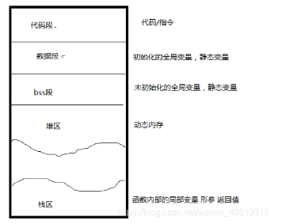

- [一、基础知识](#一基础知识)
  - [1.1 进程的概念](#11-进程的概念)
  - [1.2 多进程(任务)并行的实现](#12-多进程任务并行的实现)
  - [1.3 重要指令](#13-重要指令)
  - [1.4 父子进程和进程 ID](#14-父子进程和进程-id)
- [二、多进程编程](#二多进程编程)
  - [2.1 创建子进程（fork/vfork）](#21-创建子进程forkvfork)
- [三、进程通信方式](#三进程通信方式)
  - [3.1 管道通信](#31-管道通信)
  - [3.2 消息队列](#32-消息队列)
  - [3.3 共享内存](#33-共享内存)
  - [3.4 信号量](#34-信号量)
  - [3.5 信号](#35-信号)
  - [3.6 Socket](#36-socket)


> [Linux多进程编程(典藏、含代码)](https://blog.csdn.net/weixin_40519315/article/details/104156838)

# 一、基础知识

## 1.1 进程的概念

<font color=alice>一个程序文件，只是一堆待执行的代码和部分待处理的数据。它们只是被加载到内存中，然后让 CPU 逐条执行其代码，然后根据代码做出相应的动作，最终形成一个真正”动态执行“的程序，也就是进程。</font>**进程是动态的，程序是静止的。**

## 1.2 多进程(任务)并行的实现

对于一个单核 CPU 来说，多进程从宏观上是并行的，实际上是串行的。

它使用**时间片来划分周期调用**来实现，每个任务在一段时间内会分到一段时间片(占CPU的时间)，在这段时间内该任务只能运行时间片长度，每个任务执行一点、每个任务执行一点，从而达到”同时“的效果。

每个任务的调度和切换是由**系统调度器**来实现的，进程有以下五种状态：

* **就绪状态**：未占到CPU，进程准备好了，等待系统调度器调度。
* **运行状态**：占到CPU，已经开始运行。
* **暂停状态**：没占，收到外部暂停信号,暂停运行 (不在参与任务调度)。
* **挂起(睡眠)状态**：IO资源不满足，导致进程睡眠。 (不在参与任务调度)(例如键盘输入)
* **僵尸状态**：进程已经结束，但是资源(内存、硬件接口)没有回收。

## 1.3 重要指令

```bash
# 1.查看进程信息
ps
ps aux # 显示系统所有的进程
ps -elf # 显示系统所有的进程(通用)

# 查看进程 id
ps -ef | grep process
# 查看该进程的线程信息
pstree -H pid

# 2.动态查看进程信息
top

# 3.查看父子关系结构的进程
pstree

# 4.终止进程
kill -9 进程号
```

## 1.4 父子进程和进程 ID

**Linux 中的进程都是由其它进程启动的**。若进程 a 启动了进程 b，那么称 a 是 b 的**父进程**，b 是 a 的**子进程**。

<font color=blue>Linux 启动时，**0 进程** 启动 1 号进程(`init`) 和 2 号进程(内核进程)，0 号进程退出，其它进程是由 1号、2 号进程直接或间接产生。</font>

* 1 号进程（`init`） 是所有用户进程的祖先。
* 2 号进程（内核进程）是内核进程的祖先。

***

**进程号 PID（Process ID）**其类型为 `pid_t`，是一个正整数。

* 每个进程都有一个唯一的 ID，由 OS 进行管理和分配。
* 每个进程创建会分配一个 ID，结束会取消一个 ID。
* 取消的 ID 会被延时重复使用，但是不会同时出现同一个 ID。

```cpp
// 获取本进程的 ID
getid();

// 获取父进程的 ID，get parent id
getppid();

// 让程序后台运行的 Linux 命令
// 返回值为进程的 PID
./可执行文件 &
```


# 二、多进程编程

## 2.1 创建子进程（fork/vfork）

<font color=blue>调用 fork()，子进程会复制父进程的进程空间，除了代码段不会复制到子进程，其它段都需要复制到子进程，属于写拷贝（即只有改的时候，才会进行拷贝）。</font>

在 `fork()` 函数执行完成之后，会有两个进程，一个子进程、一个父进程。**在子进程中`fork()` 函数返回 0，在父进程中 `fork()` 函数返回子进程的线程 ID**。

因此，可以通过 `fork()` 函数的返回值来当前进程是子进程还是父进程。




## 2.2 多进程 GDB 调试命令

>[GDB调试多进程的命令介绍和演示](https://www.cnblogs.com/liuhanxu/p/17011777.html)

```cpp
#include <sys/wait.h>
#include <unistd.h>

#include <iostream>
using namespace std;

int main() {
  // 子进程中fork()函数返回 0，在父进程中fork()函数返回子进程的进程ID
  pid_t pid = fork();
  if (pid == 0) {  // 子进程
    printf("I am child, my pid = %d, my parent pid = %d\n", getpid(),
           getppid());
  } else if (pid > 0) {  // 父进程
    printf("I am parent, my pid = %d, my child pid = %d\n", getpid(), pid);
    wait(NULL);  // 等待子进程退出
  } else {       // fork失败
    perror("fork error!\n");
    return -1;
  }
  return 0;
}
```

<font color=alice>**其中[Detaching after fork from child process xxx]则说明在fork出子进程后就释放了，只跟踪父进程。**</font>

**进程操作命令 inferiors：**

* `info inferiors`：查看所有进程，带*号表示当前进程。
* `inferiors 2`：切换到编号为2的进程。
* `detach inferiors 2`：detach掉编号为2的进程，注意这个进程还存在，可以再次用run命令执行它。
* `kill inferiors 2`：kill掉编号为2的进程，注意这个进程还存在，可以再次用run命令执行它。
* `add-inferior [-copies n] [-exec executable]`：添加新的调试进程。

***

**只调试子进程 set follow-fork-mode child：**

默认设置下，在调试多进程程序时 GDB 只会调试主进程，在高版本的 GDB  中支持多进程的同时调试。 **也就是说， `GDB` 可以同时调试多个程序. 只需要设置 `follow-fork-mode` (默认值 `parent`) 和 `detach-on-fork` (默认值 `on` )即可。**

* `set follow-fork-mode parent`：只调试父进程，子进程继续运行（GDB默认）。
* `set follow-fork-mode child`：只调试子进程，父进程继续运行。
* `show follow-fork-mode`：查看follow-fork-mode当前值。

***

**同时调试父子进程 set detach-on-fork off：**

* `set detach-on-fork on`：只调试一个进程，可以是父进程或子进程（GDB默认）。
* `set detach-on-fork off`：同时调试父子进程，如果 follow-fork-mode 是 parent，则 gdb 跟踪父进程，子进程阻塞在fork位置。如果 follow-fork-mode 是 child ，则 gdb 跟踪子进程，父进程阻塞在 fork 位置。此时用户可以根据调试情况在父进程和子进程之间来回切换调试。
* `show detach-on-fork`：查看detach-on-fork当前值。

***

**所有进程同步调试：**

* **在调试多进程时，默认情况下，除了当前调试的进程，其他进程都处于挂起状态，所以，如果需要在调试当前进程的时候，其他进程也能正常执行，那么通过设置`set schedule-multiple on`即可**。

* `set schedule-multiple off`：gdb 发出执行命令后，只有当前进程会执行，其他进程挂起（GDB默认）。

* `set schedule-multiple on`：当 `gdb` 发出执行命令后，所有的进程都会正常执行。
* `show schedule-multiple`：查看schedule-multiple当前值。

# 三、进程通信方式

## 3.1 管道通信

> [进程间通信之管道（pipe）和命名管道（FIFO）](https://blog.csdn.net/daaikuaichuan/article/details/82827994)、[进程间的六种通信方式——管道 命名管道 详解](https://blog.csdn.net/ZHNEYU/article/details/126044287)


## 3.2 消息队列

>[Linux进程通信 | 消息队列](https://www.cnblogs.com/Wayne123/p/17225376.html)、[Linux进程间通信-消息队列（IPC、mq）C/C++代码接口](https://blog.csdn.net/zhoubiaodi/article/details/123513131)、[进程间通信的方式（三）：消息队列](https://zhuanlan.zhihu.com/p/37891272)

消息队列是在两个不相关进程间传递数据的一种简单、高效的方式，独立于发送进程、接受进程而存在。

消息队列提供了一种从一个进程向另一个进程发送数据库的方法。每个数据块都被认为是一个管道，接收进程可以独立地接收含有不同管道的数据结构。


## 3.3 共享内存

**共享内存：每个进程使用一块虚拟地址空间映射到相同的物理内存中**。


## 3.4 信号量

信号量是一个整形的计数器，主要用于实现进程间的互斥与同步，而不是用于缓存进程间通信的数据。


## 3.5 信号


## 3.6 Socket


