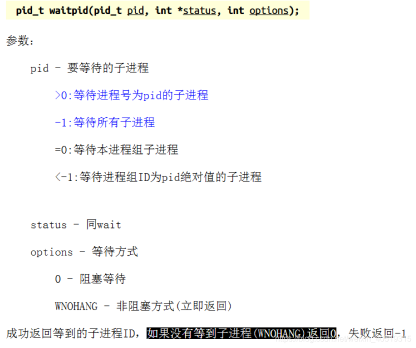
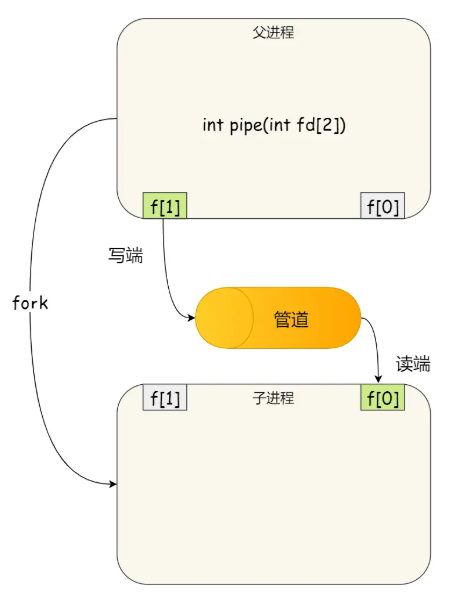

- [一、基础知识](#一基础知识)
  - [1.1 进程的概念](#11-进程的概念)
  - [1.2 多进程(任务)并行的实现](#12-多进程任务并行的实现)
  - [1.3 重要指令](#13-重要指令)
  - [1.4 父子进程和进程 ID](#14-父子进程和进程-id)
- [二、多进程编程](#二多进程编程)
  - [2.1 创建子进程（fork/vfork）](#21-创建子进程forkvfork)
  - [2.2 多进程 GDB 调试命令](#22-多进程-gdb-调试命令)
  - [2.3 进程结束](#23-进程结束)
  - [2.4 等待进程结束并回收资源](#24-等待进程结束并回收资源)
    - [2.4.1 wait() 函数](#241-wait-函数)
    - [2.4.2 waitpid() 函数](#242-waitpid-函数)
  - [2.5 替换进程内容（exec 系列函数）](#25-替换进程内容exec-系列函数)
- [三、进程通信方式](#三进程通信方式)
  - [3.1 管道通信](#31-管道通信)
    - [3.1.1 定义](#311-定义)
    - [3.1.2 管道的命令](#312-管道的命令)
    - [3.1.3 管道的使用](#313-管道的使用)
  - [3.2 消息队列](#32-消息队列)
  - [3.3 共享内存](#33-共享内存)
  - [3.4 信号量](#34-信号量)
  - [3.5 信号](#35-信号)
  - [3.6 Socket](#36-socket)


> [Linux多进程编程(典藏、含代码)](https://blog.csdn.net/weixin_40519315/article/details/104156838)

# 一、基础知识

## 1.1 进程的概念

<font color=alice>一个程序文件，只是一堆待执行的代码和部分待处理的数据。它们只是被加载到内存中，然后让 CPU 逐条执行其代码，然后根据代码做出相应的动作，最终形成一个真正”动态执行“的程序，也就是进程。</font>**进程是动态的，程序是静止的。**

## 1.2 多进程(任务)并行的实现

对于一个单核 CPU 来说，多进程从宏观上是并行的，实际上是串行的。

它使用**时间片来划分周期调用**来实现，每个任务在一段时间内会分到一段时间片(占CPU的时间)，在这段时间内该任务只能运行时间片长度，每个任务执行一点、每个任务执行一点，从而达到”同时“的效果。

每个任务的调度和切换是由**系统调度器**来实现的，进程有以下五种状态：

* **就绪状态**：未占到CPU，进程准备好了，等待系统调度器调度。
* **运行状态**：占到CPU，已经开始运行。
* **暂停状态**：没占，收到外部暂停信号,暂停运行 (不在参与任务调度)。
* **挂起(睡眠)状态**：IO资源不满足，导致进程睡眠。 (不在参与任务调度)(例如键盘输入)
* **僵尸状态**：进程已经结束，但是资源(内存、硬件接口)没有回收。

## 1.3 重要指令

```bash
# 1.查看进程信息
ps
ps aux # 显示系统所有的进程
ps -elf # 显示系统所有的进程(通用)

# 查看进程 id
ps -ef | grep process
# 查看该进程的线程信息
pstree -H pid

# 2.动态查看进程信息
top

# 3.查看父子关系结构的进程
pstree

# 4.终止进程
kill -9 进程号
```

## 1.4 父子进程和进程 ID

**Linux 中的进程都是由其它进程启动的**。若进程 a 启动了进程 b，那么称 a 是 b 的**父进程**，b 是 a 的**子进程**。

<font color=blue>Linux 启动时，**0 进程** 启动 1 号进程(`init`) 和 2 号进程(内核进程)，0 号进程退出，其它进程是由 1号、2 号进程直接或间接产生。</font>

* 1 号进程（`init`） 是所有用户进程的祖先。
* 2 号进程（内核进程）是内核进程的祖先。

***

**进程号 PID（Process ID）**其类型为 `pid_t`，是一个正整数。

* 每个进程都有一个唯一的 ID，由 OS 进行管理和分配。
* 每个进程创建会分配一个 ID，结束会取消一个 ID。
* 取消的 ID 会被延时重复使用，但是不会同时出现同一个 ID。

```cpp
// 获取本进程的 ID
getid();

// 获取父进程的 ID，get parent id
getppid();

// 让程序后台运行的 Linux 命令
// 返回值为进程的 PID
./可执行文件 &
```


# 二、多进程编程

## 2.1 创建子进程（fork/vfork）

<font color=blue>调用 fork()，子进程会复制父进程的进程空间，除了代码段不会复制到子进程，其它段都需要复制到子进程，属于写拷贝（即只有改的时候，才会进行拷贝）。</font>

在 `fork()` 函数执行完成之后，会有两个进程，一个子进程、一个父进程。**在子进程中`fork()` 函数返回 0，在父进程中 `fork()` 函数返回子进程的线程 ID**。

因此，可以通过 `fork()` 函数的返回值来当前进程是子进程还是父进程。


## 2.2 多进程 GDB 调试命令

>[GDB调试多进程的命令介绍和演示](https://www.cnblogs.com/liuhanxu/p/17011777.html)

```cpp
#include <sys/wait.h>
#include <unistd.h>

#include <iostream>
using namespace std;

int main() {
  // 子进程中fork()函数返回 0，在父进程中fork()函数返回子进程的进程ID
  pid_t pid = fork();
  if (pid == 0) {  // 子进程
    printf("I am child, my pid = %d, my parent pid = %d\n", getpid(),
           getppid());
  } else if (pid > 0) {  // 父进程
    printf("I am parent, my pid = %d, my child pid = %d\n", getpid(), pid);
    wait(NULL);  // 等待子进程退出
  } else {       // fork失败
    perror("fork error!\n");
    return -1;
  }
  return 0;
}
```

<font color=alice>**其中[Detaching after fork from child process xxx]则说明在fork出子进程后就释放了，只跟踪父进程。**</font>

**进程操作命令 inferiors：**

* `info inferiors`：查看所有进程，带*号表示当前进程。
* `inferiors 2`：切换到编号为2的进程。
* `detach inferiors 2`：detach掉编号为2的进程，注意这个进程还存在，可以再次用run命令执行它。
* `kill inferiors 2`：kill掉编号为2的进程，注意这个进程还存在，可以再次用run命令执行它。
* `add-inferior [-copies n] [-exec executable]`：添加新的调试进程。

***

**只调试子进程 set follow-fork-mode child：**

默认设置下，在调试多进程程序时 GDB 只会调试主进程，在高版本的 GDB  中支持多进程的同时调试。 **也就是说， `GDB` 可以同时调试多个程序. 只需要设置 `follow-fork-mode` (默认值 `parent`) 和 `detach-on-fork` (默认值 `on` )即可。**

* `set follow-fork-mode parent`：只调试父进程，子进程继续运行（GDB默认）。
* `set follow-fork-mode child`：只调试子进程，父进程继续运行。
* `show follow-fork-mode`：查看follow-fork-mode当前值。

***

**同时调试父子进程 set detach-on-fork off：**

* `set detach-on-fork on`：只调试一个进程，可以是父进程或子进程（GDB默认）。
* `set detach-on-fork off`：同时调试父子进程，如果 follow-fork-mode 是 parent，则 gdb 跟踪父进程，子进程阻塞在fork位置。如果 follow-fork-mode 是 child ，则 gdb 跟踪子进程，父进程阻塞在 fork 位置。此时用户可以根据调试情况在父进程和子进程之间来回切换调试。
* `show detach-on-fork`：查看detach-on-fork当前值。

***

**所有进程同步调试：**

* **在调试多进程时，默认情况下，除了当前调试的进程，其他进程都处于挂起状态，所以，如果需要在调试当前进程的时候，其他进程也能正常执行，那么通过设置`set schedule-multiple on`即可**。
* `set schedule-multiple off`：gdb 发出执行命令后，只有当前进程会执行，其他进程挂起（GDB默认）。
* `set schedule-multiple on`：当 `gdb` 发出执行命令后，所有的进程都会正常执行。
* `show schedule-multiple`：查看schedule-multiple当前值。

## 2.3 进程结束

不管是子进程还是父进程，都要进行进程结束。**进程的退出分为正常退出和异常退出。**

**进程的正常退出：**

* `return` 只是代表函数的结束, 返回到函数调用的地方。
* `exit()`  代表整个进程的结束，无论当前执行到哪一行代码，只要遇到`exit()` ，这个进程就会马上结束。
* 进程的所有线程都结束。
*  `_exit()`  或者 `_Exit()` 是系统调用函数。

<font color=alice>`_exit()` 和 `_Exit()` 都是系统调用函数，`exit()` 是库函数。`exit()` 通过调用 `_exit()` 实现退出，`exit()` 会清空缓冲区、调用**退出处理函数**。</font>

**退出处理函数**：

* 进程正常退出，且调用 exit() 函数，会自动**退出处理函数**。
* **退出处理函数**可以做一些清理工作，需要先登记才生效，退出处理函数保存在退出处理函数栈中（**先进后出**的原则）。

***

 **进程的异常退出：**

* 被信号打断(Ctrl + C、段错误、kill -9 进程号)。
* 主线程被取消执行。

## 2.4 等待进程结束并回收资源

**子进程退出时，不管是正常还是异常的，父进程都会收到信号。子进程推出后，内存上的资源必须是由父进程进行回收的。**

**僵尸进程**：<font color=alice>子进程执行结束，会通过信号通知父进程，让父进程回收资源，如果父进程不处理信号，则子进程变成僵尸进程了。</font>

**孤儿进程**：<font color=blue>若父进程先执行结束，那么子进程就会变成孤儿进程了。孤儿进行由 1 号进程 (`init`) 进行回收，但实际编程中需要避免产生孤儿进程这种情况，因为 1号进程非常繁忙。</font>

### 2.4.1 wait() 函数

`wait()` 函数的作用：

1. **阻塞等待子进程终止**
   调用 `wait()` 的父进程会暂停执行（阻塞），直到 **任意一个子进程终止**，否则父进程就会卡住。
2. **回收子进程资源**
   获取子进程的终止状态，并释放子进程占用的内核资源（如进程表项），避免产生 **僵尸进程（Zombie Process）**。
3. **获取子进程退出状态**
   通过参数 `status` 返回子进程终止的具体原因（正常退出、信号终止等）。

**`wait()` 函数的返回值：**

- **成功**：返回被终止子进程的 **PID**。
- **失败**：返回 `-1`，并设置 `errno`（常见错误：没有子进程可等待时返回 `-1`，`errno=ECHILD`）。

```cpp
#include <sys/types.h>
#include <sys/wait.h>
 
pid_t wait(int * status);

// status（输出参数）
// 指向整型的指针，用于存储子进程的终止状态信息。若不需要状态信息可设为 NULL。
if (WIFEXITED(status)) {   // 子进程是否正常退出？
    int exit_code = WEXITSTATUS(status);  // 获取退出码（如 exit(5) 返回 5）
} else if (WIFSIGNALED(status)) {  // 子进程是否被信号终止？
    int signal = WTERMSIG(status); // 获取导致终止的信号（如 SIGKILL）
}
```

**status 是传出函数，传出退出状态/退出码**：


### 2.4.2 waitpid() 函数

**主要作用：**

1. **指定目标子进程**
   通过 `pid` 参数选择等待的子进程（或一组子进程）。
2. **非阻塞等待**
   通过 `options` 参数设置非阻塞模式（如 `WNOHANG`）。
3. **状态全面监控**
   支持捕获子进程的终止、暂停（如 `SIGSTOP`）或恢复（如 `SIGCONT`）状态。

**该函数为 wait() 的加强版，可以选择指定哪个子进程，还可以选择等待方式（可以选择阻塞、不阻塞）**。

```cpp
#include <sys/types.h>
#include <sys/wait.h>

pid_t waitpid(pid_t pid, int *status, int options);

// 使用以下代码回收父进程所有的僵尸子进程的资源
while(waitpid(-1, NULL, WNOHANG)> 0);
```



## 2.5 替换进程内容（exec 系列函数）

`exec` 系列函数是 Unix/Linux 系统编程中用于 **替换当前进程映像** 的核心工具，**通过加载并执行新程序，覆盖原进程的代码段、数据段和堆栈**。它们常与 `fork()` 配合使用，实现“创建子进程 → 执行新程序”的经典模式。

使用 fork/vfork() 产生的子进程内容与父进程完全一致，exec 系列函数可以使用一个程序去替换进程的内容（不会产生新的进程，是替换）。单独使用 exec() 函数没有意义，一般是是与 fork/vfork 连用。用 fork/vfork 产生子进程，然后使用 exec 进行替代。

<font color=alice>使用 vfork 堵塞父进程，抢了资源，但是使用exec后，子进程替换了内容，便不抢占资源了，父进程继续执行，不用等子进程。</font>

**所有的 exec 函数均基于系统调用 `execve()` 函数，但参数形式和搜索路径不一样。**

**核心行为：**

1. **替换进程映像**
   **当前进程的代码、数据、堆栈被新程序完全替换**，但以下属性保留：
   - 进程 ID（PID）
   - 打开的文件描述符（除非显式设置 `FD_CLOEXEC`）
   - 信号处理设置（默认继承，但可通过 `sigaction` 的 `SA_RESETHAND` 重置）
2. **无返回值**
   成功时，`exec` 函数 **不返回**；失败时返回 `-1`，并设置 `errno`。

```cpp
#include <unistd.h>

// 基础函数
int execve(const char *pathname, char *const argv[], char *const envp[]);

// 衍生函数（参数形式不同）
int execl(const char *path, const char *arg, ... /*, (char *) NULL */);
int execv(const char *path, char *const argv[]);
int execle(const char *path, const char *arg, ... /*, (char *) NULL, char *const envp[] */);
int execvpe(const char *file, char *const argv[], char *const envp[]);
int execlp(const char *file, const char *arg, ... /*, (char *) NULL */);
int execvp(const char *file, char *const argv[]);
```


# 三、进程通信方式

## 3.1 管道通信

> [进程间通信之管道（pipe）和命名管道（FIFO）](https://blog.csdn.net/daaikuaichuan/article/details/82827994)、[进程间的六种通信方式——管道 命名管道 详解](https://blog.csdn.net/ZHNEYU/article/details/126044287)

### 3.1.1 定义

管道是一种用于两个进程之间单向通信的机制。**由于管道传递数据的单向性，管道又称为半双工管道**。管道的这一特点决定了其使用的局限性，管道是 Linux 支持的最初 Unix IPC 形式之一，具有以下特点：

* 数据**只能从一个进程流向另一个进程（一个读管道、一个写管道）**，如果要进行双工通信，需要建立两个管道。
* 管道只能用于父子进行或兄弟进程间的通信，也就是说管道只能用于具有亲缘关系的进程间的通信。

### 3.1.2 管道的命令

```bash
command1 | command2 | command3
```

管道的操作符为：`|`，它只能处理**前一个指令传出的正确输出信息，对错误信息没有直接处理能力，然后传递给下一个命令，作为标准的输入**。

在shell中输入命令：`ls -l | grep string`。我们知道 `ls` 命令（其实也是一个进程）会把当前目录中的文件都列出来，但是它不会直接输出，而是把本来要输出到屏幕上的数据通过管道输出到 `grep` 这个进程中，作为 `grep` 这个进程的输入，然后这个进程对输入的信息进行筛选，把存在 `string` 的信息的字符串（以行为单位）打印在屏幕上。

### 3.1.3 管道的使用

```cpp
#include <unistd.h>  
int pipe(int filedes[2]);   // 成功返回0，失败返回-1
```

`pipe` 函数用来创建一个管道，`fd` 是传出参数，用于保存返回的两个文件描述符。该文件描述符用于标识管道的两端，**`fd[0]` 只能用于读，`fd[1]` 只能用于写**，因此管道只能保证单向的数据通信。

**管道的一般使用方式为：父进程创建一个管道，然后 fork 一个子进程，由于子进程拥有父进程的副本，所以父子进程可以通过管道进程进行通信。**

对于从父进程到子进程的管道，父进程关闭读端（`fd[0]`），子进程关闭写端（`fd[1]`）；对于从子进程到父进程的管道，子进程关闭读端（`fd[0`]），父进程关闭写端（`fd[1]`）。

当管道的一端被关闭后，会出现以下两种情况：

1. 当读一个写端被关闭的管道时，在所有数据都被读取后，read返回0，表示文件结束；如果写端没有被关闭，但是没有数据，则读端读完数据后阻塞；
2. 当写一个读端被关闭的管道时，则产生信号 SIGPIPE，write 返回-1，`errno` 设置为EPIPE；如果读端没有被关闭，写端写满数据后，则写端阻塞。



### 3.1.4 popen 和 pclose 函数

`popen()` 函数是作为管道的一个实例，由标准 I/O 函数库提供。**该函数创建一个管道，并 fork 了一个子进程，该子进程根据 `popen()` 传入的参数，关闭管道的对应端，然后执行传入的 shell 命令，最后等待进程终止。**

调用 `popen()` 函数的进程与 fork 的子进程之间形成一个管道。调用进程与执行 shell 命令的子进程之间的管道信息是通过 `popen()` 函数返回的 `FIFE*` 来间接实现的，调用进程通过标准文件 I/O 来写入或读取管道。

```cpp
#include <stdio.h>  
// 成功返回标准文件I/O指针，失败返回NULL
// command：要执行的命令。传入参数是一个shell命令行，这个命令是通过shell处理的。
// type：指定管道的类型，可以是 "r"（读取）或 "w"（写入）。type = “r”，调用进程将读取command 执行后的标准输出，该标准输出通过返回的 FILE* 来操作；type = “w”，调用进程将写command 执行过程中的标准输入。
// 返回值：返回一个 FILE 指针，用于读取或写入管道。如果失败，返回 NULL。
FILE *popen(const char *command, const char *type); 
// 成功返回shell的终止状态，失败返回-1  
int pclose(FILE *stream); 
```

`popen()` 函数的原理以及优缺点：

* 原理：当调用 `popen()` 函数运行一个新进程时，它首先启动 shell，然后将 command 参数传递给它。
* 优点：可以使用 shell 来分析命令字符串，启动非常复杂的 shell 命令。
* 缺点：会启动两个进程，一个子进程，一个 shell 进程，效率会比较低。

```cpp
#include <stdio.h>
#include <stdlib.h>

int main() {
  FILE *fp;
  char path[1035];

  // /* 打开用于读取的管道 */
  // fp = popen("ls -l", "r");
  // if (fp == NULL) {
  //   printf("Failed to run command\n");
  //   exit(1);
  // }

  // /* 读取命令的输出一行一行地读取 */
  // while (fgets(path, sizeof(path), fp) != NULL) {
  //   printf("%s", path);
  // }

  // /* 关闭管道 */
  // pclose(fp);
  FILE *fpr = NULL, *fpw = NULL;
  char buf[256];
  int ret;
  // 执行完这行代码，标准输出就装满，这里这个标准输出标记为out1，
  // 管道指向out1，fpr指向管道的读端。执行这句代码，会一直去读取标准输出，
  // 若标准输出为空，则会阻塞，直到标准输出不为空，执行命令后又会去指
  // 读取标准输出继续执行。这里这个标准输入标记为in2。
  // 管道指向int2，fpw指向管道的写端。
  fpr = popen("cat /etc/group", "r");
  fpw = popen("grep root", "w");
  // 从out1中读取256个字节数据，存放在buf中。
  while ((ret = fread(buf, 1, sizeof(buf), fpr)) > 0) {
    // 将buf的数据写到int2(此时gerp命令一直在获取int2，直到进行退出)。
    fwrite(buf, 1, ret, fpw);
  }
  pclose(fpr);
  pclose(fpw);
  return 0;
}
```

### 3.1.5 命令管道（FIFO）

```cpp
#include <sys/types.h>  
#include <sys/stat.h>  
// 成功则返回0，失败返回-1 
// pathname：一个Linux路径名，它是FIFO的名字。即每个FIFO与一个路径名相对应。
// mode：指定的文件权限位，类似于open函数的第三个参数。即创建该FIFO时，指定用户的访问权限，有以下值：S_IRUSR，S_IWUSR，S_IRGRP，S_IWGRP，S_IROTH，S_IWOTH。
int mkfifo(const char *pathname, mode_t mode);  
```

`mkfifo()` 函数默认指定 `O_CREAT | O_EXECL` 方式创建 `FIFO`，如果创建成功，直接返回0。如果FIFO已经存在，则创建失败，会返回-1并且errno置为EEXIST。对于其他错误，则置响应的errno值；

当创建一个 `FIFO` 后，它必须以只读方式打开或者只写方式打开，所以可以用 `open` 函数，当然也可以使用标准的文件 `I/O` 打开函数，例如 `fopen` 来打开。由于 `FIFO` 是半双工的，所以不能够同时打开来读和写。

其实一般的文件 `I/O` 函数，如 `read`，`write`，`close`，`unlink` 都可用于 `FIFO`。对于管道和`FIFO` 的 `write` 操作总是会向末尾添加数据，而对它们的 `read` 则总是会从开头数据，所以不能对管道和 `FIFO` 中间的数据进行操作，因此对管道和 `FIFO` 使用 `lseek` 函数，是错误的，会返回ESPIPE错误。

**`mkfifo()`的一般使用方式是：通过 `mkfifo()` 创建 `FIFO`，然后调用 `open`，以读或者写的方式之一打开 `FIFO`，然后进行数据通信。**

```cpp
// test_fifo_read.cpp
#include <fcntl.h>
#include <stdio.h>
#include <string.h>
#include <sys/stat.h>
#include <sys/types.h>
#include <unistd.h>

int main(int argc, char *argv[]) {
  int fd;
  int ret;
  ret = mkfifo("my_fifo", 0666);  // 创建命名管道
  if (ret != 0) {
    perror("mkfifo");
  }
  fd = open("my_fifo", O_RDONLY);  // 等着只写
  if (fd < 0) {
    perror("open fifo");
  }
  while (1) {
    char recv[100] = {0};
    read(fd, recv, sizeof(recv));  // 读数据
    printf("read from my_fifo buf=[%s]\n", recv);
    sleep(1);
  }
  close(fd);
  return 0;
}

// test_fifo_write.cpp
#include <fcntl.h>
#include <stdio.h>
#include <string.h>
#include <sys/stat.h>
#include <sys/types.h>
#include <unistd.h>

int main(int argc, char *argv[]) {
  int fd;
  int ret;
  ret = mkfifo("my_fifo", 0666);  // 创建命名管道
  if (ret != 0) {
    perror("mkfifo");
  }
  fd = open("my_fifo", O_WRONLY);  // 等着只读
  if (fd < 0) {
    perror("open fifo");
  }
  char send[100] = "Hello World";
  write(fd, send, strlen(send));  // 写数据
  printf("write to my_fifo buf=%s\n", send);
  while (1);  // 阻塞，保证读写进程保持着通信过程
  close(fd);
  return 0;
}
```

### 3.1.6 总结

1. 管道是一个环形队列缓冲区，允许两个进程以生产者消费者模型进程通信。是一个先进先出（FIFO）队列，由一个进程写，而由另一个进程读。
2. 管道在创建时获得一个固定大小的字节数。当一个进程试图往管道中写时，如果有足够的空间，则写请求立即被执行，否则该进程被阻塞。如果一个进程试图读取的字节数多于当前管道中的字节数，也将被阻塞。
3. 操作系统强制实行互斥，只能有一个进程可以访问管道。
4. 只有有血缘关系（父子关系）的进程才可以共享匿名管道，不相关的进程只能共享命名管道。
5. 命名管道的用途主要有：（1）shell命名使用FIFO将数据从一条管道传送到另一条时，无须创建中间临时文件；（2）在客户进程和服务器进程间传送数据。

## 3.2 消息队列

>[Linux进程通信 | 消息队列](https://www.cnblogs.com/Wayne123/p/17225376.html)、[Linux进程间通信-消息队列（IPC、mq）C/C++代码接口](https://blog.csdn.net/zhoubiaodi/article/details/123513131)、[进程间通信的方式（三）：消息队列](https://zhuanlan.zhihu.com/p/37891272)

**消息队列是在两个不相关进程间传递数据的一种简单、高效的方式，独立于发送进程、接受进程而存在**。

消息队列提供了一种从一个进程向另一个进程发送数据块的方法。每个数据块都被认为是一个管道，接收进程可以独立地接收含有不同管道的数据结构。

```cpp
#include <sys/types.h>
#include <sys/ipc.h>
#include <sys/msg.h>

struct msg_form {
	long mtype;//类型
	char mtext[];//消息内容，可以是定长数组或者变长数组
};
```


## 3.3 共享内存

**共享内存：每个进程使用一块虚拟地址空间映射到相同的物理内存中**。

共享内存（Shared Memory）是一种进程间通信（IPC）机制，允许多个进程共享一块内存区域。共享内存是最快的 IPC 机制之一，因为进程可以直接访问共享内存中的数据，而不需要通过内核进行数据传递。

**特点：**

1. **高效**：共享内存允许进程直接访问内存中的数据，避免了数据在内核和用户空间之间的拷贝。
2. **同步**：共享内存本身不提供同步机制，需要使用其他同步机制（如信号量、互斥锁）来确保数据的一致性。
3. **持久性**：共享内存段在所有进程分离后仍然存在，直到显式删除。

***

共享内存的基本操作：**在 Unix 系统中，可以使用 `shmget`、`shmat`、`shmdt` 和 `shmctl` 函数来操作共享内存**。

- `shmget`：创建或获取一个共享内存段。
- `shmat`：将共享内存段附加到进程的地址空间。
- `shmdt`：将共享内存段从进程的地址空间分离。
- `shmctl`：控制共享内存段的操作，如删除共享内存段。

***

```cpp
// 写入进程（shm_write.cpp）
#include <sys/ipc.h>
#include <sys/shm.h>
#include <stdio.h>
#include <stdlib.h>
#include <string.h>

int main() {
    key_t key = ftok("shmfile", 65);  // 生成共享内存的唯一键
    int shmid = shmget(key, 1024, 0666 | IPC_CREAT);  // 创建共享内存段
    if (shmid == -1) {
        perror("shmget");
        exit(1);
    }

    char *str = (char*) shmat(shmid, (void*)0, 0);  // 将共享内存段附加到进程的地址空间
    if (str == (char*)-1) {
        perror("shmat");
        exit(1);
    }

    strcpy(str, "Hello from writer!");  // 写入数据到共享内存
    printf("Data written to shared memory: %s\n", str);

    shmdt(str);  // 将共享内存段从进程的地址空间分离

    return 0;
}
```

```cpp
// 读取进程（shm_read.cpp）
#include <sys/ipc.h>
#include <sys/shm.h>
#include <stdio.h>
#include <stdlib.h>

int main() {
    key_t key = ftok("shmfile", 65);  // 生成共享内存的唯一键
    int shmid = shmget(key, 1024, 0666 | IPC_CREAT);  // 获取共享内存段
    if (shmid == -1) {
        perror("shmget");
        exit(1);
    }

    char *str = (char*) shmat(shmid, (void*)0, 0);  // 将共享内存段附加到进程的地址空间
    if (str == (char*)-1) {
        perror("shmat");
        exit(1);
    }

    printf("Data read from shared memory: %s\n", str);  // 读取共享内存中的数据

    shmdt(str);  // 将共享内存段从进程的地址空间分离
    shmctl(shmid, IPC_RMID, NULL);  // 删除共享内存段

    return 0;
}
```

1. **生成共享内存的唯一键**：
   - 使用 `ftok` 函数生成一个唯一的键，用于标识共享内存段。

2. **创建或获取共享内存段**：
   - 使用 `shmget` 函数创建或获取一个共享内存段，并返回共享内存段的标识符。

3. **将共享内存段附加到进程的地址空间**：
   - 使用 `shmat` 函数将共享内存段附加到进程的地址空间，返回共享内存段的起始地址。

4. **写入和读取共享内存中的数据**：
   - 写入进程将数据写入共享内存。
   - 读取进程从共享内存中读取数据。

5. **将共享内存段从进程的地址空间分离**：
   - 使用 `shmdt` 函数将共享内存段从进程的地址空间分离。

6. **删除共享内存段**：
   - 使用 `shmctl` 函数删除共享内存段。

通过这个示例程序，你可以了解如何使用共享内存在两个进程之间进行通信。共享内存提供了一种高效的进程间通信机制，适用于需要在不相关进程之间传递大量数据的场景。


## 3.4 信号量

信号量是一个整形的计数器，主要用于实现进程间的互斥与同步，而不是用于缓存进程间通信的数据。


## 3.5 信号


## 3.6 Socket


