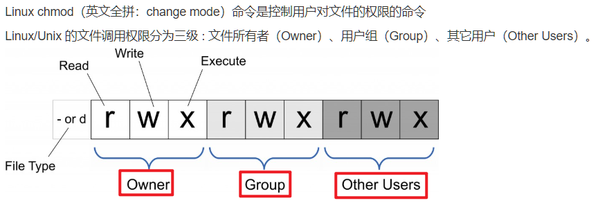

### 1. **文件与目录操作**

- `ls`：列出目录内容。
- `cd`：切换目录。
- `pwd`：显示当前目录路径。
- `cp`：复制文件或目录。
- `mv`：移动文件或重命名。
- `rm`：删除文件或目录。
- `touch`：创建空文件。
- `mkdir`：创建目录。
- `rmdir`：删除空目录。

### 2. **文件查看与编辑**

`cat`：显示文件内容。

```bash
# cat 是最简单的查看文件内容的命令。它将整个文件的内容输出到终端。
cat filename.txt
```

`less` / `more`：分页显示文件内容。

```bash
# less 和 more 都用于分页显示文件内容，它们比 cat 更适合查看长文件。
# 使用方向键或 PgUp、PgDn 上下滚动。按 q 退出。
less filename.txt

# 使用空格键向下翻页，按 q 退出。
more filename.txt
```

`head`：查看文件的前几行。

```bash
# head 命令默认显示文件的前 10 行，可以使用 -n 参数指定行数。
head filename.txt

# 想查看前 5 行
head -n 5 filename.txt
```

`tail`：查看文件的后几行。

```bash
# tail 命令用于查看文件的最后部分，默认显示最后 10 行。可以使用 -n 参数指定行数。
tail filename.txt

# 若要查看最后 5 行
tail -n 5 filename.txt
```

`nano` / `vim`：编辑文件。

```bash
# nano 是一个简单的终端文本编辑器，适用于快速编辑文件。
# 这会打开 filename.txt，并允许你在终端中编辑文件。

# 使用方向键进行移动。
# 按 Ctrl + O 保存文件。
# 按 Ctrl + X 退出编辑器。
nano filename.txt
```

在 `vim` 中，你需要切换到不同模式来进行操作：

- **普通模式**：用于移动光标和删除文本。
- **插入模式**：按 `i` 进入插入模式进行文本编辑。
- **命令模式**：按 `:` 进入命令模式。

**常用命令**：

- 按 `i` 进入插入模式。
- 按 `Esc` 回到普通模式。
- 按 `:w` 保存文件。
- 按 `:q` 退出编辑器，若未保存修改，按 `:wq` 保存并退出。
- 按 `:q!` 强制退出不保存。

`grep`：在文件中查找匹配模式。

使用 `-i` 选项进行不区分大小写的搜索。

使用 `-r` 或 `-R` 选项递归地搜索目录中的文件。

### 3. **文件权限与所有权**




> [chmod命令](https://www.runoob.com/linux/linux-comm-chmod.html)

`chmod`：修改文件权限。

Linux 中的文件权限用于控制对文件或目录的访问，主要通过三种类型的权限来实现：

- **读取权限**（read，r）：允许查看文件内容，对应数字 4。
- **写入权限**（write，w）：允许修改文件内容，对应数字 2。
- **执行权限**（execute，x）：允许执行文件（对文件夹而言，表示能否进入目录），对应数字 1。
- **无权限（-）**，对应数字 0。

这些权限分别应用于三个不同的用户类别：

- **文件所有者**（user，u）：文件的所有者。
- **文件所属组**（group，g）：与文件关联的用户组。
- **其他用户**（others，o）：系统中其他所有的用户。

符号模式（Symbolic Mode）使用字母来表示文件权限和修改操作。符号模式中，常用的符号包括：

- **u**：文件所有者（user）。
- **g**：文件所属组（group）。
- **o**：其他用户（others）。
- **a**：所有用户（all，包括 `u`、`g` 和 `o`），也就是等于`ugo`。
- **+**：添加权限。
- **-**：移除权限。
- **=**：设置权限。

权限的表示方式通常是以三个字符来展示：`rwx`。

数字模式（Numeric Mode）使用数字来表示权限，每个权限使用一个数字表示，分别是 `r`（4）、`w`（2）、`x`（1）。三个数字分别对应文件的所有者、所属组和其他用户的权限。

数字模式的表示方法：

- **r**（4）+ **w**（2）+ **x**（1）= 7
- **r**（4）+ **w**（2）= 6
- **r**（4）= 4
- **w**（2）= 2
- **x**（1）= 1
- 无权限 `-` = 0

```bash
chmod <permissions> <file>

# 符号模式：使用 r、w、x 来设置权限。
chmod u+x file.txt  # 给文件所有者添加执行权限
chmod go-w file.txt  # 移除组用户和其他用户的写权限
chmod u=rwx,g=rx,o=r file.txt  # 设置所有者可读写执行，组用户可读执行，其他用户只可读

# 数字模式：使用数字表示权限（3个数字，分别对应所有者、组和其他用户的权限）。
# 所有者：7（rwx，读取、写入、执行）。所属组：5（r-x，读取、执行）。其他用户：5（r-x，读取、执行）
# rwxr-xr-x
chmod 755 file.txt  # 所有者读写执行，组和其他用户可读执行

# 所有者：7（rwx，读取、写入、执行）。所属组：5（r-x，读取、执行）。其他用户：5（r-x，读取、执行）
# 即：rw-r--r--
chmod 644 file.txt  # 所有者读写，组和其他用户只读

# 所有者：7（rwx，读取、写入、执行）。所属组：7（rwx，读取、写入、执行）。其他用户：7（rwx，读取、写入、执行）
# 即：rwxrwxrwx
chmod 777 file.txt # 所有者、组、其他用户都可以进行读取、写入、执行

# 所有者：6（rw-，读取、写入）。所属组：0（---，没有权限）。其他用户：0（---，没有权限）
# rw-------
chmod 600 file.txt # 所有者可以进行读取、写入，组和其他用户没有任何权限
```

要查看文件或目录的权限与所有权，可以使用 `ls -l` 命令：

```bash
ls -l file.txt
```

输出结果示例：

```bash
# -rwxr-xr--：文件权限，所有者有读、写、执行权限，所属组有读和执行权限，其他用户只有读取权限。
# 1：硬链接的数量。
# user：文件的所有者。
# group：文件的所属组。
# 12345：文件的大小（字节）。
# Jan 1 12:34：最后修改时间。
# file.txt：文件名。
-rwxr-xr-- 1 user group 12345 Jan 1 12:34 file.txt
```


`chown`：修改文件所有者。

```bash
chown <owner>:<group> <file>

chown user:group file.txt  # 将文件的所有者更改为 user，所属组更改为 group
chown -R user:group /path/to/dir  # 递归地更改目录及其子目录的所有者和所属组
```


`chgrp`：修改文件所属组。

```bash
# chgrp（change group）用于更改文件或目录的所属组。
chgrp <group> <file>

chgrp developers file.txt  # 将文件的所属组更改为 developers
```


### 4. **文件查找与管理**

`find`：查找文件或目录。

```bash
# 用于在指定目录中查找符合条件的文件
find <directory> <options> <expression>

# -name：按文件名查找
find /home/user -name "file.txt"  # 查找文件名为 file.txt 的文件

# -type：按文件类型查找（例如 f 代表文件，d 代表目录）。
find /home/user -type f  # 查找所有文件
find /home/user -type d  # 查找所有目录

# -size：按文件大小查找。
find /home/user -size +100M  # 查找大于 100MB 的文件

# -exec：对查找的文件执行命令。
find /home/user -name "*.txt" -exec cp {} /backup/ \;  # 找到所有 txt 文件并复制到 /backup 目录
```

`locate`：快速查找文件。

```bash
# locate 命令基于预建的文件索引数据库，能够快速查找文件。
locate <filename>
locate file.txt  # 查找所有名为 file.txt 的文件

```

`updatedb`：更新 `locate` 数据库。`pdatedb` 用于更新 `locate` 命令使用的文件数据库。

`which`：查找命令的位置。

```bash
# which 用于显示命令的完整路径。
which gcc  # 查找 gcc 命令的路径
```

`lsblk`： — 显示块设备

```bash
# lsblk 用于列出系统中的所有块设备（例如硬盘、分区、USB 驱动器等）。
lsblk

```

`stat`：查看文件的详细信息。

```
# stat 显示文件的详细信息，包括文件大小、权限、所有者、修改时间等。
stat file.txt
```

### 5. **进程管理**

`ps`：显示当前进程。

> [ps命令](https://www.runoob.com/linux/linux-comm-ps.html)

```bash
# ps 用于列出当前系统中的进程。
ps [options]

ps aux  # 显示所有用户的所有进程
ps -ef  # 显示所有进程，包含父子进程信息
```

`top`：实时显示进程信息。

```bash
# top 是一个实时显示进程信息的命令。它会定期更新系统进程的状态，包括 CPU 使用率、内存使用率等。
# 按 q 退出。
# 按 P 按 CPU 使用率排序。
# 按 M 按内存使用率排序。
top
```

`htop`：更强大的 `top`，提供交互式界面。

```bash
# htop 是 top 命令的增强版，提供了彩色的交互式界面，显示了更多的进程信息。
# 按 F10 退出。
# 使用方向键浏览和管理进程。
htop
```

`kill`：结束指定进程。

```bash
# kill 命令用于发送信号终止进程。默认发送的是 SIGTERM 信号，允许进程进行清理
kill <pid>

kill 1234  # 发送终止信号给 PID 为 1234 的进程
```

`killall`：根据进程名结束所有匹配的进程。

```bash
# killall 根据进程名称终止所有匹配的进程。
killall <process_name>

killall firefox  # 终止所有 Firefox 进程
```

`bg` / `fg`：控制后台/前台进程。

```bash
# 将进程放到后台运行。
bg <job_id>

# 将后台运行的进程调回前台。
fg <job_id>
```

`jobs`：显示后台任务列表。

```
# jobs 命令用于查看当前 shell 中的后台任务。
jobs
```

`nice` / `renice`：调整进程优先级

```bash
# nice 用于启动一个进程并设置其优先级。
nice -n 10 command  # 以较低的优先级启动 command

# renice 用于改变一个正在运行的进程的优先级。
renice -n 10 -p 1234  # 将 PID 为 1234 的进程优先级设为 10
```


### 6. **磁盘和文件系统管理**

- `df`：显示磁盘空间使用情况。
- `du`：显示目录或文件的磁盘使用情况。
- `mount` / `umount`：挂载/卸载文件系统。
- `fdisk`：磁盘分区管理工具。
- `lsblk`：列出所有块设备。

### 7. **网络管理**

- `ifconfig` / `ip`：查看和配置网络接口。
- `ping`：检测主机网络连通性。
- `netstat`：查看网络连接和端口使用情况。
- `ss`：查看网络连接，比 `netstat` 更高效。
- `wget` / `curl`：下载文件或与网络资源交互。
- `scp`：在本地主机与远程主机之间复制文件。
- `ssh`：安全地远程登录到另一台机器。

### 8. **压缩与解压**

- `tar`：打包和解包文件。
- `gzip` / `gunzip`：压缩和解压 `.gz` 文件。
- `zip` / `unzip`：压缩和解压 `.zip` 文件。
- `bzip2` / `bunzip2`：压缩和解压 `.bz2` 文件。

### 9. **系统监控与调试**

- `dmesg`：查看系统启动日志和内核消息。
- `lsof`：列出打开的文件。
- `strace`：跟踪系统调用和信号。
- `vmstat`：查看虚拟内存统计。
- `uptime`：显示系统的运行时间和负载。

### 10. **版本控制与软件管理**

- `git`：常用的版本控制命令。
- `apt-get` / `yum` / `dnf`：安装、更新和管理软件包（根据发行版）。
- `dpkg` / `rpm`：管理软件包（Debian 和 RPM 系统）。

### 11. **编译与构建**

- `make`：自动化构建工具。
- `gcc` / `g++`：GNU 编译器（C 和 C++ 编译）。
- `cmake`：跨平台的构建系统工具。

### 12. **环境变量与配置**

- `export`：设置环境变量。
- `env`：显示当前环境变量。
- `source`：加载配置文件到当前 shell 会话。

### 13. **其他有用的命令**

- `alias`：创建命令别名。
- `history`：查看命令历史。
- `man`：查看命令的帮助文档。
- `sudo`：以管理员权限执行命令。

这些命令帮助你进行日常开发、调试、系统管理和文件操作，尤其是在使用 Linux 作为开发环境时非常重要。