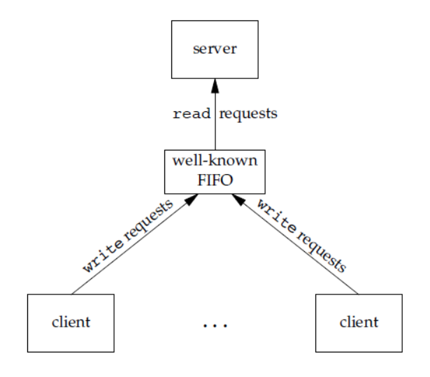

- [一、计算机操作系统概述](#一计算机操作系统概述)
  - [1.1 操作系统的特征](#11-操作系统的特征)
    - [1.1.1 并发](#111-并发)
    - [1.1.2 共享](#112-共享)
    - [1.1.3 虚拟](#113-虚拟)
    - [1.1.4 异步](#114-异步)
  - [1.2 操作系统分类与发展](#12-操作系统分类与发展)
    - [1.2.1 批处理阶段](#121-批处理阶段)
    - [1.2.2 多道批处理系统](#122-多道批处理系统)
    - [1.2.3 分时操作系统](#123-分时操作系统)
    - [1.2.4 实时操作系统](#124-实时操作系统)
    - [1.2.5 网络操作系统和分布式计算机系统](#125-网络操作系统和分布式计算机系统)
    - [1.2.6 个人计算机操作系统](#126-个人计算机操作系统)
  - [1.3 中断分类](#13-中断分类)
  - [1.4 大内核和微内核](#14-大内核和微内核)
- [二、进程管理](#二进程管理)
  - [2.1 进程与线程](#21-进程与线程)
    - [2.1.1 进程](#211-进程)
    - [守护进程](#守护进程)
    - [孤儿进程](#孤儿进程)
    - [僵尸进程](#僵尸进程)
    - [2.1.2 线程](#212-线程)
      - [线程同步](#线程同步)
    - [2.1.3 进程与线程的区别](#213-进程与线程的区别)
  - [2.2 进程状态的切换](#22-进程状态的切换)
  - [2.3 进程通信](#23-进程通信)
    - [2.3.1 管道（Pipe）](#231-管道pipe)
    - [2.3.2 消息队列（Message Queue）](#232-消息队列message-queue)
    - [2.3.3 信号量（Semaphore）](#233-信号量semaphore)
    - [2.3.4 共享内存（Shared Memory）](#234-共享内存shared-memory)
    - [2.3.5 信号（Signal）](#235-信号signal)
    - [2.3.6 套接字（Socket）](#236-套接字socket)
    - [2.3.7 命名信号量（Named Semaphore）](#237-命名信号量named-semaphore)
  - [2.4 进程调度](#24-进程调度)
    - [2.4.1 进程调度方式](#241-进程调度方式)
    - [2.4.2 进程调度算法](#242-进程调度算法)
  - [2.5 进程同步](#25-进程同步)
    - [2.5.1 临界区](#251-临界区)
    - [2.5.2 同步与互斥](#252-同步与互斥)
    - [2.5.3 实现临界区互斥的基本方法](#253-实现临界区互斥的基本方法)
    - [2.5.4 信号量](#254-信号量)
    - [2.5.5 管程](#255-管程)
    - [2.5.6 经典同步问题](#256-经典同步问题)
  - [2.6 死锁](#26-死锁)
- [二、内存管理](#二内存管理)
    - [内存映射的基本原理](#内存映射的基本原理)
    - [内存映射的类型](#内存映射的类型)
    - [内存映射的优点](#内存映射的优点)
    - [内存映射的应用场景](#内存映射的应用场景)
- [三、文件管理](#三文件管理)
- [四、IO 管理](#四io-管理)
- [补充](#补充)
- [mmap](#mmap)
    - [`mmap`的常见使用方式](#mmap的常见使用方式)
      - [1. 映射文件到内存](#1-映射文件到内存)
      - [2. 匿名映射（分配共享内存）](#2-匿名映射分配共享内存)

前言：针对校招八股文进行整理，也是方便自己记忆，重新梳理一遍。

# 一、计算机操作系统概述

## 1.1 操作系统的特征

### 1.1.1 并发

并发是指两个或多个事件在**同一时间间隔内发生**。而并行是两个或多个事件**同一时刻发生**。

操作系统的并发性是通过**分时**得以实现的。而**并行需要硬件支持**，是指系统能同时进行运算或操作的特性，在同一时刻能完成两种或两种以上的工作，如多流水线、多核处理器或分布式计算系统。

 操作系统引入进程和线程，使得程序能够并行运行。

### 1.1.2 共享

* 共享是指系统中的资源可供内存中的多个并发执行的进程同时使用。
* 有两种共享方式：互斥共享方式、同时共享方式。**互斥共享的资源称为临界资源或者独占资源，一段时间内只允许一个进程进行访问，如打印机、磁带机**，需要使用同步机制进行互斥访问。

### 1.1.3 虚拟


### 1.1.4 异步


## 1.2 操作系统分类与发展

### 1.2.1 批处理阶段

### 1.2.2 多道批处理系统

### 1.2.3 分时操作系统

### 1.2.4 实时操作系统

### 1.2.5 网络操作系统和分布式计算机系统

### 1.2.6 个人计算机操作系统


## 1.3 中断分类

**外中断**：由 CPU 执行指令以外的事件引起，如 I/O 完成中断，表示设备输入/输出处理已经完成，处理器能够发送下一个输入/输出请求。此外还有时钟中断、控制台中断等。

**异常**：由 CPU 执行指令的内部事件引起，如非法操作码、地址越界、算术溢出等。

**陷入**：在用户程序中使用系统调用。


## 1.4 大内核和微内核

大内核是指将操作系统的主要功能模块作为一个紧密结合的整体放到内核中。


# 二、进程管理

## 2.1 进程与线程

### 2.1.1 进程

进程是资源分配的基本单位。

进程控制块 (Process Control Block, PCB) 描述进程的基本信息和运行状态，所谓的创建进程和撤销进程，都是指对 PCB 的操作。

孤儿进程和僵尸进程的区别：孤儿进程是父进程已退出，而子进程未退出；僵尸进程是父进程未退出，而子进程已退出。

### 守护进程

守护进程：**指在后台运行的，没有控制终端与之相连的进程。它独立于控制终端，周期性地执行某种任务。**linux的大多数服务器就是用守护进程的方式实现的，如**web服务器进程http**等。
创建守护进程要点:
(1)**让程序在后台执行**。方法是调用fork()产生一个子进程，然后使父进程退出。
(2)**调用setsid ()创建一个新对话期**。控制终端、登录会话和进程组通常是从父进程继承下来的，守护进程要摆脱它们，不受它们的影响,方法是调用setsid ()使进程成为一个会话组长。setsid()调用成功后，进程成为新的会话组长和进程组长，并与原来的登录会话、进程组和控制终端脱离。
(3)**禁止进程重新打开控制终端**。经过以上步骤，进程已经成为一个无终端的会话组长，但是它可以重新申请打开一个终端。为了避免这种情况发生，可以通过使进程不再是会话组长来实现。再一次通过fork()创建新的子进程，使调用fork的进程退出。
(4)**关闭不再需要的文件描述符**。子进程从父进程继承打开的文件描述符。如不关闭，将会浪费系统资源，造成进程所在的文件系统无法卸下以及引起无法预料的错误。首先获得最高文件描述符值，然后用一个循环程序，关闭0到最高文件描述符值的所有文件描述符。
(5)将当前目录更改为根目录。
(6)子进程从父进程继承的文件创建屏蔽字可能会拒绝某些许可权。为防止这一点，使用unmask(0)将屏蔽字清零
(7)处理SIGCHLD信号。对于服务器进程，在请求到来时往往生成子进程处理请求。如果子进程等待父进程捕获状态，则子进程将成为僵厅进程(zombie)，从而占用系统资源。如果父进程等待子进程结束，将增加父进程的负担，影响服务器进程的并发性能。在Linux下可以简单地将SIGCHLD信号的操作设为SIG IGN。这样，子进程结束时不会产生僵尸进程。

### 孤儿进程

如果父进程先退出，子进程还没退出，那么子进程的父进程将变为init进程。(注:任何一个进程都必须有父进程)。

**一个父进程退出，而它的一个或多个子进程还在运行，那么那些子进程将成为孤儿进程。孤儿进程将被 `init` 进程(进程号为1)所收养，并由 `init` 进程对它们完成状态收集工作**。

### 僵尸进程

如果子进程先退出，父进程还没退出，那么子进程**必须等到父进程捕获到了子进程的退出状态才真正结束**，否则这个时候子进程就成为僵尸进程。

设置僵尸进程的目的是**维护子进程的信息，以便父进程在以后某个时候获取**。这些信息**至少包括进程ID，进程的终止状态，以及该进程使用的CPU时间，所以当终止子进程的父进程调用 `wait` 或`waitpid` 时就可以得到这些信息**。如果一个进程终止，而该进程有子进程处于僵尸状态，那么它的**所有僵尸子进程的父进程 ID 将被重置为 1(`init` 进程)**。**继承这些子进程的 `init`  进程将清理它们**(也就是说 **`init` 进程将 `wait` 它们，从而去除它们的僵尸状态**)。

### 2.1.2 线程

**线程是独立调度的基本单位**。

**一个进程中可以有多个线程，它们共享进程资源**。

QQ 和浏览器是两个进程，浏览器进程里面有很多线程，例如 **HTTP 请求线程、事件响应线程、渲染线程**等等，**线程的并发执行使得在浏览器中点击一个新链接从而发起 HTTP 请求时，浏览器还可以响应用户的其它事件**。

### 2.1.3 线程同步

> [C++ 多线程同步](https://blog.csdn.net/weixin_39926429/article/details/131122459)、[[线程同步机制：互斥量、信号量、读写锁、条件变量](https://www.cnblogs.com/youxin/p/3336775.html)](https://www.cnblogs.com/youxin/p/3336775.html)

线程同步机制是指在多线程环境下，确保多个线程对共享资源的访问不发生冲突，避免出现竞态条件（race condition），从而保证数据的一致性和正确性。不同的同步机制根据使用场景的不同提供不同的解决方案，常见的线程同步机制包括锁、条件变量、信号量、屏障等。

**互斥锁（Mutex）**

互斥锁是一种最基本的同步机制，**它可以保证同一时刻只有一个线程可以访问共享资源**。一个线程在访问共享资源之前获得互斥锁（`lock`），完成之后释放互斥锁（`unlock`）。如**果其他线程尝试获取同一把锁，它们会被阻塞直到锁被释放**。

**使用场景**：保护共享数据的访问，防止多个线程同时修改同一个数据。

**C++标准库中的实现**：

- `std::mutex`：普通互斥锁。
- `std::timed_mutex`：带超时功能的互斥锁。
- `std::recursive_mutex`：允许同一个线程多次加锁的互斥锁。

```cpp
#include <iostream>
#include <mutex>
#include <thread>

std::mutex mtx;

void print(int num) {
  mtx.lock();
  std::cout << "Thread " << num << " is printing." << std::endl;
  mtx.unlock();
}

int main() {
  std::thread t1(print, 1);  // 创建线程就立即开始执行
  std::thread t2(print, 2);  // 创建线程就立即开始执行

  t1.join();  // 阻塞主线程，等待该子线程执行完成
  t2.join();  // 阻塞主线程，等待该子线程执行完成
  return 0;
}
```


**读写锁（Shared Mutex / Reader-Writer Lock）**

读写锁允许多个线程同时读取共享资源，但在**写入时需要独占访问**。它区分了读锁（共享锁）和写锁（独占锁），允许并发读取，同时保证写操作的安全性。

读写锁可以由三种状态：**读模式下加锁状态**、**写模式下加锁状态**、**不加锁状态**。一次只有一个线程可以占有写模式的读写锁（**unique_lock**），但是**多个线程可以同时占有读模式的读写锁（shared_lock）**。

**使用场景**：读多写少的场景，允许多个线程并发读取，但**写操作必须互斥**。

**C++标准库中的实现**：

- `std::shared_mutex`：允许多个读者同时持有读锁，但写者只能独占锁。
- `std::shared_timed_mutex`：带超时功能的共享锁。

```cpp
#include <iostream>
#include <mutex>
#include <shared_mutex>
// #include <syncstream>
#include <thread>

class ThreadSafeCounter {
 public:
  ThreadSafeCounter() = default;

  // 多个线程/读者能同时读计数器的值。
  unsigned int get() const {
    // 读--共享
    std::shared_lock lock(mutex_);
    return value_;
  }

  // 只有一个线程/写者能增加/写计数器的值。
  void increment() {
    // 写--独占
    std::unique_lock lock(mutex_);
    ++value_;
  }

  // 只有一个线程/写者能重置/写计数器的值。
  void reset() {
    // 重置--独占
    std::unique_lock lock(mutex_);
    value_ = 0;
  }

 private:
  mutable std::shared_mutex mutex_;
  unsigned int value_{};
};

int main() {
  ThreadSafeCounter counter;

  // lambda 函数
  auto increment_and_print = [&counter]() {
    for (int i{}; i != 3; ++i) {
      counter.increment();  // 写线程
      // std::osyncstream确保了多个线程同时向同一个输出流（例如std::cout）写入时，数据不会交错，从而避免混乱输出
      std::cout << "id: " << std::this_thread::get_id()
                << " count: " << counter.get() << '\n';
    }
  };

  std::thread thread1(increment_and_print); // 创建并执行子线程1
  std::thread thread2(increment_and_print); // 创建并执行子线程2

  thread1.join();  
  thread2.join();  

  return 0;
}
```


**信号量（Semaphore）**

**信号量是一种同步机制，它可以控制多个线程对共享资源的访问**。信号量有一个**计数器**，当计数器为 0 时，线程会被阻塞，当计数器大于 0 时，线程可以访问共享资源并将计数器减 1。

信号量是一种计数器，用于控制多个线程对有限资源的访问。它可以用于实现限制资源的访问数量，例如限制最多只能有`N`个线程访问某个资源。

- **使用场景**：控制对某些资源（如数据库连接池、线程池）的并发访问数量。
- **C++中的实现**：C++20引入了`std::counting_semaphore`，也可以使用第三方库实现。

```cpp
#include <semaphore.h>

#include <iostream>
#include <thread>

sem_t sem;

void print(int num) {
  sem_wait(&sem);  // P 操作

  std::cout << "Thread " << num << " is printing." << std::endl;

  sem_post(&sem);  // V 操作
}

int main() {
  sem_init(&sem, 0, 1);  // 初始化信号量
  std::thread t1(print, 1);
  std::thread t2(print, 2);
  t1.join();
  t2.join();
  sem_destroy(&sem);  // 销毁信号量
  return 0;
}
```


**条件变量（Condition Variable）**

**条件变量和互斥锁一起使用时，允许线程以无竞争的方式等待特定的条件发生**。条件本身是由互斥量保护的，**线程在改变条件状态前必须首先锁住互斥量**，其他线程在获得互斥量之前不会察觉到这种改变，因此**锁住互斥量才能计算条件**。

**条件变量允许线程在某个条件满足时被唤醒，用于协调多个线程的执行顺序**。一个线程**等待条件成立，**其他线程在**条件成立后通知等待的线程继续执行**。

**使用场景**：需要等待某个条件才能继续执行的场景，例如生产者-消费者问题。

**C++标准库中的实现**：

- `std::condition_variable`：提供等待条件和通知机制。
- `std::condition_variable_any`：支持自定义锁类型的条件变量。

```cpp
#include <condition_variable>
#include <iostream>
#include <mutex>
#include <thread>

std::mutex mtx;
std::condition_variable cv;
bool ready = false;

void print(int num) {
  std::unique_lock<std::mutex> lock(mtx);
  // 调用 wait 之后，该线程被阻塞，互斥锁被释放，允许其他线程获得互斥锁，但是其他线程也会陷入等待
  while (!ready) {
    cv.wait(lock);
  }
  std::cout << "Thread " << num << " is printing." << std::endl;
}

int main() {
  std::thread t1(print, 1); // 创建线程并立即执行
  std::thread t2(print, 2); // 创建线程并立即执行
  std::this_thread::sleep_for(std::chrono::seconds(1));
  ready = true;
  cv.notify_all(); // 唤醒等待该条件变量的所有线程
  t1.join();
  t2.join(); 
  return 0;
}
```


**自旋锁（Spinlock）**

自旋锁是一种忙等待的锁实现，即**线程在获取锁时不会阻塞，而是不断地循环尝试获取锁，直到成功为止。由于没有线程上下文切换的开销，自旋锁适用于锁的持有时间非常短的场景**。

- **使用场景**：锁的持有时间非常短，且不希望线程进入休眠状态。
- **C++中的实现**：标准库没有直接提供自旋锁，可以自己实现或使用第三方库。


**屏障（Barrier）**

屏障是一种同步机制，它可以让**多个线程在某个点上等待**，直到所有线程都到达该点后才继续执行。屏障通常用于分阶段的任务，每个阶段都需要等待所有线程完成后才能进入下一阶段。

屏障是一种同步原语，允许一组线程在某个点集合，只有当所有线程都到达屏障时，所有线程才继续执行。这通常用于分阶段计算，确保在每个阶段开始前，所有线程的上一阶段都已经完成。

**使用场景**：需要多个线程在某个同步点集合，确保某个阶段完成后再继续的场景。

**C++标准库中的实现**：

- `std::barrier`：用于多个线程在某个同步点等待。

```cpp
#include <barrier>
#include <iostream>
#include <thread>

std::barrier bar(2);

void print(int num) {
  std::cout << "Thread " << num << " is waiting." << std::endl;
  // 让多个线程在这个点上等待，直到所有的线程都到达这个点后才继续执行
  bar.wait(); 
  std::cout << "Thread " << num << " is printing." << std::endl;
}

int main() {
  std::thread t1(print, 1);
  std::thread t2(print, 2);
  t1.join();
  t2.join();
  return 0;
}
```


### 2.1.4 进程与线程的区别

Ⅰ 拥有资源

进程是资源分配的基本单位，但是线程不拥有资源，线程可以访问隶属进程的资源。

Ⅱ 调度

线程是独立调度的基本单位，在同一进程中，线程的切换不会引起进程切换，从一个进程中的线程切换到另一个进程中的线程时，会引起进程切换。

Ⅲ 系统开销

由于创建或撤销进程时，系统都要为之分配或回收资源，如内存空间、I/O 设备等，所付出的开销远大于创建或撤销线程时的开销。类似地，在进行进程切换时，涉及当前执行进程 CPU 环境的保存及新调度进程 CPU 环境的设置，而线程切换时只需保存和设置少量寄存器内容，开销很小。

Ⅳ 通信方面

线程间可以通过直接读写同一进程中的数据进行通信，但是进程通信需要借助 IPC。

**定义：**

   - **进程**：是操作系统中资源分配的基本单位，一个进程通常包含代码、数据、文件、内存等资源。每个进程都是独立的运行实体，操作系统为其分配独立的地址空间。
   - **线程**：是进程中的一个执行流，是操作系统调度的基本单位。一个进程可以包含多个线程，它们共享该进程的资源，如内存、文件句柄等。

**内存空间**：

   - **进程**：每个进程有自己独立的地址空间，进程之间的内存空间互不干扰。进程间通信（IPC）需要通过特定的机制（如管道、信号、消息队列等）。
   - **线程**：同一个进程中的所有线程共享进程的地址空间和资源。这使得线程间通信更高效，但也增加了数据共享带来的同步问题。

**创建开销**：

   - **进程**：创建进程的开销较大，需要分配独立的地址空间和系统资源，切换进程时也需要保存和恢复整个进程的上下文（包括地址空间等）。
   - **线程**：线程是轻量级的，创建和销毁的开销较小，因为线程共享进程的资源，切换线程时只需保存和恢复线程的上下文。

**执行方式**：

   - **进程**：进程是独立的执行实体，可以独立运行，不共享内存，除非通过IPC。
   - **线程**：线程依赖进程运行，多个线程可以并发执行并共享相同的内存和资源。

**资源共享**：

   - **进程**：进程之间不共享内存等资源，通信和协作较为复杂。
   - **线程**：同一进程内的线程共享进程的资源，因此可以直接访问相同的变量和内存，线程间通信更简单。

**并发性**：

   - **进程**：不同进程可以并行执行，但由于其独立性，进程间协作较为复杂。
   - **线程**：线程可以在同一进程中并行运行，资源共享方便，适用于需要高效并发执行的场景。

**崩溃影响**：

   - **进程**：如果一个进程崩溃，通常不会影响其他进程。
   - **线程**：如果一个线程崩溃，可能会导致整个进程崩溃，因为线程共享同一内存空间。

**调度**：

   - **进程**：由操作系统调度，每个进程有独立的优先级和调度策略。
   - **线程**：线程调度一般由操作系统内核完成，多个线程可以同时在多个处理器上运行。

**适用场景：**

   - **进程**适用于独立性强、资源分配明确的任务，如操作系统中不同应用的执行。
   - **线程**适用于高效并发执行、资源共享的场景，如多线程计算、服务器处理多个请求等。

总结来说，进程是独立的资源管理单位，而线程是进程内部的执行单元。线程的创建和切换更高效，但因为共享资源，会面临同步问题。

## 2.2 进程状态的切换


运行态：

就绪态：

阻塞态：

创建态：

结束态：


## 2.3 进程通信

进程同步与进程通信很容易混淆，它们的区别在于：

- **进程同步：控制多个进程按一定顺序执行**；
- **进程通信：进程间传输信息**；

**进程通信是一种手段，而进程同步是一种目的**。也可以说，为了能够达到进程同步的目的，需要让进程进行通信，传输一些进程同步所需要的信息。

进程间通信（Inter-Process Communication, IPC）是指在不同进程之间交换数据的机制。由于每个进程都有独立的地址空间，进程之间不能直接共享数据，因此需要通过特定的方式进行通信。

### 2.3.1 管道（Pipe）

管道是最基本的IPC机制之一，用于在具有父子关系的进程之间传递数据。管道本质上是一个先入先出的字节流，分为**匿名管道**和**命名管道**（FIFO）。

**匿名管道（内存文件）是通过调用 pipe 函数创建的，fd[0] 用于读，fd[1] 用于写。**

```cpp
#include <unistd.h>
int pipe(int fd[2]);
```

**它具有以下限制：**

- **只支持半双工通信（单向交替传输）**。
- **只能在父子进程或者兄弟进程中使用**。


**命名管道 FIFO（借助文件系统）：可以在无亲缘关系的进程之间通信，数据可以双向传递。**

```cpp
#include <sys/stat.h>
int mkfifo(const char *path, mode_t mode);
int mkfifoat(int fd, const char *path, mode_t mode);
```

**FIFO 常用于客户-服务器应用程序中**，FIFO 用作汇聚点，**在客户进程和服务器进程之间传递数据**。



### 2.3.2 消息队列（Message Queue）

**概述**：<font color=alice>消息队列是一种消息传递机制，允许一个或多个进程**向消息队列中发送消息**，也允许一个或多个进程**从队列中读取消息**。</font>消息队列**以消息为单位**进行通信，进程可以通过**队列名来识别和访问消息队列**。

**特点**：

- 可以用于无亲缘关系进程之间的通信。
- 支持消息的优先级，可以实现异步通信。
- 消息以固定格式存储，支持消息的有序读取和处理。

****

**相比于 FIFO，消息队列具有以下优点：**

- **消息队列可以独立于读写进程存在**，从而避免了 **FIFO 中同步管道的打开和关闭时可能产生的困难**；
- **避免了 FIFO 的同步阻塞问题**，不需要进程自己提供同步方法；
- **读进程可以根据消息类型有选择地接收消息**，而不像 FIFO 那样只能默认地接收。

**使用场景**：适用于多进程的消息传递和任务调度。

### 2.3.3 信号量（Semaphore）

**信号量是一种用于控制访问共享资源的计数器**。它**可以用于进程同步**，也**可以作为进程间通信的一种手段**。<font color=alice>通过操作信号量，可以**控制多个进程对共享资源的访问顺序**，避免竞争条件。</font>

**特点**：

- 常用于**同步多个进程对共享资源的访问**。
- 可以**实现互斥锁（mutex）等同步机制**。

**使用场景**：用于进程同步和控制共享资源的并发访问。

### 2.3.4 共享内存（Shared Memory）

**共享内存是一种高效的进程间通信机制，它允许多个进程共享一块物理内存**。<font color=alice>通过映射相同的内存段，不同的进程可以直接读写该内存区域，进程间的通信不需要通过内核，因此速度非常快。</font>

**特点**：

- 通信效率高，因为**不需要通过内核进行数据传输**。
- 需要**通过同步机制（如信号量）来避免数据竞争**。
- **不同进程可以直接访问相同的内存地址，但需要协调访问**。

**使用场景**：<font color>适用于需要频繁、大量数据交互的场景。</font>

### 2.3.5 信号（Signal）

**信号是一种异步通信机制，用于向进程发送通知或事件**。信号的主要用途是**通知进程发生了某些事件（如中断 `Ctrl + C`、定时器到期等），进程可以捕捉这些信号并执行特定的处理函数**。

**特点**：

- 异步通信，**信号可以在任意时间发送**。
- 信号的处理需要**进程【注册】信号处理函数**。
- **信号只传递简单的标志信息，不适合传递复杂数据**。

**使用场景**：适用于异常处理、进程控制和事件通知。

### 2.3.6 套接字（Socket）

**套接字最初是为网络通信设计的，但也可以用于同一台机器上不同进程之间的通信**。使用套接字，进程可以通过**标准的网络通信协议（如TCP/IP或UDP）来进行数据交换**。

**特点**：

- 支持**本地和远程进程的通信**。
- 使用**标准网络协议，灵活性高**。
- 可以**用于不同操作系统的进程通信**。

**使用场景**：适用于**分布式系统、网络应用程序中的进程通信**。

### 2.3.7 命名信号量（Named Semaphore）

与普通信号量类似，**命名信号量允许多个无关进程通过特定的信号量名字来同步操**作。不同的进程可以通过**同一个信号量名**来协调资源的使用。

**特点**：

- 无须进程间有亲缘关系。
- 可以在不同进程间提供同步和互斥机制。

**使用场景**：多进程对共享资源进行同步访问时使用。


## 2.4 进程调度

### 2.4.1 进程调度方式

非剥夺式调度

剥夺式调度

### 2.4.2 进程调度算法

先来先服务算法

短作业优先算法

优先级调度算法

高响应比优先调度算法

时间片轮转调度算法

多级反馈队列调度算法


## 2.5 进程同步

### 2.5.1 临界区

### 2.5.2 同步与互斥

同步

互斥

### 2.5.3 实现临界区互斥的基本方法

### 2.5.4 信号量

### 2.5.5 管程

### 2.5.6 经典同步问题

生产者-消费者问题

读者-写者问题

哲学家进餐问题

吸烟者问题


## 2.6 死锁

**死锁：各进程相互等待对方手里的资源，导致各进程被阻塞，无法向前推进的现象**。

**饥饿：由于长期得不到想要的资源，某进程无法向前推动的现象。**

系统死锁的可能原因主要是**时间上的和空间上的**：

* 时间上：由于**进程运行中推进顺序不当**，即**调度时机不合适**，不该切换时切换，可能会导致死锁。**信号量使用不当，也可能造成死锁**。
* 空间上：对独占资源分配不当，互斥资源部分分配又不可剥夺，极易造成死锁。

产生死锁必须同时满足四个互斥条件，只要其中一个条件不成立，死锁就不会发生。

* 互斥条件：任何时刻，只能由一个进行使用资源。如打印机，每次只能由一个进程所占有并使用。
* 不可剥夺条件：资源不能被其他进程抢占，只有由该进程完成任务后自动释放资源。
* 请求并保持条件：任一个进程至少占有了一个资源，同时又等待更多资源，而这些资源又被其他进程所占有。
* 循环等待条件：至少有两个进程构成死锁。也就是有循环等待条件可知，若存在死锁，必然至少存在两个进程。

死锁的处理策略：

* 死锁预防：事先预防策略，确保系统不会进入死锁状态。也就是**破坏四个必要条件中的一个或几个**即可。
* 避免死锁：使用银行家算法来防止系统进入不安全状态，从而避免死锁。
* 死锁的检测与解除：使用资源分配图来检测死锁。使用**资源剥夺法（旋转一个牺牲品，然后抢占它的资源）、撤销进程法（终止所有死锁进程或一次只终止一个进程直到取消死锁循环为止）、进程回退法（回滚到足够打破死锁的状态）**来解除死锁。


# 二、内存管理

内存映射（Memory Mapping）是一种将文件或设备映射到进程的地址空间的技术，允许进程通过直接访问内存来读写文件或设备，而不需要使用传统的文件I/O操作（如`read`、`write`）。这种方式可以提高文件的访问效率，特别是当需要频繁访问和修改文件时。

### 内存映射的基本原理

内存映射的核心思想是将文件或设备的内容直接映射到虚拟内存地址空间中，这样进程可以像访问内存一样访问文件的内容。操作系统负责将映射的虚拟地址与文件的物理存储地址对应起来，并在访问时自动处理页面换入换出等细节。

- **虚拟地址空间**：进程操作文件时，文件的内容会被映射到进程的虚拟地址空间，进程可以通过这些虚拟地址来读取或修改文件内容。
- **页面换入换出**：当进程访问映射的内存区域时，如果该区域还未加载到物理内存，操作系统会将文件的相应部分加载到内存中，必要时还会将修改后的数据写回文件。
- **共享内存**：多个进程可以映射同一个文件的内存区域，从而通过共享内存进行进程间通信。

### 内存映射的类型

内存映射通常分为以下两种类型：

1. **文件映射（File Mapping）**

   - **定义**：将磁盘上的文件映射到进程的地址空间，进程可以通过内存地址直接访问文件内容。
   - **应用场景**：适用于需要频繁访问或修改文件的大规模数据处理场景，如数据库、日志分析等。由于减少了系统调用，文件映射比传统的文件I/O操作更高效。

   **示例**：

   ```c
   int fd = open("example.txt", O_RDWR);
   char* mapped = mmap(NULL, length, PROT_READ | PROT_WRITE, MAP_SHARED, fd, 0);
   // 使用映射后的内存区域
   strcpy(mapped, "Hello, Memory Mapped File!");
   munmap(mapped, length);
   close(fd);
   ```

2. **匿名映射（Anonymous Mapping）**

   - **定义**：匿名映射是指不与文件关联的内存映射，通常用于进程间通信（共享内存）或为进程分配大块内存。
   - **应用场景**：用于在多个进程间共享一块内存区域，可以通过该区域进行数据的读写和同步操作。

   **示例**：

   ```c
   char* shared_mem = mmap(NULL, length, PROT_READ | PROT_WRITE, MAP_ANONYMOUS | MAP_SHARED, -1, 0);
   ```

### 内存映射的优点

1. **高效性**：内存映射避免了频繁的系统调用，尤其是对于大文件，操作系统通过分页机制来管理文件的加载和写回，减少了磁盘I/O的开销。
2. **数据共享**：多个进程可以映射同一个文件，进而通过共享内存实现数据共享和进程间通信。
3. **按需加载**：内存映射文件时，操作系统只在访问时才将文件的部分加载到内存中，这种按需加载减少了内存占用。
4. **方便的文件读写操作**：进程可以像操作内存一样操作文件内容，简化了代码逻辑，无需使用繁琐的文件I/O函数。

### 内存映射的应用场景

1. **进程间通信**：多个进程通过映射相同的内存区域，可以实现数据的快速共享和通信，而不需要通过消息队列或管道等传统IPC方式。
2. **文件操作**：对于需要频繁访问或修改的大文件，内存映射提供了一种高效的访问方式，特别适用于数据库、日志处理等场景。
3. **高效数据处理**：在处理大数据文件时，使用内存映射可以减少I/O开销，提高程序的整体性能。


# 三、文件管理


# 四、IO 管理


# 补充

# mmap

**mmap 函数用于申请一段内存空间，可以将这段内存空间作为进程间通信的共享内存，可以将文件直接映射到其中**。

### `mmap`的常见使用方式

#### 1. 映射文件到内存

进程可以将文件的某个部分映射到内存，以便更高效地进行文件操作。

```cpp
#include <fcntl.h>
#include <sys/mman.h>
#include <unistd.h>
#include <stdio.h>

int main() {
    int fd = open("example.txt", O_RDWR);  // 打开文件
    if (fd == -1) {
        perror("open");
        return 1;
    }

    size_t length = 4096;  // 映射文件的大小
    char* mapped = mmap(NULL, length, PROT_READ | PROT_WRITE, MAP_SHARED, fd, 0);
    if (mapped == MAP_FAILED) {
        perror("mmap");
        close(fd);
        return 1;
    }

    // 修改映射的内存，相当于修改文件内容
    mapped[0] = 'H';

    // 取消映射
    munmap(mapped, length);
    close(fd);

    return 0;
}
```

#### 2. 匿名映射（分配共享内存）

使用`MAP_ANONYMOUS`标志，可以不与文件关联，分配一块共享内存区域，用于进程间通信或作为大块内存的分配方式。

```cpp
#include <sys/mman.h>
#include <stdio.h>

int main() {
    size_t length = 4096;
    char* shared_mem = mmap(NULL, length, PROT_READ | PROT_WRITE, MAP_ANONYMOUS | MAP_SHARED, -1, 0);
    if (shared_mem == MAP_FAILED) {
        perror("mmap");
        return 1;
    }

    // 使用共享内存
    shared_mem[0] = 'X';
    printf("Shared memory content: %c\n", shared_mem[0]);

    // 取消映射
    munmap(shared_mem, length);

    return 0;
}
```

