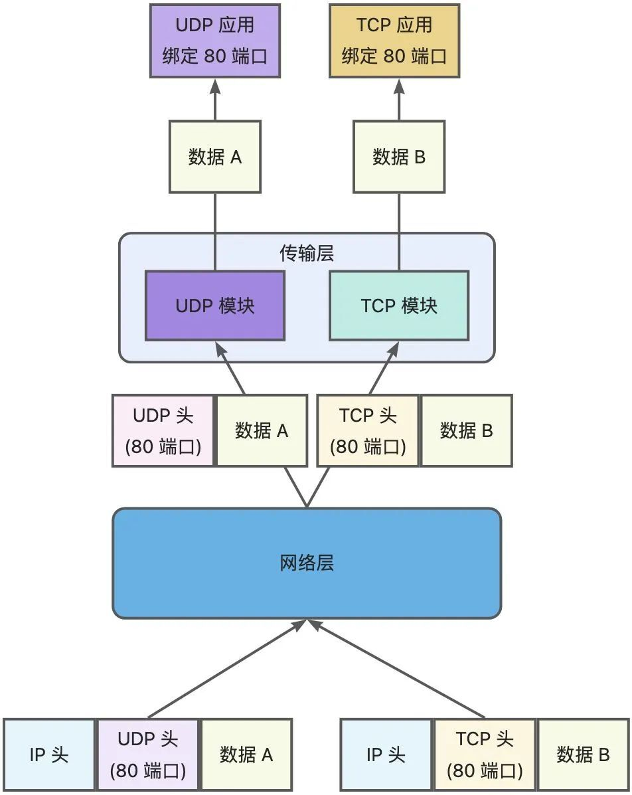
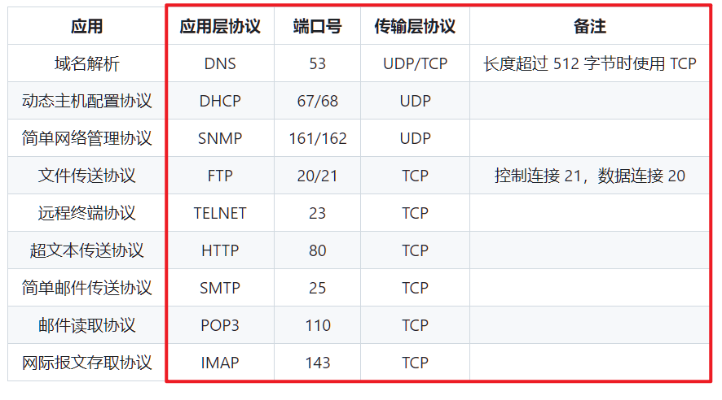

- [一、计算机网络的体系结构](#一计算机网络的体系结构)
  - [1.1 计算机网络的组成](#11-计算机网络的组成)
  - [1.2 主机间的通信方式](#12-主机间的通信方式)
- [二、物理层](#二物理层)
- [三、数据链路层](#三数据链路层)
  - [自动重传请求（Auto Repeat reQuest，ARQ）](#自动重传请求auto-repeat-requestarq)
- [四、网络层](#四网络层)
  - [4.1 ARP 地址解析协议](#41-arp-地址解析协议)
  - [4.2 ICMP网际控制报文协议](#42-icmp网际控制报文协议)
  - [4.3 VPN 虚拟专用网](#43-vpn-虚拟专用网)
  - [4.4 NAT 网络地址转换](#44-nat-网络地址转换)
  - [4.5 路由器](#45-路由器)
  - [4.6 路由选择协议](#46-路由选择协议)
    - [4.6.1 内部网关协议 RIP](#461-内部网关协议-rip)
    - [4.6.2 内部网关协议 OSPF](#462-内部网关协议-ospf)
    - [4.6.3 外部网关协议 BGP](#463-外部网关协议-bgp)
- [五、传输层](#五传输层)
  - [5.1 UDP](#51-udp)
  - [5.2 TCP](#52-tcp)
    - [5.2.1 TCP 的三次握手](#521-tcp-的三次握手)
      - [第一次握手丢失了，怎么办？](#第一次握手丢失了怎么办)
      - [第二次握手丢失了，怎么办？](#第二次握手丢失了怎么办)
      - [第三次握手丢失了，怎么办呢？](#第三次握手丢失了怎么办呢)
      - [什么是 SYN 攻击？如何避免 SYN 攻击？](#什么是-syn-攻击如何避免-syn-攻击)
      - [TCP 黏包问题](#tcp-黏包问题)
    - [5.2.2 TCP 的四次挥手](#522-tcp-的四次挥手)
      - [为什么挥手需要四次呢？](#为什么挥手需要四次呢)
      - [为什么 TIME\_WAIT 等待的时间是 2MSL？](#为什么-time_wait-等待的时间是-2msl)
      - [为什么需要 TIME\_WAIT 状态？](#为什么需要-time_wait-状态)
      - [TIME\_WAIT 过多由什么危害？](#time_wait-过多由什么危害)
      - [如何优化 TIME\_WAIT？](#如何优化-time_wait)
    - [5.2.3 TCP 可靠传输](#523-tcp-可靠传输)
    - [5.2.4 TCP 流量控制](#524-tcp-流量控制)
    - [5.2.5 TCP 拥塞控制](#525-tcp-拥塞控制)
  - [5.3 socket 编程](#53-socket-编程)
  - [5.4 面试题](#54-面试题)
- [六、应用层](#六应用层)
  - [6.1 域名系统 DNS](#61-域名系统-dns)
  - [6.2 文件传送协议 FTP](#62-文件传送协议-ftp)
  - [6.3 动态主机配置协议 DHCP](#63-动态主机配置协议-dhcp)
  - [6.5 远程登陆协议 TELNET](#65-远程登陆协议-telnet)
  - [6.6 电子邮件协议](#66-电子邮件协议)
  - [6.7 常用端口](#67-常用端口)
  - [6.8 超文本传输协议 HTTP](#68-超文本传输协议-http)
    - [6.8.1 请求和响应报文](#681-请求和响应报文)
    - [6.8.2 HTTP 方法](#682-http-方法)
    - [6.8.3 HTTP 状态码](#683-http-状态码)
    - [6.8.4 HTTPS](#684-https)
      - [加密](#加密)
      - [认证](#认证)
      - [HTTPS 的缺点](#https-的缺点)
    - [6.8.5 HTTP/2.0](#685-http20)
    - [6.8.6 解析一个 URL 的全过程](#686-解析一个-url-的全过程)
- [补充：常用 IP 地址](#补充常用-ip-地址)
  - [1.1 localhost](#11-localhost)
  - [1.2 127.0.0.1](#12-127001)
  - [1.3 本机IP](#13-本机ip)
  - [1.4 0.0.0.0](#14-0000)

# 一、计算机网络的体系结构

> [计算机网络 - 概述](https://github.com/CyC2018/CS-Notes/blob/master/notes/%E8%AE%A1%E7%AE%97%E6%9C%BA%E7%BD%91%E7%BB%9C%20-%20%E6%A6%82%E8%BF%B0.md)

## 1.1 计算机网络的组成

* 1）**从组成部分上分为：硬件、软件、协议**。硬件是指主机、通信链路、交换设备和通信处理机组曾。软件包括各种实现资源共享的软件以及各种软件工具（如网络操作系统、邮件收发程序、FTP程序、聊天软件）。

* 2）从工作方式上分为：边缘部分和核心部分。

* 3）从功能组成上分为：通信子网和资源子网。

## 1.2 主机间的通信方式

* 客户-服务器（C/S）：客户是服务的请求方，服务器是服务的提供方。


* 对等（P2P）：不区分客户和服务器。


暂停，感觉面试不会问~

# 二、物理层

通信方式：

* 单工通信：单向传输，仅需要一条通道。
* 半双工通信：通信双方都可以发送或接收消息，但是任何一方都不能同时发送和接收消息，此时需要两条通道。
* 全双工通信：通信双方可以同时发送和接收信息，需要两条通道。


# 三、数据链路层

## 自动重传请求（Auto Repeat reQuest，ARQ）

SW 停止等待协议、GBN 回退 N 帧协议111、SR 选择重传协议这三种协议**（实现可靠传输实现机制的基本原理）并不限于数据链路层，可以应用到计算机网络体系结构中的各层协议中**。

**停止等待协议：**

* 发送窗口和接收窗口均为 1 的滑动窗口协议。

* 每次只允许发送一帧，然后就等到接收方发送确认信息的过程中，因此传输效率很低。

**后退 N 帧协议：**

* 发送窗口大于 1，接收窗口为 1 的滑动窗口协议。
* GBN 协议是指发送方发送完一组数据帧后，再停止发送，等待确认。采用的是累计确认的方式，确认号是希望接收到的下一组序号。

**SR 选择重传协议：**

* 发送窗口和接收窗口都大于 1 的滑动窗口协议。
* SR 协议用来处理不按顺序到达的分组，也就是不正确的帧进行重传，正确的帧来者不拒，全部存放在缓冲区中。

SR 协议与 GBN 协议的区别是：<font color=alice>SR 协议为每一个等待确认的分组使用一个计时器，当计时器进行超时后，只有对应的分组被重传。</font><font color=blue>相反，GBN 协议将所有来确认的分组看作一个整体，使用唯一的计时器，当超时之后就会重传所有未确认的分组。</font>


# 四、网络层

## 4.1 ARP 地址解析协议

完成 IP 地址到 MAC 地址的映射。

## 4.2 ICMP网际控制报文协议

ICMP 是为了更有效地转发 IP 数据报和提高交付成功的机会。它封装在 IP 数据报中，但是不属于高层协议。


ICMP 报文分为差错报告报文和询问报文。


Ping 是 ICMP 的一个重要应用，主要用来测试两台主机之间的连通性。

Ping 的原理是通过向目的主机发送 ICMP Echo 请求报文，目的主机收到之后会发送 Echo 回答报文。Ping 会根据时间和成功响应的次数估算出数据包往返时间以及丢包率。


## 4.3 VPN 虚拟专用网

由于 IP 地址的紧缺，**一个机构能申请到的 IP 地址数往往远小于本机构所拥有的主机数**。并且一个机构并不需要把所有的主机接入到外部的互联网中，机构内的计算机可以使用仅在本机构有效的 IP 地址（专用地址）。

**私有 IP 地址如下：**

- 10.0.0.0 ~ 10.255.255.255
- 172.16.0.0 ~ 172.31.255.255
- 192.168.0.0 ~ 192.168.255.255

**VPN 使用公用的互联网作为本机构各专用网之间的通信载体**。专用指机构内的主机只与本机构内的其它主机通信；虚拟指好像是，而实际上并不是，它有经过公用的互联网。


## 4.4 NAT 网络地址转换

网络地址转换 NAT 将**专有的网络地址转换为共用的地址**，从而对外隐藏内部管理的 IP 地址。

NAT 转换表中存放着 `{本地 IP 地址：端口}` 到 `{全球 IP 地址：端口}` 的映射关系。通过 `{ip 地址：端口}` 这样的映射方式，可以当多个私有 IP 地址映射到同一个全球 IP 地址。


## 4.5 路由器

路由器从功能上可以划分为：路由选择和分组转发。

分组转发结构由三个部分组成：交换结构、一组输入端口和一组输出端口。


**路由器分组转发流程：**

- 从数据报的首部提取目的主机的 IP 地址 D，得到目的网络地址 N。
- 若 N 就是与此路由器直接相连的某个网络地址，则进行直接交付；
- 若路由表中有目的地址为 D 的特定主机路由，则把数据报传送给表中所指明的下一跳路由器；
- 若路由表中有到达网络 N 的路由，则把数据报传送给路由表中所指明的下一跳路由器；
- 若路由表中有一个默认路由，则把数据报传送给路由表中所指明的默认路由器；
- 报告转发分组出错。


## 4.6 路由选择协议

路由选择协议都是自适应的，能随着网络通信量和拓扑结构的变化而自适应地进行调整。

互联网可以划分为许多较小的自治系统 AS，一个 AS 可以使用一种和别的 AS 不同的路由选择协议。

可以把路由选择协议划分为两大类：

- 自治系统内部的路由选择：RIP 和 OSPF
- 自治系统间的路由选择：BGP

### 4.6.1 内部网关协议 RIP

**RIP 是一种基于距离向量的路由选择协议。距离是指跳数，直接相连的路由器跳数为 1。跳数最多为 15，超过 15 表示不可达。**

**RIP 按固定的时间间隔仅和相邻路由器交换自己的路由表（并且按照固定的时间间隔进行交换路由信息，如每隔 30s）**，经过若干次交换之后，所有路由器最终会知道到达本自治系统中任何一个网络的最短距离和下一跳路由器地址。

距离向量算法：

- 对地址为 X 的相邻路由器发来的 RIP 报文，先修改报文中的所有项目，把下一跳字段中的地址改为 X，并把所有的距离字段加 1；
- 对修改后的 RIP 报文中的每一个项目，进行以下步骤：
- 若原来的路由表中没有目的网络 N，则把该项目添加到路由表中；
- 否则：若下一跳路由器地址是 X，则把收到的项目替换原来路由表中的项目；否则：若收到的项目中的距离 d 小于路由表中的距离，则进行更新（例如原始路由表项为 Net2, 5, P，新表项为 Net2, 4, X，则更新）；否则什么也不做。
- 若 3 分钟还没有收到相邻路由器的更新路由表，则把该相邻路由器标为不可达，即把距离置为 16。

RIP 协议实现简单，开销小。但是 RIP 能使用的最大距离为 15，限制了网络的规模。并且当网络出现故障时，要经过比较长的时间才能将此消息传送到所有路由器。

**RIP 属于应用层协议，在传输层使用 UDP 传输数据。**

### 4.6.2 内部网关协议 OSPF

开放最短路径优先 OSPF，是为了克服 RIP 的缺点而开发出来的。

开放表示 OSPF 不受某一家厂商控制，而是公开发表的；最短路径优先表示使用了 Dijkstra 提出的最短路径算法 SPF。

OSPF 具有以下特点：

- **向本自治系统中的所有路由器发送信息，这种方法是洪泛法**。
- 发送的信息就是与相邻路由器的链路状态，链路状态包括与哪些路由器相连以及链路的度量，度量用费用、距离、时延、带宽等来表示。
- 只有当链路状态发生变化时，路由器才会发送信息。

所有路由器都具有全网的拓扑结构图，并且是一致的。相比于 RIP，OSPF 的更新过程收敛的很快。

**OSPF 是网络层协议，它不使用 UDP 或 TCP，而是直接使用 IP 协议（其 IP 数据报首部的协议字段为 89）。**

OSPF 是分布式网络层协议，基于链路状态的，使用 `dijkstra` 算法**计算从自己到各目的网络的最优路径**，以此构造自己的路由表。**虽然 `dijkstra` 算法能计算出完整的最优路径，但是路由表不会存储完整路径，而是只存储下一跳路由器的 IP 地址**（只有到了下一跳路由器，才知道再下一跳应当怎么走）。

### 4.6.3 外部网关协议 BGP

BGP（Border Gateway Protocol，边界网关协议），**是应用层协议，基于 TCP。由于网络环境复杂，需保证可靠的传输，所以选择 TCP。**

AS 之间的路由选择很困难，主要是由于：

- 互联网规模很大；
- 各个 AS 内部使用不同的路由选择协议，无法准确定义路径的度量；
- AS 之间的路由选择必须考虑有关的策略，比如有些 AS 不愿意让其它 AS 经过。

BGP 只能寻找一条比较好的路由，而不是最佳路由。

每个 AS 都必须配置 BGP 发言人，通过在两个相邻 BGP 发言人之间建立 TCP 连接来交换路由信息。

# 五、传输层

传输层位于网络层之上，为运行在不同主机上的进程提供逻辑通信，而 IP 层提供主机之间的逻辑通信。

端口是传输层服务访问点，**使用端口号来标识主机中的应用进程**，而 IP 地址和 MAC 地址用来标识主机的。

**Socket 套接字 = [IP 地址 + 端口号]**，用来**唯一标识网络中的一台主机和其上的一个应用进程**。

这里注意一下：

* **IP 分组的首部校验和仅仅校验首部是否出错，而 TCP、UDP 的校验和是对整个报文段进行校验的**。

## 5.1 UDP

用户数据报协议 UDP（User Datagram Protocol）是无连接的，尽最大可能交付，没有拥塞控制，面向报文（对于应用程序传下来的报文不合并也不拆分，只是添加 UDP 首部），支持一对一、一对多、多对一和多对多的交互通信。


* UDP 无须建立连接。【UDP 对应用进程交下来的报文既不合并也不拆分，直接打包发送。】【**适用于 IP 电话、视频会议等实时应用。**】
* 无连接状态。【UDP 不需要使用主机维护复杂的连接状态表】
* UDP 分组首部开销小。
* **UDP 仅在 IP 的基础上增加了端口的功能（复用、分用）和校验和功能（差错检查）**。
* 不提供可靠传输。【不提供ARQ确认、重传序号，因此是不可靠的。】【不使用流量控制和拥塞控制。】**UDP 仅有差错检测功能，不使用流量控制和拥塞控制，但是 UDP 的差错检查只检查数据在传输过程中是否发生错误，出错就直接丢弃，并没有重传机制，因此是不可靠传输（可靠性是由 ARQ 保证序号重传确认机制的）。**


## 5.2 TCP

传输控制协议 TCP（Transmission Control Protocol）是面向连接的，提供可靠交付，有流量控制，拥塞控制，提供全双工通信，面向字节流（把应用层传下来的报文看成字节流，把字节流组织成大小不等的数据块），每一条 TCP 连接只能是点对点的（一对一）。

* T**CP 是面向连接的协议，提供面向连接的服务**。
* 其传送的传输协议数据单元是 **TCP 报文**。
* 支持**点对点单播**，不支持多播、广播。
* **提供可靠服务**。
* 复杂，用于大多数应用，如：**万维网、电子邮件、文件传输**。


### 5.2.1 TCP 的三次握手

**第三次握手是可以携带数据的，前两次握手是不可以携带数据的**。一旦完成三次握手，双方都处于ESTABLISHED 状态，此时连接就已建立完成，客户端和服务端就可以相互发送数据了。

TCP 的连接状态查看，在 Linux 可以通过 `netstat -napt` 命令查看。


假设 A 为客户端，B 为服务器端。

- 首先 B 处于 LISTEN（监听）状态，等待客户的连接请求。
- A 向 B 发送连接请求报文，SYN=1，ACK=0，选择一个初始的序号 x。
- B 收到连接请求报文，如果同意建立连接，则向 A 发送连接确认报文，SYN=1，ACK=1，确认号为 x+1，同时也选择一个初始的序号 y。
- A 收到 B 的连接确认报文后，还要向 B 发出确认，确认号为 y+1，序号为 x+1。
- B 收到 A 的确认后，连接建立。

三次握手的原因：

* **三次握手才可以阻止重复历史连接的初始化（主要原因）**。
* 三次握手才可以同步双方的初始序列号。
* 三次握手才可以避免资源浪费。

简单来说，三次握手的首要原因是**为了防止旧的重复连接初始化造成混乱**。

我们考虑一个场景，客户端先发送了 SYN( seq =90 )报文，然后客户端宕机了，而且这个 SYN 报文还被网络阻塞了，服务端并没有收到，接着客户端重启后，又重新向服务端建立连接，发送了SYN( seq =100 )报文(**注意：不是重传SYN，重传的SYN的序列号是一样的)**。


RST：**`Reset the connection`，即连接重置**，用于**复位因某种原因引起出现的错误连接**，也用来拒绝非法数据和请求。如果接收到RST位时候，通常发生了某些错误。

因此，**要解决这种现象，最好就是在服务端发送数据前，也就是建立连接之前，要阻止掉历史连接，这样就不会造成资源浪费，而要实现这个功能，就需要三次握手**。
所以，**TCP 使用三次握手建立连接的最主要原因是防止「历史连接」初始化了连接**。

#### 第一次握手丢失了，怎么办？

当客户端想和服务端建立 TCP 连接的时候，首先第一个发的就是 `SYN` 报文，然后进入到 `SYN_SENT` 状态。

在这之后，如果客户端迟迟收不到服务端的 `SYN-ACK` 报文(第二次握手)，**就会触发「超时重传」机制，重传 SYN 报文，而且重传的 SYN 报文的序列号都是一样的。**

#### 第二次握手丢失了，怎么办？

当服务端收到客户端的第一次握手后，就会回 `SYN-ACK` 报文给客户端，这个就是第二次握手，此时服务端会进入 `SYN_RCVD` 状态。

第二次握手的 `SYN-ACK` 报文其实有两个目的：

* **第二次握手里的 ACK，是对第一次握手的确认报文**；
* **第二次握手里的 SYN，是服务端发起建立 TCP 连接的报文**；

所以，如果第二次握手丢了，就会发生比较有意思的事情，具体会怎么样呢?

因为第二次握手报文里是包含对客户端的第一次握手的 ACK 确认报文，所以，如果客户端迟迟没有收到第二次握手，**那么客户端就觉得可能自己的 SYN 报文(第一次握手)丢失了，于是客户端就会触发超时重传机制，重传 SYN 报文**。

然后，因为第二次握手中包含服务端的 SYN 报文，所以当客户端收到后，需要给服务端发送 ACK 确认报文（第三次握手），**服务端才会认为该 SYN 报文被客户端收到了**。

那么，如果第二次握手丢失了，服务端就收不到第三次握手，**于是服务端这边会触发超时重传机制，重传SYN-ACK 报文。**

在 Linux 下，SYN-ACK 报文的最大重传次数由 `tcp_synack_retries` 内核参数决定，默认值是 5。

#### 第三次握手丢失了，怎么办呢？

客户端收到服务端的 `SYN-ACK` 报文后，就会给服务端回一个 `ACK` 报文，也就是第三次握手，此时客户端状态进入到 `ESTABLISH` 状态。

因为这个**第三次握手的 ACK 是对第二次握手的 SYN 的确认报文**，所以当第三次握手丢失了，如果服务端那一方迟迟收不到这个确认报文，就会触发超时重传机制，**此时会由服务端重传 SYN-ACK 报文，直到收到第三次握手，或者达到最大重传次数。**

注意，**ACK 确认报文是不会有重传的，当 ACK 确认报文丢失了，就由对方重传对应的报文**。

#### 什么是 SYN 攻击？如何避免 SYN 攻击？

我们都知道 TCP 连接建立是需要三次握手，假设攻击者短时间伪造不同IP 地址的 sN 报文，服务端每接收到一个 s 报文，就进入 SYN_RCVD 状态，但服务端发送出去的 ACK+sYN 报文，无法得到未知IP主机的 ACK 应答，久而久之就会占满服务端的半连接队列，使得服务端不能为正常用户服务。


在 TCP 三次握手的时候，Linux 内核会维护两个队列，分别是:

* **半连接队列，也称 SYN 队列**；
* **全连接队列，也称 accept 队列**；

避免 SYN 攻击方式，可以有以下四种方法：

* 调大 `netdev_max_backlog`；
* 增大 `TCP` 半连接队列；
* 开启 `tcp_syncookies`；
* 减少 `SYN+ACK` 重传次数；

#### TCP 黏包问题

**原因：**

TCP 是一个基于字节流的传输服务（UDP 基于报文的），“流” 意味着 TCP 所传输的数据是没有边界的。所以可能会**出现两个数据包黏在一起的情况**。

**解决：**

- **发送定长包**。如果每个消息的大小都是一样的，那么在接收对等方只要累计接收数据，直到数据等于一个定长的数值就将它作为一个消息。
- **包头加上包体长度**。包头是定长的 4 个字节，说明了包体的长度。接收对等方先接收包头长度，依据包头长度来接收包体。
- **在数据包之间设置边界**，如添加特殊符号 `\r\n` 标记。FTP 协议正是这么做的。但问题在于如果数据正文中也含有 `\r\n`，则会误判为消息的边界。
- 使用更加复杂的应用层协议。

### 5.2.2 TCP 的四次挥手

**双方都可以主动断开连接，断开连接后主机中的「资源」将被释放**，四次挥手的过程如下图。

以下描述不讨论序号和确认号，因为序号和确认号的规则比较简单。**并且不讨论 ACK，因为 ACK 在连接建立之后都为 1**。

- A 发送连接释放报文，FIN=1。
- B 收到之后发出确认，此时 TCP 属于半关闭状态，B 能向 A 发送数据但是 A 不能向 B 发送数据。
- 当 B 不再需要连接时，发送连接释放报文，FIN=1。
- A 收到后发出确认，进入 TIME-WAIT 状态，等待 2 MSL（最大报文存活时间）后释放连接。
- B 收到 A 的确认后释放连接。


这里一点需要注意是：**主动关闭连接的，才有 TIME_WAIT 状态。**

注意：客户端发送 FIN 包后，只是**表示其不能继续向服务端发送数据了，但是能接收数据的**。服务也是如此，这就能解释为什么需要四次挥手了。

#### 为什么挥手需要四次呢？

再来回顾下四次挥手双方发FIN包的过程，就能理解为什么需要四次了。

* 关闭连接时，客户端向服务端发送FIN时，**仅仅表示客户端不再发送数据了但是还能接收数据**。
* 服务端收到客户端的 FIN 报文时，先回一个ACK 应答报文，而**服务端可能还有数据需要处理和发送，等服务端不再发送数据时，才发送FIN报文给客户端来表示此时服务端同意现在关闭连接**。
* 另一种回答：因为 TCP 是全双工模式，客户端请求关闭连接后，客户端向服务端的连接关闭（一二次挥手），服务端继续传输之前没传完的数据给客户端（数据传输），服务端向客户端的连接关闭（三四次挥手）。所以 TCP 释放连接时服务器的 ACK 和 FIN 是分开发送的（中间隔着数据传输），而 TCP 建立连接时服务器的 ACK 和 SYN 是一起发送的（第二次握手），所以 TCP 建立连接需要三次，而释放连接则需要四次。

从上面过程可知，**服务端通常需要等待完成数据的发送和处理**，所以**服务端的ACK和FIN一般都会分开发送，因此是需要四次挥手**。

**但是在特定情况下，四次挥手是可以变成三次挥手的，就是服务端将 ACK 与 FIN 一起发送。**

#### 为什么 TIME_WAIT 等待的时间是 2MSL？

1. **为了保证客户端发送的最后一个 ACK 报文能够到达服务端。若未成功到达，则服务端超时重传 FIN+ACK 报文段，客户端再重传 ACK，并重新计时**。
2. **防止已失效的连接请求报文段出现在本连接中**。TIME-WAIT 持续 2MSL 可使本连接持续的时间内**所产生的所有报文段都从网络中消失**，这样可使下一个新的 TCP 连接中不会出现旧的连接报文段。

MSL 是 Maximum Segment Lifetime，**报文最大生存时间，它是任何报文在网络上存在的最长时间，超过这个时间报文将被丢弃**。

TIME WAIT 等待 2 倍的 MSL，比较合理的解释是: 网络中可能存在来自发送方的数据包，**当这些发送方的数据包被接收方处理后又会向对方发送响应，所以一来一回需要等待 2 倍的时间**。

比如，**如果被动关闭方（服务端）没有收到断开连接的最后的 ACK 报文，服务端就会触发超时重发 FIN 报文，另一方（客户端）接收到 FIN 后，会重发 ACK 给被动关闭方（服务端），一来一去正好2个MSL**。

可以看到 **2MSL时长，这其实是相当于至少允许报文失一次。**比如，若 ACK 在一个 MSL 内丢失，这样被动方重发的 FIN 会在第 2个 MSL 内到达，TIME WAIT状态的连接可以应对。

#### 为什么需要 TIME_WAIT 状态？

主动发起关闭连接的一方，才会有 `TIME-WAIT` 状态。

需要 `TIME_WAIT` 状态，主要是两个原因：

* 防止历史连接中的数据，被后面相同四元组的连接错误的接收。因此 TCP 设计了 TIME_WAIT 状态，**状态会持续 2MSL 时长，这个时间足以让两个方向上的数据包都被丢弃，使得原来连接的数据包在网络中都自然消失，再出现的数据包一定都是新建立连接所产生的**。
* 保证「被动关闭连接」的一方，能被正确的关闭。**TIME-WAIT 作用是等待足够的时间以确保最后的 ACK 能让被动关闭方【服务端】接收，从而帮助其正常关闭。**

#### TIME_WAIT 过多由什么危害？

`TIME_WAIT` 状态的主要危害有两种：

* 第一是**占用系统资源**，比如**文件描述符、内存资源、CPU 资源、线程资源**等。

* 第二是**占用端口资源**，端口资源也是有限的，一般可以开启的端口为 `32768~61000`，也可以通过 `net.ipv4.ip_local_port_range` 参数指定范围。

若客户端（主动发送关闭连接方）的 `TIME_WAIT` 状态过多，就会占满所有的端口资源，那么就无法对**目的 IP + 目的端口**都一样的服务端发起连接了。不过即使在这种场景下，只要连接的是不同的服务端，端口是可以重复使用的，所以客户端还是可以向其他服务端发送连接，这是因为内核在定位一个连接的时候，是通过**四元组(源IP、源端口、目的IP、目的端口)信息来定位的**，**并不会因为客户端的端口一样，而导致连接冲突**。

若服务端（主动发起关闭连接方）的 `TIME_WAIT` 状态过多，**并不会导致端口资源受限，因为服务端只监听一个端口，而且由于一个四元组唯一确定一个 TCP连接，因此理论上服务端可以建立很多连接**，但是**TCP 连接过多，会占用系统资源，比如文件描述符内存资源、CPU 资源、线程资源**等。

#### 如何优化 TIME_WAIT？

这里给出优化 TIME-WAIT 的几个方式，都是有利有弊:

* 打开 `net.ipv4.tcp_tw_reuse` 和 `net.ipv4.tcp_timestamps` 选项；

*  `net.ipv4.tcp_max_tw_buckets`；

* 程序中使用 `SO_LINGER`，应用强制使用 `RST` 关闭；

方式一：`net.ipv4.tcp_tw_reuse` 和 `net.ipv4.tcp_timestamps`

通过引入时间戳，内核会随机找一个 `time_wait` 状态超过 1 秒的连接给新的连接服用，这样就会导致 2MSL 的问题就不复存在了，因为重复的数据包会因为时间戳过期被自然丢弃。

方式二：`net.ipv4.tcp_max_tw_buckets`

这个值默认为 18000，**当系统中处于 `TIME_WAIT` 的连接一旦超过这个值时，系统就会将后面的 `TIME_WAIT` 的连接状态重置**，这个方法比较暴力。

方式三：程序中使用 `SO_LINGER`

**如果服务端要避免过多的 `time_wait` 状态的连接，就永远不要主动断开连接，让客户端去断开，由分布在各处的客户端去承受 `time_wait`。**

#### 服务端出现大量的 TIME_WAIT 状态的原因有哪些呢？

服务端出现大量的 `TIME_WAIT` 就说明**服务端主动断开了很多 TCP 连接**，因为 **`TIME_WAIT` 状态是主动关闭连接放才会出现的状态**。

有三种情况下会导致服务端会主动断开连接：

* HTTP 没有使用长连接；
* HTTP 长连接超时；
* HTTP 长连接的请求数量到达上限了；

1）若 HTTP 使用的是短连接的话，那么每次 HTTP 请求都要经历：**TCP三次握手建立连接 -> 客户端请求资源 -> 服务端响应资源 -> TCP四次挥手释放连接**。由于服务端主动释放 TCP 连接了，因此会导致 `TIME_WAIT` 状态。

2）假设设置了 HTTP 长连接的超时时间是 60 秒，`nginx` 就会启动一个「定时器」，**如果客户端在完后一个HTTP 请求后，在 60 秒内都没有再发起新的请求，定时器的时间一到，`nginx` 就会触发回调函数来关闭该连接，那么此时服务端上就会出现 TIME_WAIT 状态的连接**。


3）Web 服务端通常会有个参数，来定义一条 HTTP 长连接上**最大能处理的请求数量，当超过最大限制时，就会主动关闭连接**。

比如 `nginx` 的 `keepalive_requests` 这个参数，这个参数是**指一个 HTTP 长连接建立之后，`nginx` 就会为这个连接设置一个计数器，记录这个 `HTTP` 长连接上已经接收并处理的客户端请求的数量**。如果达到这个参数设置的最大值时，则 `nginx` 会主**动关闭这个长连接，那么此时服务端上就会出现 TIME WAIT 状态的连接**。

但是，对于一些 QPS 比较高的场景，比如超过 `10000QPS`，甚至达到 30000，50000 甚至更高，如果 `keepalive_requests` 参数值是 100，**这时候就 `nginx` 就会很频繁地关闭连接，那么此时服务端上就会出大量的 TIME WAIT 状态**。

针对这个场景下，解决的方式也很简单，调大 `nginx` 的 `keepalive_requests` 参数就行。

### 5.2.3 TCP 可靠传输

TCP 使用超时重传来实现可靠传输：如果一个已经发送的报文段在超时时间内没有收到确认，那么就重传这个报文段。

超时重传造成的问题是：超时周期过长。**可以使用冗余 ACK 来较好地检查丢包情况**（**`3ACK` 表示网络半阻塞**）。

### 5.2.4 TCP 流量控制

流量控制（flow control）就是让发送方的发送速率不要太快，要让接收方来得及接收。

方法：利用**滑动窗口**进行流量控制。

### 5.2.5 TCP 拥塞控制

概念：**拥塞控制就是防止过多的数据注入到网络中，这样可以使网络中的路由器或链路不致过载**。

**方法：**

- 慢开始( slow-start )：每个传输轮次后，拥塞窗口按指数增大。
- 拥塞避免( congestion avoidance )：拥塞窗口进行加法增大。
- 快重传( fast retransmit )：为使发送方尽快进行重传，而不是超时重传计数器超时再重传。也就是**发送方一旦收到三个连续的重复确认，就将相应的报文段立即重传，而不是等待该报文段的超时重传计数器超时再重传**。
- 快恢复( fast recovery )：发送方一旦收到三个重复的 ACK 就不再启动慢开始算法，而是执行快开始算法。


**满开始与拥塞避免：**

* 发送的最初执行慢开始，令 `cwnd = 1`，发送方只能发送 1 个报文段；当收到确认后，将 `cwnd` 加倍，因此之后发送方能够发送的报文段数量为：2、4、8 ...

* 注意到慢开始每个轮次都将 `cwnd` 加倍，这样会让 `cwnd` 增长速度非常快，从而使得发送方发送的速度增长速度过快，网络拥塞的可能性也就更高。设置一个慢开始门限 `ssthresh`，当 `cwnd >= ssthresh` 时，进入拥塞避免，每个轮次只将 `cwnd` 加 1。

* 如果出现了超时，则令 `ssthresh = cwnd / 2`，然后重新执行慢开始。

**快重传与快恢复：**

* 在接收方，要求每次接收到报文段都应该对最后一个已收到的有序报文段进行确认。例如已经接收到 M1 和 M2，此时收到 M4，应当发送对 M2 的确认。
* 在发送方，如果收到三个重复确认，那么可以知道下一个报文段丢失，此时执行快重传，立即重传下一个报文段。例如收到三个 M2，则 M3 丢失，立即重传 M3。
* 在这种情况下，只是丢失个别报文段，而不是网络拥塞。因此执行快恢复，令 `ssthresh = cwnd / 2` ，`cwnd = ssthresh`，注意到此时直接进入拥塞避免。
* 慢开始和快恢复的快慢指的是 `cwnd` 的设定值，而不是 `cwnd` 的增长速率。慢开始 `cwnd` 设定为 1，而快恢复 `cwnd` 设定为 `ssthresh`。


## 5.3 socket 编程

> [小林code：socket 编程](https://xiaolincoding.com/network/3_tcp/tcp_interview.html#%E9%92%88%E5%AF%B9-tcp-%E5%BA%94%E8%AF%A5%E5%A6%82%E4%BD%95-socket-%E7%BC%96%E7%A8%8B)、[cys 的 socket](https://github.com/CyC2018/CS-Notes/blob/master/notes/Socket.md)


* 服务端和客户端初始化 socket，得到文件描述符；
* 服务端调用 bind，将 socket 绑定在指定的 IP 地址和端口；
* 服务端调用 listen，进行监听； 服务端调用 accept，等待客户端连接；
* 客户端调用 connect，向服务端的地址和端口发起连接请求；
* 服务端 accept 返回用于传输的 socket 的文件描述符；
* 客户端调用 write 写入数据；
* 服务端调用 read 读取数据；
* 客户端断开连接时，会调用 close，那么服务端 read 读取数据的时候，就会读取到了 EOF，待处理完数据后，服务端调用 close，表示连接关闭。

这里需要注意的是，**服务端调用 accept 时，连接成功了会返回一个已完成连接的 socket，后续用来传输数据**。

所以，**监听的 socket 和真正用来传送数据的 socket，是「两个」 socket，一个叫作监听 socket，一个叫作已完成连接 socket。**

**成功连接建立之后，双方开始通过 read 和 write 函数来读写数据，就像往一个文件流里面写东西一样。**

## 5.4 面试题

Q1：为什么需要 TCP 协议？ TCP 工作在哪一层？

* 因为 IP 层是不可靠的，其不保证网络包的交付，不保证网络包的交付、不保证网络包的按序交付、也不保证网络包中的数据的完整性。如果需要保障网络数据包的可靠性，那么就需要由上层（传输层）的 `TCP` 协议来负责。**因为 TCP 是一个工作在传输层的可靠数据传输的服务，它能确保接收端接收到的网络包是无损坏的、无间隔的、非冗余的和按序的**。

Q2：什么是 TCP？

* TCP 是**面向连接的、可靠的、基于字节流**的传输层通信协议。
* **面向连接**：只有一对一才能进行连接，不能像 UDP 协议一样可以让一台主机同时向多个主机发送消息，也就是一对多是无法做到的。
* **可靠的：无论的网络链路中出现了怎样的链路变化，TCP 都可以保证一个报文一定能够到达接收端。**
* **字节流**：用户消息通过 TCP 协议传输时，消息可能会被操作系统「分组」成多个的 TCP 报文，如果接收方的程序如果不知道「消息的边界」，是无法读出一个有效的用户消息的。**并且 TCP 报文是「有序的」，当「前一个」TCP 报文没有收到的时候，即使它先收到了后面的 TCP 报文，那么也不能扔给应用层去处理，同时对「重复」的 TCP 报文会自动丢弃**。

Q3：什么是 TCP 连接？

* 简单来说就是，**用于保证可靠性和流量控制维护的某些状态信息，这些信息的组合，包括 Socket、序列号和窗口大小称为连接**。
* 所以我们可以知道，建立一个 TCP 连接是需要客户端与服务端达成上述三个信息的共识。**Socket：由 IP 地址和端口号组成。序列号：用来解决乱序问题等。窗口大小：用来做流量控制。**

Q4：如何唯一确定一个 TCP 连接呢？

* 使用**源地址、源端口、目的地址、目的端口**这样一个四元组来唯一确定一个 TCP 连接。源地址和目的地址的字段（32 位）是在 IP 头部中，作用是通过 IP 协议发送报文给对方主机。源端口和目的端口的字段（16 位）是在 TCP 头部中，作用是告诉 TCP 协议应该把报文发给哪个进程。

* > 有一个 IP 的服务端监听了一个端口，它的 TCP 的最大连接数是多少？

  **服务端通常固定在某个本地端口上监听，等待客户端的连接请求**。 因此，客户端 IP 和端口是可变的，其理论值计算公式如下：**最大 TCP 连接数 = 客户端的 IP 数 x 客户端的端口数**。对 IPv4，**客户端的 IP 数最多为 2 的 32 次方，客户端的端口数最多为 2 的 16 次方**，也就是服务端单机最大 TCP 连接数，约为 **2 的 48 次方**。 当然，服务端最大并发 TCP 连接数远不能达到理论上限，会受以下因素影响：

  **文件描述符限制**，每个 TCP 连接都是一个文件，如果文件描述符被占满了，会发生 Too many open files。Linux 对可打开的文件描述符的数量分别作了三个方面的限制：

  * **系统级**：当前系统可打开的最大数量，通过 cat /proc/sys/fs/file-max 查看； 

  * **用户级**：指定用户可打开的最大数量，通过 cat /etc/security/limits.conf 查看； 

  * **进程级**：单个进程可打开的最大数量，通过 cat /proc/sys/fs/nr_open 查看；

  **内存限制**，每个 TCP 连接都要占用一定内存，操作系统的内存是有限的，如果内存资源被占满后，会发生 OOM（Out Of Memory）。

Q5：UDP 和 TCP 有什么区别呢？分别的应用场景是什么呢？


* UDP 不提供复杂的控制机制，**利用 IP 提供面向「无连接」的通信服务**。 UDP 协议真的非常简，**头部只有 8 个字节（64 位）**。
* 目标和源端口：主要是告诉 UDP 协议应该把报文发给哪个进程。 包长度：该字段保存了 UDP 首部的长度跟数据的长度之和。 **校验和：校验和是为了提供可靠的 UDP 首部和数据而设计，防止收到在网络传输中受损的 UDP 包**。

**TCP 与 UDP 的区别如下：**

* TCP 面向连接，UDP 是无连接的；
* TCP 提供可靠的服务，也就是说，通过 TCP 连接传送的数据，无差错，不丢失，不重复，且按序到达；UDP 尽最大努力交付，即不保证可靠交付
* TCP 的逻辑通信信道是全双工的可靠信道；UDP 则是不可靠信道
* 每一条 TCP 连接只能是点到点的；UDP 支持一对一，一对多，多对一和多对多的交互通信
* TCP 面向字节流（可能出现黏包问题），实际上是 TCP 把数据看成一连串无结构的字节流；UDP 是面向报文的（不会出现黏包问题）
* UDP 没有拥塞控制，因此网络出现拥塞不会使源主机的发送速率降低（对实时应用很有用，如 IP 电话，实时视频会议等）
* TCP 首部开销20字节；UDP 的首部开销小，只有 8 个字节

**TCP 与 UDP 的应用场景：**


Q6：TCP 和 UDP 可以使用同一个端口号吗？

* 可以的。在数据链路层中，通过 MAC 地址来寻找局域网中的主机。在网际层中，通过IP 地址来寻找网络中互连的主机或路由器。**在传输层中，需要通过端口进行寻址来识别同一计算机中同时通信的不同应用程序**。所以，**传输层的「端口号」的作用，是为了区分同一个主机上不同应用程序的数据包**。当主机收到数据包后，可以在**IP 包头的「协议号」字段知道该数据包是 TCP/UDP**，所以可以根据这个信息确定送给哪个模块(TCP/UDP)处理，送**给TCP/UDP模块的报文根据「端口号」确定送给哪个应用程序处理**。
* 因此，TCP/UDP 各自的端口号也相互独立，如 TCP 有一个 80 号端口，UDP 也可以有一个 80 号端口，二者并不冲突。




# 六、应用层

## 6.1 域名系统 DNS

DNS 是一个分布式数据库，提供了主机名和 IP 地址之间相互转换的服务。这里的分布式数据库是指，每个站点只保留它自己的那部分数据。

域名具有层次结构，从上到下依次为：根域名、顶级域名、二级域名。


**DNS 可以使用 UDP 或者 TCP 进行传输，使用的端口号都为 53**。大多数情况下 DNS 使用 UDP 进行传输，**这就要求域名解析器和域名服务器都必须自己处理超时和重传从而保证可靠性**。在两种情况下会使用 TCP 进行传输：

- 如果返回的响应超过的 512 字节（UDP 最大只支持 512 字节的数据）。
- 区域传送（区域传送是主域名服务器向辅助域名服务器传送变化的那部分数据）。


## 6.2 文件传送协议 FTP

**FTP 使用 TCP 进行连接，它需要两个连接来传送一个文件**：

- **控制连接**：服务器打开端口号 21 等待客户端的连接，客户端主动建立连接后，使用这个连接将客户端的命令传送给服务器，并传回服务器的应答。
- **数据连接**：用来传送一个文件数据。

根据数据连接是否是服务器端主动建立，**FTP 有主动和被动两种模式**：

- 主动模式：服务器端主动建立数据连接，其中**服务器端的端口号为 20，客户端的端口号随机**，但是必须大于 1024，因为 0~1023 是熟知端口号。


- 被动模式：客户端主动建立数据连接，其中**客户端的端口号由客户端自己指定，服务器端的端口号随机**。


**主动模式要求客户端开放端口号给服务器端，需要去配置客户端的防火墙**。被动模式只需要服务器端开放端口号即可，无需客户端配置防火墙。**但是被动模式会导致服务器端的安全性减弱，因为开放了过多的端口号。**

## 6.3 动态主机配置协议 DHCP

**DHCP (Dynamic Host Configuration Protocol) 提供了即插即用的连网方式，用户不再需要手动配置 IP 地址等信息。**

DHCP 配置的内容**不仅是 IP 地址，还包括子网掩码、网关 IP 地址**。

DHCP 工作过程如下：

1. 客户端发送 Discover 报文，该报文的目的地址为 255.255.255.255:67，源地址为 0.0.0.0:68，被放入 UDP 中，该报文被广播到同一个子网的所有主机上。如果客户端和 DHCP 服务器不在同一个子网，就需要使用中继代理。
2. DHCP 服务器收到 Discover 报文之后，发送 Offer 报文给客户端，该报文包含了客户端所需要的信息。因为客户端可能收到多个 DHCP 服务器提供的信息，因此客户端需要进行选择。
3. 如果客户端选择了某个 DHCP 服务器提供的信息，那么就发送 Request 报文给该 DHCP 服务器。
4. DHCP 服务器发送 Ack 报文，表示客户端此时可以使用提供给它的信息。


## 6.5 远程登陆协议 TELNET

**TELNET 用于登录到远程主机上，并且远程主机上的输出也会返回。**

**TELNET 可以适应许多计算机和操作系统的差异**，例如不同操作系统系统的换行符定义。

## 6.6 电子邮件协议

一个电子邮件系统由三部分组成：**用户代理、邮件服务器以及邮件协议**。

邮件协议包含**发送协议**和**读取协议**，**发送协议常用 SMTP，读取协议常用 POP3 和 IMAP**。


**SMTP 只能发送 ASCII 码，而互联网邮件扩充 MIME 可以发送二进制文件**。MIME 并没有改动或者取代 SMTP，而是增加邮件主体的结构，定义了非 ASCII 码的编码规则。


**POP3 的特点是只要用户从服务器上读取了邮件，就把该邮件删除**。但最新版本的 POP3 可以不删除邮件。

IMAP 协议中客户端和服务器上的邮件保持同步，如果不手动删除邮件，那么服务器上的邮件也不会被删除。**IMAP 这种做法可以让用户随时随地去访问服务器上的邮件**。

## 6.7 常用端口



## 6.8 超文本传输协议 HTTP

### 6.8.1 请求和响应报文

**客户端发送一个请求报文给服务器，服务器根据请求报文中的信息进行处理，并将处理结果放入响应报文中返回给客户端。**

**请求报文结构：**

- 第一行是包含了**请求方法、URL、协议版本**；
- 接下来的多行都是**请求首部 Header，每个首部都有一个首部名称，以及对应的值**。
- 一个空行用来分隔首部和内容主体 Body。
- 最后是请求的内容主体。

```txt
GET http://www.example.com/ HTTP/1.1
Accept: text/html,application/xhtml+xml,application/xml;q=0.9,image/webp,image/apng,*/*;q=0.8,application/signed-exchange;v=b3;q=0.9
Accept-Encoding: gzip, deflate
Accept-Language: zh-CN,zh;q=0.9,en;q=0.8
Cache-Control: max-age=0
Host: www.example.com
If-Modified-Since: Thu, 17 Oct 2019 07:18:26 GMT
If-None-Match: "3147526947+gzip"
Proxy-Connection: keep-alive
Upgrade-Insecure-Requests: 1
User-Agent: Mozilla/5.0 xxx

param1=1&param2=2
```

**响应报文结构：**

- 第一行包含**协议版本、状态码以及描述**，最常见的是 **200 OK 表示请求成功了**。
- 接下来**多行也是首部内容**。
- 一个空行**分隔首部和内容主体**。
- 最后是**响应的内容主体**。

```txt
HTTP/1.1 200 OK
Age: 529651
Cache-Control: max-age=604800
Connection: keep-alive
Content-Encoding: gzip
Content-Length: 648
Content-Type: text/html; charset=UTF-8
Date: Mon, 02 Nov 2020 17:53:39 GMT
Etag: "3147526947+ident+gzip"
Expires: Mon, 09 Nov 2020 17:53:39 GMT
Keep-Alive: timeout=4
Last-Modified: Thu, 17 Oct 2019 07:18:26 GMT
Proxy-Connection: keep-alive
Server: ECS (sjc/16DF)
Vary: Accept-Encoding
X-Cache: HIT

<!doctype html>
<html>
<head>
    <title>Example Domain</title>
	// 省略... 
</body>
</html>
```

**万维网**：是一个分布式、联机式的信息存储空间。

**URL（Uniform Resource Locator，统一资源定位符）**：是因特网上标准的资源的地址（Address），负责标识万维网上的各种文档，并使每个文档在整个万维网的范围内具有唯一的标识符 URL。

### 6.8.2 HTTP 方法

**HTTP（`HyperText Transfer Protocol`，超文本传输协议）是一种用于分布式、协作式和超媒体信息系统的应用层协议**。HTTP 是万维网的数据通信的基础。


### 6.8.3 HTTP 状态码

**1xx：表示通知信息，如请求收到了或正在进行处理。**

- **100 Continue**：继续，客户端应继续其请求
- **101 Switching Protocols 切换协议**。服务器根据客户端的请求切换协议。只能切换到更高级的协议，例如，切换到 HTTP 的新版本协议

**2xx：表示成功，请求正常处理完毕。**

- **200 OK：请求成功。**
- **204 No Content** ：请求已经成功处理，但是返回的响应报文不包含实体的主体部分。一般在只需要从客户端往服务器发送信息，而不需要返回数据时使用。
- **206 Partial Content** ：表示客户端进行了范围请求，响应报文包含由 Content-Range 指定范围的实体内容。

**3xx：表示重定向，如要完成请求还必须采取进一步的行动。**

- **301 Moved Permanently: 永久性重定向**。请求的资源已被永久的移动到新 URL，返回信息会包括新的 URL，浏览器会自动定向到新 URL。今后任何新的请求都应使用新的 URL 代替。
- **302 Found** ：临时性重定向。
- **303 See Other** ：和 302 有着相同的功能，但是 303 明确要求客户端应该采用 GET 方法获取资源。
- 注：虽然 HTTP 协议规定 301、302 状态下重定向时不允许把 POST 方法改成 GET 方法，但是大多数浏览器都会在 301、302 和 303 状态下的重定向把 POST 方法改成 GET 方法。
- **304 Not Modified** ：如果请求报文首部包含一些条件，例如：If-Match，If-Modified-Since，If-None-Match，If-Range，If-Unmodified-Since，如果不满足条件，则服务器会返回 304 状态码。
- **307 Temporary Redirect** ：临时重定向，与 302 的含义类似，但是 307 要求浏览器不会把重定向请求的 POST 方法改成 GET 方法。

**4xx：表示客户的差错，如请求中有错误的语法或不能完成。**

- **400 Bad Request: 客户端请求的语法错误，服务器无法理解。**
- 401 Unauthorized: 请求要求用户的身份认证。
- **403 Forbidden: 请求被拒绝**。服务器理解请求客户端的请求，但是拒绝执行此请求（权限不够）。
- 404 Not Found: 服务器无法根据客户端的请求找到资源（网页）。通过此代码，网站设计人员可设置 “您所请求的资源无法找到” 的个性页面。
- 408 Request Timeout: 服务器等待客户端发送的请求时间过长，超时。

**5xx：表示服务器的差错，如服务器失效无法完成请求。**

- **500 Internal Server Error: 服务器内部错误，无法完成请求**。
- **503 Service Unavailable: 由于超载或系统维护，服务器暂时的无法处理客户端的请求。**延时的长度可包含在服务器的 Retry-After 头信息中。
- 504 Gateway Timeout: 充当网关或代理的服务器，未及时从远端服务器获取请求。

 ### 6.8.4 HTTPS

HTTP 有以下安全性问题：

- 使用明文进行通信，内容可能会被窃听；
- 不验证通信方的身份，通信方的身份有可能遭遇伪装；
- 无法证明报文的完整性，报文有可能遭篡改。

HTTPS 并不是新协议，而是让 **HTTP 先和 SSL（Secure Sockets Layer）通信，再由 SSL 和 TCP 通信，也就是说 HTTPS 使用了隧道进行通信。**

通过使用 SSL，HTTPS 具有了加密（防窃听）、认证（防伪装）和完整性保护（防篡改）。

**HTTP 与 HTTPS 有哪些区别？**

* HTTP 是超文本传输协议，信息是明文传输，存在安全风险的问题。**HTTPS 则解决 HTTP 不安全的缺陷，在 TCP 和 HTTP 网络层之间加入了 SSL/TLS 安全协议，使得报文能够加密传输**。
* HTTP 连接建立相对简单，**TCP 三次握手之后便可进行 HTTP 的报文传输**。而 **HTTPS 在 TCP 三次握手之后，还需进行 SSL/TLS 的握手过程，才可进入加密报文传输**。
* 两者的默认端口不一样，**HTTP 默认端口号是 80，HTTPS 默认端口号是 443**。
* HTTPS 协议需要向 **CA（证书权威机构）申请数字证书，来保证服务器的身份是可信的**。

#### 加密

对称密钥加密（Symmetric-Key Encryption），**加密和解密使用同一密钥**。

- 优点：运算速度快；
- 缺点：无法安全地将密钥传输给通信方。


**非对称密钥加密，又称公开密钥加密（Public-Key Encryption），加密和解密使用不同的密钥。**

公开密钥所有人都可以获得，通信发送方获得接收方的公开密钥之后，就**可以使用公开密钥进行加密，接收方收到通信内容后使用私有密钥解密**。

**非对称密钥除了用来加密，还可以用来进行签名**。因为私有密钥无法被其他人获取，因此通信发送方使用其私有密钥进行签名，通信接收方使用发送方的公开密钥对签名进行解密，就能判断这个签名是否正确。

- 优点：可以更安全地将公开密钥传输给通信发送方；
- **缺点：运算速度慢。**


HTTPS 采用的是对称加密和非对称加密结合的「混合加密」方式：

* **在通信建立前采用非对称加密的方式交换「会话秘钥」**，后续就不再使用非对称加密。
* 在通信过程中**全部使用对称加密的「会话秘钥」的方式加密明文数据**。


***

采用「混合加密」的方式的原因：

* **对称加密只使用一个密钥，运算速度快，密钥必须保密，无法做到安全的密钥交换。**
* **非对称加密使用两个密钥：公钥和私钥，公钥可以任意分发而私钥保密，解决了密钥交换问题但速度慢。**

#### 认证

通过使用 **证书** 来对通信方进行认证。

**数字证书认证机构（CA，Certificate Authority）是客户端与服务器双方都可信赖的第三方机构。**

服务器的运营人员向 CA 提出公开密钥的申请，CA 在判明提出申请者的身份之后，会对已申请的公开密钥做数字签名，然后分配这个已签名的公开密钥，并将该公开密钥放入公开密钥证书后绑定在一起。

进行 HTTPS 通信时，服务器会把证书发送给客户端。客户端取得其中的公开密钥之后，先使用数字签名进行验证，如果验证通过，就可以开始通信了。

#### HTTPS 的缺点

- 因为需要进行加密解密等过程，因此速度会更慢；
- 需要支付证书授权的高额费用。

### 6.8.5 HTTP/2.0

**HTTP/1.x 实现简单是以牺牲性能为代价的：**

- 客户端需要使用多个连接才能实现并发和缩短延迟；
- 不会压缩请求和响应首部，从而导致不必要的网络流量；
- 不支持有效的资源优先级，致使底层 TCP 连接的利用率低下。

HTTP/2 协议是基于 HTTPS 的，所以 HTTP/2 的安全性也是有保障的。

### 6.8.6 解析一个 URL 的全过程

> [详解浏览器解析一个URL的全过程](https://blog.csdn.net/qq_41687938/article/details/119778557)

鼠标点击 URL 的全过程：

* 1）浏览器分析链接指向的页面的 URL。
* 2）浏览器向 DNS 请求解析 URL 的 IP 地址。
* 3）域名解析系统 DNS 解析 URL 的 IP 地址。
* 4）浏览器与该服务器连接 TCP 连接（默认端口号为 80）。
* 5）浏览器发出 HTTP 请求：GET/chn/index.html。
* 6）服务器通过 HTTP 响应把文件 index.html 发送给浏览器。
* 7）释放 TCP 连接。
* 8）浏览器解释文件 index.html，并将 web 页面渲染显示给用户。


# 补充：常用 IP 地址

`127.0.0.1` 是**回送地址，指本地机，一般用来测试使用**。

[localhost，127.0.0.1，本机IP及0.0.0.0四者的区别](https://jc-performance.cn//online/121843023.html)、[127.0.0.1和localhost和本机IP三者的区别](https://blog.csdn.net/msdnwolaile/article/details/51278867)

## 1.1 localhost

> localhost首先是一个域名（如同：www.baidu.com），又名本地服务器。在操作系统中有个host配置文件自动将localhost解析为127.0.0.1，，它可以被配置为任意的IP地址。不过通常情况下都指向 127.0.0.1(ipv4)和 [::1] (ipv6)

localhot（local）是不经网卡传输！它不受网络防火墙和网卡相关的的限制。一般设置程序时本地服务用localhost是最好的，localhost不会解析成ip，也不会占用网卡、网络资源。


## 1.2 127.0.0.1

> 127.0.0.1：是绑定在 loopback 接口上的地址，又名本机地址（环回地址）。当操作系统初始化本机的TCP/IP协议栈时，设置协议栈的IP地址为127.0.0.1（保留地址），并注入路由表。当IP层接收到目的地址为127.0.0.1的数据包时，不调用网卡驱动进行二次封装，而是立即转发到本机IP层进行处理，由于不涉及底层操作，所以ping 127.0.0.1可用于测试本机TCP/IP协议栈是否正常

每台带有TCP/IP协议栈的设备基本上都有 localhost/127.0.0.1，因此这个地址在无法通过其他计算机上不能访问，只能通过本机访问。（整个127.* 网段通常被用作 loopback 网络接口的默认地址）
127.0.0.1是通过网卡传输，依赖网卡，并受到网络防火墙和网卡相关的限制。


## 1.3 本机IP

> 本机IP：通常情况下，绑定在物理或虚拟网络接口上的IP地址，可供其他设备访问到。一般电脑本机有三块网卡，一块网卡叫做loopback（虚拟网卡），一块叫做ethernet（有线网卡），一块叫做wlan（你的无线网卡）

本机IP是联网，网卡传输，受防火墙和网卡限制，不仅可用于本机访问，也可当做服务器供其他电脑访问。


## 1.4 0.0.0.0

> 0.0.0.0：这个地址被称为通配地址，使用这个IP地址可以建立的服务器，IP为本地主机的IP

如果我绑定电脑服务器的端口指定了 0.0.0.0，那么通过内网地址（127.0.0.1、localhost）或外网地址（本机IP）都可以访问应用
即使两台电脑都是使用通配地址（0.0.0.0）建立的服务器，但服务器的IP地址不一样，所以无影响。


https证书交换过程

常见的三次握手四次分离

操作系统肯定也问