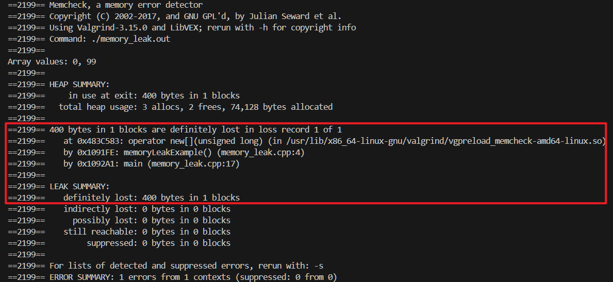
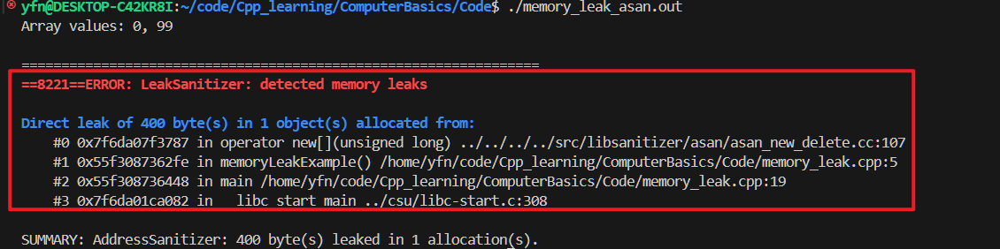
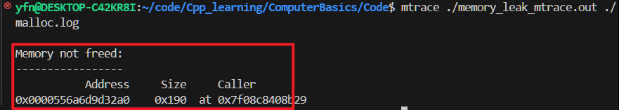

- [一、检查内存泄漏](#一检查内存泄漏)
  - [1.1 什么是内存泄漏？](#11-什么是内存泄漏)
  - [1.2 内存泄露产生的方式](#12-内存泄露产生的方式)
  - [1.3 使用工具检测内存泄漏](#13-使用工具检测内存泄漏)
    - [1.3.1 Valgrind 工具检查内存泄漏](#131-valgrind-工具检查内存泄漏)
    - [1.3.2 使用 AddressSanitizer (ASan)](#132-使用-addresssanitizer-asan)
    - [1.3.3 使用 mtrace](#133-使用-mtrace)
    - [1.3.4 其他工具](#134-其他工具)
    - [1.3.5 监控系统的内存使用](#135-监控系统的内存使用)
- [二、select、poll、epoll 之间的区别](#二selectpollepoll-之间的区别)


# 一、检查内存泄漏

## 1.1 什么是内存泄漏？

内存泄漏（Memory Leak）**是指程序中已动态分配的堆内存由于某种原因，程序未释放或无法释放，造成系统内存的浪费，导致程序运行速度减慢甚至系统崩溃等严重后果**。

内存泄漏缺陷具有隐蔽性、积累性的特征，比其他内存非法访问错误更难检测。因为**内存泄漏的产生原因是内存块未被释放，属于遗漏型缺陷而不是过错型缺陷**。此外，内存泄漏通常不会直接产生可观察的错误症状，而是逐渐积累，降低系统整体性能，极端的情况下可能使系统崩溃。


## 1.2 内存泄露产生的方式

以产生的方式来分类，内存泄漏可以分为四类：

- **常发性会内存泄漏**：发生内存泄漏的代码会被多次执行到，每次被执行时都导致一块内存泄漏。
- **偶发性内存泄漏**：发生内存泄漏的代码只有在某些特定环境或操作过程下才会发生。常发性和偶发性是相对的。对于特定的环境，偶发性的也许就变成了常发性的。所以测试环境和测试方法对检测内存泄漏至关重要。
- **一次性内存泄漏**：发生内存泄漏的代码只会被执行一次，或者由于算法上的缺陷，导致总会有一块且仅有一块内存发生泄漏。
- **隐式内存泄漏**：程序在运行过程中不停的分配内存，但是直到结束的时候才释放内存。严格的说这里并没有发生内存泄漏，因为最终程序释放了所有申请的内存。但是对于一个服务器程序，需要运行几天，几周甚至几个月，不及时释放内存也可能导致最终耗尽系统的所有内存。所以，我们称这类内存泄漏为隐式内存泄漏。从用户使用程序的角度来看，内存泄漏本身不会产生什么危害，作为一般的用户，根本感觉不到内存泄漏的存在。真正有危害的是内存泄漏的堆积，这会最终耗尽系统所有的内存。从这个角度来说，一次性内存泄漏并没有什么危害，因为它不会堆积，而隐式内存泄漏危害性则非常大，因为较之于常发性和偶发性内存泄漏它更难被检测到。

## 1.3 使用工具检测内存泄漏

### 1.3.1 Valgrind 工具检查内存泄漏

**Valgrind** 是一个功能强大的开源内存调试工具，特别适用于检测 C/C++ 程序中的内存泄漏。其 `Memcheck` 工具可以检测未释放的内存、使用未初始化的内存等问题。

```bash
# 1. 安装工具
sudo apt-get update
sudo apt-get install valgrind

# 2. 编译程序
# 为了获得详细的调试信息，建议在编译时添加调试符号（-g）并关闭优化（-O0）
gcc -g -O0 -o memory_leak memory_leak.cpp

# 3. 运行 Valgrind
# --leak-check=full：进行详细的内存泄漏检查。
# --show-leak-kinds=all：显示所有类型的内存泄漏。
# --track-origins=yes：跟踪未初始化内存的来源，帮助定位问题。
# Valgrind 会输出内存泄漏的详细信息，包括泄漏的内存大小、泄漏位置的源代码行号等。根据这些信息，您可以定位并修复内存泄漏。
valgrind --leak-check=full --show-leak-kinds=all --track-origins=yes ./memory_leak.out 
```

```cpp
// 测试程序
#include <iostream>

void memoryLeakExample() {
    int* leakArray = new int[100];  // 动态分配内存
    for (int i = 0; i < 100; ++i) {
        leakArray[i] = i;
    }

    std::cout << "Array values: " << leakArray[0] << ", " << leakArray[99] << std::endl;

    // 忘记释放内存，导致泄漏
    // delete[] leakArray;  // 如果加上这一行，就不会有内存泄漏了
}

int main() {
    memoryLeakExample();
    return 0;
}
```
以下 `Valgrind` 会报告 400 字节的内存泄漏，因为 `new int[100]` 分配的数字没有被释放。




### 1.3.2 使用 AddressSanitizer (ASan)

**AddressSanitizer** 是 GCC 和 Clang 提供的一种快速的内存错误检测工具，能够在编译时插桩代码，运行时检测内存错误，包括内存泄漏。

```bash
# 1. 使用 -fsanitize=address 选项编译程序
g++ -fsanitize=address -g -o memory_leak_asan.out memory_leak.cpp


# 2. 直接运行编译后的程序
./memory_leak_asan.out

# 或者 ASan 会在程序运行时检测并报告内存错误和泄漏。如果只想检测内存泄漏，可以启用 LeakSanitizer 
g++ -fsanitize=address,leak -g -o memory_leak_asan1.out memory_leak.cpp
# 运行程序后，LeakSanitizer 会在程序结束时报告内存泄漏信息。
```



### 1.3.3 使用 mtrace

**mtrace** 是 glibc 提供的一个简单工具，用于跟踪 `malloc` 和 `free` 调用，从而检测内存泄漏。

```cpp
#include <iostream>
#include <mcheck.h>  // 包含 mtrace 所需的头文件

void memoryLeakExample() {
  int* leakArray = new int[100];  // 动态分配内存
  for (int i = 0; i < 100; ++i) {
    leakArray[i] = i;
  }

  std::cout << "Array values: " << leakArray[0] << ", " << leakArray[99]
            << std::endl;

  // 忘记释放内存，导致泄漏
  // delete[] leakArray;  // 如果加上这一行，就不会有内存泄漏了
}

int main() {
  mtrace();  // 启用内存跟踪
  memoryLeakExample();
  return 0;
}
```

启动内存泄漏工具：

```bash
# 1. 编译代码
g++ -g -o memory_leak_mtrace.out memory_leak.cpp

# 2. 设置环境变量
export MALLOC_TRACE=./malloc.log

# 3. 运行程序
./memory_leak_mtrace.out

# 4. 分析日志文件
mtrace ./memory_leak_mtrace.out ./malloc.log
```

**`mtrace` 会输出以下内存泄露的位置：**




### 1.3.4 其他工具

除了上述工具，还有一些其他工具和方法可以辅助检测内存泄漏：

**Heaptrack**：一个性能分析工具，可以跟踪堆内存的分配和泄漏。

```bash
# 1. 安装 Heaptrack
sudo apt-get install heaptrack

# 2. 使用 Heaptrack
heaptrack ./myprogram
heaptrack_print heaptrack.myprogram.*.gz
```

**Massif (Valgrind 的一部分)**：用于堆内存分析和性能分析。

**使用 Massif**

```bash
valgrind --tool=massif ./myprogram
ms_print massif.out.<pid>
```

**ltrace 和 strace**：虽然主要用于跟踪库调用和系统调用，但也可以间接帮助发现内存问题。


### 1.3.5 监控系统的内存使用

通过监控程序的内存使用情况，可以初步发现内存泄漏。例如，使用 `top`、`htop` 或查看 `/proc/<pid>/status` 中的内存相关字段。

```bash
# 如果发现程序的内存占用持续增长，可能存在内存泄漏。但这种方法无法提供具体的泄漏位置，仅作为初步诊断
top -p <pid>

cat /proc/<pid>/status | grep -i vm
```


# 二、select、poll、epoll 之间的区别

> [select、poll、epoll之间的区别(搜狗面试)](https://www.cnblogs.com/aspirant/p/9166944.html)

(1)select==>时间复杂度O(n)

它仅仅知道了，有I/O事件发生了，却并不知道是哪那几个流（可能有一个，多个，甚至全部），我们只能无差别轮询所有流，找出能读出数据，或者写入数据的流，对他们进行操作。所以**select具有O(n)的无差别轮询复杂度**，同时处理的流越多，无差别轮询时间就越长。

(2)poll==>时间复杂度O(n)

poll本质上和select没有区别，它将用户传入的数组拷贝到内核空间，然后查询每个fd对应的设备状态， **但是它没有最大连接数的限制**，原因是它是基于链表来存储的.

(3)epoll==>时间复杂度O(1)

**epoll可以理解为event poll**，不同于忙轮询和无差别轮询，epoll会把哪个流发生了怎样的I/O事件通知我们。所以我们说epoll实际上是**事件驱动（每个事件关联上fd）**的，此时我们对这些流的操作都是有意义的。**（复杂度降低到了O(1)）**

select，poll，epoll都是IO多路复用的机制。I/O多路复用就通过一种机制，可以监视多个描述符，一旦某个描述符就绪（一般是读就绪或者写就绪），能够通知程序进行相应的读写操作。**但select，poll，epoll本质上都是同步I/O，因为他们都需要在读写事件就绪后自己负责进行读写，也就是说这个读写过程是阻塞的**，而异步I/O则无需自己负责进行读写，异步I/O的实现会负责把数据从内核拷贝到用户空间。 

epoll跟select都能提供多路I/O复用的解决方案。在现在的Linux内核里有都能够支持，其中epoll是Linux所特有，而select则应该是POSIX所规定，一般操作系统均有实现。


# 面试问题收集

> [小米秋招](https://www.nowcoder.com/discuss/670754186060914688?sourceSSR=users)

## Q1：常见的Linux段错误是什么原因，怎么排查？

* 在 Linux 上，段错误（Segmentation Fault）是程序试图访问不允许的内存区域时发生的错误。常见的原因是对非法内存的访问，如解引用空指针、访问已经释放的内存、或者超出数组边界访问。

```cpp
// 1. 解引用空指针
int *ptr = nullptr;
*ptr = 5; // 试图解引用空指针，产生段错误

// 2. 越界访问数组
int arr[5];
arr[10] = 3;  // 数组越界访问，可能引发段错误

// 3. 访问已释放的内存
int* ptr = new int(5);
delete ptr;
*ptr = 10;  // 使用已经释放的内存，产生段错误

// 4. 栈溢出：过深的递归调用或分配了过大的局部变量，导致栈空间耗尽。
void recursiveFunction() {
    recursiveFunction();  // 递归调用无终止条件，导致栈溢出
}
```

如何排查段错误呢？

1. **检查系统日志**。当发生段错误时，Linux 会在系统日志中记录信息。可以通过 `dmesg` 查看相关的日志输出，通常会显示类似于 `segfault at` 的信息。
2. **使用 `GDB` 调试**。当程序发生段错误时，`gdb` 会停止程序并显示错误的位置，可以使用 `backtrace(bt)` 命令来查看调用栈，来定位出错的代码行。
3. **使用 Valgrind 检查内存错误**。`valgrind ./my_code.out` 来运行程序，`Valgrind` 会详细报告内存访问情况，包括无效的读取和写入内存操作。**通过报告的信息，可以定位引发段错误的代码**。
4. **核心转储（Core Dump）分析**。

```bash
# 1. 启用核心转储。默认情况下，许多系统禁用了核心转储。使用以下命令进行启用。
ulimit -c unlimited
    
# 2. 运行程序并产生核心转储。当程序发生段错误时，会生成一个 core 文件（可能会命名为 core.pid，其中 pid 是进程 ID）。

# 3. 使用 gdb 分析核心转储 使用核心转储文件进行调试
gdb ./your_program.out core
```

5. 除了运行时调试工具外，可以使用一些**静态分析工具**来在编译时检测潜在的错误。如 `cppcheck`，其是专门用于 C++ 的静态代码分析工具，可以检测很多常见的编程错误和潜在的内存问题。

***

## Q2：堆和栈哪个会先溢出？

大多数情况下，**栈会比堆先溢出**，但这取决于程序的内存使用方式。

原因在于栈和堆的内存分配机制不同，栈通常有更严格的大小限制，而堆的大小限制相对较宽松。

**栈（stack）**：栈用于存储局部变量、函数参数、返回地址等。栈的大小通常是固定的，并且由操作系统或编译器分配。**当声明局部变量、调用递归函数等时，栈上的空间会迅速增长**。如果递归太深或局部变量过多，栈空间很容易耗尽，导致**栈溢出**（Stack Overflow）。

```cpp
void recursiveFunction() {
    recursiveFunction();  // 无限递归，导致栈溢出
}

void test(){
    int largeArray[1000000];  // 试图在栈上分配过大的数组，导致栈溢出
}

int main() {
    recursiveFunction();
    return 0;
}
```


**堆（heap）**：堆用于动态内存分配（`new`、`malloc`等）。**堆的大小由系统内存总量决定，通常比栈空间大得多**。当需要大量动态分配内存时，堆可能会用完，导致**堆溢出**（Heap Overflow）。但在大多数情况下，堆空间更大、更灵活，因此堆溢出往往不如栈溢出常见。

```cpp
int main() {
    while (true) {
        int* ptr = new int[1000000];  // 动态分配大量内存但没有释放，可能导致堆溢出
    }
    return 0;
}
```

**栈溢出**：栈的大小通常是操作系统指定的，**默认值一般在几百 KB 到几 MB 之间**，因此递归过深或局部变量过大时，栈溢出往往会比较快发生。

**堆溢出**：堆的大小通常比栈大得多，**可以根据系统的物理内存和虚拟内存使用情况进行动态增长，除非进行非常大量的动态内存分配，否则堆溢出较不常见**。

## Q3：Core dump 是怎么造成的？

一、内存访问违规

* **数组越界访问**：在 C/C++ 程序中，如果定义了一个数组`int arr[10]`，但在程序执行时，误访问了`arr[15]`这样超出数组范围的元素，就属于数组越界访问。此时，程序试图访问不属于它合法使用的内存区域，这可能会破坏其他变量或者系统管理的数据结构，导致程序运行出现异常而产生 Core dump。
* **野指针访问**：访问一个已经释放掉内存的指针。

二、非法的函数调用

* **栈溢出**：在函数调用过程中，如果递归调用没有正确的终止条件，或者局部变量占用的栈空间过大，超过了栈所能承受的范围，就会发生栈溢出。
* **函数参数传递错误**：当调用函数时传递的参数类型不符合函数定义要求，或者参数个数不对时，可能导致函数内部执行出现错误，最终引发 Core dump。

三、信号异常

* **除零错误**：在进行数学运算时，如果出现除数为 0 的情况，操作系统通常会发送一个`SIGFPE`（浮点数异常信号）信号给程序，程序接收到这个信号后，如果没有进行相应的信号处理，就会异常终止并生成 Core dump。
* **非法指令执行**：当程序试图执行一些不被当前硬件或操作系统支持的指令时，会触发相关信号（如`SIGILL`，非法指令信号），导致程序异常终止并生成 Core dump。

四、资源耗尽

* **内存耗尽**：如果程序不断地申请内存（比如通过`malloc`等函数在堆上分配内存），而没有及时释放，当内存使用量超过了系统所能提供的最大内存限制时，后续的内存分配请求就无法满足，这时程序可能会因为无法获取到所需内存而异常终止并生成 Core dump。
* **文件描述符耗尽**：在一些涉及大量文件操作或网络套接字操作的程序中，如果持续打开文件或创建套接字而不关闭，会导致文件描述符资源被耗尽。因为操作系统对每个进程可使用的文件描述符数量是有限制的（例如在 Linux 系统中，默认有一定的限制，虽然可以调整但也是有上限的），当用完所有可用的文件描述符后，再进行相关操作就会失败，进而可能引发程序异常并产生 Core dump。

## Q4：如何使用 GDB 调试的？


## Q5：线程池有什么作用？


## Q6：讲解一下 IO 复用？


## Q7：如何进行排查内存泄露的？


## Q8：为什么要使用 PIPM 模式呢？

PIMPL（Pointer to Implementation，指向实现的指针）模式是C++中的一个常见设计模式。其主要目的是**将类的实现细节隐藏起来，只暴露必要的接口给用户。这样当实现细节发生变化时，不会影响到用户的代码，从而实现了接口与实现的分离。**


1. **信息隐藏**：通过将实现细节隐藏在内部类中，我们可以保护类的实现细节，使其不被外部用户误用或滥用。
2. **减少编译依赖**：当类的实现细节发生变化时，只需要重新编译实现文件，而不需要重新编译使用该类的所有代码。
3. **保持二进制兼容性**：当我们需要更改类的实现细节时，只需要更改内部类，而不需要更改外部类的接口。