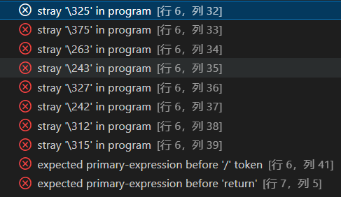

# 练习 1.3

编写程序，在标准输出上打印Hello, World。

```cpp
#include <iostream>
using namespace std;

int main()
{
    cout<<"hello world!"<<endl;
    return 0;
}
```

# 练习 1.4

我们的程序使用加法运算符`+`来将两个数相加。编写程序使用乘法运算符`*`，来打印两个数的积。

```cpp
#include <iostream>
using namespace std;

int main()
{
    cout<<"请输入两个数：";
    int a,b;
    cin>>a>>b;
    cout<<"这两个数的积为："<< a << " * " << b << " = " << a*b <<endl;
    return 0;
}
```

# 练习 1.5

我们将所有的输出操作放在一条很长的语句中，重写程序，将每个运算对象的打印操作放在一条独立的语句中。

```cpp
#include <iostream>
using namespace std;

int main()
{
    cout<<"please enter two numbers:"<<endl;
    int a,b;
    cin>>a>>b;
    cout<<"The product of ";
    cout<<a;
    cout<<" and ";
    cout<<b;
    cout<<" is ";
    cout<<a*b<<endl;
    return 0;
}
```

# 练习 1.6

解释下面程序片段是否合法。

```cpp
std::cout << "The sum of " << v1;
          << " and " << v2;
          << " is " << v1 + v2 << std::endl;
```

如果程序是合法的，它的输出是什么？如果程序不合法，原因何在？应该如何修正？

**解**：不合法，因为程序存在多余的分号。将 v1 和 v2 后面的分号删除后，为正确的程序。

# 练习 1.7

编译一个包含不正确的嵌套注释的程序，观察编译器返回的错误信息。

解：

```cpp
#include <iostream>
using namespace std;

int main()
{
    /* 正常注释 /* 嵌套注释 */ 正常注释*/
    return 0;
}
```



# 练习 1.8

指出下列哪些输出语句是合法的（如果有的话）：

```cpp
std::cout << "/*";
std::cout << "*/";
std::cout << /* "*/" */;
std::cout << /* "*/" /* "/*" */;
```

预测编译这些语句会产生什么样的结果，实际编译这些语句来验证你的答案(编写一个小程序，每次将上述一条语句作为其主体)，改正每个编译错误。

解：只有第三句会出错，改成如下即可。

```cpp
std::cout << /* "*/" */";
```

**第四句等价于输出 `" /* "`。**

