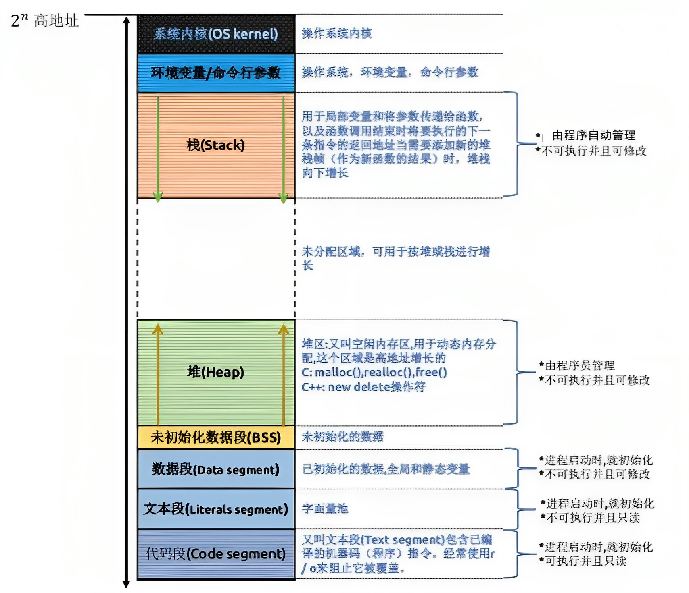

- [一、面向过程（类外部）](#一面向过程类外部)
  - [1.1 静态全局变量](#11-静态全局变量)
    - [静态全局变量声明在.h文件中，在.cpp文件中是否可见？](#静态全局变量声明在h文件中在cpp文件中是否可见)
  - [补充下C/C++程序的内存布局](#补充下cc程序的内存布局)
  - [C++ 类对象的内存布局](#c-类对象的内存布局)
  - [1.2 静态局部变量](#12-静态局部变量)
  - [1.3 静态函数](#13-静态函数)
- [二、面向对象（类内部）](#二面向对象类内部)
  - [2.1 静态成员变量](#21-静态成员变量)
  - [2.2 静态成员函数](#22-静态成员函数)
  - [2.3 八股文](#23-八股文)


参考：

* [C/C++ 中的static关键字](https://zhuanlan.zhihu.com/p/37439983)
* [C++ Static关键字作用介绍](https://blog.csdn.net/u011718663/article/details/118218407)

**static 关键字根据放在类的内部和外部，分为面向对象和面向过程两部分。**

# 一、面向过程（类外部）

## 1.1 静态全局变量

<font color=alice>**定义**：在全局变量之前加上关键字 static，则该全局变量就被声明为一个**静态的全局变量**了。</font>

```c++
// File1
#include <iostream.h> 

void fn()
{
	n++;
	cout << n << endl;
} 

/* 该变量被存放在全局数据区，该变量仅仅在 File1 文件中是可见的，而在 File1 文件之外是不可见的，这样做的好处是静态全局变量不能被其它文件所使用，其他文件也可以使用相同名字的变量，不会发生冲突。 */
static int n; // 定义静态全局变量 

void main()
{
	n = 20;
	cout << n << endl;
	fn();
} 
```

***

**特点：**

* 1）该变量在全局数据区分配内存；
* 2）未经初始化的静态全局变量会被程序自动初始化为0（自动变量的自动初始化值是随机的）；
* 3）静态全局变量在声明它的整个文件都是可见的，而在文件之外是不可见的；
* 4）**静态变量都在全局数据区分配内存，包括后面将要提到的静态局部变量。**对于一个完整的程序，在内存中的分布情况如下：【代码区】【全局数据区】【堆区】【栈区】，**一般程序的由new产生的动态数据存放在堆区，函数内部的自动变量存放在栈区，静态数据（即使是函数内部的静态局部变量）存放在全局数据区。自动变量一般会随着函数的退出而释放空间，而全局数据区的数据并不会因为函数的退出而释放空间。**

定义全局变量就可以实现变量在文件中的共享，但定义静态全局变量还有以下好处：

* 1）静态全局变量不能被其他文件所使用；
* 2）其它文件中可以定义相同名字的变量，不会发生冲突；

静态全局变量与全局变量的区别：

* <font color=blue>在一个文件中，静态全局变量和全局变量功能相同；而在两个文件中，要使用同一个变量，则只能使用全局变量而不能使用静态全局变量（在其他文件中使用关键字 extern 来实现在两个文件中公用一个全局变量）。</font>

***

### 静态全局变量声明在.h文件中，在.cpp文件中是否可见？

**当全局静态变量在 `.h` 文件中声明时，它们的作用域被限制在包含该头文件的单个源文件（`.cpp` 文件）中。这意味着全局静态变量对其他 `.cpp` 文件是不可见的。**

```cpp
/* 在 myHeader.h 文件中声明一个全局静态变量 */
static int myGlobalStatic = 0;

/* 这个变量 myGlobalStatic 会在每个包含 myHeader.h 的 .cpp 文件中有一个独立的副本。因此，每个源文件都会有自己的 myGlobalStatic，彼此之间不共享状态。*/
```

在 `.cpp` 文件中的访问：

- **可见性**：只有包含了 `myHeader.h` 的 `.cpp` 文件可以访问 `myGlobalStatic`。
- **独立性**：每个源文件中的 `myGlobalStatic` **都是独立的，对于另一个源文件中的相同变量不会有任何影响**。

**若想在多个`.cpp`文件中共享一个变量，需要声明一个非静态的全局变量并使用`extern`关键字修饰**。

```cpp
// myHeader.h
extern int myGlobal;  // 声明

// mySource.cpp
int myGlobal = 0;  // 定义

/*
使用extern关键字修饰变量，则所有包含myHeader.h的.cpp文件中都可以对myGlobal该变量进行修改和访问，也就是所有的.cpp文件共享这个变量。
*/
```

***

## 补充下C/C++程序的内存布局

[C++类对象的内存布局](https://blog.csdn.net/dxpqxb/article/details/102794132)、[第5篇:C/C++ 内存布局与程序栈](https://zhuanlan.zhihu.com/p/184957568)

**代码段**：程序的所有指令都会存放在这个区域，这是已经被编译后的机器码。<font color=red>所有类成员函数和非成员函数代码存放在代码段。</font>

**文本段**：即字面量池，程序初始化时的一些字符串字面量，在程序中用于显示文字。

**全局数据段（只读数据段）**：用来存储程序**初始化时的常量、全局变量、静态全局变量**。C/C++ 用global/static声明的变量都存放在这个区域，对所有函数（当前文件内的所有函数）公开可见。

**堆**：由 new、malloc来申请得到的内存块，该内存块的释放由程序员进行手动释放。若程序员没有手动释放掉该内存，则在程序结束后由 OS 自动进行回收。

**栈**：在执行函数时，**函数内局部变量的存储单元**都可以在栈上创建，函数执行结束时这些存储单元自动被释放。栈内存分配运算内置于处理器的指令集中，效率很高，用来存储该程序的“上下文”，从高地址向低地址进行扩展。**上下文的意思其实就是程序中各个函数之间调用的先后顺序。**存放的数据有：为运行函数而分配的局部变量、函数参数、返回数据、返回地址（程序的上下文）

windows 蓝屏的原因：是因为内存不足了，也就是栈区和堆区碰面了，导致无可用空间了。

## C++ 类对象的内存布局

在 C++ 的类对象中，成员变量有两种：static 和非 static；有三种成员函数：static、非 static 和 virtual。

在定义类时：

* **类的成员函数被存放在代码段**。
* **类的静态成员变量被存放在全局数据区。**
* 非静态成员变量在类的实例（对象）内，实例在栈区或者堆区。**若类的实例是定义为类的变量，那么就存在于栈区。若类的实例是 new 出来的类指针，那么就存在堆区。对象的引用类型被保存在栈区。**

为何这样设计？其实这是从c语言发展而来的。<font color=coral>类的成员变量相当于 c 的结构体，类的成员函数类似于 c 的函数，类的静态变量类似于 c 的静态或全局变量，至于虚函数，函数体还是放在代码区，但虚函数的指针和成员变量一起放在数据区，这是因为虚函数的函数体有多个，不同的子类调用同一虚函数实则调用的不同函数体，因此需要在类的数据区保持真正的虚函数的指针。</font>

关于非 static 成员变量及成员函数的类的对象、含有static和非static成员变量和成员函数的类的对象、加入 virtual 成员函数的类的对象、虚函数表的内容的内存分布之后参考【[第5篇:C/C++ 内存布局与程序栈](https://zhuanlan.zhihu.com/p/184957568)】再做仔细分析。



***

## 1.2 静态局部变量

**定义**：在局部变量之前，加上关键字 static，则该变量就被定义成了一个静态的局部变量了。

<font color=blue>通常，在函数体内定义了一个变量，每当程序运行到该语句时都会给该局部变量分配栈内存。但随着程序退出函数体，系统就会收回栈内存，局部变量也相应失效。</font>

但是有时候会遇到两次函数调用之间对变量的值进行保存。通常的做法是定义一个全局变量来实现，但是这样会导致这个变量不会再属于这个函数本身了，因此使用**静态局部变量可以解决这个问题，静态局部变量保存在全局数据区，而不是保留在栈中，每次静态局部变量的值保持到下一次调用，下一次可以进行运算（静态局部变量只被初始化一次，但是可以多次进行运算）。**

```cpp
//Example 3
#include <iostream.h>
void fn();
void main()
{
	fn(); // 10
	fn(); // 11
	fn(); // 12
}

void fn()
{
	static int n = 10;
	cout << n << endl;
	n++;
}
```

**特点：**

* 1）静态局部变量在全局数据区分配内存。
* 2）静态局部变量在程序执行到该对象的声明处时**被首次初始化，即以后的函数调用不再进行初始化**。
* 3）静态局部变量一般在声明处初始化，**如果没有显式初始化，会被程序自动初始化为0**。
* 4）静态局部变量始终驻留在全局数据区，直到程序运行结束。但其作用域为局部作用域，当定义它的函数或语句块结束时，其作用域随之结束，但是其内存并没有被销毁，仍然驻留在内存当中，直到该函数被再次调用，静态局部变量可以被再次访问。

**静态局部变量的一句话总结：静态变量具有全局变量的生命周期，但只能作用于自己的作用域。<font color=red>也就是说静态局部变量只能通过该函数进行访问，但是其生命周期是一直存在的。</font>**

***

## 1.3 静态函数

**定义**：在函数的返回类型前加上static关键字，函数即被定义为静态函数。静态函数与普通函数不同，它只能在声明它的文件当中可见，不能被其它文件使用。

```cpp
// 3. 静态函数：静态函数只能在声明它的文件中可见，不能被其他文件所使用
static void TestStaticFunc()
{
    int a = 20;
    cout << a << endl;
}
```

**定义静态函数的好处：（类似于静态全局变量）**

* 1）静态函数不能被其它文件所用；
* 2）其它文件中可以定义相同名字的函数，不会发生冲突；
* 3）**可以头文件`.h`定义，源文件`.cpp`中调用静态函数。**

***

# 二、面向对象（类内部）

## 2.1 静态成员变量

**定义**：在类内的成员变量前面加上关键字 static，那么该数据成员变量就是静态数据成员了。

<font color=coral>静态数据成员实际上可以看作是一个全局变量（当然静态数据成员也被存放在全局数据区）</font>，将其封装类中的目的有两个：

* 1）**限制该变量的作用范围**。只让类对象的成员函数进行访问。
* 2）将意义相关的全局变量和相位操作放在一起，可以增加程序的可读性。

***

**静态数据成员的特点：**

* 1）<font color=blue>静态数据成员存在于全局数据区，由该类的所有对象所共享。</font>static 成员变量的内存空间分配不是在声明类时所分配的，也不是创建对象时所分配的，而是**在静态成员变量初始化时内存被分配的。静态成员变量必须初始化，而且只能在类外进行初始化。**否则，编译能通过，链接不能通过。<font color=blue>初始化时可以赋初值，也可以不赋值。如果不赋值，那么会被默认初始化，一般是 0。静态数据区的变量都有默认的初始值，而动态数据区（堆区、栈区）的变量默认是垃圾值。</font>

* 2）<font color=alice>静态数据成员的声明周期：编译时在全局数据区分配内存，到程序结束时才释放内存。</font>这就意味着，static 成员变量不随对象的创建而分配内存，也不随对象的销毁而释放内存。而普通成员变量在对象创建时分配内存，在对象销毁时释放内存。

* 3）<font color=blue>静态数据成员的初始化：初始化时可以不加 static，但必须要有数据类型（一般在类内进行声明）。</font>被 private、protected、public 修饰的 static 成员变量都可以用这种方式初始化。静态数据成员初始化的格式为：`＜数据类型＞ ＜类名＞::＜静态数据成员名＞ = ＜值＞`。

* 4）<font color=alice>静态数据成员的访问：一般通过`类名::静态数据成员名`的方式进行访问。</font>使用`对象.静态数据成员名`较少，个人也不喜欢这种用法。

* 5）<font color=blue>sizeof 运算符不会计算 静态成员变量的内存大小。</font>

  ```cpp
  class CMyclass{
      int n;
      static int s;
  };    // 则sizeof（CMyclass）等于4
  ```


```cpp
class Point
{
public:
    // 构造函数
    Point(int x = 0, int y = 0): x_(x), y_(y){
        // 在构造函数中对 count 进行累加，所有对象共同维护同一个 count
        count++;
    }

    Point(Point &p){
        x_ = p.x_, y_ = p.y_;
        count++;
    }

    ~Point(){ count--; } // 构造函数

    int getX(){ return x_; }

    int getY(){ return y_; }

    void showCount(){
        cout << "Object count : " << count << endl;
    }

    static void StaticShowCount(){
        cout << "Static Object count : " << count << endl;
    }
private:
    // 私有数据成员
    int x_, y_;
    // 报错：静态成员变量不能在类中进行初始化，只能进行声明
    // static int count = 1;
    // 静态数据成员声明，用于记录点的个数
    static int count;
};

// 不赋值：被默认初始化为 0
// int Point::count;
/* 静态数据成员的初始化 */
int Point::count = 1;
```


## 2.2 静态成员函数

**定义**：在类内的成员函数前面加上关键字 static，那么该成员函数就是静态数据成员了。

**静态成员函数与普通成员函数的区别：**

* 1）静态成员函数为类服务而不是为某一个类的具体对象服务。静态成员函数与静态成员变量一样，都是类的内部实现，属于类定义的一部分。<font color=coral>普通成员函数必须具体作用于某个对象，而静态成员函数并不具体作用于某个对象。也就是说不需要创建类的任何对象，就能通过类名直接调用类的静态成员函数了。</font>
* 2）普通的成员函数一般都隐含了一个this指针，this指针指向类的对象本身，因为普通成员函数总是具体地属于类的某个具体对象的。当函数被调用时，系统会把当前对象的起始地址赋给 `this` 指针。通常情况下，`this` 是缺省的。如函数 `fn()` 实际上是 `this->fn()`。**与普通函数相比，静态成员函数属于类本身，而不作用于对象，因此它不具有this指针。**<font color=alice>正因为它没有指向某一个对象，所以它无法访问属于类对象的非静态成员变量和非静态成员函数，它只能调用其余的静态成员函数和静态成员变量。</font>**从另一个角度来看，由于静态成员函数和静态成员变量在类实例化之前就已经存在可以访问，而此时非静态成员还是不存在的，因此静态成员不能访问非静态成员。**

**静态成员函数的特点：**

* <font color=blue>静态成员函数没有 this 指针（静态成员函数不属于对象，属于类，所以没有this指针），所以不能直接访问非静态的数据成员（非静态的数据成员属于对象，而this指针就是指向当前对象的指针），只能通过`将对象作为形参传递，利用对象来访问类的非静态成员`。</font>
* 静态成员函数只能访问全局变量、静态数据成员、静态成员函数，不能访问非静态成员函数和非静态成员变量。
* **非静态成员函数可以任意地访问静态成员函数和静态数据成员。**
* <font color=alice>静态成员函数可以通过类名和对象名来调用，但是通常是使用类名来调用静态成员函数（即使通过对象名来调用静态成员函数，起作用的也只是对象的类型而已，与所使用的对象毫无关系）。</font>普通成员函数属于类的对象，因此只能调用对象来调用了。
* <font color=red>静态成员函数不能是虚函数，若非静态成员函数和静态成员函数具有相同的名字和参数类型将是非法的。</font>
* 由于没有this指针的额外开销，静态成员函数与类的全局函数相比速度上会稍快。

***

**拷贝构造函数的问题：**

* 在使用包含静态成员的类时，有时候会调用拷贝构造函数生成临时的隐藏的类对象，而这个临时对象在消亡时会调用析构函数有可能会对静态变量做操作（例如 `total_num--`），可是这些对象在生成时却没有执行构造函数中的 `total_num++` 的操作。解决方案是为这个类写一个拷贝构造函数，在该拷贝构造函数中完成 `total_num++` 的操作。

## 2.3 八股文

[为什么静态static成员函数不能成为virtual虚函数](https://blog.csdn.net/hanzhen7541/article/details/98741825)、[静态函数能否为虚函数](https://blog.csdn.net/shltsh/article/details/45999801)

Q1：为啥静态成员函数不能被声明为 virtual 函数？

* ```cpp
  class A {
   public:
    // 报错：静态成员变量不能在类中进行初始化，只能进行声明
    // static int a = 1;
    static int a;
    // 报错：error: member ‘fun’ cannot be declared both ‘virtual’ and ‘static’
    // virtual static void fun() {}
    static void funA() const() {}
  };
  
  // int A::a = 1;
  // 定义
  int A::a; // 不赋初始值，则进行默认初始化为0
  ```

* 静态成员函数不属于类中的任何一个对象和实例，属于类共有的一个函数。也就是说，**它不能用this指针来访问，因为this指针指向的是每一个对象和实例**。对于virtual虚函数，它的调用恰恰使用this指针。**在有虚函数的类实例中，this指针调用vptr指针(在类的构造函数中创建生成)，指向的是vtable(虚函数列表)，通过虚函数列表找到需要调用的虚函数的地址**。总体来说虚函数的调用关系是：**this指针->vptr(4字节）->vtable ->virtual function**。因为 static 函数没有 this 指针，无法找到虚函数，那么 static 函数就就不能声明为虚函数。

***

[C++静态成员函数不能声明为const、volatile、virtual的原因 与 C++的对象模型](https://blog.csdn.net/u010476094/article/details/38959265)

Q2：为什么静态成员函数不能是 `const` 函数？

* 当声明一个非静态成员函数为 `const` 时，对this指针会有影响。对于一个Test类中的 `const` 修饰的成员函数，this 指针的类型为`Test const * const pointer`，而对于非 `const` 成员函数，this指针的类型为`Test* const pointer`。而 `static` 成员函数没有 `this` 指针，所以不能使用 `const` 来修饰 `static` 成员函数。
  
