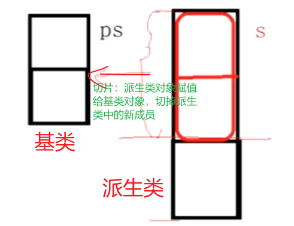
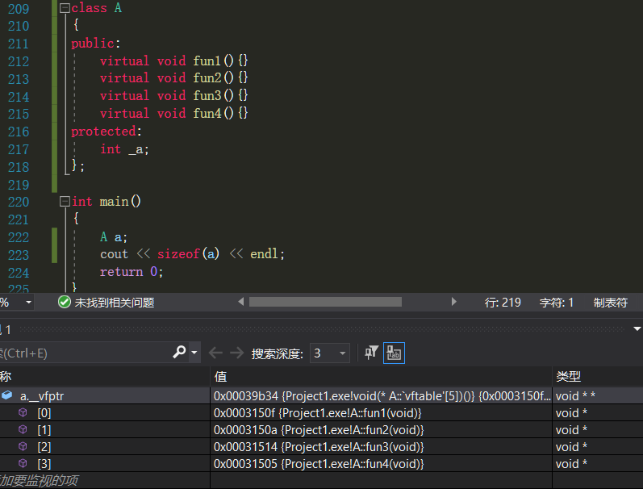

- [一、继承](#一继承)
  - [1.1 继承相关定义概述](#11-继承相关定义概述)
    - [补充：继承与静态成员之间的关系](#补充继承与静态成员之间的关系)
    - [补充：友元不会被继承](#补充友元不会被继承)
  - [1.2 类的继承方式](#12-类的继承方式)
    - [改变访问权限](#改变访问权限)
      - [using 关键字改变权限](#using-关键字改变权限)
      - [继承中的遮蔽问题](#继承中的遮蔽问题)
      - [使用指针改变权限](#使用指针改变权限)
  - [1.3 派生类的构造函数和析构函数](#13-派生类的构造函数和析构函数)
    - [派生类的构造函数](#派生类的构造函数)
    - [派生类的析构函数](#派生类的析构函数)
    - [派生类的拷贝构造函数](#派生类的拷贝构造函数)
    - [补充：面试题](#补充面试题)
  - [1.4 同名隐藏](#14-同名隐藏)
    - [补充：函数重载、函数覆盖、函数隐藏之间的定义与区别](#补充函数重载函数覆盖函数隐藏之间的定义与区别)
    - [补充：final 和 override 说明符](#补充final-和-override-说明符)
  - [1.5 类型兼容规则【派生类赋值给基类】](#15-类型兼容规则派生类赋值给基类)
  - [1.6 多重继承](#16-多重继承)
    - [菱形继承](#菱形继承)
    - [虚继承](#虚继承)
- [二、多态](#二多态)
  - [2.1 C++ 中多态的实现](#21-c-中多态的实现)
    - [2.1.1 多态的构成条件](#211-多态的构成条件)
    - [2.2.2 虚函数](#222-虚函数)
  - [2.2 抽象类](#22-抽象类)
    - [2.2.1 概念](#221-概念)
    - [2.2.2 接口继承与实现继承](#222-接口继承与实现继承)
  - [2.3 多态的原理](#23-多态的原理)
    - [2.3.1 虚函数表](#231-虚函数表)
    - [2.3.2 多态的原理](#232-多态的原理)
    - [2.3.3 动态绑定与静态绑定](#233-动态绑定与静态绑定)
    - [2.3.4 虚函数表存储的位置](#234-虚函数表存储的位置)
  - [2.4 继承中的虚函数表](#24-继承中的虚函数表)
    - [2.4.1 单继承中的虚函数表](#241-单继承中的虚函数表)
    - [2.4.2 多继承中的虚函数表](#242-多继承中的虚函数表)
    - [2.4.3 菱形继承和菱形虚拟继承](#243-菱形继承和菱形虚拟继承)
  - [2.5 虚函数面试题](#25-虚函数面试题)
  - [2.6 参考](#26-参考)

多态：

https://blog.csdn.net/qq_53558968/article/details/116886784

https://blog.csdn.net/bang___bang_/article/details/130851285

https://blog.csdn.net/qq_36359022/article/details/81870219


虚函数表：

https://www.cnblogs.com/yinbiao/p/10987640.html

https://coolshell.org/articles/12165.html

https://blog.nowcoder.net/n/2c8789b37c034ccd9a490e7051594fbd


面试题：

https://blog.csdn.net/luolaihua2018/article/details/122358512


# 一、继承

参考：[C++继承和派生](https://blog.csdn.net/weixin_45220863/article/details/125848676)、[C++总结（四）——继承与派生](https://blog.csdn.net/qq_43516875/article/details/129941180)、[C++ 继承(基类与派生类)详解附代码](https://blog.csdn.net/yn_zi/article/details/130039618)

以上三个链接的多态与虚函数到时候可以再补充下（这三个链接里面主要是虚继承没整理了，到时候再整理吧）。

## 1.1 继承相关定义概述

**定义**：继承是指在一个已存在类的基础上建立一个新类。已存在的类被称为基类（base class）或者父类，新建立的类被称为派生类（derived class）或者子类。

**继承性是面向对象程序设计最重要的特征之一**：

* 1）继承抽取了类之间的共同点，减少了代码冗余，是实现软件重用的重要手段，继承减少了代码冗余；
* 2）继承还是实现软件功能扩充的重要手段；
* 3）继承反映了类的层次结构，并支持对事物从一般到特殊的描述，这符合人的认知规律和行动准则。

***

**派生类继承基类的成员有：**

* 1）**所有数据成员，包括 static 静态数据成员变量**；
* 2）**除了基类的构造函数、析构函数之外的所有成员函数方法**；
* 3）**继承了基类的作用域，但是没有继承友元关系**；

**类继承关系图：**


**编写派生类的 4 个步骤：**

* 1）**吸收基类成员**，<font color=alice>除基类的构造函数、析构函数、运算符重载函数、友元函数外的所有成员函数和数据变量全都为派生类的成员。</font>
* 2）**改造基类成员**，主要包括两方面：一是依靠**派生类的继承方式（公有、保护、私有继承）**来控制访问基类成员的访问；二是**对基类数据成员或成员函数的同名覆盖**。<font color=alice>当派生类声明一个和某个基类成员同名的成员，派生类中的成员会屏蔽基类同名的成员，类似函数中的局部变量屏蔽全局变量。如果是成员函数，参数表和返回值完全一样时，称为同名覆盖（override），否则为重载。</font>**注意：静态函数不能被覆盖。**
* 3）**添加新成员**，添加新的成员变量和成员函数，以更适应派生类。
* 4）**重写派生类的构造函数和析构函数**，可以把基类的构造函数作为派生类构造函数的一部分或者调用基类的构造函数。

**语法如下：**

```cpp
// 单一继承
class <派生类名> : [继承方式] <基类名>
{
	...
};

// 多重继承
class <派生类名> : [继承方式] <基类名1>, [继承方式] <基类名2>, ..., [继承方式] <基类名n>
{
	...
};
```

### 补充：继承与静态成员之间的关系

静态成员在 C++ 在中属于整个类，而不是属于某个具体的对象。**静态成员被继承，但同名变量会被隐藏**。<font color=alice>如派生类中存在同名的静态成员，则派生类中的名字就会屏蔽掉基类中相同名字。使用`类名::类成员变量/函数`的方法来使用基类中的同名变量以及同名函数。</font>

**静态成员变量**的继承方式和普通静态变量一样，<font color=alice>在子类中可以直接使用父类中的静态成员变量。若在子类中重新定义了同名的静态成员变量，则会覆盖父类中的静态成员变量（同名隐藏）。</font>

```cpp
#include <iostream>
using namespace std;
 
class A {
public:
    static int num1;
    static int num2;
};

/* 静态数据成员只能在类外进行初始化 */
int A::num1 = 1;
int A::num2 = 5;
class B : public A {
public:
    static int num1; // 同名隐藏
};

/* 静态数据成员只能在类外进行初始化 */
int B::num1 = 2;

int main() {
    A::num1 = 3;
    B::num1 = 4; // 同名隐藏
    cout << "A::num1 = " << A::num1 << endl; // 输出 3
    cout << "B::num1 = " << B::num1 << endl; // 输出 4
    
    A::num2 = 6;
    B::num2 = 7; // 子类可以直接使用父类的静态成员变量
    cout << "A::num2 = " << A::num2 << endl; // 输出 6
    cout << "B::num2 = " << B::num2 << endl; // 输出 7
    return 0;
}
```

**静态成员函数**也可以被继承，在子类中可以不加任何修饰符地直接使用父类的静态成员函数。注意，**静态成员函数中不能使用 this 指针**，因为 this 指针只能用于非静态成员函数中。

```cpp
#include <iostream>
using namespace std;
 
class A 
{
public:
    static int num;
    static void print() 
    {
        cout << "A::num = " << num << endl;
    }
};
 
int A::num = 1;
 
class B : public A {
public:
    static int num;// 同名隐藏
 
    static void print() // 同名隐藏
    {
        A::print();// 使用基类中的同名函数
        cout << "B::num = " << num << endl;
    }
};
 
int B::num = 5;
 
int main() 
{
    A::print();// 打印 A::num = 1
    B::print();// 打印 A::num = 1 B::num = 5
    return 0;
}

/*
结果：
A::num = 1
A::num = 1
B::num = 5
*/
```


### 补充：友元不会被继承

在C++中，**友元关系不会被继承**。也就是说，派生类不会自动获得基类的友元关系。将基类看做父类，派生类看做子类，可以理解为：你父亲的朋友不是你的朋友。

虽然友元关系不会被继承，但是**可以在派生类中重新声明一下友元关系**。

```cpp
#include <iostream>
using namespace std;
 
class Student;
class Person
{
public:
    friend void Print(const Person& p, const Student& s);
    string _name;// 姓名
};
 
class Student :public Person
{
    // 由于友元关系不能被继承，因此需要在派生类中重新声明一下友元关系。若不声明则会报错
    friend void Print(const Person& p, const Student& s);
protected:
    int _stuNum;// 学号
};
 
void Print(const Person& p, const Student& s)
{
    cout << p._name << endl;
    cout << s._stuNum << endl; //在派生类中声明过后，就会编译通过
}
 
int main()
{
    Person p;
    Student s;
    Print(p, s);
    return 0;
}
```


## 1.2 类的继承方式

参考：[public、private、protected的区别](https://blog.csdn.net/weixin_50849959/article/details/116595077)、[C++中关于public、protect、private的访问权限控制](https://blog.csdn.net/ycf74514/article/details/49053041)

**成员函数的访问权限：**

* public 表示共有：类的数据成员变量和函数可以被该类的对象和派生类访问。
* private 表示私有：自己的类可以访问，但是派生类不能访问。
* protected 表示保护：自己的类和派生类都能进行访问。<font color=red>protected 和 private 的唯一区别在于：当发生继承之后，基类的 protected 成员可被派生类的成员直接访问，而 private 成员不能被派生类的成员访问。</font>

***

**public、protected、private的访问权限：**

* `public`：可以被 **1. 该类的成员函数、2. 其子类的成员函数、3. 其友元函数访问，也可以由 4. 该类的对象访问**。
* `protected`：可以被 **1. 该类的成员函数、2. 其子类的成员函数、3. 其友元函数访问。但是不能被该类的对象访问**。
* `private`：只能被 **1. 该类的成员函数、2. 其友元函数访问。不能被其他函数访问，该类的对象也不能访问**。
* **注意，若不指定继承方式的话，则默认为 private 继承。**

<font color=blue>友元函数之前总结过，包括三种：1. 外部函数做友元函数、2. 其他类的成员函数作为友元函数、3. 友元类。</font>

***

派生类继承基类有三种继承方式，分别是公有继承、保护继承和私有继承。

派生类中访问基类的成员依照上述成员函数的访问属性（private、protected、public）即可。


**public 继承：**

* 1）派生类通过 public 继承，基类的各种访问权限不变。
* 2）**派生类的成员函数，可以访问基类的 public 和 protected 成员**，因为通过 public 继承而来的基类成员的访问属性不变。但是肯定是**不能访问基类的 private 成员的**。
* 3）**派生类的实例变量（也就是对象），可以访问基类的 public 成员变量和成员函数，但是无法访问 protected、private 成员变量和成员函数**，即使是自身类的对象也无法访问 protected、private 成员。
* 4）可以将 public 继承看成派生类将基类的 public、protected 成员囊括到派生类，但是不包括private 成员。


**protected 继承：**

* 1）派生类通过 protected 继承，基类的public成员在派生类中的权限变成了 protected 。protected和private不变。
* 2）**派生类的成员函数，可以访问基类的 public 成员变量和成员函数、protected 成员变量和成员函数，但是无法访问基类的 private 成员变量和成员函数**。
* 3）**派生类的实例变量，无法访问基类的任何成员变量和成员函数**，因为基类的 public 成员在派生类中变成了 protected。
* 4） 可以将 protected 继承看成派生类将基类的 public、protected 成员囊括到派生类，全部作为派生类的 protected 成员，但是不包括 private 成员。


**private 继承：**

* 1） 派生类通过private继承，基类的所有成员在派生类中的权限变成了private。
* 2）**派生类的成员函数，可以访问基类的 public 成员变量和成员函数、protected 成员变量和成员函数，但是无法访问基类的 private 成员变量和成员函数**。
* 3）**派生类的实例变量，无法访问基类的任何成员变量和成员函数**，因为基类的所有成员在派生类中变成了 private。
* 4）可以将 private 继承看成派生类将基类的 public、protected 成员囊括到派生类，全部作为派生类的 private 成员，但是不包括 private 成员。

***

**总结下三种继承方式**：

* 1）**无论哪种继承方式，派生类的成员函数都能访问基类的 public 成员变量和成员函数、protected 成员变量和成员函数，但是无法访问基类的 private 成员变量和成员函数**。
* 2）派生类的实例变量（对象），除了 public 继承外，其他两种继承方式，都无法访问基类的任何成员变量和成员函数。**public 继承时派生类的实例变量（对象）只能访问基类的 public 成员变量和成员函数，但是无法访问 protected、private 成员变量和成员函数**。
* 3）<font color=red>在继承关系中，保护（protected）属性倾向于公有（public），这里主要指的是派生类的成员函数可以直接调用基类的 protected 成员；在外部函数中，保护（protected）属性倾向于私有（private），这里主要指的是派生类对象不能访问基类的 protected 成员。</font>
* **注：三种继承方式中叙述的成员是成员函数和成员变量。**

```cpp
#include <iostream>
#include <string>
 
using namespace std;
 
class AccessTest
{
public:
	int pub_mem;
	int pub_fun(){};
protected:
	int prot_mem;
	int prot_fun(){};
private:
	int priv_memb;
	int priv_fun(){};
};

// 派生类定义的语法：class <派生类名> : [继承方式] <基类名>

class PubAccessTest : public AccessTest	// 共有继承
{
public:
	void test()
	{
		int x = pub_mem;    //OK
		pub_fun();         	//OK
		
		int y = prot_mem;    //OK
		prot_fun();        	 //OK
		
		// int z = priv_memb;   //ERROR
		// priv_fun();        	 //ERROR
	}
};


class ProtAccessTest : protected AccessTest // 保护继承
{
public:
	void test()
	{
		int x = pub_mem;   //OK
		pub_fun();         //OK
		
		int y = prot_mem;  //OK
		prot_fun();        //OK
		
		// int z = priv_memb; //ERROR
		// priv_fun();        //ERROR
	}
};

class PriAccessTest : private AccessTest // 私有继承
{
public:
	void test()
	{
		int x = pub_mem;     //OK
		pub_fun();           //OK
		
		int y = prot_mem;    //OK
		prot_fun();          //OK
		
		// int z = priv_memb;   //ERROR
		// priv_fun();          //ERROR
	}
};

int main()
{
	PriAccessTest dt;
	// int x = dt.pub_mem;    //ERROR，基类的成员现在是派生类的私有成员
	// int y = dt.prot_mem;   //ERROR，基类的成员现在是派生类的私有成员
	// int z = dt.priv_memb;  //ERROR, private成员无法访问
	
	// int x = dt.pub_mem;    //ERROR，基类的成员现在是派生类的保护成员
    // int y = dt.prot_mem;   //ERROR，基类的成员现在是派生类的保护成员
    // int  z= dt.priv_memb;  //ERROR

	// PubAccessTest dt;
	// int x = dt.pub_mem;    //OK
	// int y = dt.prot_mem;   //ERROR
	// int z = dt.priv_memb;  //ERROR

	// AccessTest at;
	// at.pub_mem;     // OK, 类变量可以访问public成员
	// at.pub_fun();  // OK, 访问public成员函数是没有问题的
	return 0;
}
```


### 改变访问权限

基类成员在派生类中的访问权限的改变有两种方法：**1. 使用 using 关键字；2. 使用指针来突破访问权限的限制**。

#### using 关键字改变权限

使用 using 关键字可以改变基类成员在派生类中的访问权限，例如将 public 改为 private、将 protected 改为 public。

<font color=red>注意：使用 using 关键字只能改变基类中 public 和 protected 成员的访问权限，不能改变 private 成员的访问权限。</font>因为基类中的 private 成员在派生类中是不可见的，根本不能使用，所以基类中的 private 成员在派生类中无论如何都不能访问。

**1）将基类的 protected 成员变为派生类中的 public 成员**

以下代码使用 `using Animal::m_name;`，将基类中 protected 成员变量变成了公用成员变量，因此 Cat 类的实例变量可以直接访问这个成员变量了。

```cpp
class Animal {
protected:
   std::string m_name;
};

class Cat : public Animal {
public:
   using Animal::m_name; // 将 m_name 变成公共成员

   void printName() {
       std::cout << "My name is " << m_name << std::endl;
   }
};

int main() 
{
   Cat cat;
   cat.m_name = "Tom"; // 直接访问 m_name 变量
   cat.printName();
   return 0;
}
```

***

**2）将基类的 public 成员变为派生类的 protected 成员**

以下代码，使用 `using Person::sayHello;` 将 sayHello 函数变成了保护成员，然后在 Student 类中重载了这个函数。

```cpp
class Person {
public:
   void sayHello() {
       std::cout << "Hello!" << std::endl;
   }
};

class Student : public Person {
protected:
   using Person::sayHello; // 将 sayHello 函数变成保护成员

public:
   // 派生类中声明了与基类成员函数同名的新函数，即使函数的参数表不同，从基类继承的同名函数的所有重载形式也都会被隐藏。
   void sayHello(int grade) {
       std::cout << "Hello! My grade is " << grade << std::endl;
   }
};

int main() {
   Student student;
   // 对象无法访问 private 和 protected 成员
   student.sayHello(); // 编译错误，无法直接访问 sayHello 函数
   student.sayHello(90);
   return 0;
}
```

#### 继承中的遮蔽问题

如果派生类中的成员（包括成员变量和成员函数）和基类中的成员重名，那么就会遮蔽从基类继承过来的成员。所谓遮蔽，就是**在派生类中使用该成员（包括在定义派生类时使用，也包括通过派生类对象访问该成员）时，实际上使用的是派生类新增的成员，而不是从基类继承来的**。

以下例子中，派生类 Derived 继承自基类 Base，同时也定义了同名的成员变量 var 和成员函数 func，这就会导致基类的同名成员被遮蔽。

```cpp
class Base {
public:
   int var;
   void func();
};

class Derived : public Base {
public:
   int var;
   void func(int i);
};
```

为了解决这个方法，C++ 提供了以下两种方法：

**1.  通过作用域解析运算符 `::` 来访问基类的同名函数。**

```cpp
class Derived : public Base {
public:
   int var;
   void func();
   void test() 
   {
       // 访问基类中的var
       Base::var = 10;
       // 访问基类中的func
       Base::func();
   }
};
```

**2. 使用 using 声明，在派生类中引入基类的同名函数。**

在以下的例子中，使用 using 声明引入了基类的同名成员，在派生类中就可以直接访问基类的同名成员，而不需要使用作用域解析运算符。

**将 using 用于基类中的函数名，这样派生类中如果定义同名但参数不同的函数，基类的函数不会被隐藏，两个重载的函数将会并存在派生类的作用域中。**

```cpp
class Derived : public Base {
public:
   using Base::var;
   using Base::func;
   int var;
   void func(int);
   void test()
   {
       // 访问基类中的var
       Base::var = 10;
       // 访问基类中的func
       Base::func();
   }
};
```

#### 使用指针改变权限

C++ 中的 private 和 protected 成员变量是不能直接访问的，这是C++类的封装特性之一，如果直接访问，编译器会报错。

<font color=blue>然而，通过指针可以实现对 private 和 protected 成员变量的访问，这是因为指针可以绕过编译器对成员访问权限的限制，直接访问内存中的数据。具体实现方式如下：</font>

**1. 使用指针来访问 private 成员变量：**

```cpp
#include <iostream>
using namespace std;

class A {
private:
   int num;
public:
   void setNum(int n) {
       num = n;
   }
   int getNum() {
       return num;
   }
};

int main() {
   A a;
   int *p = (int *)&a; //将对象地址强制转换为int指针
   *p = 10; //通过指针访问private成员变量
   cout << a.getNum() << endl; //输出结果为10
   return 0;
}
```

**2. 使用指针来访问 protected 成员变量：**

```cpp
#include<iostream>
using namespace std;

class A 
{
protected:
   int num;
public:
   void setNum(int n) {
       num = n;
   }
    
   int getNum() {
       return num;
   }
};

class B : public A 
{
public:
   void test() {
       int *p = (int *)&num; //将protected成员变量地址强制转换为int指针
       *p = 20; //通过指针访问protected成员变量
   }
};

int main() 
{
   B b;
   b.setNum(10);
   b.test();
   cout << b.getNum() << endl; //输出结果为20
   return 0;
}
```

需要注意的是：只用指针来改变对 private 和 protected 成员变量的访问并不建议在实际开发中使用，因为它会破坏类的封装特性，增加代码的不可维护性和不稳定性。


## 1.3 派生类的构造函数和析构函数

### 派生类的构造函数

派生类的数据成员是由所有基类的数据成员和新增的数据成员构成，因此初始化派生类对象，就要对基类数据成员、新增数据成员和对象成员的数据成员进行初始化。

由于基类的构造函数和析构函数不能被继承，在派生类中，如果对派生类新增的成员进行初始化，就必须加入新的构造函数。对于所有从基类继承来的很多数据成员是派生类不能直接进行访问的，因此**要完成对基类成员对象的初始化就需要调用基类的构造函数**。

**在构造派生类对象时，会首先调用基类的构造函数，来初始化它们的数据成员，然后按照构造函数初始化列表中指定的方式来初始化派生类新增的数据成员，最后才执行派生类构造函数的函数体。**

**派生类构造函数声明的一般语法形式如下：**

```cpp
派生类构造函数 (参数表) : 基类构造函数1(基类1初始化参数表), ..., 基类构造函数n(基类n初始化参数表), 对象成员1(参数表), ..., 对象成员m(参数表)
{
    派生类构造函数的其他初始化操作;
}
```

****

**派生类必须定义构造函数的两种情况：**

* 1）派生类本身需要构造函数。
* 2）在定义派生类对象时，其相应的基类对象需要调用有参数的构造函数。

***

当派生类中没有显式的构造函数时，系统会隐含的生成一个默认构造函数，该函数会使用基类的默认构造函数对继承自基类的数据进行初始化，并且调用类类型的成员对象的默认构造函数对这些成员对象进行初始化。

**派生类构造函数执行的一般次序如下：**

* 第一步：调用基类构造函数，调用顺序按照它们被继承时声明的顺序（从左往右）。
* 第二步：对派生类新增的数据对象进行初始化，调用顺序按照它们在类中声明的顺序。
* 第三步：执行派生类构造函数体中的内容。

**派生类构造函数注意点：**

* 1）当基类构造函数不带参数时，派生类不一定需要定义构造函数，然而当基类的构造函数哪怕只带有一个参数时，派生类都必须定义构造函数，甚至所定义的派生类构造函数体可能为空，也仅仅只是起到传递参数的作用。
* 2）**派生类的构造函数只能调用直接基类的构造函数，不能调用间接基类的**。若继承关系为`A --> B --> C`，那么创建 C 类对象时构造函数的执行顺序为：`A类构造函数 --> B类构造函数 --> C类构造函数`。这里 C 是最终的派生类，B 就是 C 的直接基类，A 就是 C 的间接基类。C++ 这样规定是有道理的，因为我们在 C 中调用了 B 的构造函数，B 又调用了 A 的构造函数**，相当于 C 间接地（或者说隐式地）调用了 A 的构造函数，如果再在 C 中显式地调用 A 的构造函数，那么 A 的构造函数就被调用了两次，相应地初始化工作也做了两次**，这不仅是多余的，还会浪费CPU时间以及内存，毫无益处，所以 C++ 禁止在 C 中显式地调用 A 的构造函数。
* 3）**构造函数的执行顺序：先初始化由基类派生来的成员，然后再执行自身的构造函数**。即使有意把调用基类构造函数部分写在初始化列表的最后一部分也不会改变这种调用顺序。
* 4）**调用默认关系：若派生类构造函数的成员初始化表中没有指明要调用的基类构造函数，则一定会调用基类的无参构造函数（若基类没有无参构造函数，则调用默认构造函数）**。

***

### 派生类的析构函数

在派生的过程中，基类的析构函数不能被继承下来，若需要对派生类对象进行析构的话，就需要定义派生类的析构函数。**注意：派生类的析构函数和基类的析构函数没有什么联系，它们只对各自类对象消亡前的数据成员的清理工作**。

**析构函数没有类型和参数，若没有显式声明派生类的析构函数，则编译器会自动生成一个默认的构造函数**。这个自动生成的析构函数，即使函数体为空，也会自动调用派生类对象成员所在类的析构函数和调用基类的析构函数。

创建派生类对象时，构造函数的执行顺序和继承顺序相同，即先执行基类构造函数，再执行派生类构造函数。**而销毁派生类对象时，析构函数的执行顺序和继承顺序相反，即先执行派生类析构函数，再执行基类析构函数**。

```cpp
#include <iostream>
using namespace std;

class Base
{
public:
   Base(){cout << "Base constructor" << endl;}
   ~Base(){cout << "Base destructor" << endl;}
};

class Persion1: public Base
{
public:
   Persion1(){cout << "Persion1 constructor" << endl;}
   ~Persion1(){cout << "Persion1 destructor" << endl;}
};

class Persion2: public Persion1
{
public:
   Persion2(){cout << "Persion2 constructor" << endl;}
   ~Persion2(){cout << "Persion2 destructor" << endl;}
};

int main()
{
   Persion2 test;
   return 0;
}
```


***

### 派生类的拷贝构造函数

若没有定义派生类的拷贝构造函数，则编译器会自动生成一个隐含的拷贝构造函数。这个隐含的拷贝构造函数会自动调用基类的拷贝构造函数，然后为派生类新增的数据成员一一执行复制。

**在自己编写派生类的拷贝构造函数时，需要为基类相应的拷贝构造函数传递参数。**

```cpp
// Derived 类是 Base 类的派生类，Derived 类的拷贝构造函数如下：
Derived::Derived(const Derived& v) : Base(v){...}
```

**这里解释下为什么可以用派生类对象的引用来作为 Base 类的参数呢**？

* 这是因为类型赋值兼容规则在这里起了作用：**可以用派生类的对象去初始化基类的引用**。<font color=blue>因此当函数的形参为基类的引用时，实参是可以为派生类的对象的。</font>


### 补充：面试题

**1. 如何实现一个不可以被继承的类？**

* 答：由于派生类对象的构造，要先构造基类部分，而且派生类可以继承基类的 private 成员，
  但是却不能访问，因此可以**把基类的构造函数实现成 private 私有的构造函数**，那么任何一个派生类在继承这个基类的时候，都会由于无法调用基类的私有构造函数，而导致这个基类不能被任何派生类继承。

**2. 怎么实现一个能被继承的类型，但是不能在外部函数中创建对象的类型？** 

* 答：在基类的构造函数中，把构造函数实现成 protect 属性，这样外部函数中不能创建对象了。因为在继承关系中，保护属性倾向于公有；在外部函数中，保护属性倾向于私有。

**3. 怎么实现一个被继承的类型，但是能在外部函数中创建对象的类型？**

* 答：在声明类名时，在后面加上关键字 **final**。表示该类不能被继承，但是可以在外部声明该类的对象。

**4. 如何实现一个类定义的对象不能进行拷贝构造和赋值呢？**

* 答：方法一：**把这个类的拷贝构造 和 operator= 赋值函数私有化**，这样做完全可以，但是对于每一个类都得进行更改，代码修改量较大。方法二：**实现一个基类，把这个基类的拷贝构造和 operator=赋值函数私有化**，那么任何从这个基类继承的派生类，都不能够拷贝构造和 `operator=` 了。


***

## 1.4 同名隐藏

在派生类中，如果定义了与基类同名的成员变量或成员函数，那么该成员会屏蔽基类中同名的成员。这种情况下，在派生类内部访问同名成员时，实际上是访问派生类自己的成员。

```cpp
#include <iostream>
using namespace std;
 
class Person
{
protected:
    string _name = "张三";
    int _age = 18;
    int _num = 10;
};
 
class Student :public Person
{
public:
    void Print()
    {
        cout << _num << endl;//默认访问的是Student中的_num
        cout << Person::_num<<endl;//可以指定访问Persong中的_num
    }
protected:
    int _num = 20;
};
 
int main()
{
    Student s;
    s.Print();
    return 0;
}
```

总结下：

* 1）在继承体系中基类和派生类都有独立的作用域，因此当派生类中也定义了与基类相同的_num 时，不会报错。

* 2）**基类与派生类中有同名成员时，派生类成员将屏蔽基类对同名成员的直接访问**，这种情况叫隐蔽，也叫重定义。

* 3）对于成员函数来说，**只需要函数名相同就构成隐蔽/重定义**。

* 4）虽然有隐蔽，但我们仍然可以指定访问父类中的成员(如上述例子中的Person::_num)，实际中我们**应该尽量避免在派生类中定义与基类相同的成员名，即要避免隐蔽/重定义**。

* 5）一定要区分开函数重载与函数重定义，**前者发生在同一作用域，后者发生在不同作用域**。


### 补充：函数重载、函数覆盖、函数隐藏之间的定义与区别

参考：[C++重载、重写(覆盖)、隐藏的定义与区别](https://blog.csdn.net/weixin_39640298/article/details/88725073)

**函数重载：指的是在同一作用域中，同名函数的参数个数、类型不同时，构成函数重载。**

```cpp
class A
{
public:
	int func(int a);
	void func(int a, int b);
	void func(int a, int b, int c);    	
	int func(char* pstr, int a);
};
```

以上四个函数构成重载函数，需要注意的是：

* 1）**函数返回值类型与构成重载函数无任何关系。**
* 2）类的静态成员函数与普通类的成员函数之间可以形成重载关系。
* 3）函数重载发生在同一作用域中，如类成员函数之间的重载、全局函数之间的重载。

比较出名的是**运算符重载**，此外还需要注意下**const 重载**：

```cpp
class D
{
public:
	void funcA();				// 1
	void funcA() const;			// 2
	void funcB(int a);			// 报错
	void funcB(const int a);	// 报错
};
```

在类D 中 funcA 与 const funcA 是合法的重载，**而两个 funcB 函数是非法的，不能通过编译**。解释如下：

* **原因**：在类中，由于隐含的this形参的存在，const 版本的 function 使得作为形参的 this 指针的类型变为指向 const 对象的指针，而非 const 版本的使得作为形参的this指针就是正常版本的指针。此处是发生重载的本质。
* **调用规则：const 对象默认调用 const 成员函数，非 const 对象默认调用非 const 成员函数**。
* 对于 funcB，**使用非引用传参，形参是否 const 是等价的，因此这里发生了混淆**。但是当使用引用传参时，有无 const 是不同的。使用指针传参时，指向 const 对象的指针和指向非 const 对象的指针做形参的函数是不同的。

***

**函数隐藏：指不同作用域中定义的同名函数构成隐藏**。<font color=blue>只关心名字是否相同（相同就进行隐藏），而不要求参数类型和函数返回值相同。</font>比如：派生类成员函数隐藏与其同名的基类成员函数、类成员函数隐藏全局外部函数。

隐藏的实质是：**在函数查找时，名字查找先于类型检查**。如果派生类中成员和基类中的成员同名，就隐藏掉基类的同名函数。**编译器首先在相应作用域中查找函数，如果找到名字一样的则停止查找**。

```cpp
void hidefunc(const char* pstr)
{
	cout << "global function: " << pstr << endl;
}

class HideA
{
public:
	void hidefunc()
	{
		cout << "HideA function" << endl;
	}

	void usehidefunc()
	{
		// 隐藏外部函数 hidefunc，使用外部函数时要加作用域
		hidefunc();
		::hidefunc("lvlv");
	}
};

class HideB : public HideA
{
public:
	void hidefunc()
	{
		cout << "HideB function" << endl;
	}

	void usehidefunc()
	{
		// 隐藏基类函数 hidefunc，使用外部函数时要加作用域
		hidefunc();
		HideA::hidefunc();
	}
};
```

***

**函数覆盖/重写(override)**：指的是派生类中与基类**同返回值类型、同名和同参数的虚函数重定义**，构成虚函数覆盖，也叫虚函数重写。

存在一个特殊的情况：协变返回类型。定义是：派生类重写基类虚函数时，与基类虚函数返回值类型不同。即**基类虚函数返回基类对象的指针或者引用，派生类虚函数返回派生类对象的指针或者引用，称为协变**。

```cpp
class Base
{
public:
    virtual A& show()
    {
        cout<<"In Base"<<endl;
        return *(new A);
    }
};

class Derived : public Base
{
public:
     // 返回值协变，构成虚函数重写
     B& show()
     {
        cout<<"In Derived"<<endl;
        return *(new B);
    }
};
```

对比覆盖和隐藏，不难发现**函数覆盖其实是函数隐藏的特例**。<font color=blue>如果派生类中定义了一个**与基类虚函数同名但是参数列表不同的非 virtual 函数**，则此函数是一个普通成员函数，并形成对基类中同名虚函数的隐藏，而非虚函数覆盖。</font>

**隐藏是一个静态概念，它代表了标识符之间的一种屏蔽现象，而覆盖则是为了实现动态联编，是一个动态概念**。

**总结：**

* 1）**函数重载发生在相同的作用域**。<font color=alice>函数名相同，函数列表必须不同。</font>
* 2）**函数隐藏发生在不同的作用域**。<font color=alice>子类和父类的同名函数不是隐藏就是重写。</font>
* 3）**函数覆盖就是函数重写**。<font color=alice>返回值，参数列表，函数名必须完全相同（协变除外）。</font>准确地来说叫做虚函数覆盖和虚函数重写，也是函数隐藏的特例。


***

### 补充：final 和 override 说明符

通过之前的学习可以得知：**派生类可以定义一个函数与基类中虚函数的名字相同但是形参列表不同的函数（同名隐藏）**。编译器将认为新定义的这个函数与基类中原有的函数是相互独立的。

但是在写虚函数时，想让派生类中的虚函数覆盖掉基类虚函数，有时我们可能会写错（形参列表不同），造成了隐藏，这并不是我们想要的的结果。所以**C++ 11新标准中可以使用 override 关键字来说明派生类中的虚函数，表示重写虚函数**。

**override 关键字写在子类中**，要求严格检查是否完成子类是否完成虚函数重写，其目的是希望覆盖掉基类中的虚函数，若不符合则编译器会报错。**override 关键字发生在编译时期。**

```cpp
class B
{
	virtual void f1( int ) const;
	virtual void f2();
	void f3();
};
class C : public B
{
	void f1( int ) const override;	// 正确，f1与基类中的f1匹配
	void f2( int ) override;		// 错误：B 没有形如f2（int）的函数
	void f3() override;				// 错误：f3 不是虚函数
	void f4() override;				// 错误：B 中没有名为 f4 的函数
};
```

**final 关键字：**

* 1）把某个函数指定为 **final** ，意味着任何尝试覆盖该函数的操作都将引发错误。f**inal 表示最终版本的意思，表示不能进行更新了**。
* 2）**final 和 override 说明符出现在形参列表以及尾置返回类型之后**。
* 3）**final 还可以跟在类的后面**，意思这个类不能当做其它类的基类，即**这个类作为最终类**。

```cpp
class B
{
	virtual void f1( int ) const;
	virtual void f2();
	void f3();
};

class D : public B
{
	// 从 B 继承 f2() 和 f3()，覆盖 f1( int )
	void f1( int ) const final; // 不允许后续的其它类覆盖 f1（int）
};
class E : public D
{
	void f2();				// 正确：覆盖从间接类B继承而来的 f2
	void f1( int ) const;	// 错误：D 已经将 f1 声明成 final
};
```


## 1.5 类型兼容规则【派生类赋值给基类】

参考：[赋值兼容规则，拷贝构造函数、赋值语句在继承时的关系](https://blog.csdn.net/weixin_45732685/article/details/113931907)、[C++赋值兼容规则](https://blog.csdn.net/weixin_51958878/article/details/117752399)



**赋值兼容规则**：<font color=alice>任何需要**基类对象**的地方，都可以使用**公有派生类对象（使用 public 继承）**来代替，但是只能使用从基类继承来的成员。</font>因为通过 public 继承，派生类得到了基类除构造函数、析构函数的所有成员，且所有成员的访问属性和基类的完全相同。这样，public 继承的派生类实际就具备了基类的所有功能，凡是基类能解决的问题，派生类都可以解决。**所以可以使用派生类对象来代替基类对象。**

* 1）**派生类对象可以赋值给基类对象**：即用派生类对象中从基类继承来的数据成员，逐个赋值给基类对象的数据成员。**反过来不行**，使用基类对象赋值给派生类对象是不行的，因为基类无法给派生类的新成员赋值（可以使用强制类型转换）。

```cpp
Base b; 	// 定义基类 base 的对象 b
Derived d; 	//定义基类 Base 的公有派生类 Derived 的对象d
// 这样赋值的效果是，对象 b 中所有数据成员都将具有对象 d 中对应数据成员的值
b=d; 		//用派生类 Derived 的对象对基类对象 b 赋值
```

* 2）**派生类对象的地址赋给基类的指针变量**：但只能通过这个指针访问派生类中由基类继承来的数据成员，不能访问派生类中的新成员。**同样也不能反过来做**。

```cpp
// 定义基类 Base 的公有派生类 Derived 的对象 d
Derived d; 
// 把派生类对象的地址 &d 赋值给指向基类的指针 bp，也就是说使指向基类对象的指针 bp 也可以指向派生类对象 d
Base *bp=&d;
```

* 3）**派生类对象可以初始化基类的引用**：引用是别名，但这个别名只能包含派生类对象中的由基类继承来的隐藏对象。

```cpp
Derived d; 	// 定义基类 Base 的公有派生类 Derived 的对象 d
Base &br=d; // 定义基类 Base 的对象的引用 br，并用派生类 Derived 的对象 d 对其初始化
```

**总结：**

* 1）C++中，**派生类对象可以赋值给基类的对象/基类的指针/基类的引用**。这是因为由于派生类继承了基类的成员，所以派生类对象在内存中的布局与基类对象是兼容的，可以将派生类对象赋值给基类对象。
* 2）具体地说，将一个派生类对象赋值给基类对象时，编译器会自动调用从基类继承的构造函数，将派生类对象的基类部分复制到基类对象中，而忽略掉派生类独有的成员。**这样就可以通过基类对象来访问派生类继承的成员了**。这种赋值行为也被叫做**切片，即切去派生类中属于派生类的独有部分，而将属于基类的部分赋值给基类对象**。

* 3）**注意一点，除非基类的指针指向派生类对象，否则基类对象不能给派生类对象赋值**。
* 4）**如果函数的形参是基类对象或基类对象的引用，在调用函数时可以用派生类对象作为实参**。


## 1.6 多重继承

**单继承：指的是一个派生类只继承子一个基类**。在单继承中，每个类仅具有一个直接基类，并与该基类构成了一条继承链。通常情况下，子类与父类之间具有某种"是一种"（"is-a"）的关系。例如，一只狗是一种动物，一个圆形是一种图形等等。

**多继承：指的是一个派生类可以继承自多个基类（子类有两个或两个以上的直接父类）**。在多继承中，每个类可以具有多个直接基类，并形成多个继承链。举例如下：

* 1）**两个不同基类指针指向同一个派生类对象地址时候，两个基类指针所指向的地址实际不一样，各自指向自己对应的内容。**

```cpp
#include <iostream>
using namespace std;

class Bed
{
    int num;
public:
    Bed(int x = 0) : num(x) {}
    ~Bed() {}
};

class Chair
{
    int value;
public:
    Chair(int x = 0) : value(x) {}
    ~Chair() {}
};

class DeckChair : public Bed, public Chair
{
    int sum;
public:
    DeckChair(int x = 0): Chair(x + 1), Bed(x + 2), sum(x + 2){}
    ~DeckChair() {}
};

int main()
{
    DeckChair dc(10);
    Bed *bp = &dc;
    Chair *cp = &dc;
    cout << ((void*)bp == (void*)cp) << endl;// 输出 false，因为二者指向的地址不一样
    return 0;
}
```


* 2）**在多重继承时，只能把派生类对象赋值给基类对象，或者把派生类地址赋值给基类对象指针，反之是不行的**。

```cpp
int main()
{
    DeckChair dc(10);
    Bed *bp = &dc;
    Chair *cp = &dc;
    
    DeckChair *dp1 = bp; // 报错：基类指针不能赋值给派生类
    DeckChair *dp2 = cp; // 报错：基类指针不能赋值给派生类

    DeckChair *dp3 = static_cast<DeckChair*> (bp); // 使用强制类型转换不报错
    DeckChair *dp4 = static_cast<DeckChair*> (cp);
    return 0;
}
```

* 3）多重继承、多继承带来的二义性问题，要**给出限定符或者使用基类对象的指针来调动同名函数，可以避免二义性**。

```cpp
#include <iostream>
using namespace std;

class Bed
{
    int num;
public:
    Bed(int x = 0) : num(x) {}
    void fun() { cout << "Bed::fun" << endl; }
    ~Bed() {}
};

class Chair
{
    int value;
public:
    Chair(int x = 0) : value(x) {}
    void fun(){ cout << "Chair::fun" << endl; }
    ~Chair() {}
};

class DeckChair : public Bed, public Chair
{
    int sum;
public:
    DeckChair(int x = 0): Chair(x + 1), Bed(x + 2), sum(x + 2){}
    ~DeckChair() {}
};

int main()
{
    DeckChair dc(10);
    // dc.fun();// 不明确用哪个基类中的 fun 方法，则产生二义性报错
    Bed *bp = static_cast<Bed*> (&dc);
    Chair *cp = static_cast<Chair*>(&dc);

    // 派生类在调用时，使用作用域解析符来进行限定，从而避免二义性
    dc.Bed::fun();
    dc.Chair::fun();

    bp->fun();
    cp->fun();
    return 0;
}

/*
运行结果：
Bed::fun
Chair::fun
Bed::fun
Chair::fun
*/
```

### 菱形继承

**菱形继承**是多继承的一种特殊情况，由多继承引发的菱形继承问题会造成数据冗余与二义性。

```cpp
#include<iostream>
using namespace std;
 
class A
{
public:
    int num;
};
 
class B : public A
{
public:
    int b;
};
 
class C : public A
{
public:
    int c;
};
 
class D : public B, public C
{
public:
    int d;
};
 
int main()
{
    D d;
    // d.num = 1;// 由于指向不明确，所以此句编译不通过
    // 需要使用直接基类名来进行唯一标识
    d.B::num = 2;
    d.C::num = 3;
    
    return 0;
}
```

**分析**：可以看到 D 中存在两个 `num`，所以只有指定 B 和 C 才能进行访问。虽然这样做解决了问题，但是这种菱形继承造成了**数据冗余与二义性**。


菱形继承主要会引发以下几个问题：

* 1）**数据冗余**：A 类的成员变量 `num` 会被 B 和 C 类各继承一次，而 D 类又同时继承各自的 B 和 C 类，因此 D 类中有两份 `num` 的副本，这就会造成数据冗余。
* 2）**命名冲突**：若类 B 和类 C 中有相同的成员变量或成员函数，那么在类 D 中就会产生命名冲突。
* 3）**虚函数二义性**：若类 A 中有一个虚函数 `func()`，而类 B 和 类 C 分别重写了这个虚函数，那么在类 D 中就会产生虚函数二义性的问题。因为 D 类同时继承了自 B 和 C，而这两个类有重写了 `func()`，所以 D 类无法确定应该调用哪一个版本的 `func()`。

### 虚继承

以后再来整理吧，留个坑(2023/12/17)。

关于类的组合与继承可以看看：[继承与派生](https://blog.csdn.net/Mr_Fmnwon/article/details/128448807)的最后一部分。

# 二、多态

## 2.1 C++ 中多态的实现

**多态**：字面意思就是多种形态。具体点就是去完成某个行为，不同的对象去完成时会产生不同的状态。

### 2.1.1 多态的构成条件

多态是在不同继承关系的类对象去调用同一函数，产生不同的行为。

**C++的多态必须满足两个条件：**

* 1）<font color=alice>必须通过**基类的指针或者引用**调用虚函数。</font>
* 2）<font color=alice>被调用的函数是**虚函数**，且必须完成对基类虚函数的**重写**。</font>

<font color=blue>注：若类满足多态，编译器会调用指针**指向对象的虚函数**，而与**指针本身的类型无关**。若不满足多态，则编译器会直接根据**指针自身的类型**去调用相应的函数。</font>

```cpp
#include <iostream>
using namespace std;

class Person // 成人
{
  public:
  virtual void fun()
   {
       cout << "全价票" << endl; // 成人票全价
   }
};
class Student : public Person // 学生
{
   public:
   virtual void fun() // 子类完成对父类虚函数的重写
   {
       cout << "半价票" << endl;// 学生票半价
   }
};

void BuyTicket(Person* p)
{
   p->fun();
}

int main()
{
   Student st;
   Person p;
   BuyTicket(&st);  // 子类对象切片过去，输出：半价票
   BuyTicket(&p);   // 父类对象传地址，输出：全价票
   return 0;
}
```

**输出：**

```bash
半价票
全价票
```

**分析：**

* 1）可以看出，即使 `BuyTicket` 函数的参数是 person 类型的指针，但是编译器依旧会调用子类重写的虚函数。
* 2）若将`BuyTicket` 函数的参数改为 person 类型的值，就会不满足多态，调用的都是父类的函数。

***

### 2.2.2 虚函数

**虚函数**：使用 virtual 关键字修饰的成员函数就是虚函数。

**注意：静态成员函数不可以声明为虚函数**。因为静态成员函数没有 this 指针，使用类型::成员函数的调用方式无法访问虚函数表，那么静态成员函数无法被放进虚函数表，因此静态成员函数也就不能声明为虚函数了。

**虚函数重写**：派生类中有一个跟基类完全相同的虚函数（即派生类虚函数与基类虚函数的**返回值类型、函数名、参数列表完全相同**），称子类的虚函数重写了基类的虚函数。

* **在重写基类虚函数时，派生类的虚函数可以不加 `virtual` 关键字，虽然这样也能构成重写**（因为继承后基类的虚函数被派生类继承下来后依旧保持虚函数属性），但**是这种写法不规范，不建议这样使用**。

```cpp
class Person
{
public:
   virtual void fun()
   {
      cout << "Person->fun()" << endl;
   }
};
class Student
{
public:           
   virtual void fun() // 子类重写父类虚函数
   {
     cout << "Student->fun()" << endl;
   }
};
```

**虚函数重写的特例：**

* 1）**协变**：子类的虚函数和父类的虚函数的返回值可以不同，也能构成虚函数重写。但**需要子类的返回值是一个子类的指针或者引用，父类的返回值是一个父类的指针或者引用，且返回值代表的两个类也成继承关系**，这个叫做协变。

```cpp
// 协变代码如下：
class Person
{
public:
   virtual Person* fun()// 返回父类指针
   {
      cout << "Person->fun()" << endl;
      return nullptr;
   }
};
class Student
{
public:
   // 返回子类指针，虽然返回值不同，也构成重写
   virtual Student* fun() // 子类重写父类虚函数
   {
     cout << "Student->fun()" << endl;
     return nullptr;
   }
};
```

以下这种方式也构成协变，**只要返回值类型满足父子关系**：

```cpp
class A {};
class B : public A {};   // B继承A

class Person
{
public:
   virtual A* fun()// 返回 A 类指针
   {
      return nullptr;
   }
};

class Student
{
public:
   // 返回 B 类指针，虽然返回值不同，也构成重写
   virtual B* fun() // 子类重写父类虚函数
   {
     return nullptr;
   }
};
```

* 2）**析构函数的重写（析构函数名统一被处理成 Dectructor）**

若基类的析构函数不声明为 virtual 时，会出现以下情况：以下程序我们本意是想让 p1 调用 Person 类的析构函数，p2 先用调用 Student 的析构函数再调用 Person 的析构函数，**但是这里并没有调用 Student 的析构函数，只析构了父类，没有析构子类，可能会发生内存泄漏。**

```cpp
class Person //成人
{
public:
    ~Person() { cout << "~Person()" << endl; }
};

class Student : public Person //学生
{
public:
    ~Student() { cout << "~Student" << endl; }
};

int main()
{
    Person *p1 = new Person();
    Person *p2 = new Student();
    delete p1;
    delete p2;
    return 0;
}

/*
输出：
~Person()
~Person()
*/
```

**这是为什么呢？**

* 因为这里发生了隐藏，~Person() 变为 this->destructor() ，~Student() 变为 this->destructor() ，编译器将子类和父类的析构函数名都统一处理成了 destructor，因此调用的时候只看自身的类型，是 Person 类型就调用 Person 类型的析构函数，是 Student 类型就调用 Student 类型的析构函数，所以根本就没有构成多态，这并不是我们所期望的情况。

**现在给析构函数名前面加上 `virtual`，这样 Student 对象就能正常析构了。**


**虽然析构函数加 virtual 是在 new 场景上才需要，其他场景上可以不用，但是为了我们程序的健壮性，析构函数最好声明为 virtual 类型的。**


## 2.2 抽象类

### 2.2.1 概念

在虚函数的后面写上 =0 ，则这个函数为**纯虚函数**。**包含**纯虚函数的类叫做抽象类（也叫接口类），抽象类不能实例化出对象。派生类继承后也不能实例化出对象，<font color=red>只有重写纯虚函数，派生类才能实例化出对象。</font>**纯虚函数规范了派生类必须重写，另外纯虚函数更体现出了接口继承**。

* 1）注意：**只要类里面有一个纯虚函数，就是抽象类**，就无法实例化对象，间接强制派生类重写。
* 2）基类的纯虚函数强制了派生类必须重写，才能实例化出对象（跟override异曲同工，override是放在子类虛函数，检查重写，功能有一些重叠和相似 ）。
* 3）纯虚函数也可以写实现{ }，但没有意义，因为是接口继承，{ }中的实现会被重写；父类没有对象，所以无法调用纯虚函数。

```cpp
class Car
{
public:
    virtual void fun() = 0; // 不用实现，只写接口就行
}
```

### 2.2.2 接口继承与实现继承

普通函数的继承是一种**实现继承**，派生类继承了基类函数，可以使用函数，继承的是函数的实现。

虚函数的继承是一种**接口继承，派生类继承的是基类虚函数的接口，这里说的接口主要是基类的虚函数包括形参列表中的缺省值**。<font color=red>派生类继承了基类的函数接口包括形参列表中的缺省值后，覆盖基类中虚函数的实现，也就是函数体 `{}` 中的内容。</font>所以如果不实现多态，不要把函数定义成虚函数。

<font color=red>子类虚函数没有写 virtual，依旧是虚函数；子类虚函数使用的是父类虚函数的缺省参数，只是重写了函数体中的实现部分。</font>

**面试题：**

```cpp
class A
{
public:
    virtual void func(int val = 1){ std::cout << "A->" << val << std::endl;}
    virtual void test(){ func();}
};

class B : public A
{
public:
	void func(int val=0){ std::cout << "B->" << val << std::endl; }
};

int main(int argc ,char* argv[])
{
    B* p = new B();
    p->test();
    return 0;
}
```

A: A->0 B: B->1 C: A->1 D: B->0 E: 编译出错 F: 以上都不正确 

**答案：B**

p->test()，调用test中的this指针类型是 `A*`，但指向的是对象 `B* p` 中的内容，类B中继承的 test 函数中又调用 func 函数，func 函数没有写 virtual 但依旧是虚函数，只要是虚函数重写就是接口继承，子类先继承了父类函数接口声明（父类接口部分是virtual void func(int va1=1) ），重写是重写父类虚函数的实现部分（ 即使用子类的函数的实现部分{}内容 ），所以缺省函数用的是父类的1，实现用的子类的函数实现，打印结果是 B->1。


## 2.3 多态的原理

### 2.3.1 虚函数表

**虚函数表与菱形虚拟继承的虚基表不一样，菱形虚拟继承存的是偏移量。**


通过观察可以发现对象 a 的字节数为 8 比特，对象 a 除了_a 成员，还多一个`__vfptr` 放在对象的前面（注意有些平台可能会放到对象的最后面，这个跟平台有关），**对象中的这个指针被称为虚函数表指针（v代表virtual，f代表function）**。一个含有虚函数的类中都至少都有一个虚函数表指针，因为虚函数的地址要被放到虚函数表中，虚函数表也简称虚表。其实应该叫 `__vftptr`（多个t代表table）。

**虚表存的是虚函数指针**，不是虚函数，**虚函数和普通函数一样的，都是存在代码段的**，只是指向虚函数的指针被存在虚函数表中。另外对象中存的不是虚表，存的是指向虚表的指针。 <font color=red>在VS下测验发现虚表存在代码段 。</font>



从上图中可以得出结论：**虚函数表的实质是函数指针数组**。

### 2.3.2 多态的原理

```cpp
class Person // 成人
{
  public:
  virtual void fun()
   {
       cout << "全价票" << endl; //成人票全价
   }
};

class Student : public Person // 学生
{
   public:
   virtual void fun() //子类完成对父类虚函数的重写
   {
       cout << "半价票" << endl;//学生票半价
   }
};

void BuyTicket(Person* p)
{
   p->fun();
}
```

这样就实现了不同对象去调用同一函数，展现出不同的形态。
满足多态的函数调用是程序运行是去对象的虚表查找的，**而虚表是在编译时确定的。普通函数的调用是编译时就确定的。**


### 2.3.3 动态绑定与静态绑定

静态绑定又称为前期绑定(早绑定)，**在程序编译期间确定了程序的行为**，**也称为静态多态**，比如：函数重载。

动态绑定又称后期绑定(晚绑定)，是在程序运行期间，根据具体拿到的类型确定程序的具体行为，调用具体的函数，**也称为动态多态**。**C++虚函数表的实现就是动态多态。**

### 2.3.4 虚函数表存储的位置

**C++虚函数表保存在.rdata只读数据段**。编译时期由编译器确定**虚函数表**。虚函数表属于类，类的所有对象共享这个类的虚函数表。


## 2.4 继承中的虚函数表

### 2.4.1 单继承中的虚函数表

```cpp
class Base {
public:
	virtual void func1() { cout << "Base::func1" << endl; }
	virtual void func2() { cout << "Base::func2" << endl; }
private:
	int a;
};
class Derive :public Base {
public:
	virtual void func1() { cout << "Derive::func1" << endl; }
	virtual void func3() { cout << "Derive::func3" << endl; }
	virtual void func4() { cout << "Derive::func4" << endl; }
private:
	int b;
};
class X : Derive
{
public:
	virtual void fun3(){ cout << "X::func3" << endl; }
};
 
int main()
{
	Base b;
	Derive d;
	X x;
	return 0;
}
```

在vs环境下，**虚函数表里面的虚函数以0结尾**， 也很符合之前我们观察到的。


下面使用 `typedef` 了虚函数表指针 ` typedef void(*VFTPTR)()`；可以通过这个函数指针数组来打印里面的虚函数，这个打印函数终止条件就是 !=0 ，传递的参数内容跟前面我们分析的差不多，只是多了一个强转，`PrintVFPtr((VFTPTR*)*(int*)&b)` ；因为后面的  `*(int*)&b` 虽然内容是地址，但是表现形式是一个整形，需要强为  `(VFTPTR*) `。


### 2.4.2 多继承中的虚函数表


**Base1有虚函数func1和func2，**

**Base2也有虚函数func1和func2。**

**derive继承了Base1和Base2，并重写了虚函数func1，还有虚函数func3**


### 2.4.3 菱形继承和菱形虚拟继承

**菱形继承、菱形虚拟继承**贴2篇陈皓大佬的文章：[C++ 虚函数表解析 | 酷 壳 - CoolShell](https://coolshell.cn/articles/12165.html)[C++ 对象的内存布局 | 酷 壳 - CoolShell](https://coolshell.cn/articles/12176.html)

## 2.5 虚函数面试题

**总结：**

* 1）**每一个类都有虚表**。

* 2）**虚表可以继承，如果子类没有重写虚函数，那么子类虚表中仍然会有该函数的地址**，只不过这个地址指向的是基类的虚函数实现，如果基类有3个虚函数，那么基类的虚表中就有三项(虚函数地址)，派生类也会虚表，至少有三项，如果重写了相应的虚函数，那么虚表中的地址就会改变，指向自身的虚函数实现，如果派生类有自己的虚函数，那么虚表中就会添加该项。

* 3）**派生类的虚表中虚地址的排列顺序和基类的虚表中虚函数地址排列顺序相同**。

* 4）c++的多态性就是通过晚绑定技术来实现的。c++的多态性用一句话概括就是：在基类的函数前加上virtual关键字，在派生类中重写该函数，运行时将会根据对象的实际类型来调用相应的函数，**如果指向的对象类型是派生类，就调用派生类的函数，如果指向的对象类型是基类，就调用基类的函数**。

***

**Q1：inline函数可以是虚函数吗？**

* 答：可以，不过编译器忽略 inline 属性，这个函数就不再是 inline，因为虚函数要放到虚表中去。

**Q2：静态成员可以是虚函数吗？**

* 答：不能，因为静态成员函数没有 this 指针，使用类型::成员函数的调用方式无法访问虚函数表，所以静态成员函数无法放进虚函数表。

**Q3：构造函数可以是虚函数吗？**

* 答：不能，因为对象中的虚函数表指针是在构造函数初始化列表阶段才初始化的。

**Q4：析构函数可以是虚函数吗？什么场景下析构函数是虚函数？**

* 答：可以，并且最好把基类的析构函数定义成虚函数。

**Q5：对象访问普通函数快还是虚函数更快？**

* 答：首先如果是普通对象，是一样快的。如果是指针对象或者是引用对象，则调用的普通函数快，因为构成多态，运行时调用虚函数需要到虚函数表中去查找。

**Q6：虚函数表是在什么阶段生成的，存在哪的？**

* 答：虚函数表是在编译阶段就生成的，一般情况下存在代码段（常量区）的。

**Q7：什么是抽象类？抽象类的作用？**

* 答：作用：抽象类强制重写了虚函数，另外抽象类体现出了接口继承关系。

**Q8：拷贝构造和operator=可以是虚函数吗？**

* 答：拷贝构造不可以，拷贝构造也是构造函数。operator=可以，但是没有什么实际价值。

## 2.6 参考

1）[C++：多态 详解](https://blog.csdn.net/zhang_si_hang/article/details/126173598)

2）[C++ 多态 超详细讲解](https://blog.csdn.net/qq_53558968/article/details/116886784) 

3）[C++多态（超级详细版）](https://blog.csdn.net/kkbca/article/details/134073906)

4）[C++多态虚函数表详解(多重继承、多继承情况)](https://blog.csdn.net/qq_36359022/article/details/81870219) 

5）[C++多态详解（虚函数重写、接口继承、虚函数表详解）](https://blog.csdn.net/bang___bang_/article/details/130851285)

6）[C++中的多态](https://blog.csdn.net/weixin_57023347/article/details/119978550)

7）[C++ 多态的实现及原理](https://www.cnblogs.com/cxq0017/p/6074247.html)

8）[C++进阶(五) : 多态【详解】](https://blog.csdn.net/Chiang2018/article/details/120758186)

