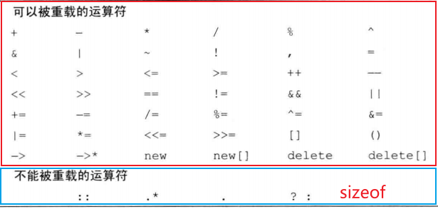

参考：

[C++11运算符重载详解与向量类重载实例](https://www.cnblogs.com/wanghongyang/p/15014326.html)

[C++运算符重载详解](https://blog.csdn.net/qq_52905520/article/details/127178512)

[C++ 运算符重载](https://blog.csdn.net/Mo3328679412/article/details/132754315)

[C++ 运算符重载详解](https://blog.csdn.net/afei__/article/details/82082003)

[C++的运算符重载](https://blog.csdn.net/jacket_/article/details/89714947)

[十个 C++ 运算符重载示例](https://blog.csdn.net/lu_embedded/article/details/121599696)

# 一、运算符重载定义

**运算符重载的定义**：C ++ 中预定义的运算符的操作对象只能是基本数据类型。但实际上，对于许多用户自定义类型（例如类），也需要类似的运算操作。这时就**必须在C ++ 中重新定义这些运算符，赋予已有运算符新的功能，使它能够用于特定类型执行特定的操作**。**运算符重载的实质是函数重载**，它提供了C ++ 的可扩展性，也是C ++ 最吸引人的特性之一。

**运算符重载的规则：**

* 1）除了类属关系运算符 `.` 、成员指针运算符 `.*` 、作用域运算符 `:: ` 、`sizeof` 运算符和三目运算符 `?:` 以外，C ++ 中的所有运算符都可以重载。



* 2）重载运算符限制在C ++ 语言中已有的运算符范围内的允许重载的运算符之中，不能创建新的运算符。
* 3）运算符重载实质上是函数重载，因此编译程序对运算符重载的选择，遵循函数重载的选择原则。
* 4）**重载之后的运算符不能改变运算符的优先级和结合性，也不能改变运算符操作数的个数及语法结构。**
* 5）运算符重载不能改变该运算符用于内部类型对象的含义。它只能和用户自定义类型的对象一起使用，或者用于用户自定义类型的对象和内部类型的对象混合使用时。
* 6）**运算符重载是针对新类型数据的实际需要对原有运算符进行的适当的改造，重载的功能应当与原有功能相类似，避免没有目的地使用重载运算符**。

总之，当 C++ 语言原来的一个运算符被重载之后，它原来所具有的语义并没有消失，只是相当于针对一个特定的类定义了一个新的运算符。

**运算符重载的语法格式：**

```cpp
// 1. 成员函数重载	
返回值类型 operator 运算符(参数)
{
	函数体;
}

// 2. 友元函数重载
friend 返回值类型 operator 运算符(参数)
{
	函数体;
}
```

***

**运算符重载的形式**：运算符重载可以**使用成员函数和友元函数**两种形式，具体使用哪种方式取决于实际情况，可以参考以下经验：

* 1）**只能使用成员函数重载的运算符有：`=`、`()`、`[]`、`->`、`new`、`delete`。**
* 2）**单目运算符最好重载为类的成员函数（`++`，`--`、`++(int)`、`--(int)`），双目运算符最好重载为类的友元函数**。
* 3）**对于复合的赋值运算符，如`+=`、 `-=`、 `*=`、 `/=`、 `&=`、 `!=`、 `~=`、 `%=`、 `>>=`、 `<<=`，建议重载成员函数。**
* 4）**对于其他运算符最好重载友元函数（+，-，*，\，%、==、!=、<、<=、>、>=）**。
* 5）**不建议重载逻辑与运算符`&`、逻辑或运算符`|`、逗号运算符`,`**，因为这三个运算符的运算对象对象的求值顺序无法保留下来。**对于 `&&` 和 `||` 这两个运算符也不建议重载**，对于  `&&` 和 `||` 是有短路的，即 `&&` 前面为假时，后面将不会计算了，同理 `||` 前面为真时也将跳过后面的计算。**但是如果是重载了这两个运算符，则会失去短路效果**。对于逗号运算符 `,` 和取地址运算符 `&` 在 C++ 中已经定义了这两种运算符用于类类型对象时的特殊含义，因此**逗号运算符 `,` 和取地址运算符 `&` 不应该被重载**，否则它们的行为就会异于常态，从而导致类的用户无法适应。

<font color=alice>除了赋值运算符外，基类的其他运算符函数都可以由派生类继承，并且派生类还可以有选择地重载自己所需要的运算符（包括基类重载的运算符）。</font>

**运算符重载的实质就是函数重载**。在实现过程中，首先把指定的运算表达式转化为对运算符函数的调用，运算对象转化为运算符函数的实参，然后根据实参的类型确定需要调用的函数，**这个过程是在编译阶段完成的**。


# 二、运算符分类

