- [1.1 std::unique\_ptr](#11-stdunique_ptr)
  - [shared\_ptr 和 unique\_ptr 都支持的操作](#shared_ptr-和-unique_ptr-都支持的操作)
  - [unique\_ptr 操作](#unique_ptr-操作)
  - [使用类模板实现一个 std::unique\_ptr 类](#使用类模板实现一个-stdunique_ptr-类)
- [1.2 std::shared\_ptr](#12-stdshared_ptr)
  - [概念及其特性](#概念及其特性)
  - [shared\_ptr 独有的操作](#shared_ptr-独有的操作)
  - [智能指针陷阱](#智能指针陷阱)
  - [内存模型](#内存模型)
    - [new 与 make\_shared 在内存上的区别](#new-与-make_shared-在内存上的区别)
  - [循环引用](#循环引用)
  - [普通的 shared\_ptr 仿写](#普通的-shared_ptr-仿写)
  - [带 weak\_ptr 的 shared\_ptr 的仿写](#带-weak_ptr-的-shared_ptr-的仿写)
- [1.3 std::weak\_ptr](#13-stdweak_ptr)
    - [1.3.1 解决循环引用问题](#131-解决循环引用问题)
    - [1.3.2 缓存实现](#132-缓存实现)
    - [1.3.3 观察者模式](#133-观察者模式)
- [1.4 std::auto\_ptr（已弃用）](#14-stdauto_ptr已弃用)

https://blog.csdn.net/K346K346/article/details/81478223

https://blog.csdn.net/cat_fish_rain/article/details/131271337

https://blog.csdn.net/qq_56673429/article/details/124837626

https://blog.csdn.net/cpp_learner/article/details/118912592

C++ 中有四种主要的智能指针，它们分别是 `std::unique_ptr`、`std::shared_ptr`、`std::weak_ptr` 和 `std::auto_ptr`。其中，`std::auto_ptr` 已被 C++11 标准弃用，实际应用中主要使用前面三种智能指针。

> [C++ 智能指针unique_ptr、shared_ptr、weak_ptr详解（包含代码示例）](https://blog.csdn.net/weixin_44046545/article/details/139034307)、[知乎：C++11智能指针](https://zhuanlan.zhihu.com/p/670068158)

# 1.1 std::unique_ptr

## shared_ptr 和 unique_ptr 都支持的操作

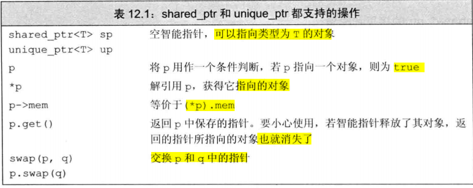

> 图片引用：[为什么unique的拷贝构造函数和复制函数被delete了](https://blog.csdn.net/lusic01/article/details/134735801)、[C++11中的智能指针unique_ptr、shared_ptr和weak_ptr详解](https://blog.csdn.net/chenlycly/article/details/130918547)

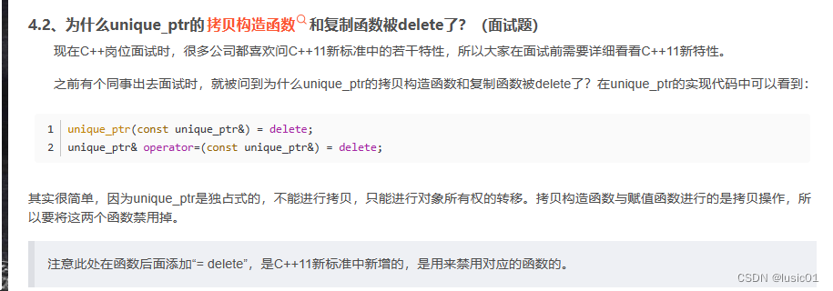

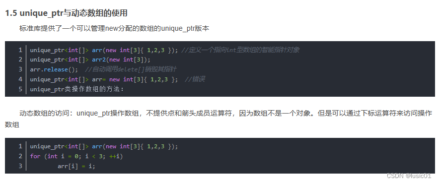

- **概念**: `std::unique_ptr` 是独占所有权的智能指针，即一个 `std::unique_ptr` 对象只能拥有一个指针的所有权，不能共享所有权。
- **特性**:
  - 不可复制（没有拷贝构造函数和拷贝赋值运算符）。
  - 可以移动（支持移动构造函数和移动赋值运算符）。
  - 适合用于单独管理资源的场景。
- **使用场景**:
  - 用于需要明确单一所有权的资源管理。
  - 适用于动态分配的对象（如在堆上分配内存）不需要共享资源的场景。

```cpp
// 直接使用 new 进行创建，指向一个动态分配的 int
std::unique_ptr<int> p1(new int(10));  // 独占一个 int 指针
std::unique_ptr<int> p2 = std::move(p1);  // p1 的所有权转移给 p2

// C++14 引入了 std::make_unique，这是创建 std::unique_ptr 的推荐方式，因为它可以避免一些潜在的内存泄漏问题。
std::unique_ptr<int> ptr = std::make_unique<int>(10);  // 更安全的创建方式

// 可以自定义删除器，用于定制资源释放问题
std::unique_ptr<FILE, decltype(&fclose)> filePtr(fopen("file.txt", "r"), &fclose);
```

## unique_ptr 操作

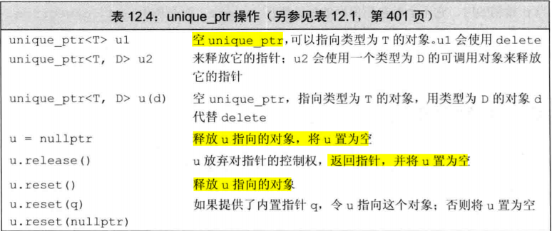

## 使用类模板实现一个 std::unique_ptr 类

```cpp
template <typename T>
class UniquePtr {
 public:
  // 构造函数，接受一个原生指针
  explicit UniquePtr(T* ptr = nullptr) : ptr_(ptr) {}

  // 禁用拷贝构造函数
  UniquePtr(const UniquePtr&) = delete;

  // 禁用拷贝赋值运算符
  UniquePtr& operator=(const UniquePtr&) = delete;

  // 实现移动构造函数
  UniquePtr(UniquePtr&& other) noexcept : ptr_(other.ptr_) {
    other.ptr_ = nullptr;
  }

  // 实现移动赋值运算符
  UniquePtr& operator=(UniquePtr&& other) noexcept {
    if (this != &other) {
      delete ptr_;
      ptr_ = other.ptr_;
      other.ptr_ = nullptr;
    }
    return *this;
  }

  // 重载 * 操作符
  T& operator*() const { return *ptr_; }

  // 重载 -> 操作符
  T* operator->() const { return ptr_; }

  // 判断是否为空
  bool operator bool() const { return ptr_ != nullptr; }

  // 释放控制的指针并返回
  T* release() {
    T* temp = ptr_;
    ptr_ = nullptr;
    return temp;
  }

  // 交换指针
  void swap(UniquePtr& other) noexcept { std::swap(ptr_, other.ptr_); }

  // 重置指针
  void reset(T* ptr = nullptr) {
    delete ptr_;
    ptr_ = ptr;
  }

  // 析构函数，释放资源
  ~UniquePtr() { delete ptr_; }

 private:
  T* ptr_;
};
```


# 1.2 std::shared_ptr

## 概念及其特性

> [C++ 智能指针 shared_ptr 详解与示例](https://blog.csdn.net/shaosunrise/article/details/85228823)

**概念：**

* `std::shared_ptr` 是具有共享所有权的智能指针，多个 `std::shared_ptr` 对象可以指向同一个对象，并共享该对象的所有权。当最后一个 `std::shared_ptr` 对象销毁时，指向的对象才会被释放。

**特性**:

- 支持引用计数，跟踪指向同一对象的智能指针的数量。
- 资源在最后一个 `std::shared_ptr` 被销毁时自动释放。

**使用场景**:

- 适用于多个对象或函数共享同一个资源的场景。
- 需要确保资源在不再需要时自动释放。

由于 shared_ptr 的构造函数是 explicit (显示初始化的)，因此**不能将一个内置指针隐式转换为一个智能指针，必须使用直接初始化（将指针/内存作为构造函数的参数进行初始化）。**1. 将new 申请的内存作为构造函数的参数进行初始化；2. 也可以不使用 new 进行申请内存，但是需要自定义删除器。

```cpp
// 使用使用 new 进行创建
srd::shared_ptr<int> p1 = new int(10); // 错误：必须使用直接初始化形式
// 使用 new 会进行两次内存分配，第一次是分配给对象，第二次是分配控制块内存（存储引用计数、弱引用计数等）
std::shared_ptr<int> p1(new int(10));  // 正确：使用了直接初始化形式。创建一个 shared_ptr
std::shared_ptr<int> p2 = p1;  // p1 和 p2 共享所有权

// std::make_shared 是创建 std::shared_ptr 的推荐方式，因为它能更高效地分配内存，减少内存分配次数。
std::shared_ptr<int> ptr = std::make_shared<int>(10);  // 更高效的创建方式

// std::shared_ptr 可以被复制，共享同一对象的所有权
std::shared_ptr<int> ptr1 = std::make_shared<int>(10);
std::shared_ptr<int> ptr2 = ptr1;  // ptr2 和 ptr1 共享同一对象

// 自定义删除器
std::shared_ptr<FILE> filePtr(fopen("file.txt", "r"), fclose);
```

**shared_ptr 的出现：**

* **使用裸指针来管理堆对象（动态内存）是及其容易出现问题的**。<font color=alice>如：忘记释放内存造成的内存泄露、尚有指针引用内存的情况下释放了该内存等等的问题。</font>
* 为了能够更加智能地保留或者释放堆（动态）对象，标准库以及 boost 库提供了智能指针。智能指针负责自己释放所指向的对象。智能指针的使用和普通指针类型，解引用一个智能指针返回它所指的对象。
* **shared_ptr：允许多个指针指向同一个对象。**

## shared_ptr 独有的操作

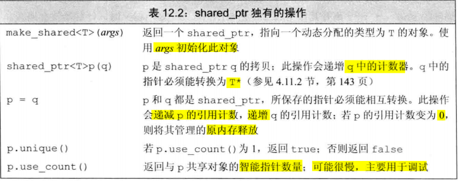

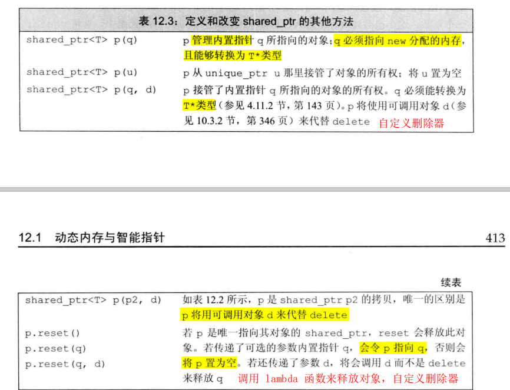

## 智能指针陷阱

智能指针可以提供对动态分配的内存安全而又方便的管理，但是需要进行正确的使用，以下有几点规范：

* 1）不使用相同的内置指针（new 申请的内存）初始化（或者 reset）多个智能指针。
* 2）不直接使用 delete 掉 get() 返回的指针。
* 3）如果使用了 get() 返回的指针，那么当最后一个指针销毁后，该指针就指向无效内存了，没有使用意义了。
* 4）**若智能指针管理的资源不是 new 进行申请的内存，则需要指定删除器**。

```cpp
// 自定义删除器
std::shared_ptr<FILE> sptr(fopen("test_file.txt", "w"), [](FILE* fp) {
    std::cout << "close " << fp << std::endl;
    fclose(fp);
```


## 内存模型

> [【C++】shared_ptr共享型智能指针详解](https://blog.csdn.net/qq_38410730/article/details/105788724)、这个要好看看：[C++：shared_ptr内存布局](https://blog.csdn.net/qq_34999565/article/details/123157285)、[现代 C++：一文读懂智能指针](https://zhuanlan.zhihu.com/p/150555165)

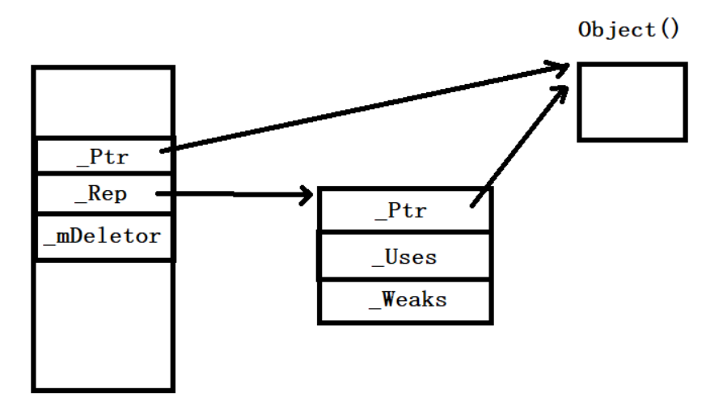

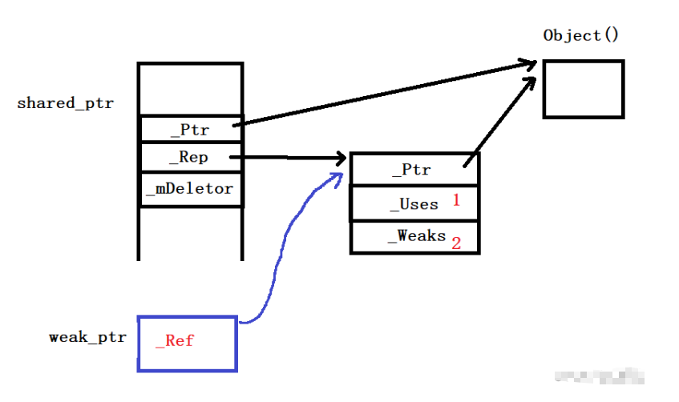

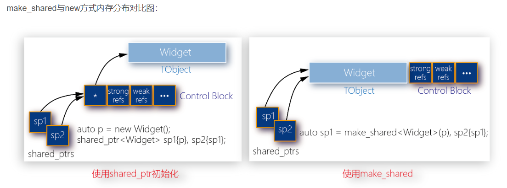

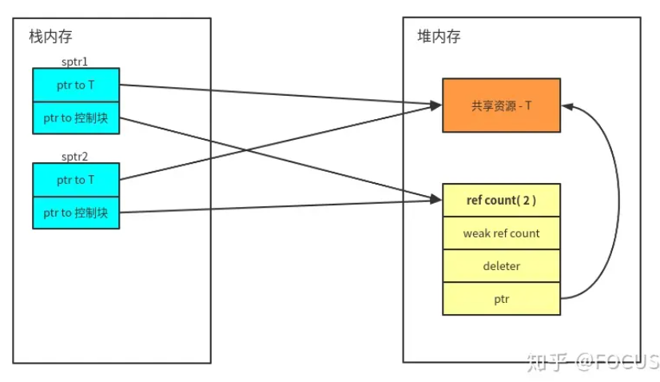

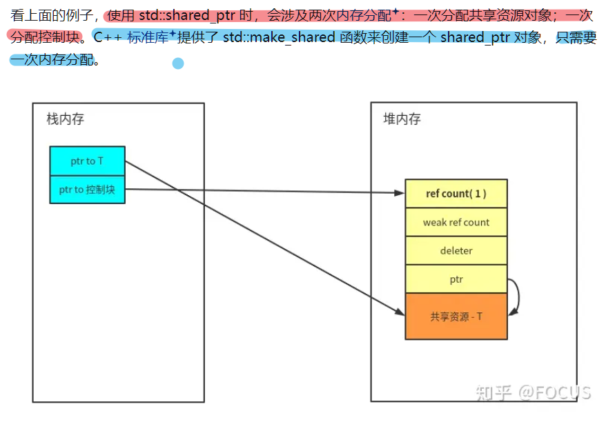

make系列函数的局限：

1. 所有的make系列函数都不允许自定义删除器；
2. make系列函数创建对象时，不能接受{}初始化列表(这是因为完美转发的转发函数是个模板函数，它利用模板类型进行推导。因此无法将{}推导为initializer_list)。换言之，make系列只能将圆括号内的形参完美转发；
3. 自定义内存管理的类(如重载了operator new和operator delete)，不建议使用make_shared来创建。因为：重载operator new和operator delete时，往往用来分配和释放该类精确尺寸(sizeof(T))的内存块；而make_shared创建的shared_ptr，是一个自定义了分配器(std::allocate_shared)和删除器的智能指针，由allocate_shared分配的内存大小也不等于上述的尺寸，而是在此基础上加上控制块的大小；
4. 对象的内存可能无法及时回收。因为 make_shared 只分配一次内存，减少了内存分配的开销，使得控制块和托管对象在同一内存块上分配。而控制块是由shared_ptr和weak_ptr共享的，因此两者共同管理着这个内存块(托管对象+控制块)。当强引用计数为0时，托管对象被析构(即析构函数被调用)，但内存块并未被回收，只有等到最后一个weak_ptr离开作用域时，弱引用也减为0才会释放这块内存块。原本强引用减为0时就可以释放的内存, 现在变为了强引用和弱引用都减为0时才能释放, 意外的延迟了内存释放的时间。这对于内存要求高的场景来说, 是一个需要注意的问题。

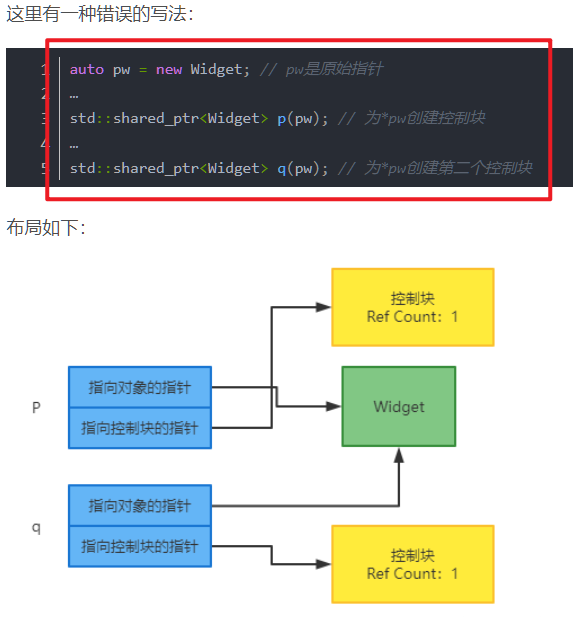

### new 与 make_shared 在内存上的区别

```cpp
/* 使用 new 初始化 shared_ptr 回进行两次内存分配，第一次首先在堆上为内存分配一块内存，然后再在堆上创建一个智能指针控制块，这两块内存不是连续的，会造成内存碎片化 */
std::shared_ptr<int> p1(new int(10)); 

/* 只需进行一次内存分配，将对象内存与智能指针控制块合并为一块连续的内存，减少内存碎片和分配开销 */
/* 分配一块内存的步骤是：先分配内存，然后使用构造函数对分配内存进行构造，构造完毕才能使用 */
std::shared_ptr<int> ptr = std::make_shared<int>(10);
```

**使用 new 进行初始化的内存布局：**

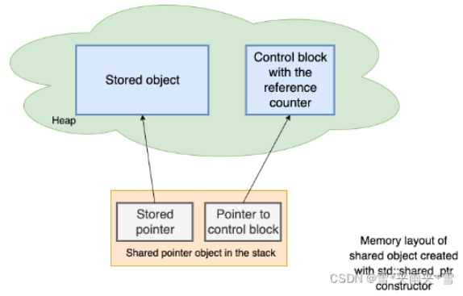

**使用 make_shared 进行初始化的内存布局：**

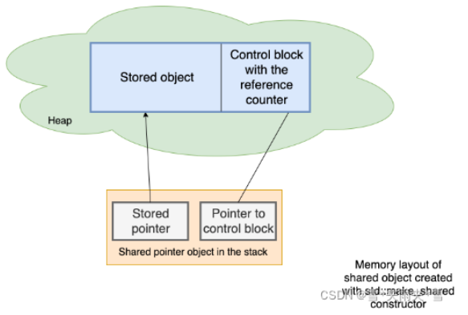

## 循环引用

> [shared_ptr循环引用问题以及解决方法](https://blog.csdn.net/qq_21539375/article/details/125020258)、[shared_ptr和weak_ptr以及循环引用问题](https://www.cnblogs.com/jialin0x7c9/p/12218645.html)、[智能指针面试题：使用weak_ptr解决循环引用无法析构的问题](https://blog.csdn.net/m0_56257585/article/details/123983853)

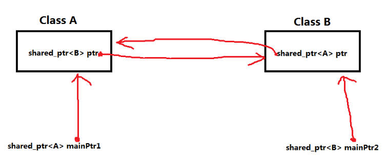

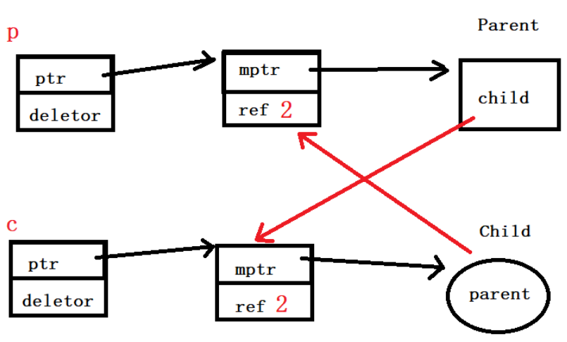

```cpp
#include <iostream>
#include <memory>

class B; // 先声明 B

class A {
public:
    std::shared_ptr<B> b_ptr;
    ~A() {
        std::cout << "A destroyed\n";
    }
};

class B {
public:
    std::shared_ptr<A> a_ptr;
    // std::weak_ptr<A> a_ptr;  // 这里使用 weak_ptr 避免循环引用
    ~B() {
        std::cout << "B destroyed\n";
    }
};

int main() {
    {
        auto a = std::make_shared<A>();
        auto b = std::make_shared<B>();
        a->b_ptr = b;
        b->a_ptr = a;
        // 此时 a 和 b 相互引用，形成循环
        // 使用 weak_ptr<T>：此时 a 和 b 相互引用，但不形成循环，因为使用了 weak_ptr
    }
    // 此处 a 和 b 应该被销毁，但由于循环引用，析构函数不会被调用
    // 使用 weak_ptr<T>：此处 a 和 b 正常被销毁，避免了循环引用导致的内存泄漏
    std::cout << "End of main\n";
}
```

## 普通的 shared_ptr 仿写

> [C++：共享型智能指针](https://blog.csdn.net/m0_56257585/article/details/123952266)

使用类模板实现一个 `std::shared_ptr` 类：

```cpp
template <typename T>
class SharedPtr {
 public:
  // 构造函数，接受一个原生指针
  explicit SharedPtr(T* ptr = nullptr) : ptr_(ptr) {
    if (ptr_) {
      ref_count_ = new size_t(1);
    }
  }

  // 拷贝构造函数
  SharedPtr(const SharedPtr& other)
      : ptr_(other.ptr_), ref_count_(other.ref_count_) {
    if (ptr_) {
      ++(*ref_count_);
    }
  }

  // 拷贝赋值运算符
  SharedPtr& operator=(const SharedPtr& other) {
    if (this != &other) {
      release();
      ptr_ = other.ptr_;
      ref_count_ = other.ref_count_;
      if (ptr_) {
        ++(*ref_count_);
      }
    }
    return *this;
  }

  // 移动构造函数
  SharedPtr(SharedPtr&& other) noexcept
      : ptr_(other.ptr_), ref_count_(other.ref_count_) {
    other.ptr_ = nullptr;
    other.ref_count_ = nullptr;
  }

  // 移动赋值运算符
  SharedPtr& operator=(SharedPtr&& other) noexcept {
    if (this != &other) {
      release();
      ptr_ = other.ptr_;
      ref_count_ = other.ref_count_;
      other.ptr_ = nullptr;
      other.ref_count_ = nullptr;
    }
    return *this;
  }

  // 重载 * 操作符
  T& operator*() const { return *ptr_; }

  // 重载 -> 操作符
  T* operator->() const { return ptr_; }

  // 获取引用计数
  size_t use_count() const { return ref_count_ ? *ref_count_ : 0; }

  // 判断是否为空
  bool operator bool() const { return ptr_ != nullptr; }

  // 析构函数，释放资源
  ~SharedPtr() { release(); }

 private:
  void release() {
    if (ref_count_ && --(*ref_count_) == 0) {
      delete ptr_;
      delete ref_count_;
    }
  }

  T* ptr_ = nullptr;
  size_t* ref_count_ = nullptr;
};
```

## 带 weak_ptr 的 shared_ptr 的仿写

> [C++：模拟实现带weak_ptr的shared_ptr](https://blog.csdn.net/m0_56257585/article/details/123968037)

```cpp
#include <functional>  // For std::function
#include <iostream>
#include <utility>  // For std::move and std::swap

template <typename T>
class SharedPtr {
 public:
  // 构造函数，默认构造空指针
  explicit SharedPtr(T* ptr = nullptr)
      : ptr_(ptr), control_block_(ptr ? new ControlBlock(ptr) : nullptr) {}

  // 带自定义删除器的构造函数
  template <typename Deleter>
  SharedPtr(T* ptr, Deleter del)
      : ptr_(ptr), control_block_(new ControlBlock(ptr, std::move(del))) {}

  // 拷贝构造函数
  SharedPtr(const SharedPtr& other)
      : ptr_(other.ptr_), control_block_(other.control_block_) {
    if (control_block_) {
      control_block_->add_ref();
    }
  }

  // 拷贝赋值运算符
  SharedPtr& operator=(const SharedPtr& other) {
    if (this != &other) {
      release();
      ptr_ = other.ptr_;
      control_block_ = other.control_block_;
      if (control_block_) {
        control_block_->add_ref();
      }
    }
    return *this;
  }

  // 移动构造函数
  SharedPtr(SharedPtr&& other) noexcept
      : ptr_(other.ptr_), control_block_(other.control_block_) {
    other.ptr_ = nullptr;
    other.control_block_ = nullptr;
  }

  // 移动赋值运算符
  SharedPtr& operator=(SharedPtr&& other) noexcept {
    if (this != &other) {
      release();
      ptr_ = other.ptr_;
      control_block_ = other.control_block_;
      other.ptr_ = nullptr;
      other.control_block_ = nullptr;
    }
    return *this;
  }

  // 析构函数
  ~SharedPtr() { release(); }

  // 重载 * 操作符
  T& operator*() const { return *ptr_; }

  // 重载 -> 操作符
  T* operator->() const { return ptr_; }

  // 返回内部指针
  T* get() const { return ptr_; }

  // 获取当前引用计数
  size_t use_count() const {
    return control_block_ ? control_block_->get_ref_count() : 0;
  }

  // 判断指针是否为空
  explicit operator bool() const { return ptr_ != nullptr; }

  // 交换两个 shared_ptr 对象
  void swap(SharedPtr& other) noexcept {
    std::swap(ptr_, other.ptr_);
    std::swap(control_block_, other.control_block_);
  }

  // 重置指针，并更新管理的对象
  void reset(T* ptr = nullptr) {
    release();
    if (ptr) {
      ptr_ = ptr;
      control_block_ = new ControlBlock(ptr);
    }
  }

  // 重置指针并使用自定义删除器
  template <typename Deleter>
  void reset(T* ptr, Deleter del) {
    release();
    if (ptr) {
      ptr_ = ptr;
      control_block_ = new ControlBlock(ptr, std::move(del));
    }
  }

 private:
  // 控制块结构，负责引用计数和删除管理
  struct ControlBlock {
    T* ptr_;
    size_t ref_count_;
    std::function<void(T*)> deleter_;

    // 默认构造
    explicit ControlBlock(T* ptr)
        : ptr_(ptr), ref_count_(1), deleter_([](T* ptr) { delete ptr; }) {}

    // 自定义删除器的构造
    template <typename Deleter>
    ControlBlock(T* ptr, Deleter del)
        : ptr_(ptr), ref_count_(1), deleter_(std::move(del)) {}

    void add_ref() { ++ref_count_; }

    void release_ref() {
      if (--ref_count_ == 0) {
        deleter_(ptr_);
        delete this;
      }
    }

    size_t get_ref_count() const { return ref_count_; }
  };

  T* ptr_ = nullptr;                       // 管理的对象指针
  ControlBlock* control_block_ = nullptr;  // 控制块指针

  // 释放当前管理的对象
  void release() {
    if (control_block_) {
      control_block_->release_ref();
    }
    ptr_ = nullptr;
    control_block_ = nullptr;
  }
};

// 测试代码
int main() {
  // 使用默认删除器的 shared_ptr
  SharedPtr<int> sp1(new int(42));
  std::cout << "sp1 use count: " << sp1.use_count() << std::endl;
  std::cout << "sp1 value: " << *sp1 << std::endl;

  // 拷贝构造 shared_ptr
  SharedPtr<int> sp2 = sp1;
  std::cout << "sp1 use count: " << sp1.use_count() << std::endl;
  std::cout << "sp2 use count: " << sp2.use_count() << std::endl;

  // 使用自定义删除器的 shared_ptr
  SharedPtr<int> sp3(new int(100), [](int* ptr) {
    std::cout << "Custom deleter called for " << *ptr << std::endl;
    delete ptr;
  });
  std::cout << "sp3 value: " << *sp3 << std::endl;

  // 移动构造 shared_ptr
  SharedPtr<int> sp4 = std::move(sp3);
  std::cout << "sp4 value: " << *sp4 << std::endl;

  return 0;
}
```


# 1.3 std::weak_ptr

> [【C++】weak_ptr弱引用智能指针详解](https://blog.csdn.net/qq_38410730/article/details/105903979)

weak_ptr 是一种不控制所指向对象生存期的智能指针，它指向一个由 shared_ptr 所管理的对象。将一个 weak_ptr 绑定到一个 shared_ptr 不会改变 shared_ptr  的引用计数。一旦最后一个指向对象的 shared_ptr 被销毁，对象就会被释放。即使有 weak_ptr 指向对象，对象也还是会被释放，因此 weaK_ptr 为弱引用指针。

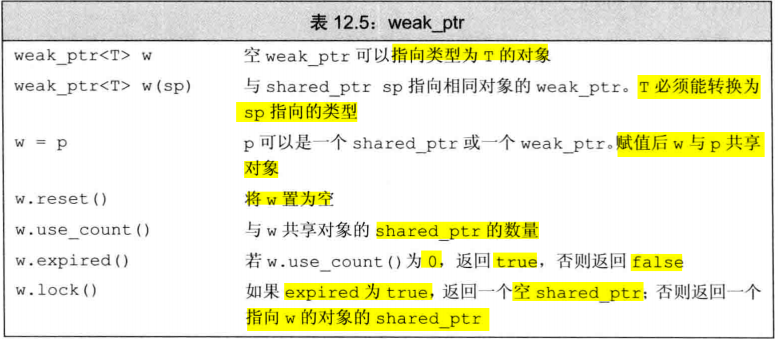

**概念**: 

* `std::weak_ptr` 是**一种不参与对象所有权计数的智能指针，常用于打破 `std::shared_ptr` 之间的循环引用**。<font color=blue>它不影响对象的生命周期，但可以检测对象是否已经被释放。</font>

**特性**:

- 不增加对象的引用计数。
- 用于解决循环引用问题。
- 必须通过 `std::shared_ptr` 来创建 `std::weak_ptr`。

**使用场景**:

- 用于需要从共享资源中获取非所有权的引用。
- 防止 `std::shared_ptr` 之间的循环引用导致内存泄漏。

由于指向的对象有可能不存在，**因此不能直接使用 weak_ptr 直接访问对象，使用 `lock()` 来检查对象是否存在**。若存在则返回一个指向共享对象的 shared_ptr，否则就返回一个空的 shared_ptr。

```cpp
// std::weak_ptr 通常由 std::shared_ptr 创建，它不会增加引用计数。
std::shared_ptr<int> sharedPtr = std::make_shared<int>(10);
std::weak_ptr<int> weakPtr = sharedPtr;  // 由 sharedPtr 创建 weakPtr

std::shared_ptr<int> p1(new int(10));
std::weak_ptr<int> p2(p1);  // p2 弱引用 p1 的对象

// std::weak_ptr 可以通过 lock 方法创建一个 std::shared_ptr，如果原对象还存在，则返回一个有效的 std::shared_ptr，否则返回一个空指针。
if (auto sp = p2.lock()) {
    // 使用 sp 访问对象
} else {
    // 对象已被释放
}
```

`std::weak_ptr` 是 C++ 标准库中的一个智能指针，它是为了解决 `std::shared_ptr` 可能引起的循环引用问题而设计的。`std::weak_ptr` 不控制它所指向对象的生命周期，而是提供一种访问由 `std::shared_ptr` 管理的对象的方式，但不增加对象的引用计数。以下是几种典型的 `std::weak_ptr` 使用场景：

### 1.3.1 解决循环引用问题

当两个对象通过 `std::shared_ptr` 相互引用时，会创建循环引用，导致内存泄漏，因为它们的引用计数永远不会达到零，所以不会被自动释放。使用 `std::weak_ptr` 可以打破这种循环：

```cpp
class A;
class B;

class A {
public:
    std::shared_ptr<B> b_ptr;
    ~A() { std::cout << "A destroyed\n"; }
};

class B {
public:
    std::weak_ptr<A> a_ptr;  // 使用 weak_ptr 而不是 shared_ptr
    ~B() { std::cout << "B destroyed\n"; }
};

int main() {
    auto a = std::make_shared<A>();
    auto b = std::make_shared<B>();
    a->b_ptr = b;
    b->a_ptr = a;
}
```

在这个例子中，`B` 类使用 `std::weak_ptr` 指向 `A` 的实例，这样即使 `A` 和 `B` 相互引用，`A` 的实例也可以被正确销毁，从而避免内存泄漏。

### 1.3.2 缓存实现

在实现缓存时，对象经常被创建和删除。使用 `std::weak_ptr` 可以在缓存中保存一个对象的非拥有引用，如果对象仍然存在，则可以通过转换为 `std::shared_ptr` 访问它，如果对象已被删除，则 `std::weak_ptr` 会自动为空：

```cpp
std::map<Key, std::weak_ptr<Value>> cache;

std::shared_ptr<Value> getValue(Key key) {
    if (auto found = cache.find(key); found != cache.end()) {
        if (auto value_ptr = found->second.lock()) {  // 尝试从 weak_ptr 获得一个 shared_ptr
            return value_ptr;
        }
    }
    // 如果不存在或者已经被销毁，则重新加载
    auto new_value = std::make_shared<Value>(loadValueForKey(key));
    cache[key] = new_value;
    return new_value;
}
```

在这种场景中，使用 `std::weak_ptr` 可以避免缓存保持对象的所有权，从而防止阻止对象被销毁。

### 1.3.3 观察者模式

在观察者模式中，可以使用 `std::weak_ptr` 来观察但不控制对象。这样当被观察的对象不存在时，观察者可以安全地了解到并作出相应的调整：

```cpp
class Observer {
public:
    virtual void notify() = 0;
};

class Observable {
private:
    std::vector<std::weak_ptr<Observer>> observers;

public:
    void registerObserver(std::shared_ptr<Observer> observer) {
        observers.push_back(observer);
    }

    void notifyObservers() {
        for (auto it = observers.begin(); it != observers.end(); ) {
            if (auto obs_ptr = it->lock()) {
                obs_ptr->notify();
                ++it;
            } else {
                it = observers.erase(it);  // 清除不存在的观察者
            }
        }
    }
};
```

在这个例子中，`Observable` 类不会延长其观察者的生命期，如果一个观察者被销毁，其对应的 `std::weak_ptr` 会自动变为空，可以从观察者列表中移除。

这些场景展示了 `std::weak_ptr` 在管理内存、避免循环引用和在没有所有权的情况下安全地访问对象时的用途。

# 1.4 std::auto_ptr（已弃用）

**概念**:

* `std::auto_ptr` 是 C++98 标准中的智能指针，但已在 C++11 中弃用，并被 `std::unique_ptr` 取代。它会自动管理指针的生命周期，确保指针在离开作用域时释放资源。

**特性**:

- 支持拷贝，但拷贝时会转移所有权，这导致两个 `std::auto_ptr` 不能同时拥有同一个对象。
- 存在较多缺陷和不安全性，因此被弃用。

**使用场景**:

- 曾用于简单的资源管理，但已被更安全、更灵活的 `std::unique_ptr` 取代。

```cpp
std::auto_ptr<int> p1(new int(10));  // 不建议使用
std::auto_ptr<int> p2 = p1;  // p1 的所有权转移给 p2
```


