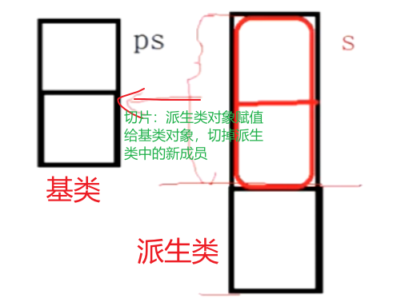
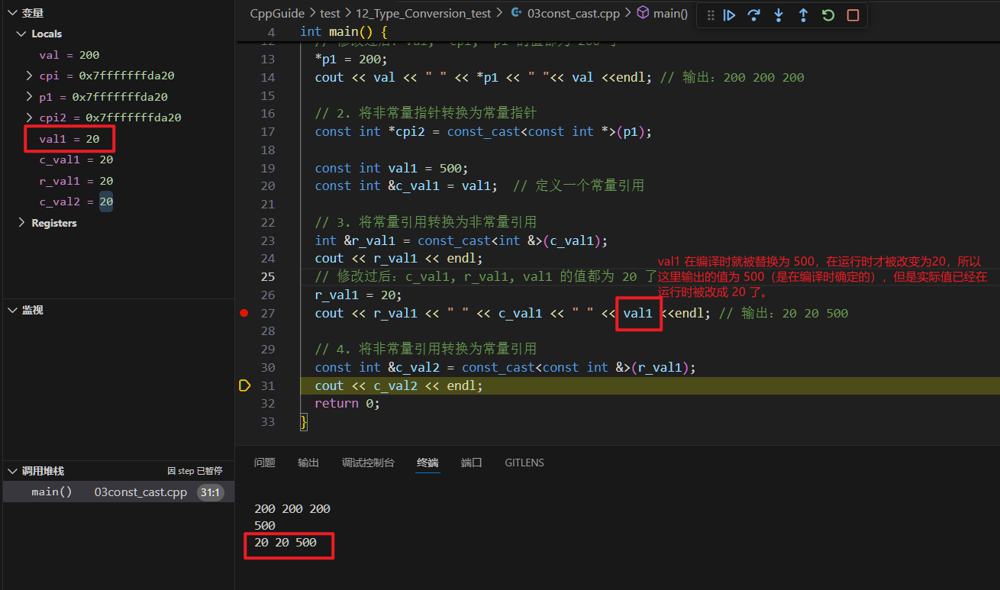

- [前言](#前言)
- [一、static\_cast 静态转换](#一static_cast-静态转换)
- [二、dynamic\_cast 动态转换](#二dynamic_cast-动态转换)
- [三、const\_cast 常量转换](#三const_cast-常量转换)
- [四、reinterpret\_cast 不相关类型的转换](#四reinterpret_cast-不相关类型的转换)
- [五、C 风格类型转换](#五c-风格类型转换)
- [六、总结](#六总结)

主要参考：[static_cast和dynamic_cast详解](https://blog.csdn.net/u014624623/article/details/79837849)、[C++中的四种强制类型转换符详解](https://www.cnblogs.com/linuxAndMcu/p/10387829.html)

其他博客，有时间再补充吧：[1. C++四种强制类型转换](https://blog.csdn.net/u_hcy2000/article/details/122470469)、有面试题：[2. C++的四种强制类型转换](https://blog.csdn.net/bit_zyx/article/details/127816591)、[【C++】四种强制类型转换](https://blog.csdn.net/Bob__yuan/article/details/88044361)、[深入理解C++中五种强制类型转换的使用场景](https://blog.csdn.net/weixin_43798887/article/details/118424172)、[c++ 四种强制类型转换介绍](https://blog.csdn.net/ydar95/article/details/69822540)、[3. C++四种强制转换](https://blog.csdn.net/daaikuaichuan/article/details/79476501)

# 前言

C++ 既支持 C 风格的类型转换，又有自己风格的类型转换。C 风格的转换格式很简单，但是有不少缺点：

* 1）**转换太过随意，可以在任意类型之间转换**。可以把一个指向 const 对象的指针转换为指向非 const 对象的指针，可以把一个指向基类对象的指针转换为一个指向派生类对象的指针，这些转换之间的差距是非常巨大的，但是传统的 C 语言风格的类型转换没有区分这些。
* 2）**C 风格的转换没有统一的关键字和标识符**。对于大型系统，做代码排查时很容易遗漏和忽略。

C++ 风格完美的解决了上面两个问题：

* 1）**对类型转换做了细分，提供了四种不同类型的转换**，以支持不同需求的转换。
* 2）**类型转换有了统一的标识符，利于代码排查和检视**。

C++ 主要提供了四种类型转换操作符：`static_cast`、`dynamic_cast`、`const_cast` 和 `reinterpret_cast`，它们都是类模板。**格式均为 `xxx_cast<T> (expression)`，其中 `T` 表示要转换成什么类型，`expression` 表示被转换类型的目标变量**。

这些转换方式比 C 风格的强制类型转换（如 `(int)x`）更加安全和明确。

# 一、static_cast 静态转换

`static_cast` 用于执行显式类型转换，**但它在编译时执行检查**。有以下的使用场景：

* 1）**基本数据类型之间的转换**，<font color=alice>如把 int 转换为 char，这种转换带来的安全性问题由程序员来保证。</font>
* 2）在**有类型指针与 `void *` 之间转换**，如将 `void *` 转换为具体类型的指针。
* 3）用于类层次结构中**基类和派生类之间指针或引用的转换**。
  * **上行转换（派生类 => 基类）是安全的**。
  * **下行转换（基类 => 派生类）：由于没有动态类型检查，所以是不安全的**。



**使用特点：**

* 主要执行**非多态的转换操作**，用于代替 C 语言风格中通常的转换操作。
* **隐式转换都建议使用 `static_cast` 进行标明和替换**。
* 不能使用 `static_cast` 在**有类型指针（非 void *）**之间转换。如 `float*` 不能强制类型转换为 `int*`。

```cpp
#include <iostream>
using namespace std;

// 基类（父类）
class CBase {
 public:
  CBase() { cout << "CBase construct." << endl; }
  ~CBase() { cout << "CBase disconstruct." << endl; }
};

// 派生类(子类)
class CDerived : public CBase {
  public:
  CDerived() { cout << "CDerived construct." << endl; }
  ~CDerived() { cout << "CDerived disconstruct." << endl; }
};

int main() {
  // 1. 使用 static_cast 在基本数据类型之间进行转换
  float fval = 10.12;
  int ival = static_cast<int>(fval);  // float => int
  cout << ival << endl;               // output: 10

  // 2. 使用 static_cast 来有类型指针与 void * 之间转换
  int *intp = &ival;
  void *voidp = static_cast<void *>(intp);
  // cout << *voidp << endl; // 报错：void*
  // 的大小未知，不是一个指向对象的指针类型 由于 long 为 64
  // 位长整数，因此这里的转换会导致 *longp 被初始化为 long
  // 的最大值，因此不能这样进行转换 long *longp = static_cast<long *>(voidp);
  // cout << *longp << endl;

  unsigned *unsignedp = static_cast<unsigned *>(voidp);
  cout << *unsignedp << endl;  // output: 10

  // 3. 用于类层次结构中基类与派生类之间指针或引用的转换
  // 3.1 上行转换：派生类 => 基类 是安全的
  CDerived *d1 = nullptr;
  CBase *b1 = static_cast<CBase *>(d1);  // 派生类转换为基类

  // 3.2 下行转换：基类 => 派生类，由于没有动态类型转换，所以是不安全的
  CBase *b2 = nullptr;
  CDerived *d2 = static_cast<CDerived*>(b2);

  // 4. 不能使用 static_cast 来有类型指针（非 void *）之间进行转换
  float *floatp = &fval;
  // int *intp1 = static_cast<int *>(floatp);
  // cout << *intp1 << endl;
  cout << *floatp << endl;
  return 0;
}
```

# 二、dynamic_cast 动态转换

使用场景：**用于将一个基类指针/引用强制类型转换为派生类的指针/引用（向下转换）**。

**使用特点：**

* 1）**基类必须要有虚函数**，<font color=blue>因为 `dynamic_cast` 是运行时的类型检查，需要运行时的类型信息，而这个信息是存储在类的虚函数表中的。</font>
* 2）**对于下行转换（向下转换），`dynamic_cast` 是安全的**<font color=alice>（当类型不一致时，转换过来的是空指针），而 `static_cast` 是不安全的。</font>
* 3）<font color=blue>对指针进行 `dynamic_cast`，失败就会返回 `nullptr`，成功则返回正常 cast 后的对象指针；对引用进行 `dynamic_cast`，失败则抛出一个异常，成功则返回正常 cast 后的对象引用。</font>

`dynamic_cast` 主要用于多态类型（带有虚函数的类层次结构）之间的指针或引用转换。它可以在运行时检查转换是否安全，适合于从**基类指针或引用向下转换为派生类指针或引用**。**如果转换失败，会返回 `nullptr`（对于指针）或抛出 `bad_cast` 异常（对于引用）**。

```cpp
#include <iostream>

class Base {
 public:
  virtual void func() {}  // 必须有虚函数
};

class Derived : public Base {};

int main() {
  Base *base = new Derived();
  // 安全转换，成功，本质上还是派生类对象
  Derived *d1 = dynamic_cast<Derived *>(base);
  if (d1) {
    std::cout << "Cast successful." << std::endl;
  }

  Base *base2 = new Base();
  // Derived *d2 = (Derived*)base2; // 可以进行强转，但是是不安全的
  // 将基类使用 dynamic_cast 强转为派生类会失败，最后返回 nullptr
  Derived *d2 = dynamic_cast<Derived *>(base2);
  if (!d2) {
    std::cout << "Cast failed." << std::endl;
  }

  delete base;
  delete base2;
  return 0;
}
```

# 三、const_cast 常量转换

**`const_cast` 只能用于常量指针（或引用）与非常量指针（或引用）之间的转换。**

**使用特点：**

* `const_cast` 是四种类型转换符中**唯一可以对常量进行操作的转换符**。
* 去除常量性是一个危险的动作，应该尽量避免使用。

`const_cast` 主要用于在同类型的 `const` 和 `non-const` 对象之间进行转换。它**只能移除或添加 `const` 和 `volatile` 修饰符，通常用于需要在某些函数内修改常量值的场景**。



```cpp
#include <iostream>
using namespace std;

void func(const int *p) {
  int *modifiable = const_cast<int *>(p);  // 移除 const 属性
  *modifiable = 20;                        // 修改值
}

int main() {
  const int a = 10;
  func(&a);  // 虽然不推荐，但这是 const_cast 的用途之一
  // 输出编译时确定的值 10，但是实际运行时已经被改变为 20 了
  std::cout << a << std::endl;  // a 的值在未定义行为的情况下可能会改变

  int val = 100;
  // 定义一个常量指针
  const int *cpi = &val;
  // *cpi = 20; // 不通过常量指针来修改指向的值

  // 1. 将常量指针转换为非常量指针，然后就可以修改指针所指向变量的值了
  int *p1 = const_cast<int *>(cpi);
  // 修改过后：val, *cpi, *p1 的值都为 200 了
  *p1 = 200;
  cout << val << " " << *p1 << " " << val << endl;  // 输出：200 200 200

  // 2. 将非常量指针转换为常量指针
  const int *cpi2 = const_cast<const int *>(p1);

  const int val1 = 500;
  const int &c_val1 = val1;  // 定义一个常量引用

  // 3. 将常量引用转换为非常量引用
  int &r_val1 = const_cast<int &>(c_val1);
  cout << r_val1 << endl;
  // 修改过后：c_val1, r_val1, val1 的值都为 20 了
  r_val1 = 20;
  cout << r_val1 << " " << c_val1 << " " << val1 << endl;  // 输出：20 20 500

  // 4. 将非常量引用转换为常量引用
  const int &c_val2 = const_cast<const int &>(r_val1);
  cout << c_val2 << endl;
  return 0;
}
```


# 四、reinterpret_cast 不相关类型的转换

reinterpret 的英文含义表示**重新转换**的意思，就相当于是 **C 语言中的不相关类型的转换、强转**。

**使用场景：**

* **用于在任意指针（或引用）类型之间的转换。**
* ~~能够将整型转换为指针，也可以将指针转换为整型或数组。~~现在在 `g++9.4.0` 会报错，不让这样进行转换，**报错原因为：这样进行强制类型转换会导致精度丢失**。

**使用特点：**

* `reinterpret_cast` 是从底层对数据进行重新解释，依赖具体的平台，可移植性差。
* 不到万不得已，不要使用这个转换符，属于高危操作。

`reinterpret_cast` 是一种非常危险的类型转换**，允许在几乎所有类型之间进行转换，包括不相关类型的指针、整数与指针之间的转换**。<font color=alice>它不会进行任何检查或处理，只是**单纯地重解释位模式**。它通常用于底层的硬件接口编程或需要强制转换类型的特殊场景。</font>

```cpp
#include <iostream>
using namespace std;

int main() {
  int a = 65;
  // 1. 在任意指针（或引用）类型之间的转换
  char* p = reinterpret_cast<char*>(&a);  // int* 转 char*
  std::cout << "char = " << *p << std::endl; // 打印字符 'A'

  // double *pd = reinterpret_cast<double*>(&a);
  // std::cout << "double = " << *pd << std::endl; // 输出：-nan
  // 报错了：丢失精度 cast from ‘char*’ to ‘int’ loses precision
  // int b = reinterpret_cast<int>(p);  // char* 转 int
  // std::cout << b << std::endl;  // 打印指针值（通常为内存地址）

  int *pv = &a;
  // 现在编译器已经不让这样转换了，会导致精度丢失，因此会报错
  // int pvaddr = reinterpret_cast<int>(pv);
  // std::cout << "pvaddr = " << hex << pvaddr << std::endl;
  std::cout << "pv = " << pv << endl;
  return 0;
}
```


# 五、C 风格类型转换

C 风格的类型转换直接使用括号语法进行，如 `(Type)expression`。这种转换不区分 `static_cast`、`dynamic_cast`、`const_cast` 和 `reinterpret_cast`，因此更不安全，容易引发未定义行为。C++ 强烈建议使用上面的 C++ 风格转换。

```cpp
int main() {
    int a = 10;
    double b = (double)a; // C 风格的强制转换
    std::cout << b << std::endl;

    return 0;
}
```


# 六、总结

- `static_cast` 用于大部分类型安全的转换，适用于**普通的基础类型转换和继承结构中向上和向下转换**。
- `dynamic_cast` 用于在**多态类型中进行安全的向下转换**。
- `const_cast` 用于在 `const` 和 `non-const` 类型之间进行转换。
- `reinterpret_cast` 用于**进行不安全的低级别转换**。
- C 风格转换虽然方便但**不建议使用**，因为**它不具备类型安全性**。

了解这些转换的适用场景和限制，对于编写安全可靠的 C++ 程序非常重要。

