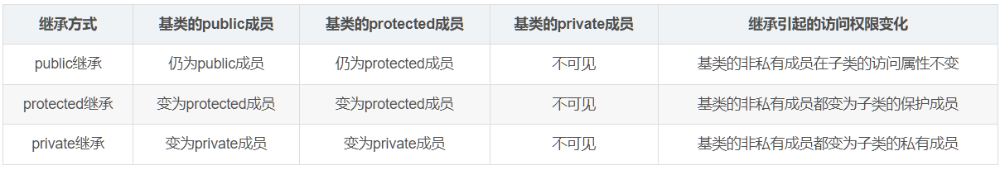

- [一、继承](#一继承)
  - [1.1 继承相关定义概述](#11-继承相关定义概述)
- [二、多态性](#二多态性)


https://blog.csdn.net/weixin_43793960/article/details/106322147

https://zhuanlan.zhihu.com/p/157102200


多态：

https://blog.csdn.net/qq_53558968/article/details/116886784

https://blog.csdn.net/bang___bang_/article/details/130851285

https://blog.csdn.net/qq_36359022/article/details/81870219


虚函数表：

https://www.cnblogs.com/yinbiao/p/10987640.html

https://coolshell.org/articles/12165.html

https://blog.csdn.net/dcrmg/article/details/83472660

https://blog.nowcoder.net/n/2c8789b37c034ccd9a490e7051594fbd


面试题：

https://blog.csdn.net/luolaihua2018/article/details/122358512


# 一、继承

参考：[基础篇：继承，多态和虚函数](https://zhuanlan.zhihu.com/p/157102200)、[C++ 继承(基类与派生类)详解附代码](https://blog.csdn.net/yn_zi/article/details/130039618)、、[C++总结（四）——继承与派生](https://blog.csdn.net/qq_43516875/article/details/129941180)

https://blog.csdn.net/weixin_45220863/article/details/125848676

https://blog.csdn.net/Qiao712/article/details/118119743

https://blog.csdn.net/Mr_Fmnwon/article/details/128448807

https://blog.csdn.net/weixin_43793960/article/details/106322147

## 1.1 继承相关定义概述

**定义**：继承是指在一个已存在类的基础上建立一个新类。已存在的类被称为基类（base class）或者父类，新建立的类被称为派生类（derived class）或者子类。

**继承性是面向对象程序设计最重要的特征之一**：

* 1）继承抽取了类之间的共同点，减少了代码冗余，是实现软件重用的重要手段，继承减少了代码冗余；
* 2）继承还是实现软件功能扩充的重要手段；
* 3）继承反映了类的层次结构，并支持对事物从一般到特殊的描述，这符合人的认知规律和行动准则。

***

**派生类继承基类的成员有：**

* 1）**所有数据成员，包括 static 静态数据成员变量**；
* 2）**除了基类的构造函数、析构函数之外的所有成员函数方法**；
* 3）**继承了基类的作用域，但是没有继承友元关系**；

***

**编写派生类的 4 个步骤：**

* 1）**吸收基类成员**，<font color=alice>除基类的构造函数、析构函数、运算符重载函数、友元函数外的所有成员函数和数据变量全都为派生类的成员。</font>
* 2）**改造基类成员**，主要包括两方面：一是依靠**派生类的继承方式（公有、保护、私有继承）**来控制访问基类成员的访问；二是**对基类数据成员或成员函数的同名覆盖**。<font color=alice>当派生类声明一个和某个基类成员同名的成员，派生类中的成员会屏蔽基类同名的成员，类似函数中的局部变量屏蔽全局变量。如果是成员函数，参数表和返回值完全一样时，称为同名覆盖（override），否则为重载。</font>**注意：静态函数不能被覆盖。**
* 3）**添加新成员**，添加新的成员变量和成员函数，以更适应派生类。
* 4）**重写派生类的构造函数和析构函数**，可以把基类的构造函数作为派生类构造函数的一部分或者调用基类的构造函数。

**语法如下：**

```cpp
class <派生类名> : [继承方式] <基类名>
{
	...
};
```


## 1.2 类的继承方式

参考：[public、private、protected的区别](https://blog.csdn.net/weixin_50849959/article/details/116595077)、[C++中关于public、protect、private的访问权限控制](https://blog.csdn.net/ycf74514/article/details/49053041)

**成员函数的访问权限：**

* public 表示共有：类的数据成员变量和函数可以被该类的对象和派生类访问。
* private 表示私有：自己的类可以访问，但是派生类不能访问。
* protected 表示保护：自己的类和派生类都能进行访问。<font color=red>protected 和 private 的唯一区别在于：当发生继承之后，基类的 protected 成员可被派生类的成员直接访问，而 private 成员不能被派生类的成员访问。</font>

***

**public、protected、private的访问权限：**

* `public`：可以被 **1. 该类的成员函数、2. 其子类的成员函数、3. 其友元函数访问，也可以由 4. 该类的对象访问**。

* `protected`：可以被 **1. 该类的成员函数、2. 其子类的成员函数、3. 其友元函数访问。但是不能被该类的对象访问**。
* `private`：只能被 **1. 该类的成员函数、2. 其友元函数访问。不能被其他函数访问，该类的对象也不能访问**。

<font color=blue>友元函数之前总结过，包括三种：1. 外部函数做友元函数、2. 其他类的成员函数作为友元函数、3. 友元类。</font>

***

派生类继承基类有三种继承方式，分别是公有继承、保护继承和私有继承。

派生类中访问基类的成员依照上述成员函数的访问属性（private、protected、public）即可。



**public 继承：**

* 1）派生类通过 public 继承，基类的各种访问权限不变。
* 2）**派生类的成员函数，可以访问基类的 public 和 protected 成员**，因为通过 public 继承而来的基类成员的访问属性不变。但是肯定是**不能访问基类的 private 成员的**。
* 3）**派生类的实例变量（也就是对象），可以访问基类的 public 成员变量和成员函数，但是无法访问 protected、private 成员变量和成员函数**，即使是自身类的对象也无法访问 protected、private 成员。
* 4）可以将 public 继承看成派生类将基类的 public、protected 成员囊括到派生类，但是不包括private 成员。


**protected 继承：**

* 1）派生类通过 protected 继承，基类的public成员在派生类中的权限变成了 protected 。protected和private不变。
* 2）**派生类的成员函数，可以访问基类的 public 成员变量和成员函数、protected 成员变量和成员函数，但是无法访问基类的 private 成员变量和成员函数**。
* 3）**派生类的实例变量，无法访问基类的任何成员变量和成员函数**，因为基类的 public 成员在派生类中变成了 protected。
* 4） 可以将 protected 继承看成派生类将基类的 public、protected 成员囊括到派生类，全部作为派生类的 protected 成员，但是不包括 private 成员。


**private 继承：**

* 1） 派生类通过private继承，基类的所有成员在派生类中的权限变成了private。
* 2）**派生类的成员函数，可以访问基类的 public 成员变量和成员函数、protected 成员变量和成员函数，但是无法访问基类的 private 成员变量和成员函数**。
* 3）**派生类的实例变量，无法访问基类的任何成员变量和成员函数**，因为基类的所有成员在派生类中变成了 private。
* 4）可以将 private 继承看成派生类将基类的 public、protected 成员囊括到派生类，全部作为派生类的 private 成员，但是不包括 private 成员。

***

**总结下三种继承方式**：

* 1）**无论哪种继承方式，派生类的成员函数都能访问基类的 public 成员变量和成员函数、protected 成员变量和成员函数，但是无法访问基类的 private 成员变量和成员函数**。
* 2）派生类的实例变量（对象），除了 public 继承外，其他两种继承方式，都无法访问基类的任何成员变量和成员函数。**public 继承时派生类的实例变量只能访问基类的 public 成员变量和成员函数，但是无法访问 protected、private 成员变量和成员函数**。
* 3）<font color=red>在继承关系中，保护（protected）属性倾向于公有（public），这里主要指的是派生类的成员函数对基类的 protected 成员的访问；在外部函数中，保护（protected）属性倾向于私有（private），这里主要指的是派生类对象不能访问基类的 protected 成员。</font>
* **注：三种继承方式中叙述的成员是成员函数和成员变量。**

```cpp
#include <iostream>
#include <string>
 
using namespace std;
 
class AccessTest
{
public:
	int pub_mem;
	int pub_fun(){};
protected:
	int prot_mem;
	int prot_fun(){};
private:
	int priv_memb;
	int priv_fun(){};
};

// 派生类定义的语法：class <派生类名> : [继承方式] <基类名>

class PubAccessTest : public AccessTest	// 共有继承
{
public:
	void test()
	{
		int x = pub_mem;    //OK
		pub_fun();         	//OK
		
		int y = prot_mem;    //OK
		prot_fun();        	 //OK
		
		// int z = priv_memb;   //ERROR
		// priv_fun();        	 //ERROR
	}
};


class ProtAccessTest : protected AccessTest // 保护继承
{
public:
	void test()
	{
		int x = pub_mem;   //OK
		pub_fun();         //OK
		
		int y = prot_mem;  //OK
		prot_fun();        //OK
		
		// int z = priv_memb; //ERROR
		// priv_fun();        //ERROR
	}
};

class PriAccessTest : private AccessTest // 私有继承
{
public:
	void test()
	{
		int x = pub_mem;     //OK
		pub_fun();           //OK
		
		int y = prot_mem;    //OK
		prot_fun();          //OK
		
		// int z = priv_memb;   //ERROR
		// priv_fun();          //ERROR
	}
};

int main()
{
	PriAccessTest dt;
	// int x = dt.pub_mem;    //ERROR，基类的成员现在是派生类的私有成员
	// int y = dt.prot_mem;   //ERROR，基类的成员现在是派生类的私有成员
	// int z = dt.priv_memb;  //ERROR, private成员无法访问
	
	// int x = dt.pub_mem;    //ERROR，基类的成员现在是派生类的保护成员
    // int y = dt.prot_mem;   //ERROR，基类的成员现在是派生类的保护成员
    // int  z= dt.priv_memb;  //ERROR

	// PubAccessTest dt;
	// int x = dt.pub_mem;    //OK
	// int y = dt.prot_mem;   //ERROR
	// int z = dt.priv_memb;  //ERROR

	// AccessTest at;
	// at.pub_mem;     // OK, 类变量可以访问public成员
	// at.pub_fun();  // OK, 访问public成员函数是没有问题的
	return 0;
}
```


### 改变访问权限

基类成员在派生类中的访问权限的改变有两种方法：**1. 使用 using 关键字；2. 使用指针来突破访问权限的限制**。

#### using 关键字改变权限

使用 using 关键字可以改变基类成员在派生类中的访问权限，例如将 public 改为 private、将 protected 改为 public。

<font color=red>注意：使用 using 关键字只能改变基类中 public 和 protected 成员的访问权限，不能改变 private 成员的访问权限。</font>因为基类中的 private 成员在派生类中是不可见的，根本不能使用，所以基类中的 private 成员在派生类中无论如何都不能访问。

**1）将基类的 protected 成员变为派生类中的 public 成员**

以下代码使用 `using Animal::m_name;`，将基类中 protected 成员变量变成了公用成员变量，因此 Cat 类的实例变量可以直接访问这个成员变量了。

```cpp
class Animal {
protected:
   std::string m_name;
};

class Cat : public Animal {
public:
   using Animal::m_name; // 将 m_name 变成公共成员

   void printName() {
       std::cout << "My name is " << m_name << std::endl;
   }
};

int main() 
{
   Cat cat;
   cat.m_name = "Tom"; // 直接访问 m_name 变量
   cat.printName();
   return 0;
}
```

***

**2）将基类的 public 成员变为派生类的 protected 成员**

以下代码，使用 `using Person::sayHello;` 将 sayHello 函数变成了保护成员，然后在 Student 类中重载了这个函数。

```cpp
class Person {
public:
   void sayHello() {
       std::cout << "Hello!" << std::endl;
   }
};

class Student : public Person {
protected:
   using Person::sayHello; // 将 sayHello 函数变成保护成员

public:
   // 派生类中声明了与基类成员函数同名的新函数，即使函数的参数表不同，从基类继承的同名函数的所有重载形式也都会被隐藏。
   void sayHello(int grade) {
       std::cout << "Hello! My grade is " << grade << std::endl;
   }
};

int main() {
   Student student;
   // 对象无法访问 private 和 protected 成员
   student.sayHello(); // 编译错误，无法直接访问 sayHello 函数
   student.sayHello(90);
   return 0;
}
```

#### 继承中的遮蔽问题

如果派生类中的成员（包括成员变量和成员函数）和基类中的成员重名，那么就会遮蔽从基类继承过来的成员。所谓遮蔽，就是**在派生类中使用该成员（包括在定义派生类时使用，也包括通过派生类对象访问该成员）时，实际上使用的是派生类新增的成员，而不是从基类继承来的**。

以下例子中，派生类 Derived 继承自基类 Base，同时也定义了同名的成员变量 var 和成员函数 func，这就会导致基类的同名成员被遮蔽。

```cpp
class Base {
public:
   int var;
   void func();
};

class Derived : public Base {
public:
   int var;
   void func();
};
```

为了解决这个方法，C++ 提供了以下两种方法：

**1.  通过作用域解析运算符 `::` 来访问基类的同名函数。**

```cpp
class Derived : public Base {
public:
   int var;
   void func();
   void test() 
   {
       // 访问基类中的var
       Base::var = 10;
       // 访问基类中的func
       Base::func();
   }
};
```

**2. 使用 using 声明，在派生类中引入基类的同名函数。**

在以下的例子中，使用 using 声明引入了基类的同名成员，在派生类中就可以直接访问基类的同名成员，而不需要使用作用域解析运算符。

```cpp
class Derived : public Base {
public:
   using Base::var;
   using Base::func;
   int var;
   void func();
   void test()
   {
       // 访问基类中的var
       Base::var = 10;
       // 访问基类中的func
       Base::func();
   }
};
```

#### 使用指针改变权限

C++ 中的 private 和 protected 成员变量是不能直接访问的，这是C++类的封装特性之一，如果直接访问，编译器会报错。

<font color=blue>然而，通过指针可以实现对 private 和 protected 成员变量的访问，这是因为指针可以绕过编译器对成员访问权限的限制，直接访问内存中的数据。具体实现方式如下：</font>

**1. 使用指针来访问 private 成员变量：**

```cpp
#include <iostream>
using namespace std;

class A {
private:
   int num;
public:
   void setNum(int n) {
       num = n;
   }
   int getNum() {
       return num;
   }
};

int main() {
   A a;
   int *p = (int *)&a; //将对象地址强制转换为int指针
   *p = 10; //通过指针访问private成员变量
   cout << a.getNum() << endl; //输出结果为10
   return 0;
}
```

**2. 使用指针来访问 protected 成员变量：**

```cpp
#include<iostream>
using namespace std;

class A 
{
protected:
   int num;
public:
   void setNum(int n) {
       num = n;
   }
    
   int getNum() {
       return num;
   }
};

class B : public A 
{
public:
   void test() {
       int *p = (int *)&num; //将protected成员变量地址强制转换为int指针
       *p = 20; //通过指针访问protected成员变量
   }
};

int main() 
{
   B b;
   b.setNum(10);
   b.test();
   cout << b.getNum() << endl; //输出结果为20
   return 0;
}
```

需要注意的是：只用指针来改变对 private 和 protected 成员变量的访问并不建议在实际开发中使用，因为它会破坏类的封装特性，增加代码的不可维护性和不稳定性。


## 1.3 派生类的构造函数和析构函数

#### 派生类的构造函数

派生类的数据成员是由所有基类的数据成员和新增的数据成员构成，因此初始化派生类对象，就要对基类数据成员、新增数据成员和对象成员的数据成员进行初始化。

由于基类的构造函数和析构函数不能被继承，在派生类中，如果对派生类新增的成员进行初始化，就必须加入新的构造函数。对于所有从基类继承来的很多数据成员是派生类不能直接进行访问的，因此**要完成对基类成员对象的初始化就需要调用基类的构造函数**。

**在构造派生类对象时，会首先调用基类的构造函数，来初始化它们的数据成员，然后按照构造函数初始化列表中指定的方式来初始化派生类新增的数据成员，最后才执行派生类构造函数的函数体。**

**派生类构造函数声明的一般语法形式如下：**

```cpp
派生类构造函数 (参数表) : 基类构造函数1(基类1初始化参数表), ..., 基类构造函数n(基类n初始化参数表), 对象成员1(参数表), ..., 对象成员m(参数表)
{
    派生类构造函数的其他初始化操作;
}
```

****

**派生类必须定义构造函数的两种情况：**

* 1）派生类本身需要构造函数。
* 2）在定义派生类对象时，其相应的基类对象需要调用有参数的构造函数。

***

当派生类中没有显式的构造函数时，系统会隐含的生成一个默认构造函数，该函数会使用基类的默认构造函数对继承自基类的数据进行初始化，并且调用类类型的成员对象的默认构造函数对这些成员对象进行初始化。

**派生类构造函数执行的一般次序如下：**

* 第一步：调用基类构造函数，调用顺序按照它们被继承时声明的顺序（从左往右）。
* 第二步：对派生类新增的数据对象进行初始化，调用顺序按照它们在类中声明的顺序。
* 第三步：执行派生类构造函数体中的内容。

**派生类构造函数注意点：**

* 1）当基类构造函数不带参数时，派生类不一定需要定义构造函数，然而当基类的构造函数哪怕只带有一个参数时，派生类都必须定义构造函数，甚至所定义的派生类构造函数体可能为空，也仅仅只是起到传递参数的作用。
* 2）**派生类的构造函数只能调用直接基类的构造函数，不能调用间接基类的**。若继承关系为`A --> B --> C`，那么创建 C 类对象时构造函数的执行顺序为：`A类构造函数 --> B类构造函数 --> C类构造函数`。这里 C 是最终的派生类，B 就是 C 的直接基类，A 就是 C 的间接基类。C++ 这样规定是有道理的，因为我们在 C 中调用了 B 的构造函数，B 又调用了 A 的构造函数**，相当于 C 间接地（或者说隐式地）调用了 A 的构造函数，如果再在 C 中显式地调用 A 的构造函数，那么 A 的构造函数就被调用了两次，相应地初始化工作也做了两次**，这不仅是多余的，还会浪费CPU时间以及内存，毫无益处，所以 C++ 禁止在 C 中显式地调用 A 的构造函数。
* 3）**构造函数的执行顺序：先初始化由基类派生来的成员，然后再执行自身的构造函数**。即使有意把调用基类构造函数部分写在初始化列表的最后一部分也不会改变这种调用顺序。
* 4）**调用默认关系：若派生类构造函数的成员初始化表中没有指明要调用的基类构造函数，则一定会调用基类的无参构造函数（若基类没有无参构造函数，则调用默认构造函数）**。

#### 派生类的析构函数

同理，析构函数也是不能被派生类继承的。

另外析构函数的执行顺序和构造函数的执行顺序也刚好相反：

-创建派生类对象时，构造函数的执行顺序和继承顺序相同，即先执行基类构造函数，再执行派生类构造函数。
-而销毁派生类对象时，析构函数的执行顺序和继承顺序相反，即先执行派生类析构函数，再执行基类析构函数。


# 二、多态性


