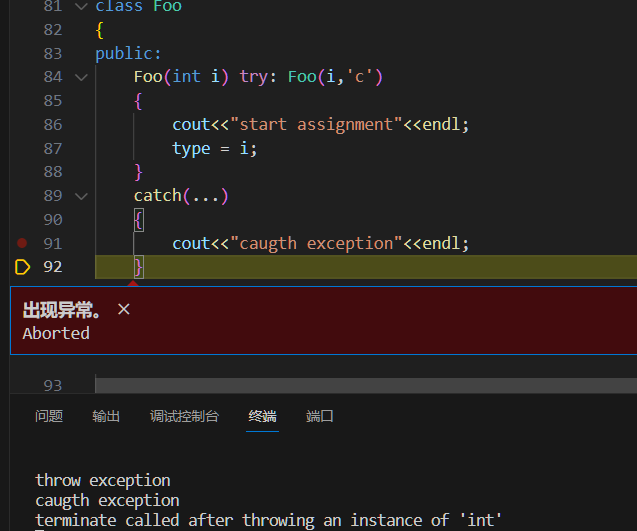

- [一、构造函数](#一构造函数)
  - [1.1 默认构造函数](#11-默认构造函数)
  - [1.2 带参数的默认构造函数](#12-带参数的默认构造函数)
    - [数据成员的初始化顺序](#数据成员的初始化顺序)
  - [1.3 委托构造函数](#13-委托构造函数)
  - [1.4 类型转换构造函数](#14-类型转换构造函数)
    - [聚合类](#聚合类)
  - [1.5 拷贝构造函数](#15-拷贝构造函数)
    - [使用 = default](#使用--default)
    - [合成拷贝构造函数（浅拷贝构造函数）](#合成拷贝构造函数浅拷贝构造函数)
    - [拷贝赋值运算符](#拷贝赋值运算符)
    - [拷贝构造函数与拷贝赋值运算符调用区别](#拷贝构造函数与拷贝赋值运算符调用区别)
    - [阻止拷贝](#阻止拷贝)
    - [行为像值的类](#行为像值的类)
    - [行为像指针的类型](#行为像指针的类型)
  - [1.6 移动构造函数](#16-移动构造函数)
    - [1）左值、右值定义](#1左值右值定义)
    - [2）区分左值引用、右值引用](#2区分左值引用右值引用)
    - [3）右值引用和 std::move 的应用场景](#3右值引用和-stdmove-的应用场景)
      - [实现移动语义](#实现移动语义)
      - [实例：vector::push\_back 使用 std::move 提高性能](#实例vectorpush_back-使用-stdmove-提高性能)
    - [4）完美转发 std::forward](#4完美转发-stdforward)
- [二、析构函数](#二析构函数)
  - [2.1 三/五法则](#21-三五法则)

# 一、构造函数

一般来说，C++的构造函数分为六类：默认构造函数、普通构造函数、委托构造函数、拷贝构造函数、转换构造函数、移动构造函数。

**构造函数的定义：**

* 1）**函数名与类名相同，且没有返回值类型（即使是 `void` 也不能有，函数体能可以使用无返回值的 `return` 语句）。**
* 2）构造函数的任务是**初始化类对象的数据成员**，无论何时只要类的对象被创建，就会执行构造函数。构造函数既可以在类内作为内联函数定义，也可以在类外定义。
* 3）一个类可以有多个构造函数，和其他重载函数差不多，**不同构造函数之间的形参的类型和个数不能完全相同。**
* 4）**构造函数不能被声明 const 的**。当我们在创建类的一个 const 对象时，需要对这个 const 对象的数据成员进行初始化，然而向 const 对象写值这是不被运行的，因此 构造函数不能被声明为 const 的。
* 5）<font color=blue>类的构造函数一般声明为 `public`。但有时也可以声明为`private` 和 `protected`，这样做的是为了限制该类对象的作用范围，即只能在本类和友元中创建该类的对象。</font>

***

## 1.1 默认构造函数

https://learn.microsoft.com/zh-cn/cpp/cpp/constructors-cpp?view=msvc-170#default_constructors

C++ 语言规定，每个类必须有一个构造函数，没有构造函数，就不能创建任何对象。若用户未显式定义一个类的构造函数，则 C++ 语言会提供一个默认的构造函数，也叫**默认构造函数**。

* 1）创建对象时不传参，则编译器就会调用默认构造函数来对所创建的对象进行**默认初始化**。<font color=alice>默认构造函数无须任何实参。</font>
* 2）若一个类没有定义任何构造函数，则编译器会自动生成一个构造函数，也就是**合成的默认构造函数**。合成的默认构造函数有两点规则来初始化类的数据成员：1. 若类内存在初始值，则用这个初始值来初始化数据成员；<font color=blue>2. 若类内不存在初始值，则使用默认初始化该成员</font>（**默认初始化是指定义变量时没有指定初值，则变量被默认初始化。如果内置变量没有被显示初始化，则它的值由定义的位置决定。定义在任何函数体之外的变量被初始化为 0；定义在函数体内部的内置类型变量将不被初始化，则这些内置类型变量时未定义的，如果试图拷贝或以其他形式访问此类值将会引发错误。**）。
* 3）<font color=coral>若定义了任意一个构造函数（不一定是无参构造函数），编译器就不会在生成默认构造函数了。</font>
* 4）**有的时候编译器无法自动为对象生成默认构造函数**，比如一个类中包含一个其他类型的对象，这个对象所属的类没有默认构造函数（自定义了一个非默认构造函数，又没有自定义默认构造函数），这个时候编译器不知道应该如何默认初始化这个成员对象。
* 5）在 C++11 中，**通过在参数列表后面加上 `= default` 来要求编译器生成默认构造函数。默认构造函数不接受任何实参**，定义默认构造函数是因为不仅需要其他形式的构造函数，也需要默认构造函数。`= default` 既可以定义在类的内部（作为内联函数），也可以定义在类的外部（不是内联函数）。

***

**默认构造函数的作用：当对象被默认初始化或值初始化时自动执行默认构造函数。**

**使用默认构造函数的好处：**

参考：[C++ 默认构造函数的重要性](https://blog.csdn.net/apacat/article/details/51646713)

* 1）**声明对象数组时，会调用默认构造函数。**如 `vector<int> vec[10];` 就会调用 `vector<int>` 的缺省构造函数（默认构造函数）来初始化每个对象。

* 2）**当用户使用了标准库的容器的时候，容器中是类等对象时，这时候会调用对象的默认构造函数进行初始化**，如果这个对象的类中没有定义默认的构造函数，那么就会报错。如：`vector<Object> vo;`。

* 3）一个类 A 以另外某个类 B 的对象为成员时，如果 A 提供了无参构造函数，而 B 未提供，那么 A 则无法使用自己的无参构造函数。

  

  ```cpp
  class B
  {
      B(int i){}
  };
  
  class A
  {
      A(){}
      B b;
  };
  
  int main(void) 
  { 
      A a(); // error C2512: 'B' : no appropriate default constructor available
  
      getchar() ; 
      return 0 ; 
  } 
  ```

* 4）若类 A 定义了拷贝构造函数，但是没有定义默认构造函数，那么若 B 继承 A，B在初始化的时候会调用A的默认构造函数，这个时候会报错。

  

  ```cpp
  class A
  {
      A(const A&){}
  };
  
  class B : public A
  {
      
  };
  
  int main(void) 
  { 
      B b; //error C2512:'B': no appropriate default constructor available
  
      getchar() ; 
      return 0 ; 
  }
  ```

  

## 1.2 带参数的默认构造函数

* 1）带参数的构造函数是最普通的一种构造函数，可以使用**初始化列表**来初始化类中的数据成员，写法是**参数列表和函数体之间，加上成员名带括号将对应的构造函数参数作为成员的初始值传入**。

```cpp
// 以下为带参数的默认构造函数

/* 以下两个构造函数的定义效果是相同的：当构造函数完成后，数据成员的值完全相同。
第一个构造函数是利用初始化列表来给数据成员赋值；
第二个构造函数是利用“等号=”来给数据成员赋值； */
TDate(int d, int m, int y): day(d), month(m), year(y){ }// 使用构造函数初始化列表进行初始化数据成员
TDate(int d, int m, int y)
{
    day = d, month = m, year = y;
}

// 带默认参数的构造函数
TDate(int d = 16, int m = 5, int y = 1990): day(d), month(m), year(y){ }
```

* 2）构造函数不应该轻易覆盖掉类内的初始值，除非新赋的值与原值不同。**如果不能使用类内初始值，则所有构造函数都应该显式地初始化每个内置类型的成员。**

* 3）<font color=blue>若类的数据成员是 const 类型、引用或者是属于某种未提供默认构造函数的类类型，就必须使用构造函数的初始化列表来提供初始值，不能使用等号`=`来进行赋值。</font>初始化和赋值的区别在于：**前者直接初始化数据成员，后者是先初始化再赋值**。一般来说，使用**列表初始化**能避免编译错误，特别是遇到有的类含有需要构造函数初始值的成员时。

  ```cpp
  class ConstRef
  {
  public:
      ConstRef(int ii);
  private:
      int i;
      const int ci;
      int &ri;
  };
  
  /* 错误：不能使用等号进行赋值，因为 const 类型和引用类型需要在初始化时绑定对象 */
  ConstRef::ConstRef(int ii)
  {
      i = ii;     // 正确
      ci = ii;    // 错误：不能给 const 赋值
      ri = i;     // 错误：ri没被初始化
  }

  /* 正确：显示初始化引用和 const 成员 */
  ConstRef::ConstRef(int ii): i(ii), ci(ii), ri(ii) { }
  ```
  

### 数据成员的初始化顺序

<font color=blue>数据成员的初始化顺序和类中定义的顺序一致，第一个成员先被初始化，然后第二个...构造函数中初始值列表中初始值的前后位置关系并不会影响实际的初始化顺序。</font>

```cpp
class X
{
    int i;
    int j;
public:
    // 未定义行为：i 在 j 之前被初始化
    X(int val):j(val), i(j){}
};
```

**最好令构造函数初始值的顺序与成员声明的顺序保持一致**。尽量避免使用某些数据成员初始化其他数据成员，使用构造函数中的参数作为数据成员的初始值，可以不用考虑成员的初始化顺序。

```cpp
X(int val): i(val), j(val){}
```


## 1.3 委托构造函数

参考：[C++11 委托构造函数](https://blog.csdn.net/K346K346/article/details/81703862)

定义：委托构造函数是 C++11 中引入的，允许构造函数通过**初始化列表**调用**同一个类的其它构造函数**，目的是简化构造函数的书写，提高代码的可维护性。

通俗来讲，**一个委托构造函数使用它所属的类的其他构造函数执行自己的初始化过程**，或者说它把自己的一些（或者全部）职责委托给了其他构造函数。和其他构造函数一样，<font color=alice>一个委托构造函数也有一个成员初始化列表和一个函数体</font>，**成员初始化列表只能包含一个其它构造函数，不能再进行成员列表初始化，只能在函数体内对其他成员变量进行赋值**。<font color=blue>当然受委托的构造函数的初始值列表和函数体依次执行完成之后，控制权才返回给委托构造函数的函数体。</font>

```cpp
/* 以下为不使用委托构造函数造成代码冗余的例子 */
class Foo
{
public:
	Foo() :type(4), name('x') {initRest();}
	Foo(int i) : type(i), name('x') {initRest();}
	Foo(char c) :type(4), name(c) {initRest();}

private:
	void initRest() {/* init othre members */}
	int type;
	char name;
	//...
};


/* 可以看出上述代码除了参数不同，初始化列表、函数体基本相同，其代码存在很多的重复。
因此在 C++11 中，可以使用委托构造函数来减少代码重复，精简构造函数。 */
class Foo
{
public:
    Foo() {initRest(); }			// 目标构造函数
    Foo(int i) : Foo() {type = i;}	// 委托构造函数
    Foo(char e) : Foo() {name = e;}	// 委托构造函数
private:
    void initRest() { /* init othre members */}
    int type{1};
    char name{'a'};
};
```

**注意事项：**

* 1）**不要形成委托环**。构造函数委托语法不会阻止意外创建构造函数递归-- `构造函数1` 调用 `构造函数2`（`构造函数2` 又调用`构造函数1`），会出现`段错误`。因此应该避免形成委托环。

```cpp
class Foo
{
public:
	Foo(int i) : Foo('c') { type = i; }
	Foo(char c) : Foo(1) { name = c; }
private:
	int type;
	char name;
};

int main()
{
    Foo f(1);
    return 0;
}
```

* 2）**若在委托构造函数中使用 `try`，则可以捕获目标构造函数中抛出的异常。**

可见在目标构造函数 `Foo(int i,char c)` 中抛出异常，在委托构造函数 `Foo(int i)` 中可以进行捕获，并且目标构造函数体内的代码并不会被执行。这样的设计是合理的，**因为目标构造函数抛出异常说明对象并没有完成初始化，在委托构造函数中进行赋值操作都是一些无意义的动作。**

```cpp
class Foo
{
public:
    // 委托构造函数
	Foo(int i) try: Foo(i,'c') 
	{
		cout<<"start assignment"<<endl;
		type = i; 
	}
	catch(...)
	{
		cout<<"caugth exception"<<endl;
	}

private:
    // 目标构造函数
	Foo(int i, char c) 
	{
		cout<<"throw exception"<<endl;
		throw 0;
	}
	int type;
	char name;

};

int main()
{
	Foo f(1);
	return 0;
}
/* 
程序输出结果：
	throw exception
	caugth exception
*/
```




## 1.4 类型转换构造函数

参考：[c++ 中的转换构造函数](https://zhuanlan.zhihu.com/p/56030875)

**类型转换构造函数**：<font color=blue>只接收一个参数的构造函数，且该参数不是本类的 const 引用，此时的构造函数被称为转换构造函数。</font>在发生类型转换时被编译器自动调用。

```cpp
Base(int a);      	// 转换构造函数
Base b;         	// 对象
// 程序将使用构造函数 Base(int a) 构造出一个临时的无名 Base 对象，并用 12 对其初始化。然后采用逐个成员赋值的方式将该临时对象的内容赋值给对象 b。这一过程被称为隐式类型转换，因为它是自动的，不需要显式强制类型转换。
b = 12;           
```

***

**使用 explicit 关键字来防止隐式类型转换，但是还是可以进行显示转换的。**

* 1）**关键字 explicit 只对一个实参的构造函数有效，需要多个实参的构造函数不能用于执行隐式转换，所以不能将多个实参的构造函数指定为 explicit 的**。<font color=coral>同时 explicit 只能在类内声明构造函数时使用，在类外不能在重复声明。</font>

  ```cpp
  class X
  {
   	int val;
  public:
  	explicit X(int i){ }    
  };
  // 错误：explicit 关键字只允许出现在类内的构造函数声明处
  explicit X::X(int i)
  {
      val = i;
  }
  ```

* 2）**explicit 构造函数只能用于直接初始化，不能使用拷贝形式的初始化（使用 = 来进行初始化）。**

  ```cpp
  X x(1);		// 正确：直接初始化
  X X2 = 1; 	// 错误：不能使用拷贝形式的初始化，explicit 就是为了避免隐式转换的
  ```

### 聚合类

**聚合类就是 struct 的结构体，所有成员都是 public、不用定义任何构造函数、没有类内初始值、没有基类，也没有 virtual 函数。**


## 1.5 拷贝构造函数

参考：[[c++拷贝构造函数详解](https://www.cnblogs.com/alantu2018/p/8459250.html)](https://www.cnblogs.com/alantu2018/p/8459250.html)、[C++构造函数总结](https://blog.csdn.net/a8039974/article/details/112002275)、[拷贝构造函数（复制构造函数）](https://blog.csdn.net/cristiadol/article/details/121935895)

当定义一个类时，可以显示地或隐式地指定在此类型的对象拷贝、移动、赋值和销毁时做什么。<font color=alice>一个类通过定义五种特殊的成员函数来控制这些操作，包括：拷贝构造函数、拷贝赋值运算符、移动构造函数、移动赋值运算符和析构函数。</font>

* 1）拷贝和移动构造函数定义了**当用同类型的一个对象来初始化本对象时需要做什么**。
* 2）拷贝和移动赋值运算符定义了**将一个对象赋值给同类型的另一个对象时做什么**。
* 3）析构函数定义了**当此类型对象销毁时做什么**。

以上这 5 种函数被称为**拷贝控制操作**。

<font color=blue>如果一个类没有定义这些拷贝控制成员，则编译器会自动生成这些拷贝控制成员，通常自动生成的拷贝控制成员会造成一些意想不到的 BUG。</font>

### 使用 = default

**对于默认构造函数、以及拷贝控制操作（拷贝构造函数、拷贝赋值运算符、析构函数、移动构造函数、移动赋值运算符）都可以使用 `= default` 来生成其对应的合成版本。**

***

**定义：如果构造函数的第一个参数是自身类类型的引用，且所有其他参数（如果有的话）都有默认值，则此构造函数是拷贝构造函数**。拷贝构造函数在以下几种情况下会被使用：

* 1）拷贝初始化（用 = 定义），如 `X x1 = x2;`；
* 2）**将一个对象作为实参传递给非引用类型的形参**，如 `void func(X x)`；
* 3）一个**返回类型为非引用类型的函数**返回一个对象；
* 4）用花括号列表初始化一个数组中的元素或一个聚合类中的成员；
* 5）**初始化标准库容器或调用其 `insert/push` 操作时，容器会对其进行拷贝初始化。使用 `emplace` 来进行直接初始化。**

```cpp
#include <iostream>
#include <vector>

using namespace std;

struct X
{
    X()
    {
        cout << "构造函数 X()" << endl;
    }

    X(const X&)
    {
        cout << "拷贝构造函数 X(const X&)" << endl;
    }

    X& operator=(const X& rhs)
    {
        cout << "拷贝赋值运算符 = (const X&)" << endl;
        return *this;
    }

    ~X()
    {
        cout << "析构函数 ~X()" <<endl;
    }
};

void f1(X x){}

void f2(X& x){}

int main()
{
    cout << "局部变量：" << endl;
    X x;
    cout << endl;

    cout << "非引用参数传递："<< endl;
    f1(x);// 拷贝初始化
    cout << endl;

    cout << "引用参数传递："<< endl;
    f2(x);// 直接初始化
    cout << endl;

    cout << "动态分配："<< endl;
    X *px = new X;
    cout << endl;

    cout << "添加到容器中："<< endl;
    vector<X> vx;
    vx.push_back(x);// 拷贝初始化
    cout << endl;

    cout << "释放动态分配对象："<< endl;
    delete px;
    cout << endl;

    cout << "间接初始化和赋值："<< endl;
    X y = x; // 拷贝初始化
    y = x;  // 拷贝赋值运算符
    cout << endl;

    cout << "程序结束：" << endl;
    return 0;
}
```


***

**拷贝构造函数的作用**：将初始对象的每个非 `static` 数据成员依次复制（赋值）给到新建立对象中的每个数据成员。

**拷贝初始化与直接初始化的区别**：

* 若使用等号（=）去初始化一个对象，实际上执行的是“**拷贝初始化**”，编译器把等号右边对象的数据成员逐个依次拷贝到左边对象中。**拷贝初始化通常使用拷贝构造函数来完成**。
* 若**不使用等号（=）**，则是使用的**直接初始化**，也就是使用普通的函数匹配。

```cpp
string dots(10,'.');                // 直接初始化
string s(dots);                     // 直接初始化
string s2 = dots;                   // 拷贝初始化
string null_book = "9-999-99999-9"; // 拷贝初始化
string lines = string(100,'9');     // 拷贝初始化
```

**拷贝构造函数的形参必须是引用类型的原因**：

* 如果不是引用类型，则会产生死循环。为了调用拷贝构造函数，我们必须拷贝它的实参，为了拷贝实参，则又必须调用拷贝构造函数，这样会造成死循环。

**拷贝初始化的限制：**

* 当拷贝构造函数前面加了一个 `explicit` 关键字时，调用拷贝构造函数不能进行隐式类型转换，但可以进行显示类型转换。

  ```cpp
  vector<int> v1(10); //正确：直接初始化
  vector<int> v2 = 10;//错误：接受大小参数的构造函数是explicit的
  void f(vector<int>);//f的参数进行拷贝初始化
  f(10);//错误：不能用一个explicit的构造函数拷贝一个实参
  f(vector<int>(10));//正确：可以进行显示类型转换（f的参数必须接收一个对象）
  ```


**哪些函数是拷贝构造函数的类型呢？**

```cpp
对于一个类 X, 如果一个构造函数的第一个参数是下列之一:
a) X&
b) const X&
c) volatile X&
d) const volatile X&
且没有其他参数或其他参数都有默认值,那么这个函数是拷贝构造函数。
```

**一些面试题：**


### 合成拷贝构造函数（浅拷贝构造函数）

* 1）形成：若类中没有定义拷贝构造函数，则编译就会自动生成一个拷贝构造函数，此时的拷贝构造函数是合成拷贝构造函数，也就是**浅拷贝构造函数**（**逐个非 static 成员依次拷贝，但是只复制对象空间而不复制资源，也就是新旧对象都指向同一块内存**）。

* 2）一般情况下，只需要使用编译器提供的**浅拷贝构造函数**即可，但是如果对象的数据成员包括指向堆空间的指针，就不能使用这种拷贝方式，**因为两个对象都拥有同一个资源，对象析构时，堆空间被释放两次，这样出现释放悬空指针指向的内存空间会报错**。

* 3）**深拷贝构造函数是指类中的数据成员含有指向堆内存的指针变量时**，需要自行定义的拷贝构造函数，这样同时复制对象空间和资源。

  

  ```cpp
  class Rect
  {
  public:
      Rect(){
          p = new int(100);
      }
      
      // 自定义深拷贝构造函数
      Rect(const Rect& c)
      {
          width = c.width, height = r.height;
          p = new int(100);// 单独在堆上申请内存
          *p = *(r.p); // 给申请到的内存赋值，完成深拷贝
      }
      
      ~Rect()
      {
          assert(p != nullptr);
          delete p;
      }
  private:
      int width;
      int height;
      int *p;
  };
  ```


### 拷贝赋值运算符

**重载运算符函数**：其参数为运算符的运算对象，对于一些运算符，必须定义为类的成员函数，然后将左侧运算对象绑定到类的 this 参数。对于二元运算符，其右侧运算对象作为显示参数传递。**重载赋值运算符是一个形如 `X& operator=(const X&){ }` 的函数，定义为类的成员，函数的返回值指向其左侧运算对象的引用，并绑定到类的 this 指针**。

一般的重载运算符函数是 `operator` 关键字后接上要定义的运算符符号。

**合成拷贝赋值运算符：**

* 1）**若一个类未定义自己的拷贝构造赋值运算符，编译器就会自动生成一个合成的拷贝赋值运算符来完成赋值操作**，但是对于某些类，还是会起到禁止该类型对象赋值的效果。

* 2）通常情况下，**合成的拷贝赋值运算符**会将**右侧对象的非 static 成员逐个赋给左侧对象的对应成员**，这些赋值操作是由成员类型的拷贝赋值运算符来完成。

```cpp
class HasPtr
{
public:
    HasPtr(const std::string & s = std::string()): // 带默认参数的构造函数
        ps(new std::string(s)), i(0) {}
    
    ~HasPtr(){ delete ps; }

    // 深拷贝构造函数
    HasPtr(const HasPtr& hp)
    {
        ps = new string(*(hp.ps)); // 重新申请一块内存空间，用于存储 ps 指向的字符串
        i = hp.i;
    }
    
    // 重载赋值运算符，用于拷贝初始化
    HasPtr& operator=(const HasPtr& rhs)
    {
        auto ps_ = new string(*(rhs.ps)); // 重新申请一块内存空间，用于存储 ps 指向的字符串
        delete ps;  // 销毁原 string 的内存空间
        ps = ps_;   // 指向新 string 的内存空间
        i = rhs.i;  // 使用内置的 int 赋值
        return *this;   // 返回一个此对象的引用
    }
private:
    std::string *ps;
    int i;
};
```

### 拷贝构造函数与拷贝赋值运算符调用区别

**拷贝构造函数是直接用于对象的初始化，而拷贝赋值运算符是先初始化对象，然后在进行赋值**。

这里可以联想到（初始化和赋值的区别：**前者直接初始化数据成员，后者是先初始化再赋值**。前面 `带参数的默认构造函数` 的初始化列表讲解了这个问题，可以仔细去看看。）

```cpp
class X
{
  ...  
};
X x1;
X x2 = x1; // 调用拷贝构造函数
X x3;
x3 = x1; // 调用拷贝复制运算符，因为 x3 是先进行初始化，然后在进行赋值的，因此调用的是拷贝赋值运算符函数
```


### 阻止拷贝

有些类应该阻止拷贝，比如 iostream 类阻止了拷贝，以避免多个对象写入或者读取相同的IO缓存。**如果我们不定义拷贝控制成员，但是编译器会默认为我们定义这些操作，因此不能阻止类的拷贝。**

**方法1：定义删除函数**

* **通过将 `拷贝构造函数` 和 `拷贝赋值运算符` 定义为删除函数来阻止拷贝**。删除函数也是一种函数，虽然定义了它们，但是不能以任何方式使用它们。

  ```cpp
  class NoCopy
  {
  public:
      NoCopy() = default;                         // 默认合成生成构造函数
      NoCopy(const NoCopy &) = delete;            // 阻止拷贝
      NoCopy &operator=(const NoCopy &) = delete; // 阻止赋值
      ~NoCopy() = default;                        // 默认合成析构函数
  };
  ```

**注意点：**

* 1）与 `=default` 不同，**`=delete` 必须出现在函数第一次声明的时候使用。**

* 2）与  `=default` 不同，**可以对任何函数指定 ` =delete`，编译器只能对合成的默认构造函数和拷贝控制成员**（拷贝构造函数、拷贝赋值运算符、析构函数、移动构造函数，移动赋值运算符）**使用 `=default`**。

* **3）不能对析构函数使用 `=delete`。**不能删除析构函数，若析构函数被删除，就无法释放该类的对象。对于析构函数已被删除的类，编译器不允许定义该类的对象或创建该类的临时对象，即使可以使用 `new` 动态地申请对象，但是 `new` 申请的对象不能被释放。**所以对于析构函数已被删除的类，不能定义该类的对象和使用 new 申请该类的对象**。

  当然类中某个数据成员是其它类的对象的话，若这个其它类的析构函数被删除了，则我们也不能定义本类的对象和动态地申请本类的对象了。

  ```cpp
  class NoDtor
  {
  public:
      NoDtor() = default;     // 使用合成默认构造函数
      ~NoDtor() = delete;     // 不能销毁 NoDtor 类型的对象
  };
  
  int main()
  {
      NoDtor nd;  // 错误：NoDtor 的析构函数是删除的
      NoDtor *p = new NoDtor();   // 正确：但是不能 delete p
      delete p;   // 错误：NoDtor 的析构函数是删除的
      return 0;
  }
  ```

  

* **4）如果一个类的某些数据成员不能进行默认构造、拷贝、赋值和销毁，则对应的成员函数将被定义为删除的。**

  4.1）若**类的某个成员的析构函数**是删除的或不可访问的，**则被定义为删除的**；

  4.2）若**类的某个成员的拷贝构造函数**是删除的或不可访问的，则类的**合成构造函数**被定义为删除的。若**类的某个成员的析构函数**是删除的或不可访问的，则**类合成的构造函数**也被定义为删除的。

  4.3）若**类的某个成员的拷贝赋值运算符**是删除的或不可访问的，或**类有一个 const 的或引用成员**，则**类的合成拷贝构造运算符**也被定义为删除的。

  4.4）若类的某个成员的析构函数是删除的或不可访问的，或是类有一个引用成员，它没有类内初始化器，或是类有一个 const 成员，它没有类内初始化器且其类型未显示定义默认构造函数，则该类的默认构造函数被定义为删除的。**因为对于具有引用成员或无法默认构造的 const 成员的类，编译器不会为其合成默认构造函数。**

***

**方法2：private 拷贝控制**

**C++11 之前，类是通过将其拷贝构造函数和拷贝赋值运算符声明为 `private` 来阻止拷贝。**

```cpp
class NoCopy
{
public:
    NoCopy() = default;  // 使用合成生成构造函数
    ~NoCopy() = default; // 使用合成析构函数
private:
    // 拷贝控制成员是private的。因此普通用户代码无法访问
    NoCopy(const NoCopy &);
    NoCopy &operator=(const NoCopy &);
};
```

由于析构函数是 public 的，用户可以定义 NoCopy 类型的对象。**但是由于拷贝构造函数和拷贝赋值运算符是 private 的，用户将不能拷贝这个类型的对象**。但是友元和成员函数仍然可以拷贝对象。**为了阻止友元和成员函数的拷贝，将这些拷贝控制成员声明成private的，但不定义它们**。通过只声明不定义 private 的拷贝构造函数，这样可以预先阻止任何拷贝该类对象的企图：**试图拷贝对象的用户代码将在编译阶段被标记为错误；成员函数或友元函数中的拷贝操作将会导致链接时的错误**。

<font color =red>特别注意：声明但是不定义一个成员函数是合法的（一种情况除外：virtual函数不能只声明不定义）。</font>

**总结：**

- 通常我们使用定义删除函数 `=delete` 的方式来阻止拷贝，尽量避免使用 `private` 拷贝控制。
- 在工程中，一般我们单独实现 `NoCopy` 的类，然后其它类通过继承该类实现阻止拷贝。

### 行为像值的类

```cpp
#include <iostream>
#include <string>
using namespace std;

class HasPtr
{
    // 使用友元函数，以便访问 HasPtr 的私有数据成员
    friend void swap(HasPtr&, HasPtr&);
public:
    HasPtr(const string& s = string()): ps(new string(s)), i(0){}
    HasPtr(const HasPtr& p): ps(new string(*(p.ps))), i(p.i){} // 拷贝构造函数
    HasPtr& operator=(const HasPtr&);   // 拷贝赋值运算符
    HasPtr& operator=(const string&);   // 赋予新 string
    string& operator*();               // 解引用
    ~HasPtr();
private:
    string* ps;
    int i;
};

inline
void swap(HasPtr& lhs, HasPtr& rhs)
{
    using std::swap;
    // 由于指针类型和整数类型，都是内置类型，因此下面这两个 swap 使用的是 std::swap，而不是 HasPtr 版本的 swap，所以不会导致递归循环
    swap(lhs.ps, rhs.ps);
    swap(lhs.i, rhs.i);
}

HasPtr::~HasPtr()
{
    delete ps;  // 释放 ps 指向的 string 对象的内存
}

// 大多数赋值运算符组合了析构函数和拷贝构造函数的工作
// 类似析构函数，赋值操作会销毁左侧运算对象的资源；类似拷贝构造函数，赋值操作会从右侧运算对象拷贝数据
inline
HasPtr& HasPtr::operator=(const HasPtr& rhs)
{
    // a = rhs
    // 先拷贝再销毁：rhs 表示右侧运算对象，先拷贝右侧对象指向的string字符串值，然后再释放左侧对象中的 ps 指向的 string 内存空间，避免自赋值时，先释放 ps 指向的内存空间，然后再访问 ps 指向的字符串，造成访问无效空间，导致错误
    auto nps = new string(*rhs.ps); // 重新申请一块内存空间，用于存储 ps 指向的字符串
    delete ps;  // 释放左侧对象指向的 string 内存空间
    ps = nps;   // 将右侧对象中 string 字符串空间拷贝到本对象，也就是左侧对象
    i = rhs.i;  // 使用内置的 int 赋值
    return *this; // 返回一个此对象的引用，返回左侧对象的引用
}

HasPtr& HasPtr::operator=(const string& rhs)
{
    *ps = rhs;
    return *this;
}

string& HasPtr::operator*()
{
    return *ps;
}

int main()
{
    HasPtr h("hello world!");
    HasPtr h2(h); // 行为类值，h2、h3 和 h 指向不同的 string
    HasPtr h3 = h; // 调用拷贝构造函数
    h2 = "h2 world!"; // 调用拷贝赋值运算符
    h3 = "h3 world!";
    cout << "h: " << *h << endl;
    cout << "h2: " << *h2 << endl;
    cout << "h3: " << *h3 << endl;
    return 0;
}
```

### 行为像指针的类型

```cpp
#include <string>
#include <iostream>
using namespace std;

class HasPtrCount
{
public:
    // 构造函数分配新的 string 和新的计数器，将计数器置为 1
    HasPtrCount(const string& s = string()): ps(new string(s)), i(0), use(new size_t(1)){}
    // 拷贝构造函数拷贝所有三个数据成员，并递增计数器
    // 拷贝构造函数
    HasPtrCount(const HasPtrCount& p):ps(p.ps), i(p.i), use(p.use){ ++*use; }
    // 拷贝赋值运算符，a = rhs
    // 之所以采用先递增 rhs 中的计数，然后再递减左侧运算对象中的计数，是为了处理自赋值，也就是两个对象相同时，避免释放再赋值前，造成访问无效内存空间
    HasPtrCount& operator=(const HasPtrCount& rhs)
    {
        // a = rhs
        ++*rhs.use; // 递增右侧运算对象的引用计数，表示又有一个对象指向相同 string 内存空间了
        if(--*use == 0){// 减少左侧对象中的引用计数，因为 a 又指向新的 string 内存空间了，因此需要递减它之前的引用计数
            delete ps;// 若引用计数减少到 0，则释放 ps 指向的 string 内存空间，以及 use 指向的 int 类型空间
            delete use;
        }
        // 然后将数据从 rhs 拷贝到本对象
        ps = rhs.ps, i = rhs.i, use = rhs.use;
        // 返回本对象
        return *this;
    }

    // 赋予新的 string
    HasPtrCount& operator=(const string& rhs)
    {
        *ps = rhs;
        return *this;
    }

    // 解引用
    string& operator*()
    {
        return *ps;
    }

    // 析构函数
    ~HasPtrCount()
    {
        if(--*use == 0) // 若引用计数变为 0，则释放 ps 指向的 string 内存，释放 use 指向的 int 类型数据的内存
        {
            delete ps;
            delete use;
        }
    }
private:
    string *ps;
    int i;
    size_t *use;    // 用来记录有多少个对象共享 *ps 的成员
};

int main()
{
    HasPtrCount h("hi mom!");
    HasPtrCount h2 = h; // 未分配新 string，h2 和 h 指向相同的 string
    h = "hi dad!";
    cout << "h: " << *h << endl;
    cout << "h2: " << *h2 << endl;
    return 0;
}
```


## 1.6 移动构造函数

参考：

* [理解 C/C++ 中的左值和右值](https://nettee.github.io/posts/2018/Understanding-lvalues-and-rvalues-in-C-and-C/)
* [一文读懂C++右值引用和std::move](https://zhuanlan.zhihu.com/p/335994370) 
* [移动构造函数和移动赋值运算符 (C++)](https://learn.microsoft.com/zh-cn/cpp/cpp/move-constructors-and-move-assignment-operators-cpp?view=msvc-170)

* [详解 C++ 左值、右值、左值引用以及右值引用](https://www.cnblogs.com/david-china/p/17080072.html)

### 1）左值、右值定义

首先不考虑引用来减少干扰：**左值可以取地址，位于等号左边；而右值没法取地址，位于等号右边**。

通过以下例子可以得出：**有地址的变量就是左值，没有地址的字面值、临时值就是右值。**

```cpp
/* a 可以通过 & 取地址，位于等号左边，所以 a 是左值。
5 位于等号右边，5 没法通过 & 取地址，所以 5 是个右值。*/
int a = 5;
```

```cpp
struct A
{
	A(int a = 0): a_(a){ }
    
    int a_;
};

/* a 可以通过 & 取地址，位于等号左边，所以 a 是左值。
A() 是个临时值，没法通过 & 取地址，位于等号右边，所以 A() 是个右值。 */
A a = A();
```

***

### 2）区分左值引用、右值引用

**左值引用：**

* 左值引用能指向左值，不能指向右值的就是左值引用。**引用是变量的别名，由于右值没有地址，没法被修改，所以左值引用无法指向右值**。

  ```cpp
  int a = 5;
  int &ref_a = a; // 左值引用绑定左值，编译通过
  int &ref_a = 5; // 左值引用指向了右值，会编译失败
  ```

* 但是，**`const` 的左值引用可以指向右值。`const` 左值引用不会修改指向值，因此可以指向右值**。

  ```cpp
  // const 左值引用可以指向右值，也就是字面值
  const int& ref_a = 5;
  
  // const & 常作为函数参数，如 std::vector 的 push_back：
  void push_back (const value_type& val);
  // 如没有 const，以下代码编译无法通过
  vec.push_back(5);
  ```

  

***

**右值引用**：其标志是 `&&`，右值引用专门为右值而生的，**可以指向右值，不能指向左值**。

```cpp
int &&ref_a_right = 5;	// ok

int a = 5;

int &&ref_a_left = a; // 编译不过，右值引用不可以指向左值

ref_a_right = 6;// 右值引用的用途：可以修改右值
```


***

**右值引用有办法指向左值吗？**

* 1）有办法，可以使用`std::move`。

```cpp
int a = 5; // a是个左值
int &ref_a_left = a; // 左值引用指向左值
int &&ref_a_right = std::move(a); // 通过std::move将左值转化为右值，可以被右值引用指向
 
cout << a; // 打印结果：5
```

* 2）**`std::move` 并不是将一个变量里的内容移动到另一个变量，实际上 `std::move` 移动不了什么，其唯一的功能是把左值强制转换为右值，让右值引用可以指向左值。其实现等同于一个类型转换：`static_cast<T&&>(lvalue)`，所以单纯的使用 `std::move(xxx)` 不会有性能提升。**
* 3）**右值引用指向右值，本质上也是把一个右值提升为一个左值，并定义一个右值引用通过 `std::move` 指向该左值。**

```cpp
int &&ref_a = 5;
ref_a = 6; 
 
// 等同于以下代码：
 
int temp = 5;
int &&ref_a = std::move(temp);
ref_a = 6;
```


***

**左值引用、右值引用本身是左值还是右值？**

* **被声明出来的左、右值引用都是左值**。因为被声明出来的左右值引用都是有地址的，也位于等号左边。

```cpp
// 形参是个右值引用
void change(int&& right_value) {
    right_value = 8;
}
 
int main() {
    int a = 5; // a是个左值
    int &ref_a_left = a; // ref_a_left是个左值引用
    int &&ref_a_right = std::move(a); // ref_a_right是个右值引用
 
    change(a); // 编译不过，a是左值，change参数要求右值
    change(ref_a_left); // 编译不过，左值引用ref_a_left本身也是个左值
    change(ref_a_right); // 编译不过，右值引用ref_a_right本身也是个左值
     
    change(std::move(a)); // 编译通过
    change(std::move(ref_a_right)); // 编译通过
    change(std::move(ref_a_left)); // 编译通过
 
    change(5); // 当然可以直接接右值，编译通过
     
    cout << &a << ' ';
    cout << &ref_a_left << ' ';
    cout << &ref_a_right;
    // 打印这三个左值的地址，都是一样的
}
```

* 分析下以上代码：表达式 `int &&ref_a_right = std::move(a);` 中 `std::move(a)` 返回一个右值引用 `int &&`，那么它是左值还是右值呢？由于右值引用 `ref` 指向的必须是右值，所以 move 返回的 `int&&` 是个右值。所以说**右值引用既可以是左值，也可以是右值。如果有名称（变量名）则为左值，否则为右值**。换句话说：**作为函数返回值的 && 是右值，直接声明出来的 && 是左值**。这样也符合之前对左值、右值定义：其实引用和普通变量是一样的，`int &&ref = std::move(a)`和 `int a = 5`没有什么区别，**等号左边就是左值，右边就是右值**。

基于以上分析可以得出如下结论：

* 1）**从性能上讲，左右值引用没有区别，传参使用左右值引用都可以避免拷贝。**
* 2）**右值引用可以直接指向右值，也可以通过 `std::move` 指向左值；而左值引用只能指向左值（`const` 左值引用也能指向右值）。**
* 3）**作为函数形参时，右值引用更灵活。虽然 `const` 左值引用也可以做到左右值都接受，但它无法修改，有一定局限性。**

```cpp
void f(const int& n) {
    n += 1; // 编译失败，const左值引用不能修改指向变量
}

void f2(int && n) {
    n += 1; // ok
}

int main() {
    f(5);
    f2(5);
}
```


***

### 3）右值引用和 std::move 的应用场景

由以上分析，可以得知 `std::move` 只是类型转换工具，不会对性能产生好处；右值引用作为函数形参时更具有灵活性，但是实际上帮助不大。

#### 实现移动语义

```cpp
#include <iostream>
#include <utility>

class MyClass {
public:
    // 默认构造函数
    MyClass() {
        std::cout << "Default constructor called" << std::endl;
        data = new int(0);
    }

    // 拷贝构造函数
    MyClass(const MyClass& other) {
        std::cout << "Copy constructor called" << std::endl;
        data = new int(*(other.data));
    }

    // 拷贝赋值运算符函数
    MyClass& operator=(const MyClass& other) {
        std::cout << "Copy assignment operator called" << std::endl;
        if (this != &other) {
            delete data;  // 避免内存泄漏
            data = new int(*(other.data));
        }
        return *this;
    }

    // 移动构造函数
    MyClass(MyClass&& other) noexcept {
        std::cout << "Move constructor called" << std::endl;
        data = other.data;
        other.data = nullptr;
    }

    // 移动赋值运算符函数
    MyClass& operator=(MyClass&& other) noexcept {
        std::cout << "Move assignment operator called" << std::endl;
        if (this != &other) {
            delete data;  // 避免内存泄漏
            data = other.data;
            other.data = nullptr;
        }
        return *this;
    }

    // 析构函数
    ~MyClass() {
        std::cout << "Destructor called" << std::endl;
        delete data;
    }

private:
    int* data;
};

int main() {
    // 创建对象并测试构造函数和赋值运算符
    MyClass obj1;              // 默认构造函数
    MyClass obj2 = obj1;       // 对象初始化调用的是拷贝构造函数
    MyClass obj3;
    obj3 = obj1;               // 拷贝赋值运算符

    // 移动构造函数和移动赋值运算符的测试
    MyClass obj4 = std::move(obj1);  // 对象初始化调用的移动构造函数
    MyClass obj5;
    obj5 = std::move(obj2);         // 对象的赋值调用的是移动赋值运算符

    // 析构函数的调用
    // 注意：在程序结束时，局部对象将被销毁，析构函数将被调用
    return 0;
}
```


#### 实例：vector::push_back 使用 std::move 提高性能

在 STL 容器中，都实现了以**右值引用为参数**的 移动构造函数 和 移动赋值运算符函数，或者其他函数，最常见的如 `std::vector` 的 `push_back` 和 `emplace_back`。**参数为左值引用意味着要进行拷贝，为右值引用意味着移动**。

```cpp
// 例2：std::vector和std::string的实际例子
int main() {
    std::string str1 = "aacasxs";
    std::vector<std::string> vec;
     
    vec.push_back(str1); // 传统方法，copy
    vec.push_back(std::move(str1)); // 调用移动语义的 push_back 方法，避免拷贝，str1会失去原有值，变成空字符串
    vec.emplace_back(std::move(str1)); // emplace_back效果相同，str1会失去原有值
    vec.emplace_back("axcsddcas"); // 当然可以直接接右值
}
 
// std::vector方法定义
void push_back (const value_type& val);
void push_back (value_type&& val);
 
void emplace_back (Args&&... args);
```

以上例子，在 vector 和 string 这个场景中，使用 `std::move` 会调用到移动语义函数，避免了深拷贝。

**除非设计不允许移动，STL类大都支持移动语义函数，即 `可移动的`**。 另外，编译器会**默认**在用户自定义的 `class` 和 `struct` 中生成移动语义函数，但前提是用户没有主动定义该类的 `拷贝构造` 等函数。 **因此，可移动对象在 <需要拷贝且被拷贝者之后不再被需要> 的场景，建议使用`std::move`触发移动语义，提升性能**。

```cpp
moveable_objecta = moveable_objectb; 
改为： 
moveable_objecta = std::move(moveable_objectb);
```

还有些STL类是`move-only`的，比如`unique_ptr`，这种类只有移动构造函数，因此只能移动(转移内部对象所有权，或者叫浅拷贝)，不能拷贝(深拷贝)：

```cpp
std::unique_ptr<A> ptr_a = std::make_unique<A>();

std::unique_ptr<A> ptr_b = std::move(ptr_a); // unique_ptr只有‘移动赋值重载函数‘，参数是&& ，只能接右值，因此必须用std::move转换类型

std::unique_ptr<A> ptr_b = ptr_a; // 编译不通过
```

**std::move 本身只做类型转换，对性能无影响。我们可以在自己的类中实现移动语义，避免深拷贝，充分利用右值引用和 std::move 的语言特性。**


### 4）完美转发 std::forward


先这样，后面在进行补充！


# 二、析构函数

析构函数执行与构造函数相反的操作：构造函数初始化对象的非 static 数据成员；**析构函数释放对象使用的资源，并销毁对象的非 static 数据成员。**

**析构函数完成与构造函数相反的工作**：

* 在一个构造函数中，类中数据成员的初始化是在函数体执行之前完成的，且按照它们在类中声明的先后顺序进行初始化的。
* 在一个析构函数中，首先执行函数体，然后销毁数据成员。如同栈一样，先进后出，**数据成员按声明的先后顺序逆序销毁**。内置类型没有析构函数，因此销毁内置类型的数据成员时什么也不需要做，销毁类类型的数据成员时需要执行类自己的析构函数。
* 析构函数是类的一个成员函数，名字为波浪号+类名，没有返回值，也不接受参数。**一个类只能有一个析构函数。**

**无论何时一个对象被销毁，就会自动调用其析构函数：**

* 1）变量在离开其作用域时被销毁；
* 2）当一个对象被销毁时，其成员被销毁；
* 3）容器（无论是标准库容器还是数组）被销毁时，其元素被销毁；
* 4）对于动态分配的对象，当对指向它的指针应用 delete 运算符时被销毁；
* 5）对于临时对象，当创建它的完整表达式结束时被销毁；

**注意：当指向一个对象的引用或指针离开局部作用域时，析构函数不会执行。**

**合成析构函数**：当一个类没有定义析构函数时，编译器会自动合成析构函数。合成的析构函数为空，当空函数体执行完后，非 static 数据成员会被逐个销毁。


## 2.1 三/五法则

C++11 之前使用三个基本构造函数就能控制类的拷贝操作：`拷贝构造函数、拷贝赋值运算符和析构函数`。**在 C++11 的新标准下，一个类中还可以定义一个移动构造函数和一个移动赋值运算符。**

* **法则1：若一个类需要自定义析构函数时，必然也要自定义拷贝构造函数和拷贝赋值运算符。**

```cpp
class HasPtr
{
public:
    HasPtr(const std::string & s = std::string()): // 带默认参数的构造函数
        ps(new std::string(s)), i(0) {}
    
    ~HasPtr(){ delete ps; }

    // 删掉自定义的深拷贝构造函数和拷贝赋值运算符，使用合成的这俩函数
private:
    std::string *ps;
    int i;
};

HasPtr f(HasPtr hp) // hp 是值传递，被拷贝一次
{
    HasPtr res = hp; // 拷贝给定的 HasPtr
    // 当函数 f 返回时，hp 和 res 都被销毁，析构函数会 delete res 和 hp 中的指针成员，由于这两个指针成员指向同一个地址对象，这个地址对象被释放两次，显然是错误的
    return res; // res 和 hp 被销毁
}

int main()
{
    HasPtr p("some values");
    f(p); // 当 f 结束后，p.ps 指向的内存被释放
    HasPtr q(p); // 现在 p 和 q 都指向无效内存
    return 0;
}
```

报错结果如下：


* **法则2：拷贝构造函数与拷贝赋值运算符必须同时定义**，但是此时的析构函数不一定是必需的。

