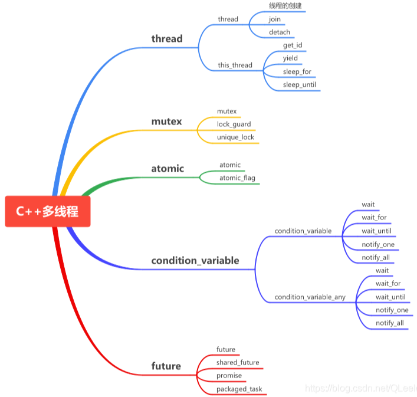
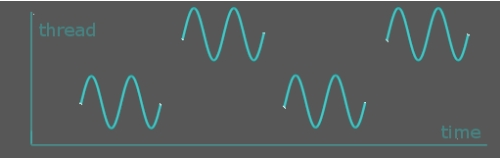
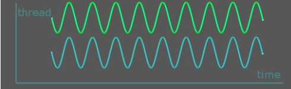
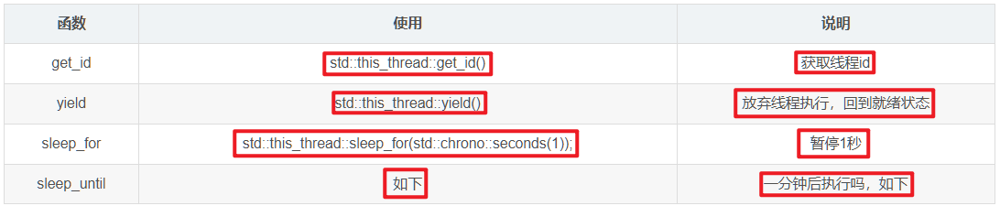
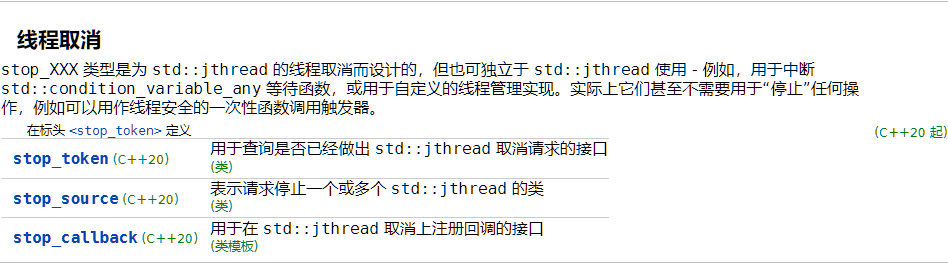
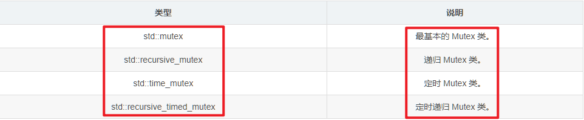
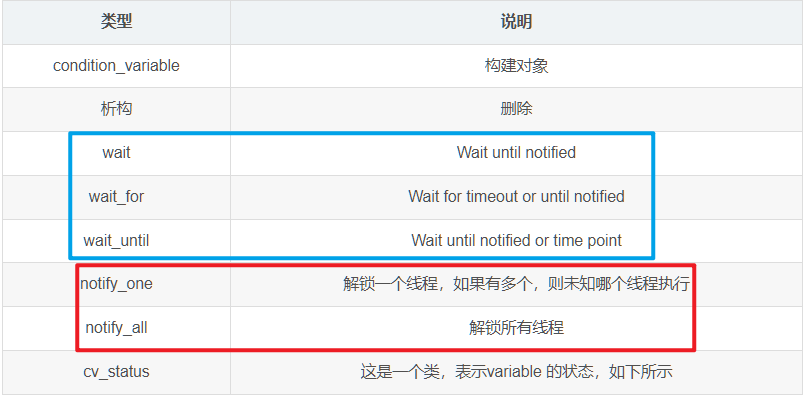
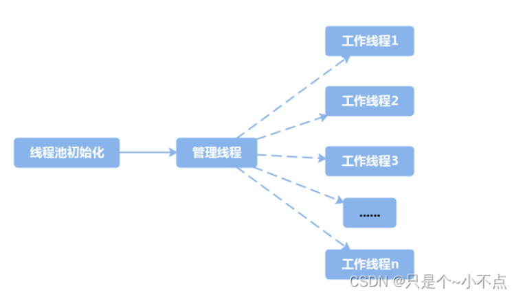
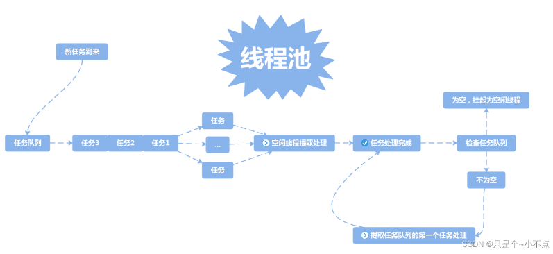

- [一、多线程](#一多线程)
  - [1.1 多进程与多线程](#11-多进程与多线程)
    - [多进程并发](#多进程并发)
    - [多线程并发](#多线程并发)
  - [1.2 多线程理解](#12-多线程理解)
  - [1.3 创建线程](#13-创建线程)
  - [1.4 join 与 detach 方式](#14-join-与-detach-方式)
  - [1.5 this\_thread](#15-this_thread)
  - [1.6 线程取消](#16-线程取消)
  - [补充：C++ 中 jthread 和 thread 的区别](#补充c-中-jthread-和-thread-的区别)
- [二、 mutex](#二-mutex)
  - [2.1 lock 与 unlock](#21-lock-与-unlock)
  - [2.2 lock\_guard](#22-lock_guard)
  - [2.3 unique\_lock](#23-unique_lock)
  - [2.4 shared\_lock](#24-shared_lock)
  - [2.5 recursive\_mutex](#25-recursive_mutex)
  - [2.6 shared\_mutex](#26-shared_mutex)
- [三、condition\_variable](#三condition_variable)
  - [3.1 wait() 函数](#31-wait-函数)
  - [3.2 wait\_for() 函数](#32-wait_for-函数)
- [四、线程池](#四线程池)
  - [4.1 概念](#41-概念)
  - [4.2 线程池的实现](#42-线程池的实现)

> [一文详解C++多线程](https://blog.csdn.net/QLeelq/article/details/115747717)、[第一版：C++并发编程实战](https://github.com/xiaoweiChen/Cpp_Concurrency_In_Action?tab=readme-ov-file)、[第二版：C++并发编程实战](https://github.com/xiaoweiChen/CPP-Concurrency-In-Action-2ed-2019)

# 一、多线程

传统的 C++（C++11之前）中并没有引入线程这个概念，在 C++11 出来之前，如果想在 C++ 中实现多线程，需要借助操作系统提供的 API，如在 Linux 中的 `<pthread.h>`，或者 windows 下的 `<windows.h>`。

C++11 提供了语言层面上的多线程，包含在头文件 `<thread>` 中。它解决了跨平台的问题，提供了**管理线程、保护共享数据、线程间同步操作、原子操作**等类。C++11 新标准中引入了5个头文件来支持多线程编程，如下图所示：




## 1.1 多进程与多线程

### 多进程并发

使用多进程并发是将一个应用程序划分为多个独立的进程（每个进程只有一个线程），这些独立的进程间可以互相通信，共同完成任务。由于操作系统对进程提供了大量的保护机制，**以避免一个进程修改了另一个进程的数据，使用多进程比多线程更容易写出安全的代码**。但是这也造就了多进程并发的两个缺点：

* 1）在进程间的通信，无论是使用**信号、套接字、还是文件、管道**等方式，其使用要么**比较复杂**，要么就是**速度比较慢**，或者二者都有。
* 2）**运行多个进程的开销很大**，操作系统要**分配很多的资源**来对这些进程进行管理。

由于多个进程并发完成同一个任务时，不可避免的是：**操作同一个数据和进程间的相互通信，上述的两个缺点也就决定了多进程的并发不是一个好的选择**。

### 多线程并发

**多线程并发指的是在同一个进程中执行多个线程**。

* 优点：**线程是轻量级的进程，每个线程可以独立的运行不同的指令序列，但是线程不独立的拥有资源，依赖于创建它的进程而存在**。也就是说，同一进程中的多个线程共享相同的地址空间，可以访问进程中的大部分数据，指针和引用可以在线程间进行传递。这样，**同一进程内的多个线程能够很方便的进行数据共享以及通信，也就比进程更适用于并发操作**。
* 缺点：由于缺少操作系统提供的保护机制，在多线程共享数据及通信时，**就需要程序员做更多的工作以保证对共享数据段的操作是以预想的操作顺序进行的，并且要极力的避免死锁(deadlock)**。

## 1.2 多线程理解

**多 CPU 内核的多个线程**：<font color=alice>一个时间片运行一个线程的代码，并不是真正意义的并行计算。</font>



**多 CPU 或多个内核**：可以做到真正的并行计算。



## 1.3 创建线程

在 C++ 中，创建一个线程时，可以为线程指定一个函数或可调用对象（如函数对象或 lambda 表达式），线程就开始执行了，**子线程与主线程（main 线程）同时运行**。**线程在 `std::thread` 对象被创建时就启动，线程启动后会执行初始化该线程的函数(返回值为 `void` 的函数)，函数执行完毕后线程也就结束了**。因此，一个线程只能初始化一个函数或可调用对象。

如果需要在同一个线程中运行多个不同的函数，**可以将它们组合在一起，放入一个函数中**，或者使用 lambda 表达式、**函数对象(也就是 lambda 表达式的类实现)**等进行封装。

注意：若使用 `std::thread t(func);` 创建了一个新线程，则该线程立即开始执行 `func` 函数。新线程会并行执行，不必等到主线程完成。也就说：**使用 C++ 线程库启动一个线程，就是构造一个 `std::thread` 对象。**

```cpp
// 形式1
std::thread myThread(thread_fun);// 函数形式为void thread_fun()
myThread.join();
// 同一个函数可以代码复用，创建多个线程

// 形式2
std::thread myThread(thread_fun, 100); // 创建并启动子线程
myThread.join(); // 主线程等待子线程执行结束
// 函数形式为void thread_fun(int x)
// 同一个函数可以代码复用，创建多个线程

// 形式3
// 创建并启动子线程
std::thread (thread_fun,1).detach();// 直接创建线程，没有名字
// 函数形式为void thread_fun(int x)

/* 创建线程 */
std::thread t1(function_name); // function_name 是要在线程中执行的函数
std::thread t2(lambda_function); // lambda_function 是一个 lambda 表达式
std::thread t3(&ClassName::member_function, &object); // 绑定类的成员函数

void func(int a, int b, int c){
    ...
}

// 正确创建线程
std::thread t1(fun, 1, 2, 3); // 创建并启动线程
t1.join(); // 阻塞主线程，等待该子线程执行完成

// 错误创建线程
// 立即调用 fun(1, 2, 3)，而不是创建线程（会产生错误）
// std::thread t(fun(1, 2, 3)); // 报错，编译不过
// t.join();
```

## 1.4 join 与 detach 方式

`join()` 是一个阻塞调用，<font color=red>它会等待被 `join()` 的线程完成执行。</font>**主线程（或调用 `join` 的线程）会被阻塞，直到目标线程结束**。

* **用途**：<font color=alice>若希望主线程（或其他线程）等待子线程完成后再继续执行时，使用 `join()`。</font>
* **当前主线程**: 如果 `join()` 是在主线程中调用的，那么主线程会等待目标线程执行完毕后再继续往下执行。
* **自身线程**：**线程不能调用自己的 `join()` 方法**，也就是不能等待自己结束，因为这样会导致程序进入死锁状态（线程永远等待自己完成，然而它需要自己去完成工作才能被 `join`，这是不可能的）。

```cpp
#include <iostream>
#include <thread>

void threadFunction() {
    std::this_thread::sleep_for(std::chrono::seconds(2));
    std::cout << "Thread finished" << std::endl;
}

int main() {
    std::thread t(threadFunction);
    t.join();  // 主线程会等待 t 线程结束
    std::cout << "Main thread finished" << std::endl;
    return 0;
}

/*
运行结果：
Thread finished
Main thread finished
*/
/*
t.join() 会阻塞主线程，直到 t 线程执行完 threadFunction() 函数
*/
```

***

`detach()` 是**将线程与其创建者分离，使线程在后台能运行，独立于主线程（或调用它的线程）**。

* **用途**：若希望线程在后台独立运行，且不关心它何时结束时，可以使用 `detach`。这种方式下，**主线程不会等待子线程结束，子线程在完成时自行清理资源**。
* **解释**: `detach` 让线程与主线程（或其他创建线程）分离开来，**主线程不会再与子线程产生联系，也不会等待子线程完成。被分离的线程的生命周期由系统管理。**

当子线程被分离（`detach()`）后，它会在后台独立运行，主线程不会等待子线程结束。<font color=red>如果主线程在子线程结束之前结束，程序可能会提前终止，导致子线程无法完成其任务。</font>**为避免主线程提前结束而导致子线程被强制终止，在生产环境中应谨慎使用 `detach()`**。

```cpp
#include <iostream>
#include <thread>

void threadFunction() {
    std::this_thread::sleep_for(std::chrono::seconds(2));
    std::cout << "Thread finished" << std::endl;
}

int main() {
    std::thread t(threadFunction);
    t.detach();  // t 线程被分离，主线程不会等待 t 线程结束
    std::cout << "Main thread finished" << std::endl;
    std::this_thread::sleep_for(std::chrono::seconds(3));
    return 0;
}
/*
运行结果：
Main thread finished
Thread finished
*/
/*
t.detach() 将 t 线程分离出来，主线程继续执行并最终结束，不会等待 t 线程完成。t 线程在后台运行完成后，系统会自动回收其资源。
*/
```

***

**`joinable()` 函数**: 检查线程对象是否有可连接的线程。

```cpp
if (t1.joinable()) {
    t1.join();
}
```

## 1.5 this_thread

`this_thread` 是一个类，它有 4 个功能函数，具体如下：

以下四个函数的使用方法：

```cpp
// 建议其他线程运行一小段时间的“忙睡眠”
/* std::this_thread::yield() */
void little_sleep(std::chrono::microseconds us)
{
    auto start = std::chrono::high_resolution_clock::now();
    auto end = start + us;
    do
    {
        std::this_thread::yield();
    }
    while (std::chrono::high_resolution_clock::now() < end);
}

/* std::this_thread::get_id() */
void foo()
{
    std::thread::id this_id = std::this_thread::get_id();
 
    std::osyncstream(std::cout) << "线程 " << this_id << " 睡眠...\n";
 
    std::this_thread::sleep_for(500ms);
}

```



```cpp
using std::chrono::system_clock;
std::time_t tt = system_clock::to_time_t(system_clock::now());

struct std::tm * ptm = std::localtime(&tt);
cout << "Waiting for the next minute to begin...\n";
++ptm->tm_min; //加一分钟
ptm->tm_sec = 0; //秒数设置为0
// 暂停执行，到下一整分执行
this_thread::sleep_until(system_clock::from_time_t(mktime(ptm)));
```

## 1.6 线程取消

主要是针对 `std::jthread` 类的，也就是从 `C++20` 开始使用的。




## 补充：C++ 中 jthread 和 thread 的区别

[C++ 中 jthread 和 thread 的区别](https://blog.csdn.net/m0_63331248/article/details/140575951)

C++ 中 std::thread 和 std::jthread（自 C++20 起引入）是用于创建和管理线程的两种不同的类模板。以下是它们之间的一些主要区别：

**1）生命周期管理**：

* `std::thread` 需要**手动管理线程的生命周期**。即需要显示调用 `join()` 或 `detach()` 来处理线程。否则在一个 `std::thread` 对象被销毁时，而**它所管理的线程还没有结束，那么线程将被立即终止，这可能导致未定义行为。**
* `std::jthread` 提供了一种更安全的方式来管理线程的生命周期。它允许线程在 `std::jthread` **对象被销毁时自动加入（`join`）来等待该子线程结束**，从而避免线程被强制终止。也就说**当 `std::jthread` 对象超出作用域时，线程会被安全地结束或等待完成，不会引发程序崩溃**。

**2）异常安全性：**

* 使用 `std::thread` 时，如果线程执行过程中抛出异常，而**这个异常没有在线程函数中被捕获，那么程序可能会异常终止**。
* `std::jthread` 能够保证在线程执行过程中抛出的异常能够被传递到 `std::jthread` **对象的析构函数中**，从而提供更好的异常安全性。

**3）中断支持：**

* `std::thread` 本身**不提供中断线程**的机制。
* `std::jthread` **提供了一种机制来请求线程中断**。**支持自动传递一个 `stop_token`，用于请求线程停止。这使得 `std::jthread` 可以更方便地实现可取消的线程操作**。当然线程也可以通过**检查 `std::jthread::joinable()` 的返回值来确定是否应该中断其执行**。

**4）兼容性：**

* `std::thread` 是 C++11 引入的，几乎所有支持 C++11 或更高版本的编译器都支持它。
* `std::jthread` 是 C++20 新增的，因此需要较新的编译器和标准库支持。

**5）使用场景：**

* `std::thread` 更**适合于那些需要精确控制线程生命周期的场景**，例如，你可能需要在特定条件下手动中断线程。
* `std::jthread` 更**适合于那些希望自动管理线程生命周期的场景**，特别是**当线程的执行可能抛出异常时**。

总的来说，`std::jthread` 提供了比 `std::thread` 更高级的特性，特别是**在异常安全性和线程中断方面**。然而，`std::jthread` 是 C++20 的一部分，因此可能不是所有环境都可用。在选择使用哪一个时，需要考虑项目需求以及编译器的支持情况。

```cpp
#include <chrono>
#include <iostream>
#include <stop_token>
#include <thread>

// std::thread 示例
void thread_func() {
  std::this_thread::sleep_for(std::chrono::seconds(1));
  std::cout << "Thread completed (std::thread)\n";
}

// std::jthread 示例
void jthread_func(std::stop_token stoken) {
  while (!stoken.stop_requested()) {/* 直到线程请求【停止操作】了，才会跳出循环 */
    std::this_thread::sleep_for(std::chrono::milliseconds(200));
    std::cout << "Working... (std::jthread)\n";
  }
  std::cout << "Thread stopped (std::jthread)\n";
}

/**
 * C++20 只有 g++10 编译器才支持，所以需要下载g++-10，使用以下命令进行编译运行！
 * sudo apt-get update
 * sudo apt-get install g++-10
 * g++-10 -o jthread.out -g jthread.cpp -std=c++20 -lpthread
 * ./jthread.out
 */
int main() {
  // 使用 std::thread
  std::thread t(thread_func);
  t.join();  // 手动 join

  // 使用 std::jthread
  std::jthread jt(jthread_func);
  std::this_thread::sleep_for(std::chrono::seconds(1));// 睡眠 1s
  jt.request_stop();  // 请求线程停止

  return 0;
}

/*
运行结果：
Thread completed (std::thread)
Working... (std::jthread)
Working... (std::jthread)
Working... (std::jthread)
Working... (std::jthread)
Working... (std::jthread)
Thread stopped (std::jthread)
*/
```


# 二、 mutex

`mutex` 头文件主要声明了与互斥量( mutex )相关的类。`mutex` 提供了4种互斥类型，如下表所示：



`std::mutex` 是 C++11 中最基本的互斥量，`std::mutex` 对象提供了独占所有权的特性——即不支持递归地对 `std::mutex` 对象上锁，而 `std::recursive_lock` 则可以递归地对互斥量对象上锁。

通常不直接使用 `std::mutex`，`std::mutex` 通常与 [std::unique_lock](https://zh.cppreference.com/w/cpp/thread/unique_lock)、[std::lock_guard](https://zh.cppreference.com/w/cpp/thread/lock_guard) 或 `std::scoped_lock` (C++17 起) 一起进行使用，这样更加安全的方式进行锁定。

## 2.1 lock 与 unlock

```cpp
void lock(); // 锁定互斥锁，如果互斥锁已经被锁定，则阻塞
bool try_lock(); // 尝试锁定互斥锁，成功返回 true，失败返回 false
void unlock(); // 解锁互斥锁

std::mutex mtx;
std::unique_lock<std::mutex> lock(mtx, std::defer_lock);  // 不加锁
// 可以在后续的代码中手动加锁
lock.lock();  // 手动加锁
```

`lock()`：资源上锁。

`unlock()`：解锁资源。

`trylock()`：查看是否上锁，它有下列 3 种类情况：

> （1）未上锁返回false，并锁住；
> （2）其他线程已经上锁，返回true；
> （3）同一个线程已经对它上锁，将会产生死锁。

**死锁**：是指两个或两个以上的进程在执行过程中，由于竞争资源或者由于彼此通信而造成的一种**阻塞的现象**，若无外力作用，它们都将无法推进下去。此时称系统处于死锁状态或系统产生了死锁，这些永远在互相等待的进程称为死锁进程。

## 2.2 lock_guard

`std::lock_guard` 是 C++11 中引入的一个用于**管理互斥锁 (`mutex`) 的类（是互斥锁的包装体）**，它提供了一种简单而安全的方式来确保互斥锁在程序中的正确使用。通过 RAII（Resource Acquisition Is Initialization）的机制，`std::lock_guard` 能够**在作用域结束时自动释放锁，避免因异常或忘记解锁而导致的死锁问题。**

`std::lock_guard<std::mutex>` 的特点：

* **自动管理锁的生命周期**: 当 `std::lock_guard` 对象创建时，它会自动对传入的互斥锁 `mutex` 进行上锁（lock），也就是**创建即加锁**；当作用域结束时，对象自动被析构并解锁（unlock），无须手工解锁。
* **不能手动解锁**: `std::lock_guard` 没有显式的解锁方法，保证了锁在作用域结束前不会被意外解锁。也就是**不能中途解锁**，必须等作用域结束才解锁。
* **RAII 模式**: 通过构造函数上锁，通过析构函数解锁，确保在任何情况下都能正确释放锁，即使在出现异常的情况下也是如此。

```cpp
std::mutex mtx;
{
    std::lock_guard<std::mutex> lock(mtx); // lock_guard 自动锁定互斥量
    // 共享资源的代码
} // 离开作用域时自动解锁
```

```cpp
#include <iostream>
#include <mutex>
#include <thread>

int g_i = 0;
std::mutex g_i_mutex;  // protects g_i，用来保护g_i

void safe_increment() {
  const std::lock_guard<std::mutex> lock(g_i_mutex);
  ++g_i;
  std::cout << std::this_thread::get_id() << ": " << g_i << '\n';
  // g_i_mutex自动解锁
}

int main() {
  std::cout << "main id: " << std::this_thread::get_id() << std::endl;
  std::cout << "main: " << g_i << '\n';

  std::thread t1(safe_increment); // 创建并启动子线程 t1
  std::thread t2(safe_increment); // 创建并启动子线程 t2

  // 子线程 t1 的资源在 join() 或 detach() 调用后才会被释放
  t1.join(); // 等待子线程 t1 执行完成
  t2.join(); // 等待子线程 t2 执行完成

  std::cout << "main: " << g_i << '\n';
}

/*
运行结果：
main id: 140737348196160
main: 0
140737348192000: 1
140737339799296: 2
main: 2
*/
```

说明：

1. 该程序的功能：每经过一个线程，`g_i` 加1。
2. 因为涉及到共同资源 `g_i` ，所以需要一个共同 `mutex`：`g_i_mutex`。

## 2.3 unique_lock

`std::unique_lock` 是 C++11 中引入的一个类，用于**管理互斥锁 (`mutex`) 的生命周期(是互斥锁 mutex 的包装体)**。与 `std::lock_guard` 相比，`std::unique_lock` 具有 `std::lockguard` 的所有功能，又具有其他很多方法，使用起来更加的灵活方便，例如**延迟上锁、手动解锁和重新上锁、递归锁定、所有权转移和与条件变量一同使用。**等操作，使其在需要更复杂锁管理的场景下非常有用。

`std::unique_lock` 的主要特点：

- **灵活性**: 支持**延迟上锁、手动解锁和重新上锁**等操作，适用于更复杂的多线程控制。
- **RAII 模式**: 与 `std::lock_guard` 一样，`std::unique_lock` 也采用 RAII（Resource Acquisition Is Initialization）模式，通过构造函数上锁，通过析构函数解锁，即**创建对象时加锁，作用域结束时自动释放锁**。当然，`std::unique_lock` 可以**随时进行加锁解锁**。
- **可以转移所有权**: `std::unique_lock` 允许通过移动构造函数和移动赋值运算符在不同对象之间转移锁的所有权。即**不可复制，可移动**。
- **条件变量需要该类型的锁作为参数（此时必须使用unique_lock）**。

```cpp
void example() {
    std::mutex mtx;
    std::unique_lock<std::mutex> lock(mtx);  // 上锁
    lock.unlock();  // 手动解锁
    // 一些操作
    lock.lock();  // 重新上锁
    // 作用域结束时自动解锁
}

/* 延迟上锁 */
void example() {
    std::mutex mtx;
    std::unique_lock<std::mutex> lock(mtx, std::defer_lock);  // 不加锁：延迟上锁
    // 一些操作
    lock.lock();  // 手动上锁
    // 作用域结束时自动解锁
}
```

所有 lock_guard 能够做到的事情，都可以使用 unique_lock 做到，反之则不然。那么何时使lock_guard呢？很简单，需要使用锁的时候，**首先考虑使用 lock_guard，因为 lock_guard 是最简单的锁。**

```cpp
#include <iostream>
#include <mutex>
#include <thread>

struct Box {
  explicit Box(int num) : num_things{num} {}
  int num_things;
  std::mutex m;
};

void transfer(Box &from, Box &to, int num) {
  // defer_lock 表示暂时 unlock，默认自动加锁
  std::unique_lock<std::mutex> lock1(from.m, std::defer_lock);
  std::unique_lock<std::mutex> lock2(to.m, std::defer_lock);

  // 两个同时加锁
  std::lock(lock1, lock2);  // 或者使用lock1.lock()

  from.num_things -= num;
  to.num_things += num;
  // 作用域结束自动解锁，也可以使用lock1.unlock()手动解锁
}

int main() {
  Box acc1(100);
  Box acc2(50);

  std::thread t1(transfer, std::ref(acc1), std::ref(acc2), 10);
  std::thread t2(transfer, std::ref(acc2), std::ref(acc1), 5);

  t1.join();
  t2.join();
  // 100 - 10 + 5 = 95
  std::cout << "acc1 num_things: " << acc1.num_things << std::endl;
  // 50 + 10 -5 = 55
  std::cout << "acc2 num_things: " << acc2.num_things << std::endl;
  return 0;
}

/*
运行结果：
acc1 num_things: 95
acc2 num_things: 55
*/
```

说明：

1. 该函数的作用是，从一个结构体中的变量减去一个 num，加载到另一个结构体的变量中去。
2. `std::mutex m;` 在结构体中，`mutex` 不是共享的。但是只需要一把锁也能锁住，因为引用传递后，同一把锁传给了两个函数。
3. `cout` 需要在 `join` 后面进行，要不然 `cout` 的结果不一定是最终算出来的结果。
4. `std::ref` 用于包装按引用传递的值。
5. `std::cref` 用于包装按 `const` 引用传递的值。

## 2.4 shared_lock

`std::shared_lock` 是 C++17 引入的一种锁类型，**专门用于管理 `std::shared_mutex` 的共享锁（读锁）**。`std::shared_lock` 允许多个线程同时持有锁，**从而可以在同一时刻并发地读取共享资源，而不会互相阻塞。**

**管理共享锁**:

- `std::shared_lock` **用于管理 `std::shared_mutex` 的共享锁**。它可以自动处理锁的获取和释放，简化了并发编程中的锁管理。
- 通过使用 `std::shared_lock`，**多个线程可以同时持有共享锁并执行读操作**。

**灵活性**:

- `std::shared_lock` 类似于 `std::unique_lock`，但它只与共享锁（读锁）一起使用。
- 它支持**延迟加锁、提前解锁和重新加锁**等操作，提供了灵活的锁管理机制。

**性能优势**:

- 在**读多写少**的场景中，使用 `std::shared_lock` 可以显著提高系统的并发性，**因为它允许多个线程同时读取数据，而不需要等待其他线程释放锁。**

```cpp
#include <iostream>
#include <shared_mutex>
#include <thread>

std::shared_mutex shared_mtx;
int shared_data = 0;

void reader(int id) {
    // 用于专门管理 std::shared_mutex 的共享锁的，也就是读锁
    std::shared_lock<std::shared_mutex> lock(shared_mtx);  // 获取共享锁
    std::cout << "Reader " << id << " read value: " << shared_data << '\n';
}

void writer(int id, int value) {
    std::unique_lock<std::shared_mutex> lock(shared_mtx);  // 获取独占锁
    shared_data = value;
    std::cout << "Writer " << id << " wrote value: " << shared_data << '\n';
}

int main() {
    std::thread t1(reader, 1);
    std::thread t2(writer, 2, 42);
    std::thread t3(reader, 3);

    t1.join();
    t2.join();
    t3.join();

    return 0;
}
```


## 2.5 recursive_mutex 

`std::recursive_mutex` 是 C++ 标准库中提供的一种互斥锁类型，**允许同一个线程多次对同一个互斥锁进行加锁操作，而不会导致死锁**。这种锁适用于需要在**递归函数**或**循环调用中反复加锁**的场景。

**特点：**

- **递归加锁**: `std::recursive_mutex` 允许同一个线程对已锁定的互斥锁再次加锁，次数没有限制。**每次加锁操作都必须有相应的解锁操作**。
- **锁计数**: 每次调用 `lock()` 方法时，递归锁内部会维护一个计数器，记录加锁的次数。对应的，每次调用 `unlock()`，计数器减少。**当计数器归零时，锁才会真正被释放，允许其他线程访问该互斥锁保护的资源。**
- **性能开销**: 相比 `std::mutex`，`std::recursive_mutex` 由于**需要维护锁计数**，因此可能略有性能开销。

**使用场景：**

- **递归函数**: 在递归函数中，如果**函数在递归调用过程中需要反复加锁以确保线程安全**，使用 `std::recursive_mutex` 是理想的选择。
- **重复加锁**: 在同一线程内，**如果函数会多次调用且需要加锁以保护资源，可以使用递归锁来避免死锁**。

**使用示例：**

```cpp
#include <iostream>
#include <thread>
#include <mutex>

std::recursive_mutex rm;
int count = 0;

void recursive_function(int loop_count) {
    if (loop_count <= 0) return;

    rm.lock();  // 加锁
    std::cout << "Lock acquired: " << ++count << " times\n";
    
    // 递归调用，进一步加锁
    recursive_function(--loop_count);

    rm.unlock();  // 解锁
    std::cout << "Lock released: " << count-- << " times\n";
}

int main() {
    std::thread t1(recursive_function, 5);
    t1.join();
    return 0;
}
```

**输出示例：**

```
Lock acquired: 1 times
Lock acquired: 2 times
Lock acquired: 3 times
Lock acquired: 4 times
Lock acquired: 5 times
Lock released: 5 times
Lock released: 4 times
Lock released: 3 times
Lock released: 2 times
Lock released: 1 times
```

**总结：**

- **递归锁的灵活性**: `std::recursive_mutex` 允许在递归函数或多次调用中灵活使用加锁操作，避免了传统 `std::mutex` 在此类场景下可能引发的死锁问题。
- **注意事项**: 虽然递归锁提供了方便，但也可能导致更难以跟踪和调试的代码，特别是在复杂的递归或嵌套函数中。务必确保每次 `lock()` 对应一个 `unlock()`，以避免资源泄漏和潜在的死锁问题。

在多线程编程中，除非确实需要递归锁的功能，否则优先考虑使用 `std::mutex`，因为它具有更简单的语义和更低的性能开销。

## 2.6 shared_mutex

`std::shared_mutex` 是 `C++17` 引入的互斥锁类型，支持多线程的读写操作，其中**多个线程可以同时获得读锁，但只有一个线程能够获得写锁**。这种锁适用于**读多写少**的场景，可以显著提高并发性能。

**特点：**

* 1）**读写锁**。<font color=alice>读锁（共享锁）: 多个线程可以同时持有读锁，**保证了多个线程可以同时读取资源而不互相阻塞**。</font><font color=blue>写锁（独占锁）: 当一个线程持有写锁时，其他线程无法获得读锁或写锁。**写锁用于保护写操作，确保数据的一致性**。</font>
* 2）**锁的类型**。**独占锁**: 通过 `lock()` 或 `try_lock()` 获取，**这种锁只能被一个线程持有**。**共享锁**: 通过 `lock_shared()` 或 `try_lock_shared()` 获取，**多个线程可以同时持有**。
* 3）**提升并发性能**: 由于读操作不会互相阻塞，所以在读多写少的场景中，`std::shared_mutex` 能有效提升系统的并发性能。

**使用方法：**

* 和其他互斥锁类似，`std::shared_mutex` 需要在临界区前后进行加锁和解锁操作。**使用 `std::lock_guard` 或 `std::unique_lock` 管理写锁，使用 `std::shared_lock` 管理读锁。**

```cpp
#include <iostream>
#include <mutex>
#include <shared_mutex>
// #include <syncstream>
#include <thread>

class ThreadSafeCounter {
 public:
  ThreadSafeCounter() = default;

  // 多个线程/读者能同时读计数器的值。
  unsigned int get() const {
    // 读--共享
    std::shared_lock lock(mutex_);
    return value_;
  }

  // 只有一个线程/写者能增加/写计数器的值。
  void increment() {
    // 写--独占
    std::unique_lock lock(mutex_);
    ++value_;
  }

  // 只有一个线程/写者能重置/写计数器的值。
  void reset() {
    // 重置--独占
    std::unique_lock lock(mutex_);
    value_ = 0;
  }

 private:
  mutable std::shared_mutex mutex_;
  unsigned int value_{};
};

int main() {
  ThreadSafeCounter counter;

  // lambda 函数
  auto increment_and_print = [&counter]() {
    for (int i{}; i != 3; ++i) {
      counter.increment(); // 写线程
      // std::osyncstream确保了多个线程同时向同一个输出流（例如std::cout）写入时，数据不会交错，从而避免混乱输出
      std::cout << "id: " <<std::this_thread::get_id() << " count: " << counter.get() << '\n';
    }
  };

  std::thread thread1(increment_and_print); // 创建并启动子线程1
  std::thread thread2(increment_and_print); // 创建并启动子线程2

  thread1.join(); // 阻塞主线程，等待子线程1执行完成
  thread2.join(); // 阻塞主线程，等待子线程2执行完成

  return 0;
}

/*
运行结果：
id: 140429985216256 count: 1
id: 140429985216256 count: 2
id: 140429985216256 count: 3
id: 140429976823552 count: 4
id: 140429976823552 count: 5
id: 140429976823552 count: 6
*/
```


# 三、condition_variable

> [C++条件变量使用详解](https://blog.csdn.net/xhtchina/article/details/90572762)、[c++条件变量的使用详解以及wait()爬坑经历记录](https://blog.csdn.net/weixin_42108411/article/details/110138238)

`condition_variable` 的头文件有两个 variable 类，一个是 `condition_variable`，另一个是`condition_variable_any`。**condition_variable 必须结合 unique_lock 使用**。**condition_variable_any 可以使用任何的锁**。下面以 condition_variable 为例进行介绍。

**condition_variable 条件变量可以阻塞（wait、wait_for、wait_until）调用的线程直到使用（notify_one 或 notify_all ）通知恢复为止。**condition_variable 是一个类，这个类既有构造函数也有析构函数，使用时需要构造对应的 condition_variable 对象，调用对象相应的函数来实现上面的功能。

```cpp
/*
功能: 唤醒一个正在等待该条件变量的线程。
使用场景: 在条件满足后，用于唤醒一个等待线程，使其继续执行。
*/
void notify_one();

/*
功能: 唤醒所有正在等待该条件变量的线程。
使用场景: 在条件满足后，用于唤醒所有等待线程，使它们继续执行。
*/
void notify_all();
```



```cpp
// 枚举类型
// std::cv_status::no_timeout : 表示等待因为通知而结束。
// std::cv_status::timeout : 表示等待因为超时而结束。
enum class cv_status { no_timeout, timeout };
```

`std::condition_variable` 是 C++ 标准库中用于**线程同步**的工具，**通常与互斥锁一起使用**。<font color=alice>它允许一个线程等待特定条件的满足，并由另一个线程通知其条件已被满足。</font>这种机制非常**适合在多线程编程中协调线程的执行顺序**。

***

**有以下特点：**

**1）等待与通知机制**:

- `std::condition_variable` 提供了一种机制，**使一个或多个线程能够在某个条件未满足时进入等待状态，并在条件满足时被其他线程唤醒。**
- 等待线程通过 `wait` 函数进入等待状态，**等待其他线程通过 `notify_one` 或 `notify_all` 唤醒。**

**2）与互斥锁结合使用**:

- <font color=alice>`std::condition_variable` 必须与 `std::mutex` 一起使用</font>，**以确保在检查和修改条件时的原子性和线程安全性，并且管理这个锁 `std::mutex` 的只能是 `std::unique_lock` RALL 模板类**。 

**3）两种唤醒方式**:

- `notify_one`: 唤醒**一个等待该条件变量**的线程。
- `notify_all`: 唤醒**所有等待该条件变量**的线程。

**使用方法：**

* **<font color=alice>一般与 `std::mutex` 和 `std::unique_lock<std::mutex>` 配合使用</font>**，**线程在条件变量上等待，直到另一个线程发出通知。**


## 3.1 wait() 函数

```cpp
/*
功能: 使调用线程进入等待状态，直到条件变量被通知。
lock: 与条件变量一起使用的 std::unique_lock 对象。wait 方法会在内部释放 lock，并在等待条件满足时重新获取 lock。
*/
void wait(std::unique_lock<std::mutex>& lock);

/*
功能: 使调用线程进入等待状态，直到指定的条件 pred 返回 true。
lock: 与条件变量一起使用的 std::unique_lock 对象。
pred: 布尔值函数或可调用对象，用于检查条件是否满足。
使用场景: 使用 Predicate 作为等待条件的检查函数，以避免虚假唤醒。
*/
// 使用带谓词版本的 wait 函数能避免虚假唤醒
template< class Predicate > void wait(std::unique_lock<std::mutex>& lock, Predicate pred);
```

当前线程调用 `std::condition_variable::wait()` 函数后，**该线程会被阻塞并进入等待状态**，会出现以下情况：

* 1）**互斥锁的释放与等待**。当 `wait()` 函数被调用时，`std::condition_variable` 会**自动释放当前线程持有的互斥锁（通常是 `std::unique_lock<std::mutex>`）**。这意味着其他线程可以获取互斥锁并继续执行。这就是为什么 `wait()` 通常需要在持有互斥锁的情况下调用，以确保在检查和修改条件时没有竞争条件。
* 2）**阻塞状态与唤醒**。<font color=alice>当前线程将保持阻塞状态，直到另一个线程调用 `notify_one()` 或 `notify_all()` 来通知条件变量。</font>在被唤醒时，`wait()` 函数会重新尝试获取互斥锁，获取成功后，线程才会继续执行从 `wait()` 之后的代码。
* 3）**其他线程的行为**。当前线程被阻塞时，互斥锁已经被释放，这意味着其他线程可以获取该互斥锁并继续执行它们的代码。这是**线程之间同步**的一个关键点。

**对于生产者-消费者模式**：

* 消费者线程**在 `wait()` 调用之前持有互斥锁**。当消费者线程调用 `wait()` 后，它会**被阻塞，互斥锁被释放，允许生产者线程获取互斥锁并生成货物。**
* 生产者线程在生成货物后，调用 `notify_one()` 或 `notify_all()`，通知消费者线程货物已经可用。**消费者线程在被唤醒后，重新获取互斥锁，并继续执行 `wait()` 之后的代码。**

**总结下：**

* 当线程调用 `wait()` 进入阻塞状态时，互斥锁会被释放，允许其他线程获取该锁并继续执行。

* 唤醒后，线程重新获取互斥锁，继续执行代码。

* **这种机制保证了多个线程之间的同步，避免了竞争条件**。

**生产者-消费者模式：**

```cpp
#include <condition_variable>  // std::condition_variable
#include <iostream>            // std::cout
#include <mutex>               // std::mutex, std::unique_lock
#include <thread>              // std::thread, std::this_thread::yield

std::mutex mtx;
std::condition_variable cv;

int cargo = 0;  // 表示货物的数量
/* 当 cargo 不为 0 时，则表示有货物可供消费。
  true 表示有货物，false 表示没有货物。
 */
bool shipment_available() { return cargo != 0; }

/* 消费货物 */
void consume(int n) {
  // 循环 n 次，每次都尝试消耗一个货物
  for (int i = 0; i < n; ++i) {
    std::unique_lock<std::mutex> lck(mtx);  // 自动上锁
    // 若第二个参数为 false，则线程进入阻塞状态，直到第二个参数返回
    // true，才会结束阻塞 wait()
    // 使用带谓词版本的 wait 函数能避免虚假唤醒
    // 调用之后消费者线程被阻塞，互斥锁被释放，允许生产者线程获取互斥锁并生成货物
    cv.wait(lck, shipment_available);
    std::cout << cargo << '\n';
    cargo = 0;
  }
}

/* 生产者-消费者模式 */
int main() {
  // 尝试 10 次消费
  std::thread consumer_thread(consume, 10);  // 创建并启动消费者线程

  /* 主线程（生产者）生成货物 cargo， */
  for (int i = 0; i < 10; ++i) {
    // 若 cargo 为 0，则生产者线程会使用 std::this_thread::yield()
    // 让出cpu，等待消费者线程完成消费
    while (shipment_available()) {
      // 放弃本线程执行
      std::this_thread::yield();
    }
    // 生产者获得互斥锁，然后生成货物，调用 notify_one
    // 来通知消费者线程货物已经可以消费了。
    // 消费者线程在被唤醒后，重新获取互斥锁，并继续执行 wait() 之后的代码。
    std::unique_lock<std::mutex> lck(mtx);  // 加锁，作用域结束就释放锁
    // 生产货物
    cargo = i + 1;
    // 解锁消费者线程，让其消费货物
    cv.notify_one();
  }

  consumer_thread.join();  // 阻塞主线程，等待子线程执行结束
  return 0;
}
```


## 3.2 wait_for() 函数

```cpp
/*
功能: 使调用线程等待指定时间，直到条件变量被通知或超时。
lock: 与条件变量一起使用的 std::unique_lock 对象。
rel_time: 指定的等待时间长度。
返回值: 返回 std::cv_status 类型，指示等待是因超时 (std::cv_status::timeout) 还是因通知 (std::cv_status::no_timeout) 结束。
使用场景: 需要在特定时间后自动恢复执行的场景，如实现超时功能。
*/
template< class Rep, class Period > std::cv_status wait_for(std::unique_lock<std::mutex>& lock, const std::chrono::duration<Rep, Period>& rel_time);

/*
功能: 使调用线程等待指定时间，直到条件 pred 返回 true 或超时。
lock: 与条件变量一起使用的 std::unique_lock 对象。
rel_time: 指定的等待时间长度。
pred: 布尔值函数或可调用对象，用于检查条件是否满足。
返回值: 布尔值，指示条件是否在超时之前满足 (true) 或超时 (false)。
使用场景: 结合等待时间和条件函数，实现超时条件的检查。
*/
template< class Rep, class Period, class Predicate > bool wait_for(std::unique_lock<std::mutex>& lock, const std::chrono::duration<Rep, Period>& rel_time, Predicate pred);
```

与 `std::condition_variable::wait()` 类似，不过 `wait_for` 可以指定一个时间段，**在当前线程收到通知或者指定的时间 `rel_time` 超时之前，该线程都会处于阻塞状态**。<font color=alice>而一旦超时或者收到了其他线程的通知，wait_for 返回，剩下的处理步骤和 wait()类似。</font>

```cpp
#include <chrono>              // std::chrono::seconds
#include <condition_variable>  // std::condition_variable, std::cv_status
#include <iostream>            // std::cout
#include <mutex>               // std::mutex, std::unique_lock
#include <thread>              // std::thread

std::condition_variable cv;

int value;

void read_value() {
  std::cin >> value;
  // 当用户输入整数并按下回车键之后，子线程通知条件变量 cv，解除主线程的阻塞状态
  cv.notify_one();
}

int main() {
  std::cout << "Please, enter an integer (I'll be printing dots): \n";
  std::thread th(read_value);  // 创建并启动线程

  std::mutex mtx;
  std::unique_lock<std::mutex> lck(mtx);
  // 超时就打印dots
  // 调用 cv.wait_for(lck, std::chrono::seconds(1))，等待条件变量 cv 在 1
  // 秒内被通知（通过 notify_one()）
  // 如果在 1 秒内没有收到通知（即 cv_status::timeout），while
  // 循环的条件为真，主线程会打印一个 "."（点）并再次等待
  while (cv.wait_for(lck, std::chrono::seconds(1)) == std::cv_status::timeout) {
    std::cout << '.' << std::endl;
  }
  std::cout << "You entered: " << value << '\n';

  th.join();  // 阻塞主线程，等待子线程执行完成

  return 0;
}
```


# 四、线程池

> [C++线程池的原理（画图）](https://blog.csdn.net/qq_44667165/article/details/135287449)、[基于C++17的简易线程池](https://github.com/anda522/ThreadPool?tab=readme-ov-file)、[基于C++11实现线程池](https://zhuanlan.zhihu.com/p/367309864)、[全方位击破C++线程池及异步处理](https://zhuanlan.zhihu.com/p/376235626)

## 4.1 概念

在一个程序中，若需要多次使用线程，这就意味着需要多次创建并销毁线程。而创建并销毁线程的过程必定会消耗内存，线程过多会带来调动的开销，进而会影响缓存局部性和整体性能。

**线程的创建并销毁的一些缺点**：

* 创建太多的线程，将会浪费一定的资源，有些线程未被充分使用。
* 销毁太多线程，将导致之后浪费时间再次创建这些线程。
* 创建线程太慢，将会导致长时间的等待，导致性能变差。
* 销毁线程太慢，导致其他线程资源饥饿。

**线程池维护着多个线程，这避免了在处理短时间任务时，创建与销毁线程的代价。**

****

**线程池的作用**：

* **提升性能**：创建和销毁线程都是相对昂贵的操作，特别是在高并发场景下，频繁地创建和销毁线程会极大地降低程序的性能。**通过线程池预先创建一定数量的线程并保存在内存中，可以避免频繁地创建和销毁线程，从而提高程序的性能**。
* **资源管理**：线程是操作系统级别的资源，如果线程数量过多，可能会导致系统资源的过度消耗，甚至可能导致系统崩溃。**通过线程池，可以控制同时运行的线程数量，避免资源过度消耗**。
* **任务调度**：线程池可以更方便地进行任务的调度。通过线程池，**可以将任务分配给不同的线程执行，实现并行处理，提高程序的执行效率**。
* **简化编程**：使用线程池可以简化多线程编程的复杂性。程序员只需要将任务提交给线程池，而不需要关心线程的创建、管理和销毁等细节，降低了多线程编程的难度。


## 4.2 线程池的实现

**原理解释**：

* 1）**初始化线程池，可以生成一个管理线程，来管理工作线程的数量**。若当前任务队列中一直有很多任务时，说明线程繁忙、处理不过来。**可以根据设置的最大工作线程数来新增线程**，提高并发处理能力，提高工作效率。若当前任务队列一直为空时，说明当前时间段没有任务或者很少任务需要处理，**可以销毁多余的空闲线程，来避免资源浪费**。



* 2）**初始化线程池后，有新任务到来后，线程池的处理流程**：<font color=alice>将新任务投递到线程队列中->发送信号通知线程处理->空闲线程处理->处理完成检查任务队列是否还有任务->有任务则提取任务处理，没有任务就挂起为空闲线程，避免占用系统资源。</font>



因为程序边允许边创建线程是比较耗时的，**因此通过池化的思想：在程序开始允许之前就创建多个线程，当程序在运行时，只需要从线程池中取出线程来使用即可**，大大提高了程序的运行效率。

一般线程池由以下几个部分组成：

* 1）**线程池管理器 `ThreadPoolManager`**：**用于创建并管理线程池，也就是线程池类**。
* 2）**工作线程 `WorkThread`**：**线程池中的线程**。
* 3）**任务队列 `Task`**：**用于存放没有处理的任务，提供一种缓冲机制**。
* 4）`Append`：**用于添加任务的接口**。

```cpp
// threadpool.h
#ifndef _THREADPOOL_H
#define _THREADPOOL_H
#include <assert.h>

#include <condition_variable>
#include <iostream>
#include <memory>  //unique_ptr
#include <queue>
#include <stdexcept>
#include <thread>
#include <vector>

const int MAX_THREADS = 1000;  // 最大线程数目

/**
 * 实现了一个简单的线程池类，用于管理多个工作线程并处理任务队列中的任务。
 * 线程池通过工作线程并发地执行任务，以提高系统的并发能力和资源利用效率。
 */
template <typename T>
class threadPool {
 public:
  threadPool(int number = 1);  // 默认开一个线程
  ~threadPool();
  std::queue<T *> tasks_queue;  // 任务队列

  bool append(T *request);  // 往请求队列＜task_queue＞中添加任务<T *>

 private:
  // 工作线程需要运行的函数，不断的从任务队列中取出并执行
  static void *worker(void *arg);
  // 线程的主要工作循环函数，所有的工作线程都会调用这个函数来处理任务队列中的任务
  void run();

 private:
  std::vector<std::thread> work_threads;  // 工作线程

  std::mutex queue_mutex;
  std::condition_variable condition;  // 必须与unique_lock配合使用
  bool stop;
};  // end class

// 构造函数，创建线程
template <typename T>
threadPool<T>::threadPool(int number) : stop(false) {
  // 线程数量不满足要求，则抛出异常
  if (number <= 0 || number > MAX_THREADS) throw std::exception();
  for (int i = 0; i < number; i++) {
    std::cout << "created Thread num is : " << i << std::endl;
    // 每个线程都会调用静态成员函数 worker，并传递线程池对象的指针作为参数
    work_threads.emplace_back(worker, this);  // 添加线程
    // 直接在容器尾部创建这个元素，省去了拷贝或移动元素的过程
  }
}

template <typename T>
inline threadPool<T>::~threadPool() {
  std::unique_lock<std::mutex> lock(queue_mutex);
  stop = true;

  // 唤醒所有等待的线程
  condition.notify_all();
  // 让所有的工作线程都执行完毕
  for (auto &ww : work_threads) ww.join();  // 可以在析构函数中join
}

// 添加任务
template <typename T>
bool threadPool<T>::append(T *request) {
  /* 操作工作队列时一定要加锁，因为它被所有线程共享 */
  queue_mutex.lock();  // 同一个类的锁
  tasks_queue.push(request);
  queue_mutex.unlock();
  // 将任务添加到任务队列后，解锁并通知一个等待中的线程
  condition.notify_one();  // 线程池添加进去了任务，自然要通知等待的线程
  return true;
}

// 单个线程
template <typename T>
void *threadPool<T>::worker(void *arg) {
  // 通过传递 this 指针来获取线程池对象，并在 run() 函数中处理任务
  threadPool *pool = (threadPool *)arg;
  // 调用 run 方法，让线程开始处理任务
  pool->run();  // 线程运行
  return pool;
}

template <typename T>
void threadPool<T>::run() {
  while (!stop) {
    std::unique_lock<std::mutex> lk(this->queue_mutex);
    /* unique_lock() 出作用域会自动解锁 */
    // 当任务队列不为空时，线程才会被唤醒；任务队列为空时，返回
    // false，子线程会等待
    this->condition.wait(lk, [this] { return !this->tasks_queue.empty(); });
    // 如果任务为空，则wait，就停下来等待唤醒
    // 需要有任务，才启动该线程，不然就休眠
    if (this->tasks_queue.empty())  // 任务为空，双重保障
    {
      assert(0 &&
             "断了");  // 实际上不会运行到这一步，因为任务为空，wait就休眠了。
      continue;
    } else {
      // 当任务队列不为空时，线程就从队列中取出任务并执行
      // process()，然后继续等待下一个任务
      T *request = tasks_queue.front();
      tasks_queue.pop();
      if (request)  // 来任务了，开始执行
        request->process();
    }
  }
}
#endif
```

```cpp
// main.cpp
#include <cmath>
#include <string>

#include "thread_pool.h"
using namespace std;

class Task {
 public:
  void process() {
    // cout << "run........." << endl;
    // 测试任务数量
    long i = 1000000;
    while (i != 0) {
      int j = sqrt(i);
      i--;
    }
  }
};

int main(void) {
  threadPool<Task> pool(6);  // 6个线程，vector
  std::string str;
  while (1) {
    // Task *tt = new Task();
    // 使用智能指针
    std::shared_ptr<Task> tt = std::make_shared<Task>();
    // 将任务 tt 添加到线程池的任务队列 tasks_queue
    // 中。当线程池中的某个线程空闲时，它将从任务队列中取出一个任务并执行。
    // 不停的添加任务，任务是队列 queue，因为只有固定的线程数
    pool.append(tt.get());
    // 输出当前任务队列中的任务数量。由于任务被立即删除，因此每次输出的队列大小会保持不变或增长得非常慢。
    cout << "添加的任务数量： " << pool.tasks_queue.size() << endl;
    // delete tt;  // 立即删除指针，避免内存泄漏
  }
}
```

