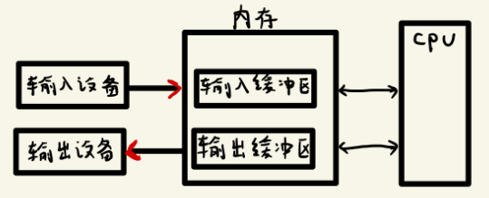
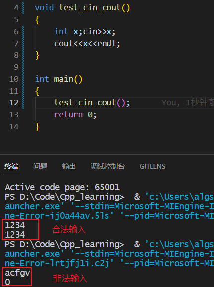

- [1. IO 中 cin 和 cout 的理解](#1-io-中-cin-和-cout-的理解)
- [2. 命名空间](#2-命名空间)
- [3. 智能指针](#3-智能指针)
- [4. 构造函数总结](#4-构造函数总结)
- [5. C++ 强制类型转换总结](#5-c-强制类型转换总结)
- [6. 关于 Static 的总结](#6-关于-static-的总结)

***

# 1. IO 中 cin 和 cout 的理解

缓冲区又称为缓存，它是内存空间的一部分。也就是说，在内存空间中预留了一定的存储空间，这些存储空间用来缓冲输入或输出的数据，这部分预留的空间就叫做缓冲区。**缓冲区根据其对应的是输入设备还是输出设备，分为输入缓冲区和输出缓冲区。**



**缓冲区**分为三种类型：**全缓冲、行缓冲、不带缓冲。**

1）<font color=blue>全缓冲：只有标准的 I/O 缓冲被填满时才进行实际的 I/O 操作</font>。典型代表是对磁盘文件的读写。

2）<font color=blue>行缓冲：只有当输入和输出中遇到换行符时，才会执行真正的 I/O 操作。</font>典型代表是键盘输入数据：我们输入的字符先存放在缓冲区中，等按下回车键换行时才执行实际的 I/O 操作。**C++ 中的 cin 和 cout 都是属于「行缓冲」这种缓冲的，cin 从标准输入中读取数据，cout 向标准输出写入数据，>> 运算符是用来从一个 istream 对象读取输入数据，<< 运算符是向一个 ostream 对象写入输出数据。** 

**cin 关联输入缓冲区：**

```c++
int x;
// cin >> 表示从标准输入中读取数据，将输入缓冲区中 int 型的数据存储中的变量 x 中。
// cin >> 可以连续的从键盘读取数据，对于多个输入变量，cin >> 的划分标准是以空格、Tab或者换行符作为分隔符或者结束符的。
cin >> x;

// 对于一些非法输入，比如上面的 x 需要输入数据是数字类型的，而非法输入是字母类型的，那么就会造成程序错误，使用清空输入缓冲区来消除错误。
cin.clear();
cin.sync();
```



**cout 关联输出缓冲区：**

```c++
int x;cin >> x;
// 将变量 x 的数值写入到输出流对象 cout 中，也就是写入到输出缓冲区中。
cout << x;
```

**一旦输出缓冲区被刷新，那么数据就会被输出，也就是将显存的内容输出到显示器上进行显示。**

下列情况会导致缓冲区的刷新：

* 1）程序正常结束，作为 main 函数的 return 操作的一部分，缓冲刷新被执行。
* 2）缓冲区满时，需要刷新输出缓冲区，这样之后的数据才能写入输出缓冲区中。
* 3）使用 endl 来显示刷新输出缓冲区。endl 时用来完成换行并刷新缓冲区；IO 库中还有两个类似的操作符：flush 和 ends。其中 flush 刷新缓冲区，但不输出任何额外的字符；ends 向输出缓冲区插入一个空字符，然后刷新缓冲区。
* 4）一个输出流可能被关联到另一个流。默认情况下，cin 和 cerr 都关联到 cout，因此读 cin 或写 cerr 都会导致 cout 的输出缓冲区被刷新。

**以上内容解释完 cin 和 cout ，可以写程序验证下全缓冲的大小为 4096 个字节，并且输出缓冲区满了之后就会刷新输出缓冲区，执行真正的 IO 操作。**

```cpp
void test_cout_size()
{
    ofstream of("test.txt");// 创建文件 test.txt 并打开
    for(int i=0;i<4096;i++){// 向 test.txt 中写入 4096 个字符 a  
        of<<'a';
    }
    // 此时 4096 个字符 'a' 还在输出缓冲区中，还没有写入到文件中，此时打开文件会发现是空的
    system("pause");// 暂停
    // 将字符 b 写入输出缓冲区中，此时文件出现了 4096 个字符 'a'，说明全缓冲区的大小为 4K，输出缓冲区满了之后执行了 IO 操作，字符 'a' 被写入到文件中了。而此时字符 'b' 还在缓冲区中。
    of<<'b';
    // 按下回车键，函数结束之后输出缓冲区被刷新，字符 'b' 被写入文件中。
    system("pause");// 暂停
}
```

****

3）<font color=blue>不带缓冲：即不进行缓冲。</font>典型代表是标准出错 stderr，这使得出错信息可以直接尽快地显示出来。

参考文章：[c++ 中缓冲区的理解](https://blog.csdn.net/mxgsgtc/article/details/15500109)、[缓冲区刷新在 C++ 中意味着什么？](https://juejin.cn/post/7031455528723152927)、[C++中关于输入cin的一些总结](https://www.cnblogs.com/mini-coconut/p/9041925.html)、[C++学习之：cout和cin用法](https://segmentfault.com/a/1190000023902592)、[C++ cin 详解之终极无惑](https://blog.csdn.net/K346K346/article/details/48213811)

***

# 2. 命名空间

大型程序往往会使用多个独立开发的库，这些库又会定义大量的全局名字，如类、函数和模板等。当应用程序用到多个供应商提供的库时，不可避免地回发生某些名字相互冲突的清空。因此将多个库的名字放在全局命名空间中将引发**命名空间污染（namespace pollution）**。

***
# 3. 智能指针


***
# 4. 构造函数总结

***
# 5. C++ 强制类型转换总结

***
# 6. 关于 Static 的总结

