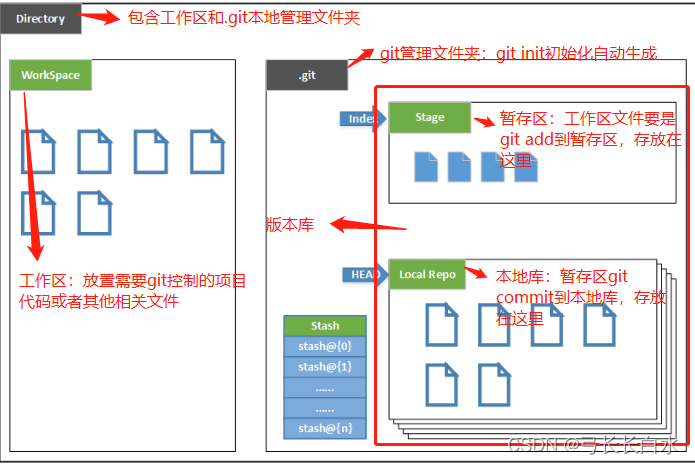
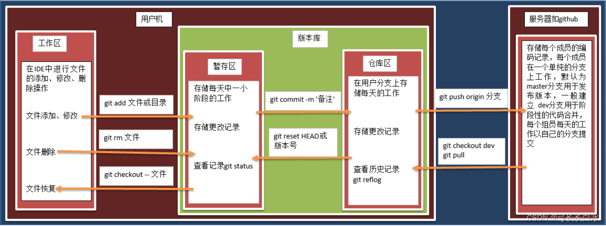

- [一、Git 概念](#一git-概念)
- [二、Git 操作](#二git-操作)
  - [2.1 Git 回退版本](#21-git-回退版本)
  - [2.2 git stash](#22-git-stash)
  - [2.3 Git 不同版本开发](#23-git-不同版本开发)
  - [2.4 Patching 补丁](#24-patching-补丁)
    - [2.4.1 git merge 与 git rebase 的区别](#241-git-merge-与-git-rebase-的区别)
    - [2.4.2 git cherry-pick](#242-git-cherry-pick)

[Git 快速上手](https://dablelv.blog.csdn.net/article/details/52620885)、[【技术】git实用命令总结](https://blog.csdn.net/ann295258232/article/details/73826122)

# 一、Git 概念

[git关于本地仓库、版本库、工作区、暂存区、远程仓库、分支](https://blog.csdn.net/zdwzzu2006/article/details/130761246)



Directory：包含 .git 文件夹和代码文件的目录，注意 .git 文件夹由 `git init` 初始化仓库然后进行生成的。

工作区 `Workspace`：当前文件夹下的所有文件/目录。

暂存区 `Stage/Index`：由工作区中的文件进行 `git add 文件路径` 添加到的地方，就是暂存区。

仓库区 `Local Repo`：本地仓库，用来存放本地代码的版本库；`HEAD` 是当前开发的分支 `branch`。

`Stash`：工作状态保存栈，用于保存/恢复工作区的临时状态。

***

以下图片就很好的说明这个分区之间的关系了。




# 二、Git 操作

## 2.1 Git 回退版本

`git reset`：这个命令可以用来撤销之前的提交。常用的选项有 `--soft`、`--mixed` 和 `--hard`。

* `--soft`：回退到某个版本，会保留工作区(本地修改的代码)和暂存区(git add 将工作区代码添加到暂存区)，也就是说该选项不会丢失修改的代码。

- `--mixed`（默认选项）：回退到某个版本，并重置暂存区，意味着所做的更改会保留在工作区。该选项不会丢失修改的代码。
- `--hard`：彻底回退到某个版本，工作区和暂存区的内容都会丢失。该选项丢失修改的代码，代码回退到最初的版本。

```bash
# 将代码会滚到上一个版本，丢弃所有的更改，包括工作区和暂存区的更改
git reset --hard HEAD^

# 默认选项为 --mixed，以下命令等价
# 该命令会重置暂存区(将暂存区代码移除到工作区)，保留所有的修改代码，也就是合并所有commit提交信息
git reset <commit-hash>
git reset --mixed <commit-hash>

# 回退到某个版本，但保留工作区和暂存区的内容，意味着所做的更改会保留在暂存区(保留回到到版本的commit信息)
git reset --soft <commit_hash>
```

***

`git revert HEAD~2`： 这个命令会创建一个新的提交，这个提交会撤销倒数第二个提交的更改。该操作可以保证项目历史可以向前移动，但是不会丢失任何数据（该操作是安全的）。

```bash
# 撤销多个连续的提交，可以使用 -n 或 --no-commit 选项来连续应用多个 git revert 命令，然后在所有撤销操作完成后一次性提交结果
git revert -n <commit_hash1>
git revert -n <commit_hash2>
git commit -m "Revert multiple commits"
```

***

`git checkout <commit_hash>`： 这个命令会切换到指定的提交哈希，但并不会改变当前分支的头部（HEAD）。这是一个临时的操作，它允许你查看和操作特定提交的状态，但不会影响你的项目历史。如果你在这个状态下做了更改并想要保存，你需要创建一个新的提交。

分离头指针状态（Detached HEAD state）是 Git 中一个特殊的模式，它发生在当你检出一个提交而不是一个分支时。在 Git 中，`HEAD` 通常指向你当前所在的分支的最后一个提交。当你切换分支时，`HEAD` 会自动更新以指向新分支的最后一个提交。

然而，如果你使用 `git checkout <commit_hash>` 检出一个特定的提交，`HEAD` 就会从分支上分离（detach），直接指向那个特定的提交。在这种状态下，你没有在任何一个分支上，`HEAD` 只是指向一个历史提交的快照。

在分离头指针状态下，你可以查看项目在那个特定提交时的状态，或者对代码进行实验性的更改。但是，由于你不在任何分支上，如果你进行了新的提交，这些提交就不会属于任何一个分支，这就创建了一个“孤儿”提交。这样的提交在 Git 历史中是孤立的，不属于任何分支，因此在常规的分支切换操作中是不会被检查到的。

如果你在分离头指针状态下进行了更改，并且想要保留这些更改，你需要创建一个新的分支来保存这些提交。例如：

```bash
git checkout -b new_branch_name
```

这将创建一个名为 `new_branch_name` 的新分支，并将 `HEAD` 移动到这个分支上，这样你的更改就不会丢失。

## 2.2 git stash

> [git-stash用法小结 - Tocy - 博客园](https://www.cnblogs.com/tocy/p/git-stash-reference.html)

`git stash` 是一个非常有用的 Git 命令，用于将未提交的修改保存到一个临时区域中，以便稍后恢复。下面是一些基本的 `git stash` 命令的用法：

```bash
# 保存工作目录中的修改
git stash
# 保存修改并添加描述
git stash save "message!自己想说的话"

# 查看已保存的 stash 列表
git stash list

# 恢复最近的 stash 并删除它
git stash pop
git stash pop stash@{1} # 恢复特定的 stash

# 将 stash 应用到工作目录但不删除 stash
git stash apply
git stash apply stash@{1} # 应用特定的 stash 但不删除 stash

# 删除最近的 stash
git stash drop
git stash drop stash@{<stash_number>} # 删除特定的 stash

# 清空所有的 stash
git stash clear

# 保存包括未跟踪文件的修改
git stash --include-untracked

# 保存包括已暂存的修改
git stash --keep-index
```


## 2.3 Git 不同版本开发

**场景：**我从远程仓库拉取了版本A，然后对代码进行了修改为版本 A1；但是目前我接到一个新需求，需要代码编写，现在远程仓库最新的版本为B，我现在需要保存版本A1，然后拉取版本B，来做新需求。在做完 B 的需求后，在切回到A1版本。

**方法1：**

* 不同的需求对应的不同的仓库环境，也就是重新起一个新的环境来做需求 B，这样导致的问题就是重新编译比较慢，然后就是多个本地仓库会冗余的问题。

**方法2：**

```bash
# 1. 首先创建新分支保存 A1，所有 A1 的修改都会保存在该分支上面
# git stash save"Save A1"
git checkout -b feature_a
# 或者使用以下的
git add .  # 添加 A1 修改
git commit -m "Save A1 changes"  # 提交 A1 的修改

# 2. 切换到主分支，也就是开发主线
git checkout master
git pull origin master

# 3. 开发版本 B1 并推送到远程分支 master
git add .
git commit -m "Implement feature B1"
git push origin master

# 4. 恢复 A1 的修改
git checkout feature_a1
git stash pop

# 5. 合并 A1 到 master
git checkout master  # 切换回 master 分支
git merge feature_a1  # 将 feature_a1 分支的修改合并到 master 分支
git push origin master  # 推送合并后的修改到远程仓库

# 3. 在版本B上创建一个新分支，进行新需求的开发，并将修改代码上传到 Github
# git checkout -b feature_b
# git add .
# git commit -m"B需求开发"
# git push origin feature_b
```

补充：

在 Git 中，`git push origin <branch_name>` 会将你当前所在的本地分支 `<branch_name>` 推送到远程仓库的同名分支。**如果该远程分支不存在，Git 会在远程仓库上创建这个分支**。


## 2.4 Patching 补丁

### 2.4.1 git merge 与 git rebase 的区别

> [git merge 与 git rebase的区别](https://blog.csdn.net/michaelshare/article/details/79108233)

1. 可以看出 merge 结果能够体现出时间线，但是 rebase 会打乱时间线。
2. 而 rebase 看起来简洁，但是 merge 看起来不太简洁。


### 2.4.2 git cherry-pick

